# LinkVortex Writeup - by Thammanant Thamtaranon
  - LinkVortex is an easy Linux machine on Hack The Box.

## Reconnaissance
  - First, we use the command `nmap -A -T4 -p- 10.10.11.47` to check for any open TCP ports and their service information.
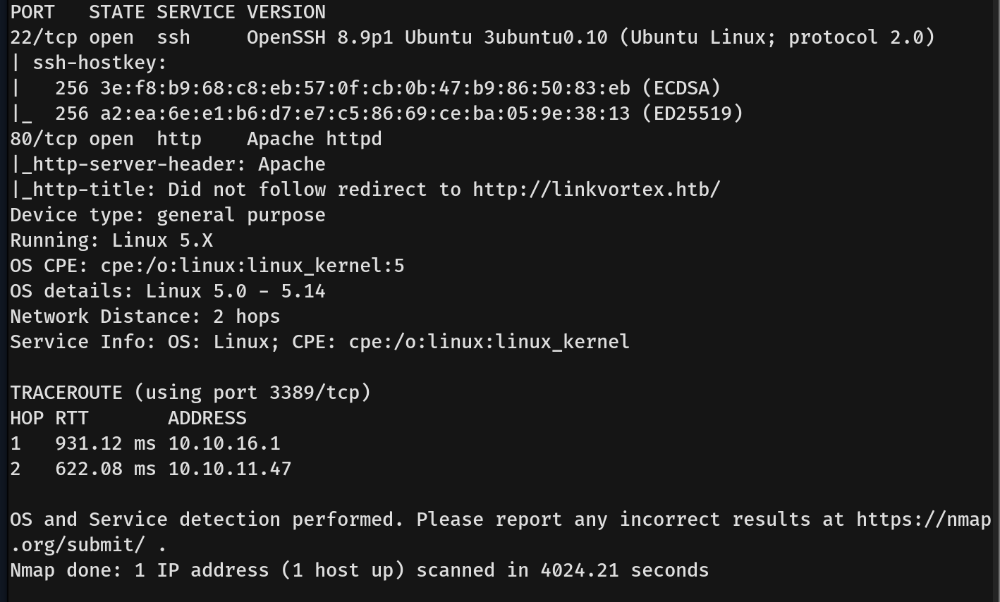
  - Then, we add linkvortex.htb to /etc/hosts.
  - We use Wappalyzer and found out that it uses Ghost CMS Version 5.58.

## Scanning & Enumeration
  - Now that we know port 80 is open, we use the command `dirsearch -u http://linkvortex.htb` to look for any directories.
  - We find /robots.txt.
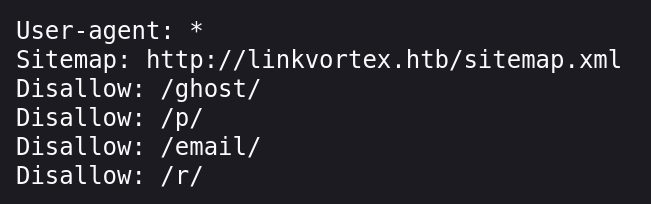
  - We also find /sitemap.xml, which is referenced in robots.txt.
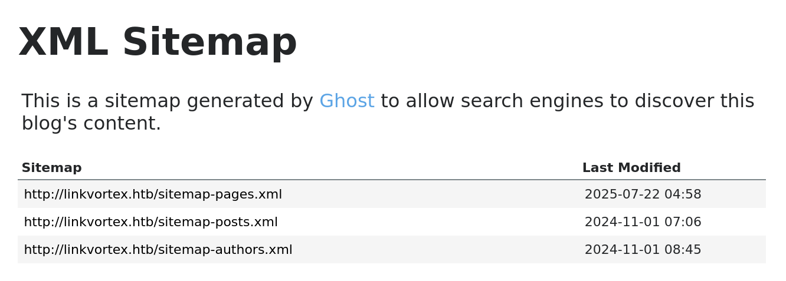
  - From robots.txt, we discover http://linkvortex.htb/ghost/#/signin.
  - Since Ghost has no default credentials, we leave it for now.
  - We try virtual host enumeration using the command `wfuzz -u linkvortex.htb -H "Host: FUZZ.linkvortex.htb" -w /usr/share/seclists/Discovery/DNS/subdomains-top1million-5000.txt --hh 199691` and discover "dev". So we add dev.linkvortex.htb to /etc/hosts as well.
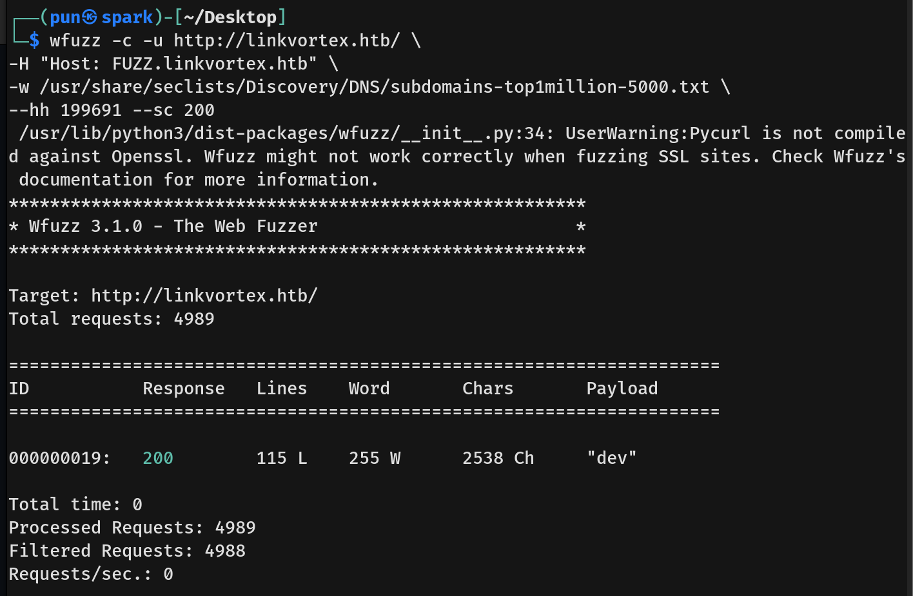
  - We use the command `dirsearch -u http://dev.linkvortex.htb` to check for any directories.
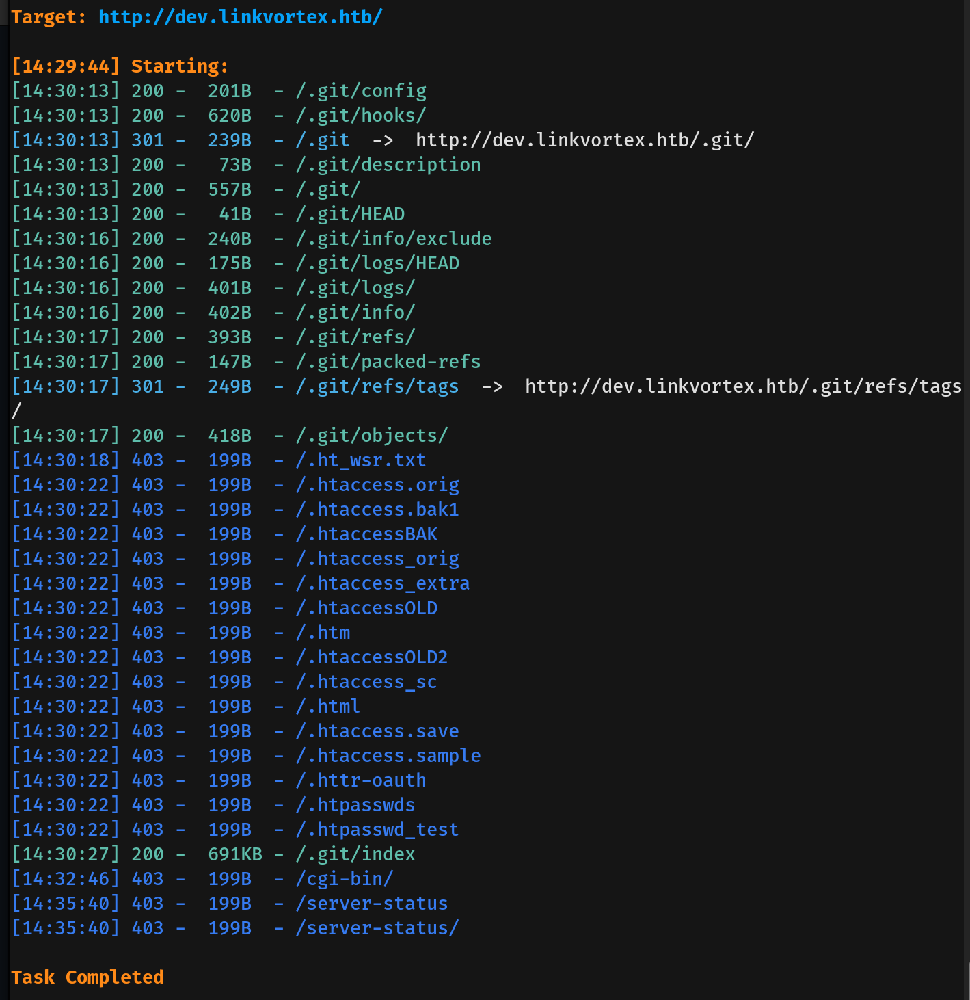
  - We find 54b0ed7f9c9aedf3180ee1fd94e7e43b29f000 from http://dev.linkvortex.htb/.git/objects/e6/, which is a Git object hash file.
  - We download it and use the command `zlib-flate -uncompress < 54b0ed7f9c9aedf3180ee1fd94e7e43b29f000 > output.txt` to convert it into a readable format.
  - From the file, we find several hardcoded credentials.
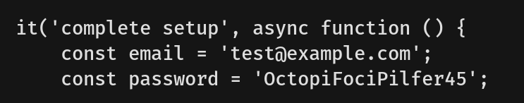

  - We try all the credentials, but unfortunately none of them work. The error response says "There is no user with that email address". After some trial and error, we gain access with admin@linkvortex.htb : OctopiFociPilfer45.
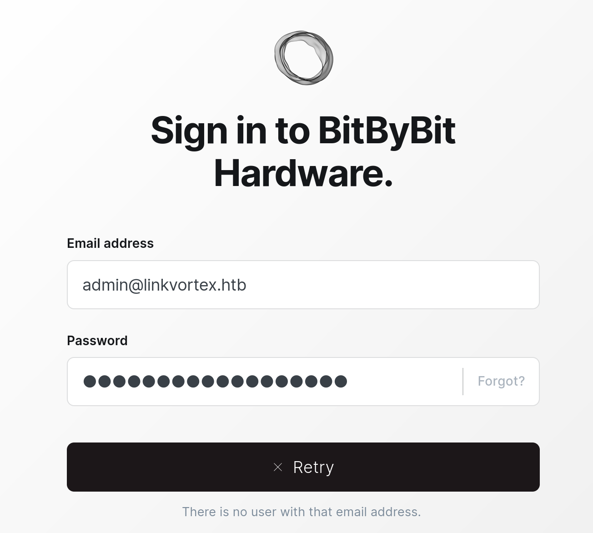

## Exploitation
  - We search for Ghost CMS 5.58 vulnerabilities on the internet and find this:
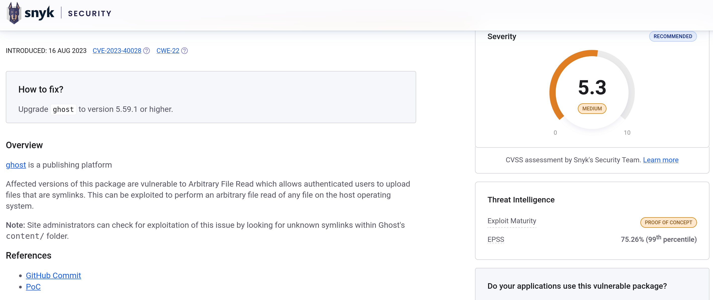
  - We download the PoC.
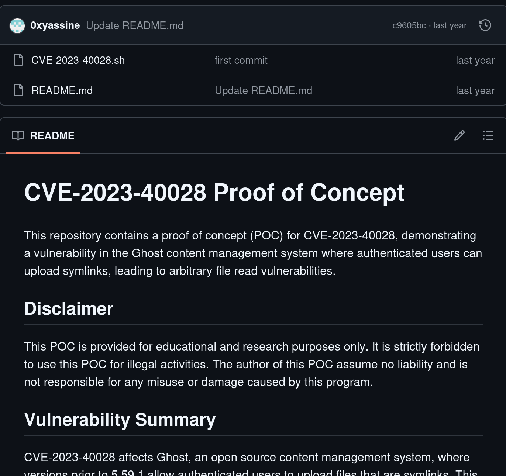
  - We modify this part and run the command `./CVE-2023-40028.sh -u admin@linkvortex.htb -p OctopiFociPilfer45`.
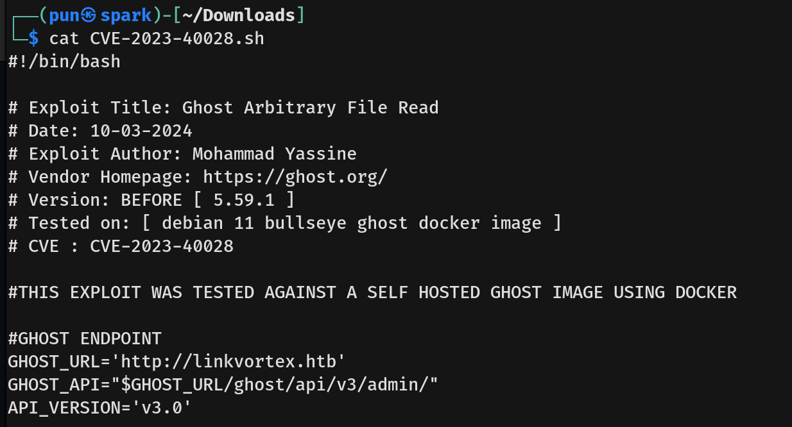
  - We then look for the config file `/var/lib/ghost/config.production.json`.
  - The config file contains the username and password for the user "bob".
  - If bob reused his password, we could try using this credential to SSH into the machine.
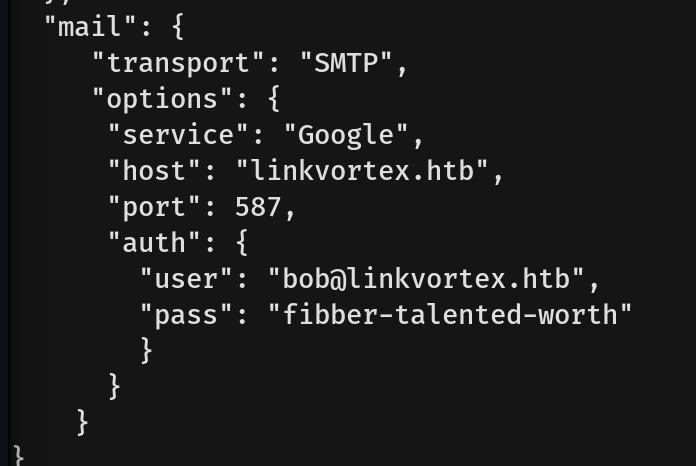
  - We use the command `ssh bob@10.10.11.47` and gain a foothold as bob.
  - We obtain the user flag.
  - We type the command `sudo -l` to check what commands bob can run as root.
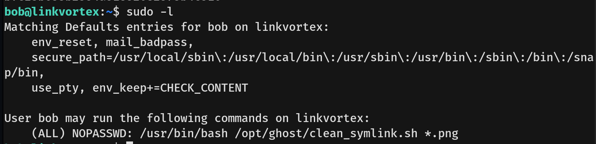
  - We then read the script using `cat /opt/ghost/clean_symlink.sh`.
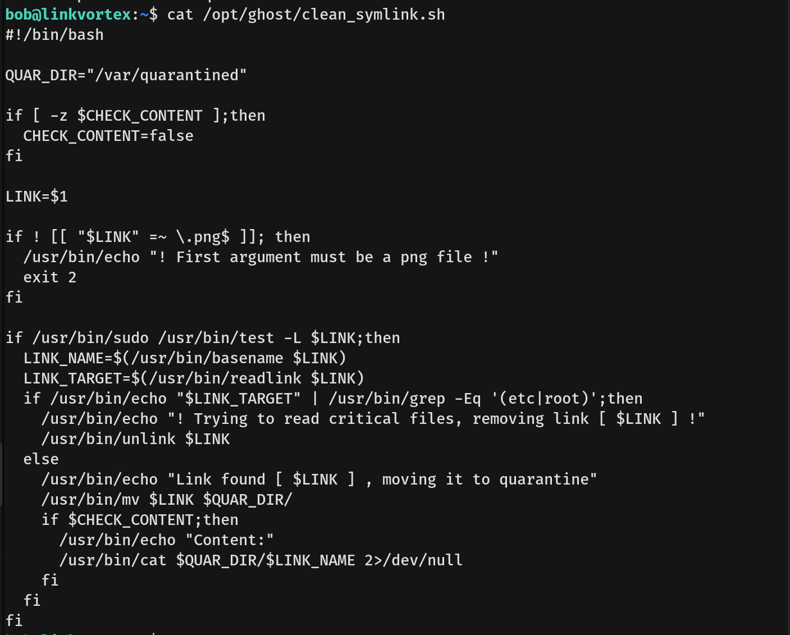
  - In the script, there is an environment variable named CHECK_CONTENT which is treated as true if set to a non-zero value (any character also works).
  - Since we can control CHECK_CONTENT, we try injecting a command into it.
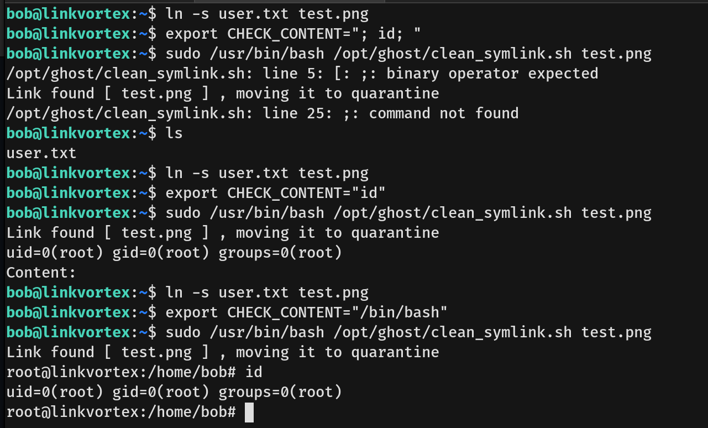
  - We get the root flag.
