# Magic Writeup - by Thammanant Thamtaranon

**Magic** is a **Medium**-difficulty Linux machine hosted on Hack The Box.

---

## Reconnaissance
- We began the engagement with a full TCP port scan using Nmap to identify open services and fingerprint the underlying operating system.
    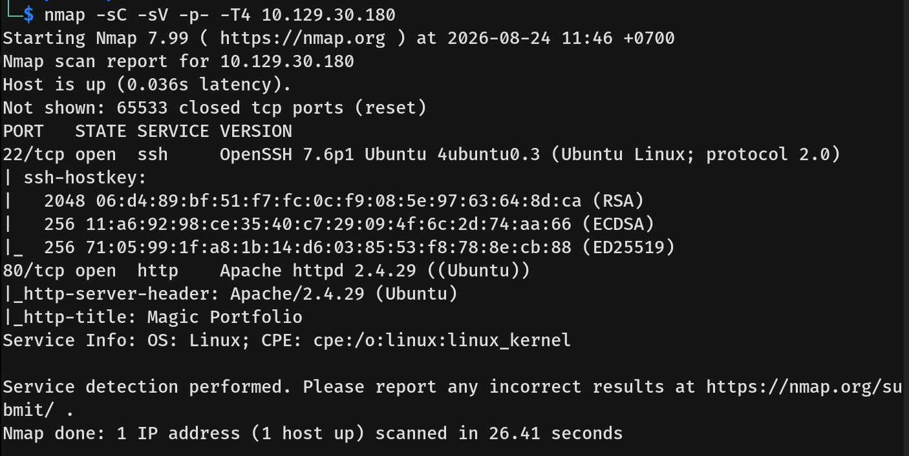
- Only two ports were open:
    *   **22/tcp:** SSH (OpenSSH 7.6p1 Ubuntu 4ubuntu0.3)
    *   **80/tcp:** HTTP (Apache httpd 2.4.29 (Ubuntu))

---

## Scanning & Enumeration
- Visiting port 80 revealed a website containing a portfolio of images.
    
- Noticing the text below that said to login to upload images, we navigated to the login page.
    
  
---

## Exploitation
- Since we did not know the username and password, I tried common credentials but failed. I then attempted an SQL injection authentication bypass.
    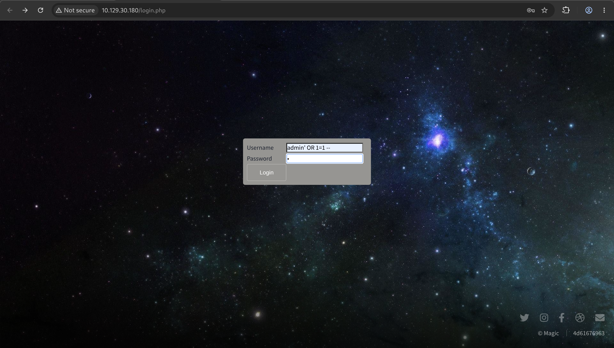
- The bypass worked, and we successfully logged in. We were now presented with an image upload feature.
    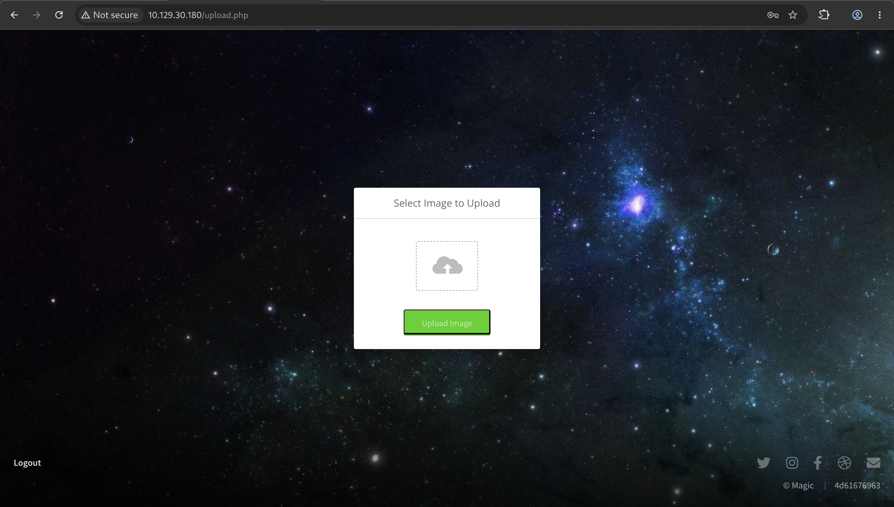
- The upload mechanism had restrictions, only allowing JPG, JPEG, and PNG files.
    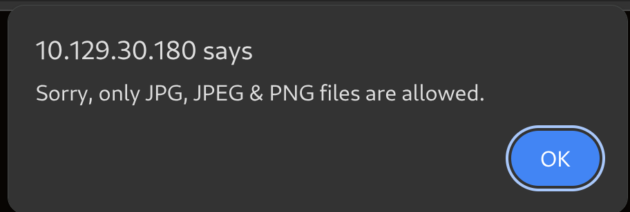
- To bypass the file extension restriction, we tried using double extensions (e.g., `.php.png`), which the application accepted.
    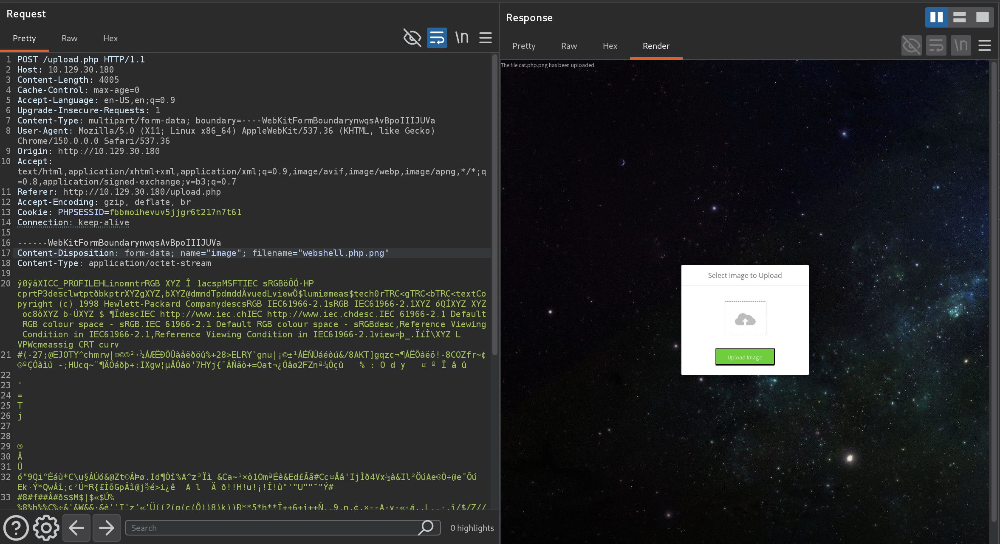
- However, the upload still failed initially because the server was checking for valid image magic bytes. To solve this, we added the legitimate magic bytes of an actual image file to our payload, followed by our PHP web shell code.
    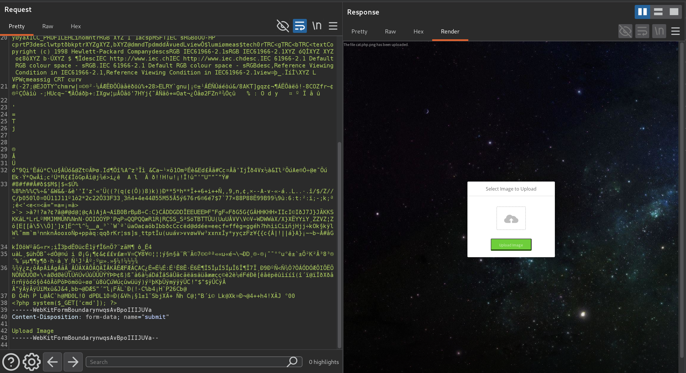
- The upload was successful. We then navigated to the uploaded file and tested command execution by running the `id` command.
    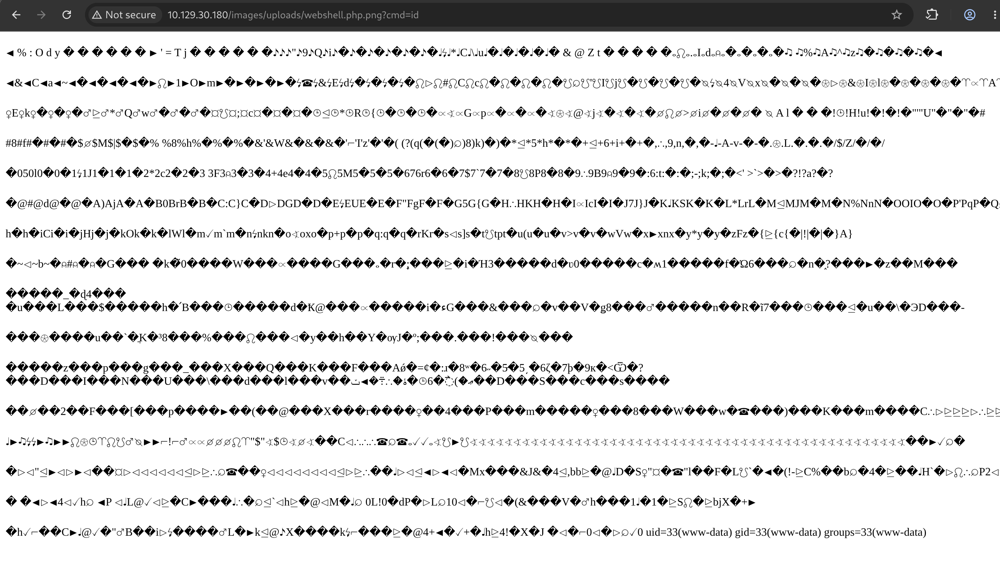
- After confirming the successful execution of the web shell, we changed the command to a reverse shell payload and caught a connection back as the `www-data` user.
    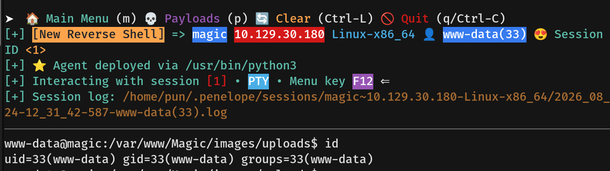

---

## Privilege Escalation
- Enumerating further, we found database credentials for the user `theseus`. I tried to SSH into the machine with this password but failed, as SSH was configured to accept only public/private key authentication. I also tried `su` to change users, but the password was incorrect.
    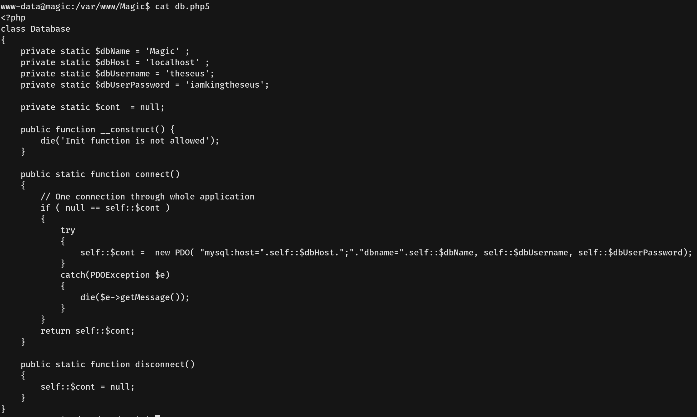
- With the MySQL database credentials in hand, I searched for available MySQL client commands on the machine.
    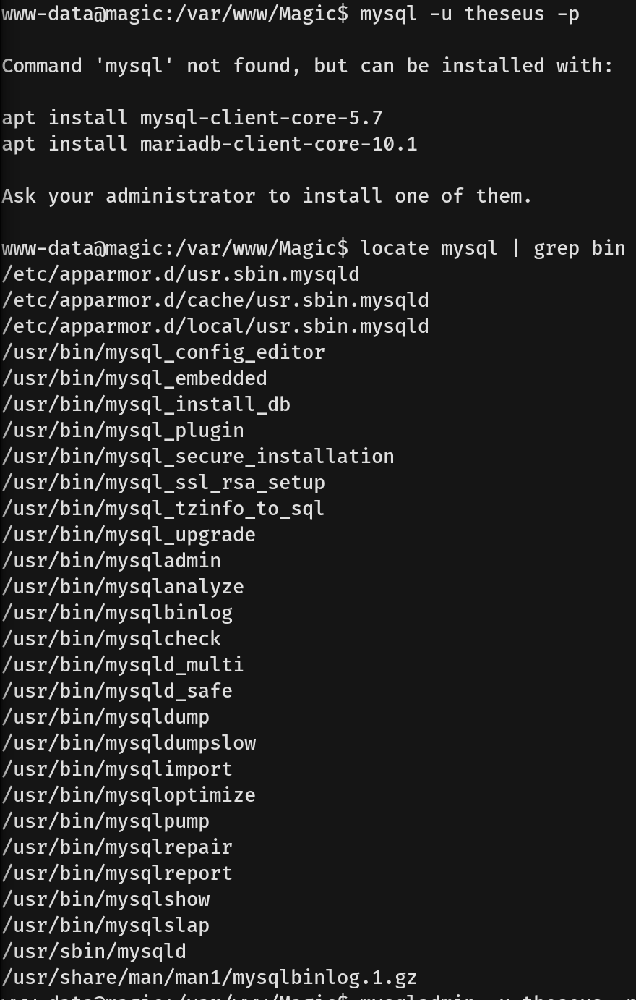
- We chose to use the `mysqlshow` command, entering the username and password to enumerate the databases.
    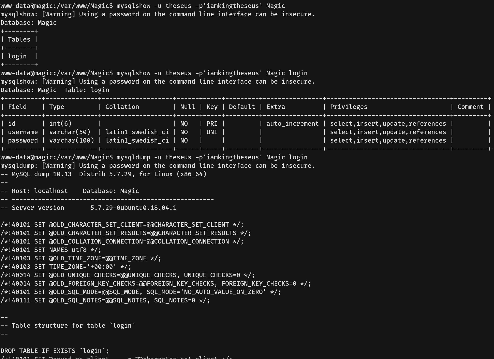
- By enumerating the database, we discovered the actual system password for the user `theseus`.
    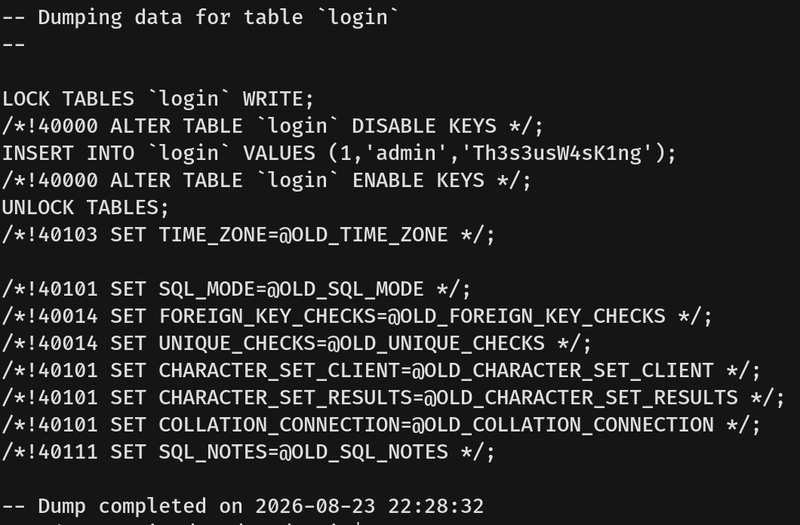
- Since we knew SSH wouldn't work with just a password, we used the `su` command to change users and obtained a shell as `theseus`.
    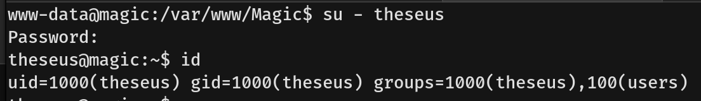
- To establish a more stable connection, I generated an SSH key pair on my local machine.
    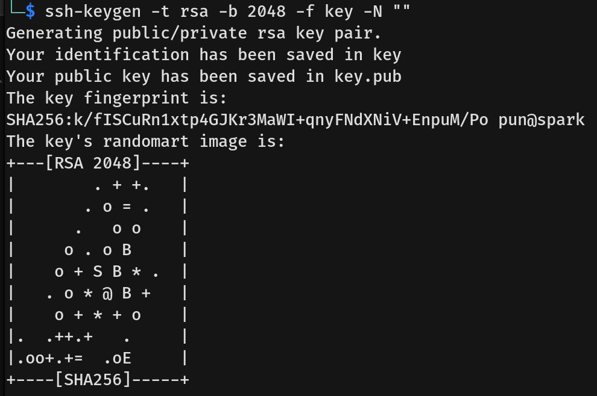
- I then placed the public key into Theseus's `~/.ssh/authorized_keys` file.
    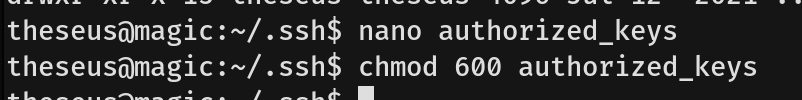
- We were then able to SSH into the machine using our private key and capture the user flag.
    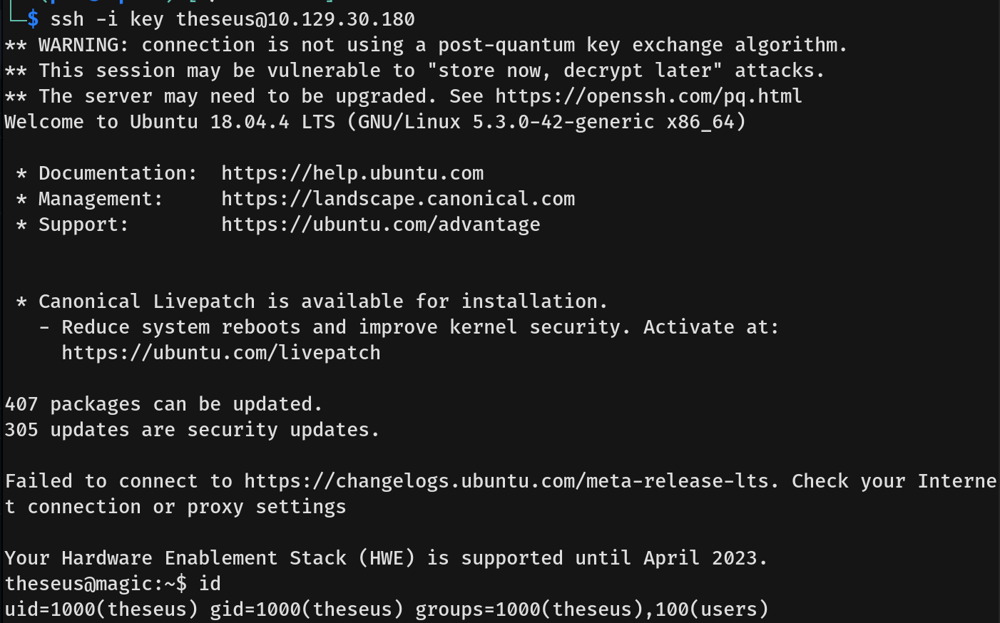
- I tried running `sudo -l`, but the user `theseus` did not have permission to run sudo. Searching for interesting SUID binaries instead, we found `/bin/sysinfo`.
    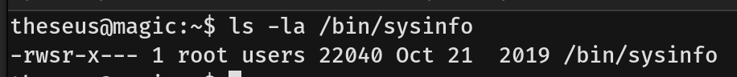
- Running the `strings` command on the binary showed that it calls several other binaries (like `lshw`, `fdisk`, `cat`, and `free`) without using their absolute paths. This is vulnerable to PATH hijacking.
    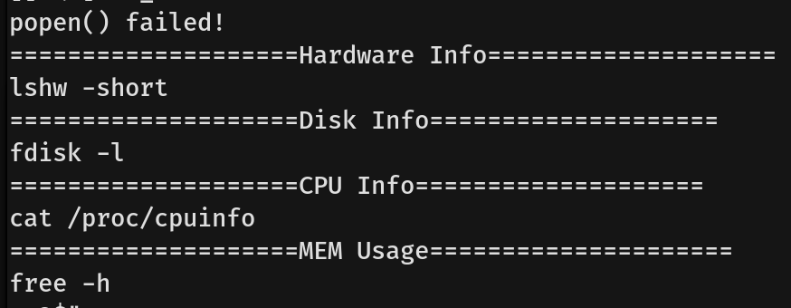
- I performed a PATH hijacking attack targeting the `free` binary (though `lshw`, `fdisk`, or `cat` would also work). I created a malicious script named `free` in the `/tmp` directory that executes `chmod +s /bin/bash`. I made the script executable and added `/tmp` to my environment's `$PATH` variable.
    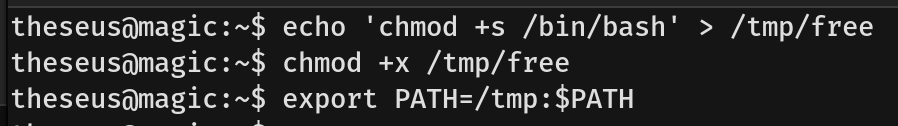
- After running the `/bin/sysinfo` SUID binary, it executed our fake `free` script as root, successfully setting the SUID bit on `/bin/bash`. We then ran `/bin/bash -p` to drop into a privileged root shell and captured the root flag.
    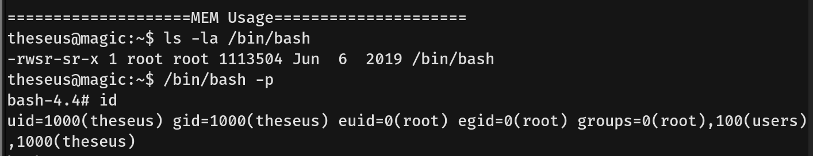
