# Mirai Writeup - by Thammanant Thamtaranon

**Mirai** is an **Easy**-difficulty Linux machine hosted on Hack The Box.

---

## Reconnaissance
- We started the engagement with a full TCP port scan using Nmap to identify open services and determine the underlying operating system.
  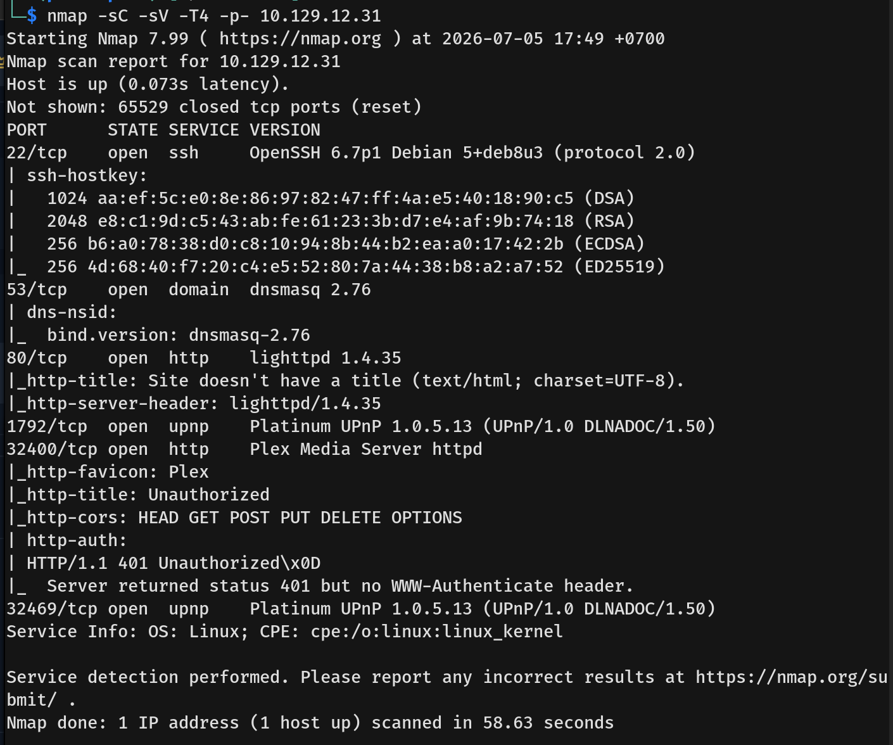
- The results indicated several open ports, revealing a Linux/Raspbian environment with the following services available:
  * **22/tcp:** ssh (OpenSSH 6.7p1)
  * **53/tcp:** domain (dnsmasq 2.76)
  * **80/tcp:** http (lighttpd 1.4.35)
  * **1162/tcp:** upnp
  * **32400/tcp:** http (Plex Media Server)
  * **32469/tcp:** upnp

---

## Scanning & Enumeration
- I started by enumerating the web server on Port 80 using directory brute-forcing.
  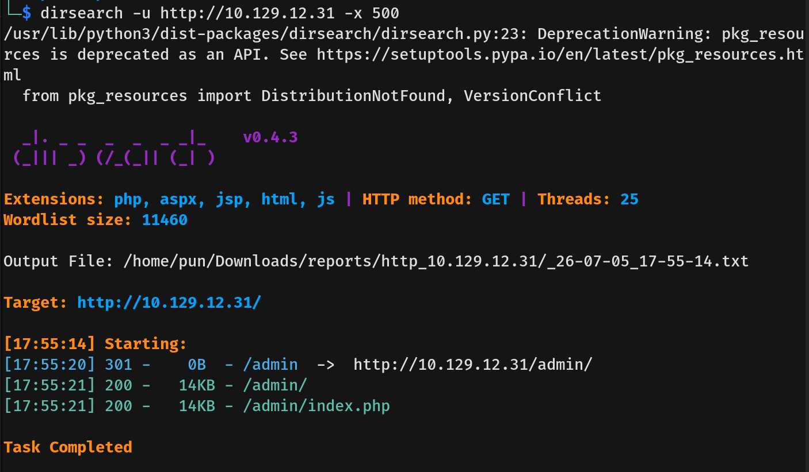
- I then visited `/admin` on port 80 and found a Pi-hole admin console.
  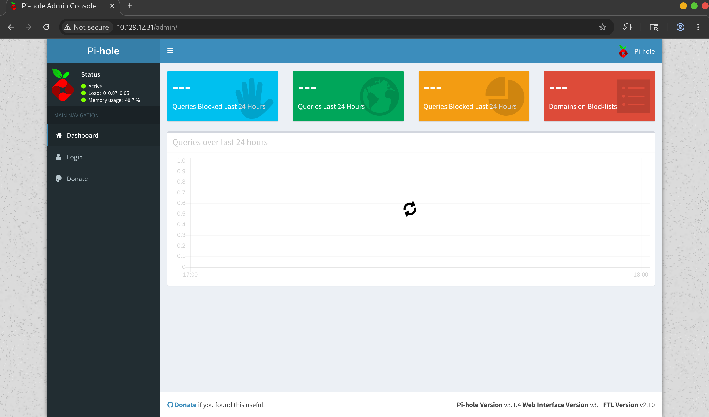
- I searched for the default credentials, but there were no default credentials configured for Pi-hole.
- I then searched for known CVEs for Pi-hole, but the available exploits required authentication.
- Moving on, I investigated port 32400 and found a Plex Media Server.
  
- Plex also does not have default credentials, so I signed up for an account to gain access.
  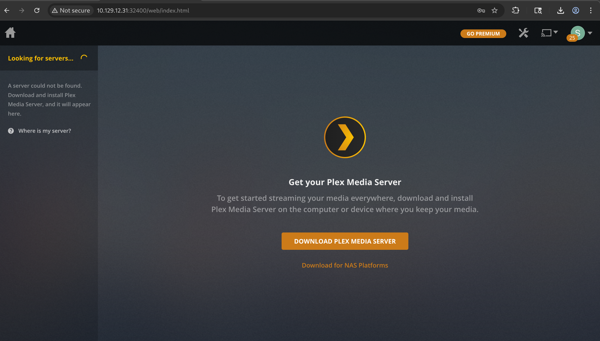
- After signing up and logging in, I discovered the server was running Plex version 3.9.1.
  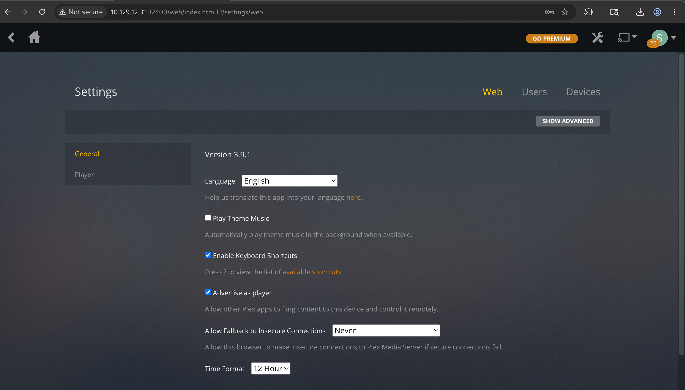
- However, my research indicated there were no viable vulnerabilities for this specific version of Plex.

---

## Exploitation
- Seeing Pi-hole and realizing the box name is "Mirai" (a famous botnet that targeted IoT devices using default credentials), I remembered that this server is likely a Raspberry Pi. 
- I attempted to SSH into the machine using the default Raspberry Pi credentials: `pi:raspberry`.
  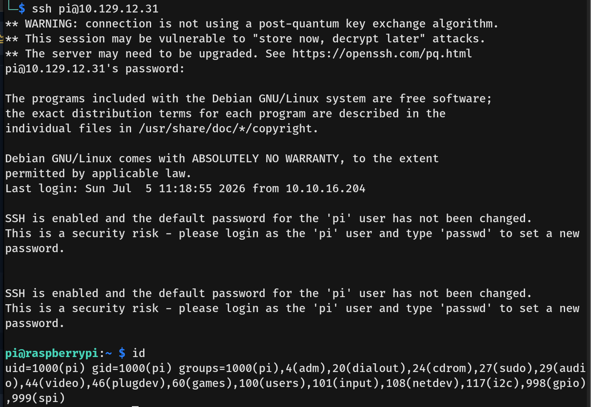
- The authentication was successful, granting us initial access, and I captured the user flag.

---

## Privilege Escalation
- Running `sudo -l` showed that the user `pi` is in the sudoers group and can run any command without a password.
  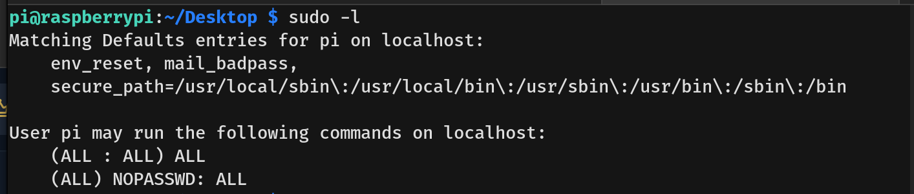
- I ran `sudo su -` to elevate my privileges to root, navigated to the `/root` directory, and attempted to read the flag.
  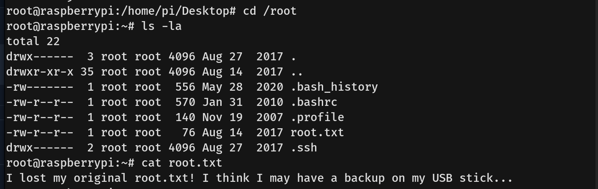
- However, the root flag was not that straightforward. There was a note inside `root.txt` stating that the admin lost the original flag but kept a backup on a USB stick.
- Normally, USB drives are mounted in the `/media` directory. I navigated there and found a `usbstick` folder containing a `dammit.txt` file, which stated that someone accidentally deleted the files off the USB stick.
  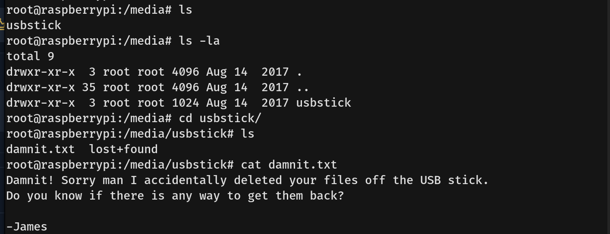
- To recover the deleted file, I first ran the `df -h` command to identify the physical block device mapped to the USB stick, which turned out to be `/dev/sdb`.
  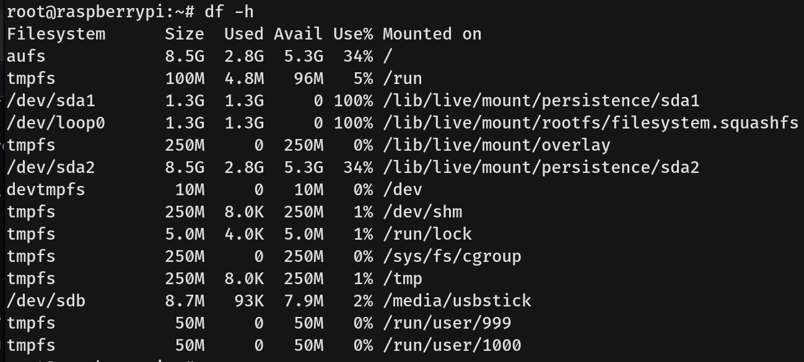
- When a file is deleted, the operating system only removes the reference to the file. The actual data remains intact on the physical storage device until it is overwritten by new data. 
- Knowing this, I used the `strings` command directly on the block device to extract all human-readable text from the raw disk. Scanning through the output, I successfully recovered the deleted root flag.
  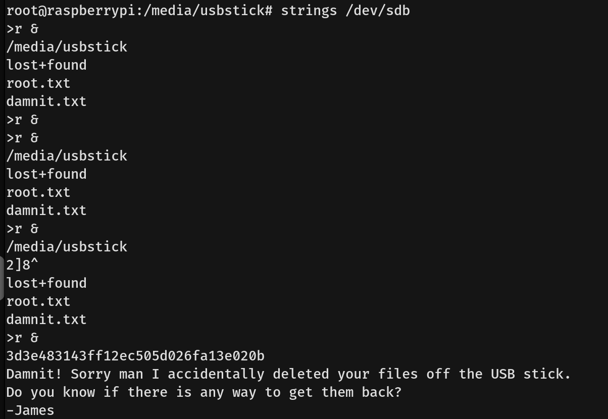
