# Monteverde Writeup - by Thammanant Thamtaranon

**Monteverde** is a **Medium**-difficulty Windows machine hosted on Hack The Box.

---

## Reconnaissance
- We started the engagement with a full TCP port scan using Nmap to identify open services and determine the underlying operating system.
  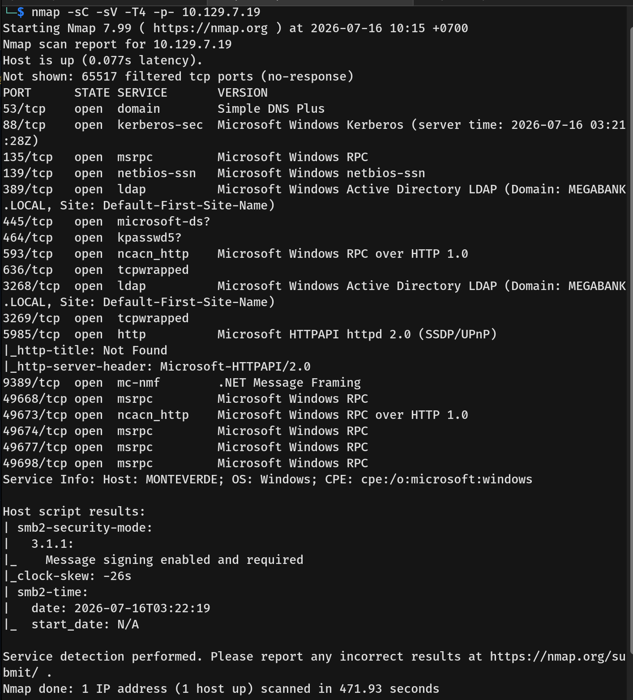
- The results indicated an Active Directory Domain Controller environment for the `MEGABANK.LOCAL` domain, with the hostname `MONTEVERDE`. Several key services were available:
  * **53/tcp:** domain (DNS)
  * **88/tcp:** kerberos-sec
  * **135/tcp:** msrpc
  * **139/tcp & 445/tcp:** netbios-ssn / microsoft-ds (SMB)
  * **389/tcp & 636/tcp:** ldap / tcpwrapped
  * **5985/tcp:** http (WinRM remote management)

---

## Scanning & Enumeration
- We started by enumerating SMB with null and guest credentials. The null credentials worked, but we were not permitted to list any directories.
  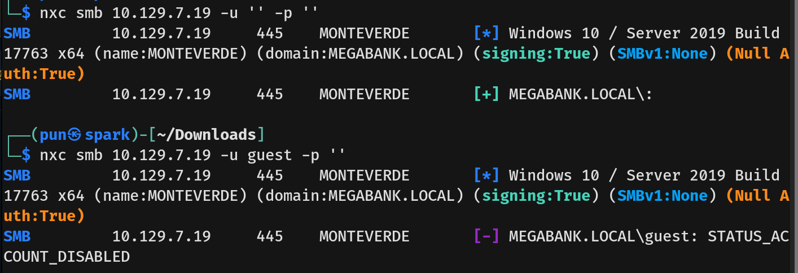
- Next, we enumerated LDAP using null credentials. We successfully retrieved a list of valid domain usernames but did not obtain any passwords.
  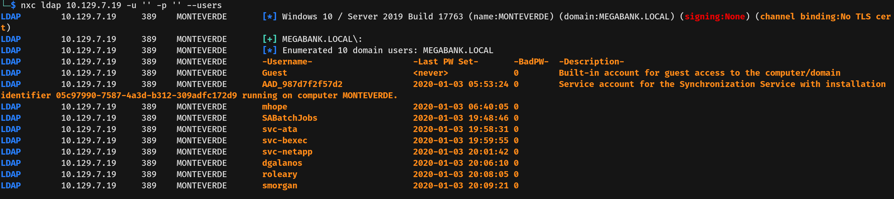

---

## Exploitation
- Using the extracted user list, we tried spraying the usernames as their own passwords and discovered that the account `SABatchJobs` was using its username as the password (`SABatchJobs:SABatchJobs`).
  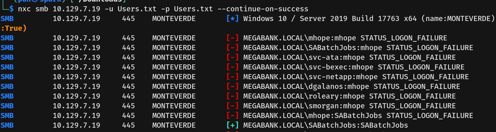
- With these credentials, we authenticated to SMB and found that we had read access to the `azure_uploads` and `users$` shares.
  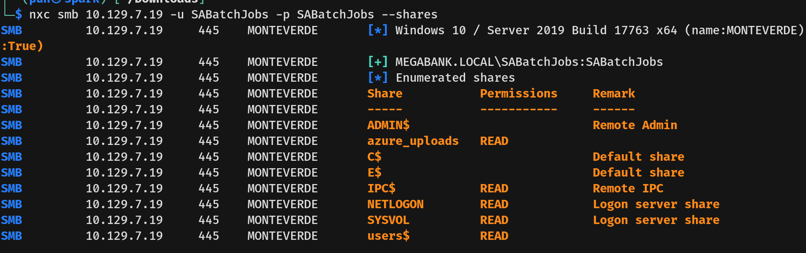
- The `azure_uploads` share was empty, but the `users$` share contained the home directories for several users, including `dgalanos`, `mhope`, `roleary`, and `smorgan`.
  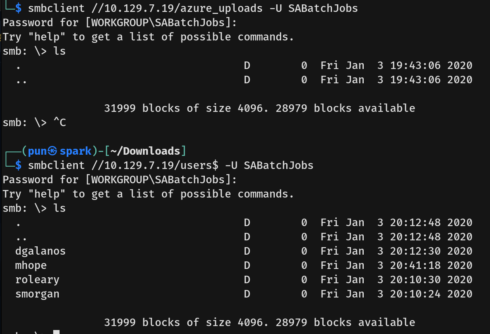
- Navigating through them, most were empty, but inside `mhope`'s folder, we found a file named `azure.xml`. We downloaded it to our attack machine.
  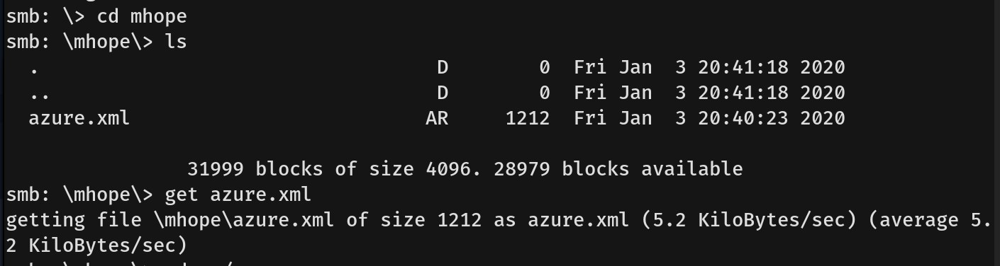
- Reading `azure.xml`, we found a cleartext password belonging to the user `mhope`.
  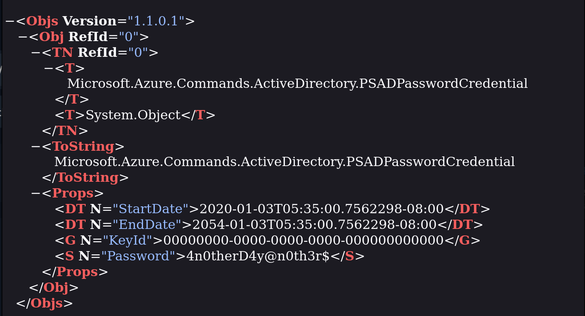
- We verified the credentials against SMB to confirm they were valid.
  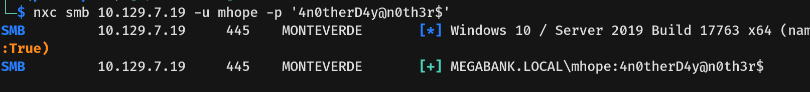
- Finally, we connected to the machine via WinRM using `mhope`'s credentials and successfully captured the user flag.
  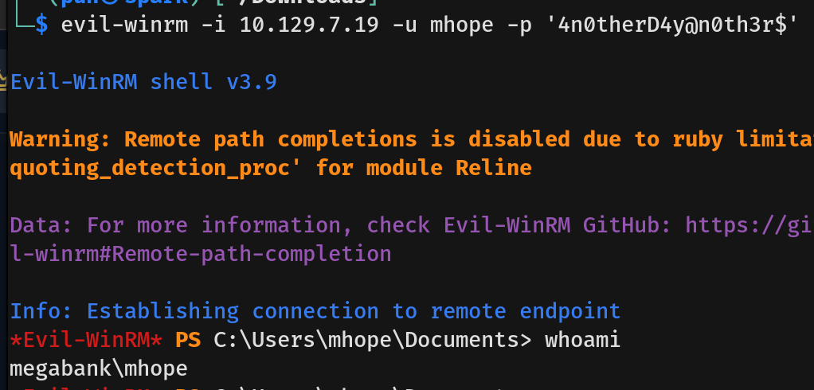

---

## Privilege Escalation (Intended)
- Checking our user's group memberships, we noticed `mhope` is a member of the `MEGABANK\Azure Admins` group. This group grants privileges to manage the local Azure AD Connect installation.
  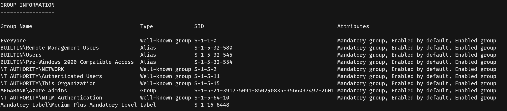
- With this information, we searched for known privilege escalation vectors and found a [PowerShell script on GitHub](https://github.com/CloudyKhan/Azure-AD-Connect-Credential-Extractor) designed to extract credentials from Azure AD Connect.
- **How it works:** Azure AD Connect uses a local SQL Express database (`LocalDB` / `ADSync`) to store the encrypted credentials of the synchronization account (often a Domain Admin). Because our user is in the `Azure Admins` group, we have permission to query this database. The script extracts the encrypted keys and decrypts them, successfully revealing the Active Directory domain `administrator` password as `d0m@in4dminyeah!`.
  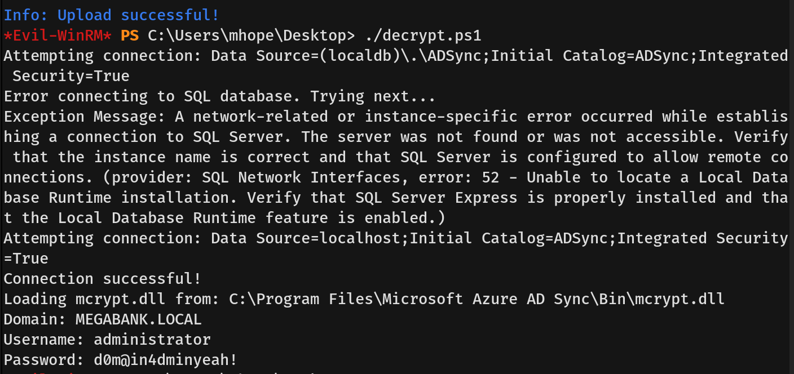
- With the Administrator password in hand, we reconnected to the machine via evil-winrm and captured the root flag.
  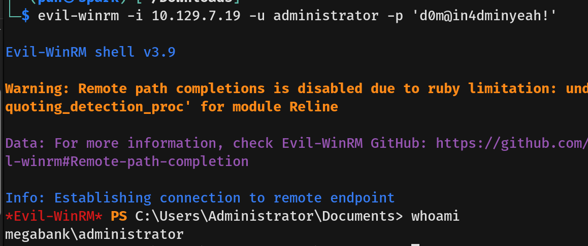
  
---

## Alternative Privilege Escalation (noPac)
- Alternatively, by looking at standard domain privileges on the user `mhope`, we found `SeMachineAccountPrivilege` is enabled. This default privilege allows standard domain users to add up to 10 computer accounts to the Active Directory domain.
  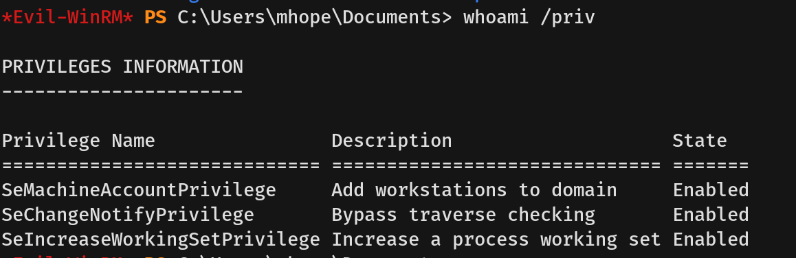
- Searching for privilege escalation vectors associated with this capability, we found a blog post demonstrating a chain of **CVE-2021-42278** and **CVE-2021-42287** (often referred to as the **noPac** exploit) to gain `NT AUTHORITY\SYSTEM`.
  * **CVE-2021-42278:** A vulnerability that allows an attacker to spoof the `SAMAccountName` of a domain controller by creating a machine account and renaming it to match a DC without the trailing `$` symbol.
  * **CVE-2021-42287:** A vulnerability in the Kerberos Key Distribution Center (KDC). When an attacker requests a Ticket Granting Service (TGS) ticket for a machine account that no longer exists (because we renamed it back), the KDC falls back to searching for the Domain Controller's account and mistakenly grants a ticket with Domain Admin privileges.
- We downloaded a Python Proof-of-Concept (PoC) from [Ridter/noPac on GitHub](https://github.com/Ridter/noPac/tree/main).
- We ran the `noPac.py` PoC, successfully exploited the chain to get a semi-interactive shell as `nt authority\system`, and compromised the machine.
  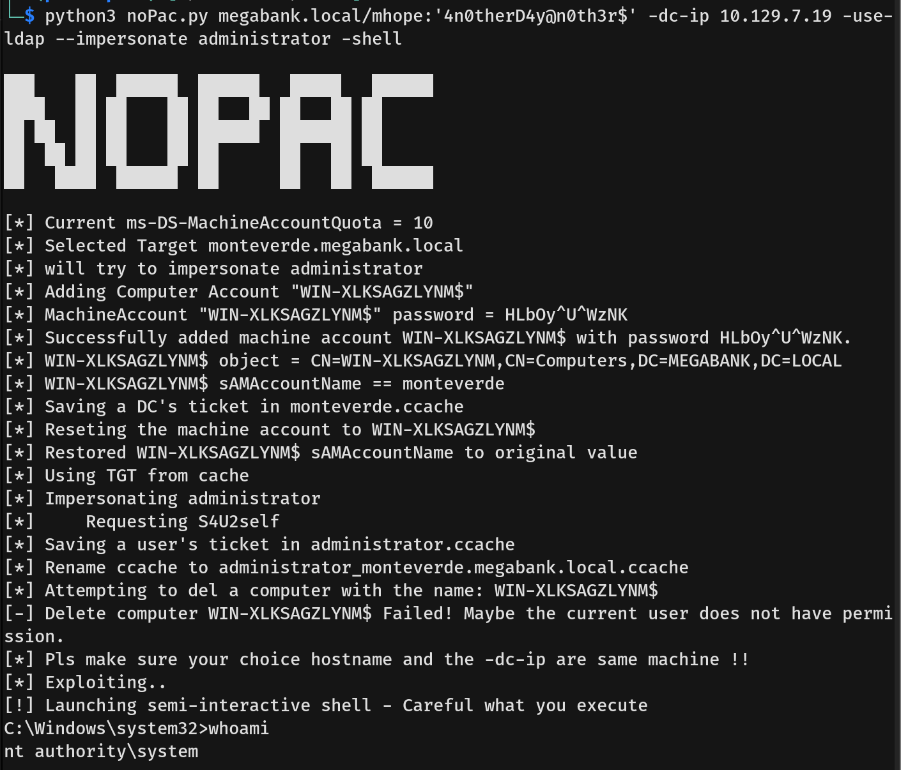
