# NodeBlog Writeup - by Thammanant Thamtaranon

**NodeBlog** is an **Easy**-difficulty Linux machine hosted on Hack The Box.

---

## Reconnaissance
- The engagement began with a full TCP port scan to identify open services and determine the underlying operating system.
  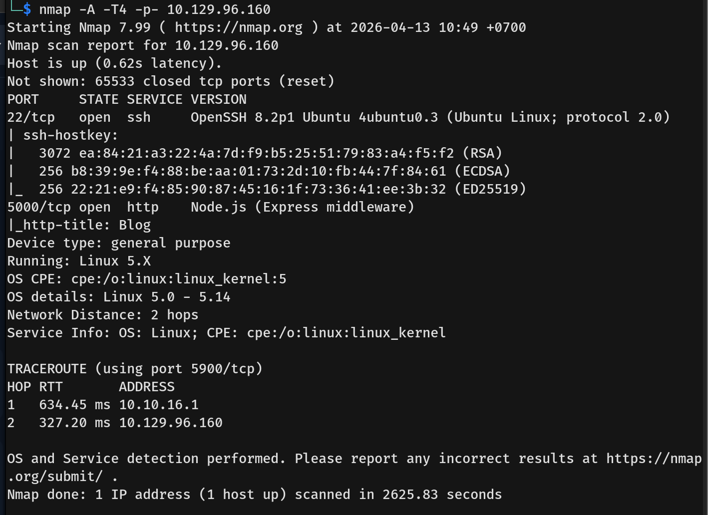
- The results indicated that only port **5000/tcp** was open, which is commonly associated with Node.js or Flask web applications.

---

## Scanning & Enumeration
- We initiated a directory brute-force scan using `dirsearch` against port 5000 to map out the application's structure.
  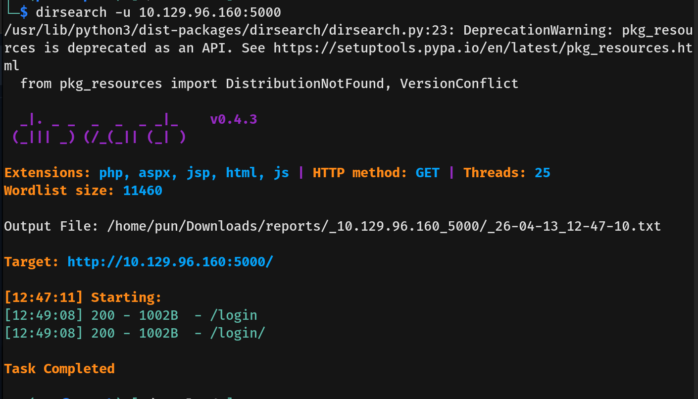
- Navigating to `http://10.129.96.160:5000` in the browser revealed the Blog web application.
  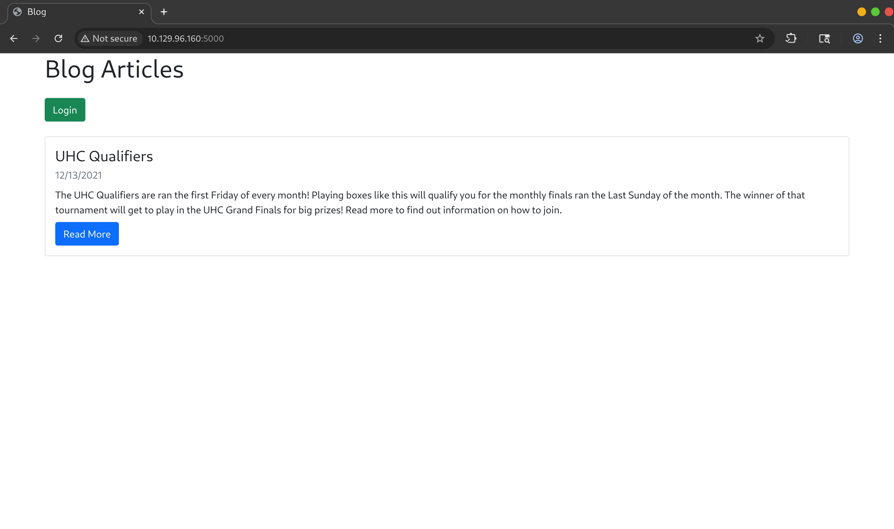
- Further enumeration led us to the login portal, presenting an initial target for authentication bypass.
  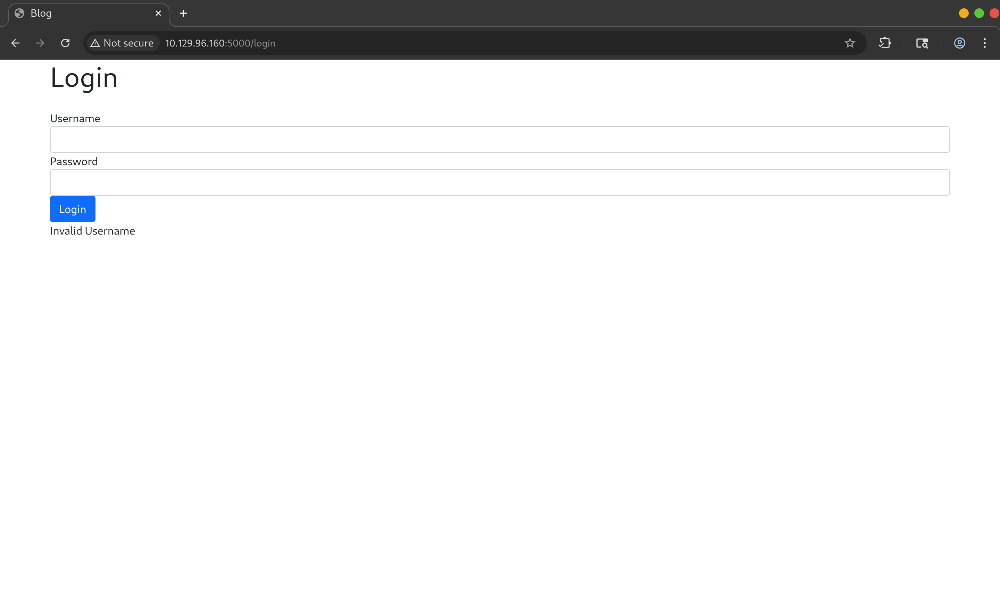
  
---

## Exploitation (Initial Access)
- We initially tested the login form for standard SQL injection, which failed. Recognizing that Node.js applications frequently use MongoDB, we pivoted to testing for NoSQL injection. Using a standard NoSQL authentication bypass payload successfully granted us access to the application dashboard.
  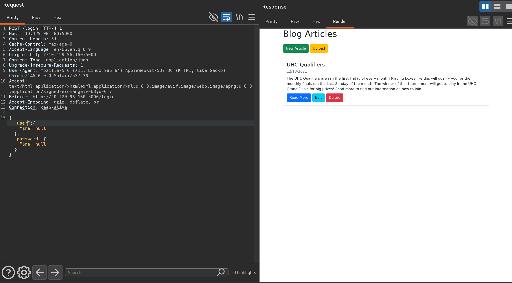
  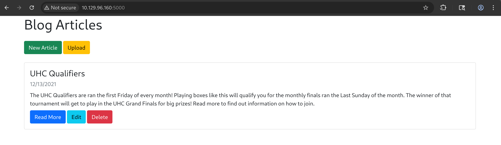
- While exploring the authenticated features, we discovered an "Upload" function that accepts XML files to automatically prefill the New Article functions.
- Suspecting an XML External Entity (XXE) vulnerability, we crafted a malicious XML payload designed to read local system files, starting with `/etc/passwd`.
  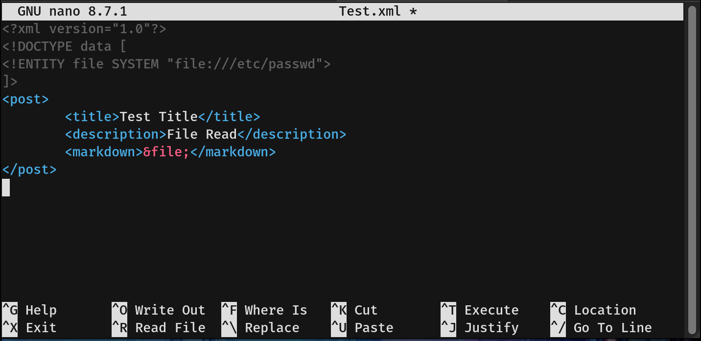
- Upon uploading the payload, the application successfully parsed the external entity, displaying the contents of `/etc/passwd` directly within the Markdown section.
  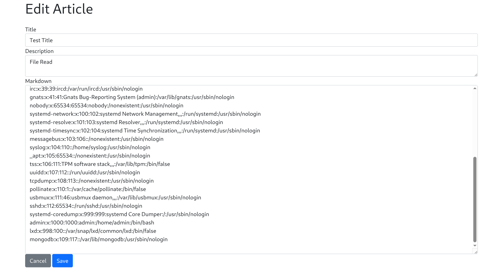
- With local file inclusion confirmed via XXE, we aimed to retrieve the application's source code (e.g., `index.js`, `main.js`, or `server.js`). During testing, we intentionally triggered an error that conveniently leaked the application's absolute file path.
  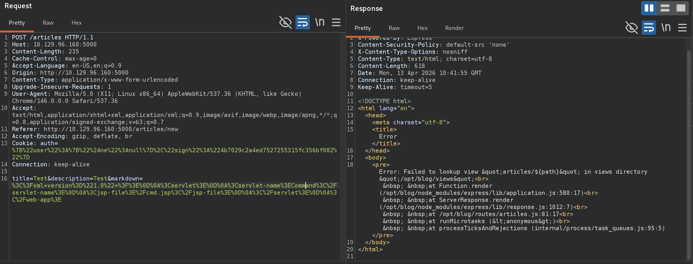
- Utilizing the leaked path and the XXE vulnerability, we successfully extracted the contents of `server.js`.
  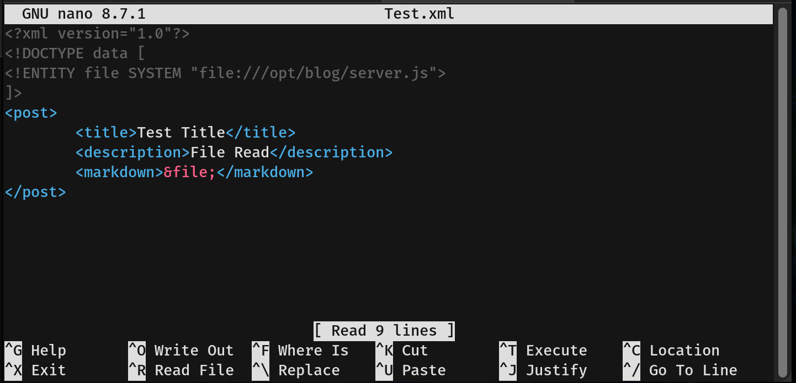
  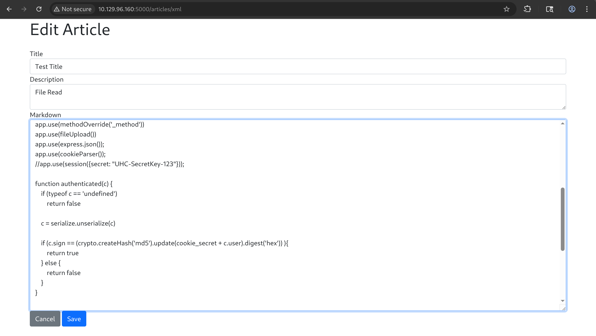
- Analyzing `server.js` revealed a critical insecure deserialization flaw in how user authentication cookies were handled. The application utilized the `node-serialize` library and called `c = serialized.unserialize(c)` directly on user input.
- We leveraged documentation from *PayloadsAllTheThings* for Node.js insecure deserialization to craft our attack.
- **Exploitation Steps:**
  1. We generated and encoded a reverse shell payload.
  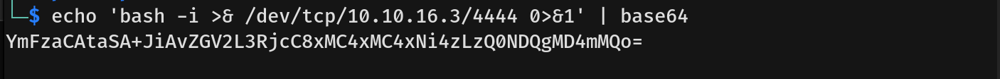
  2. We embedded the encoded shell into the PayloadsAllTheThings payload.
  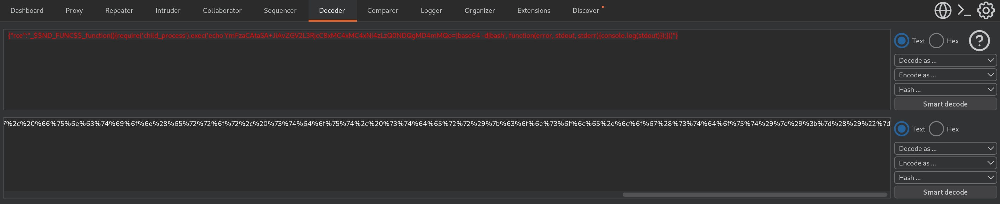
  3. We intercepted a legitimate web request, replaced the `Cookie` header with our malicious payload (`Cookie: auth=<payload>`), and forwarded it.
  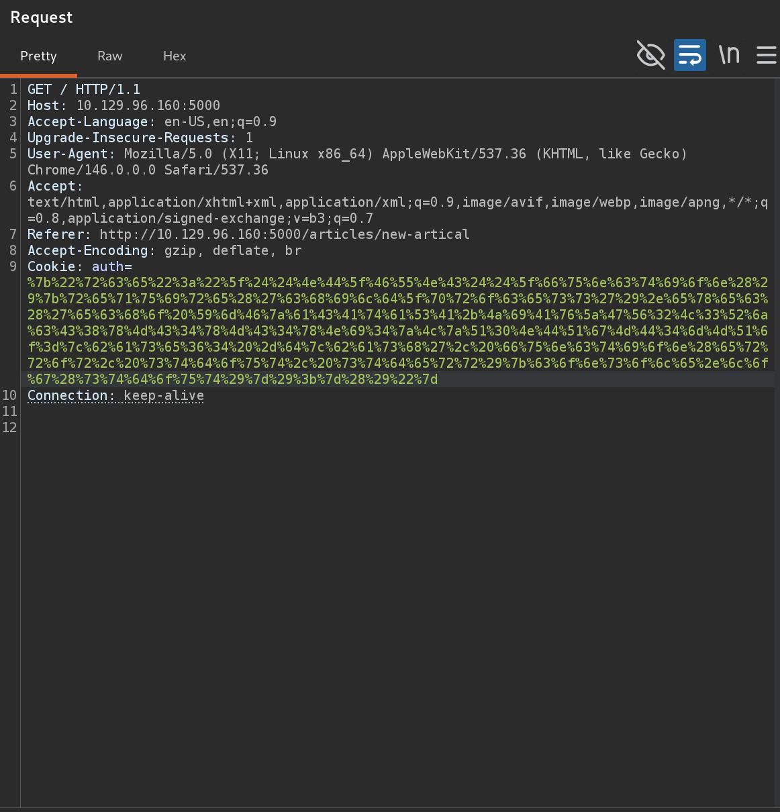
- The application deserialized the payload, successfully executing the reverse shell and granting us access as the `admin` user.
  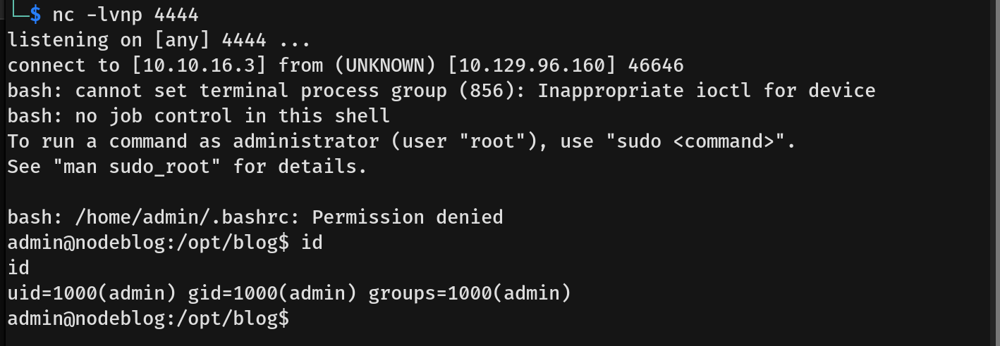
- *Note:* Upon gaining initial access, the shell lacked permissions to read the home directory. After manually adjusting the directory permissions, we were able to retrieve the `user.txt` flag.
  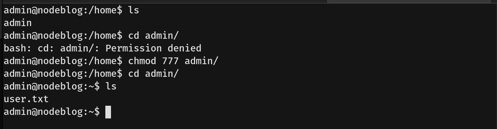

---

## Privilege Escalation
- We attempted to execute `sudo -l` to check for privileged commands but lacked the `admin` user's system password.
- Shifting to internal enumeration, we checked for active local services and discovered a MongoDB instance running on localhost (`127.0.0.1:27017`).
  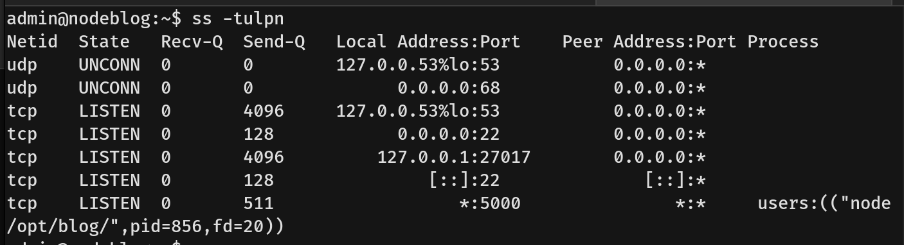
- We connected to the local MongoDB instance using the command-line client.
  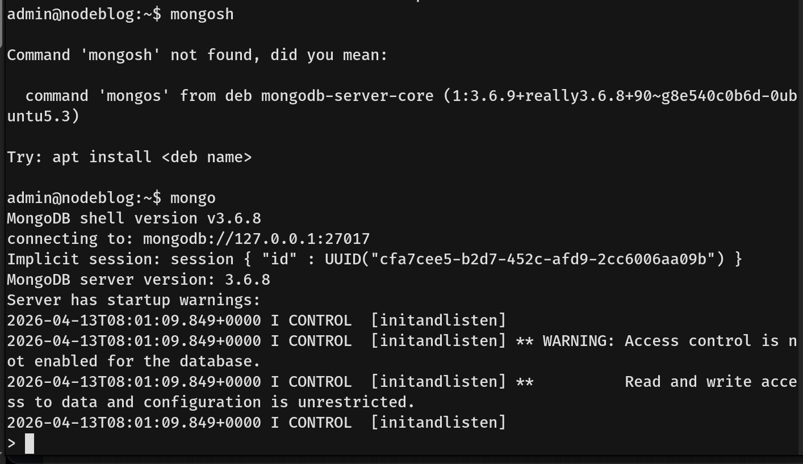
- Dumping the database collections revealed a set of plaintext administrator credentials.
  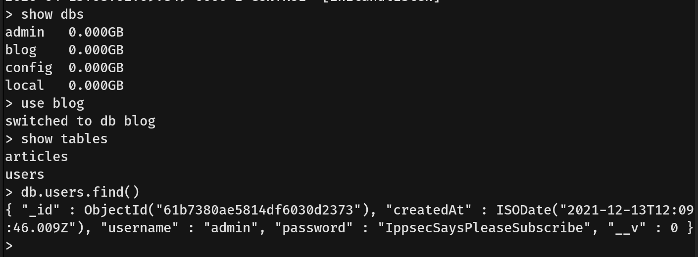
- With the `admin` system password in hand, we successfully ran `sudo -l`. The output confirmed that the `admin` user was permitted to run **any command** with `sudo` privileges without restrictions (`(ALL : ALL) ALL`).
- To achieve a stable root shell, we executed `sudo chmod +s /bin/bash` to set the SUID bit on the bash executable.
- Finally, running `/bin/bash -p` dropped us into a high-privileged root shell, allowing us to retrieve the `root.txt` flag.
  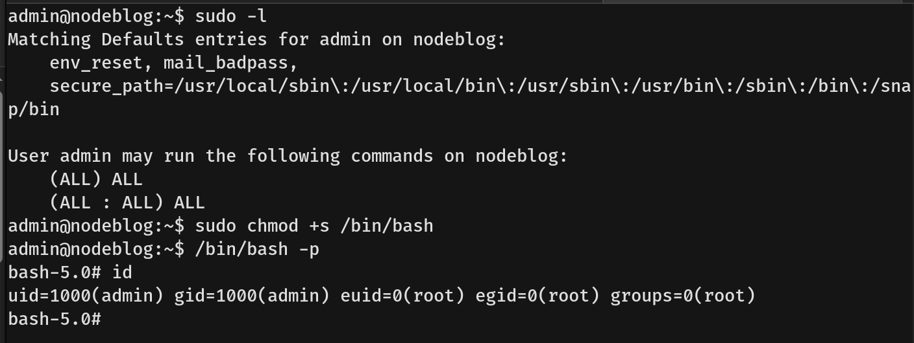
