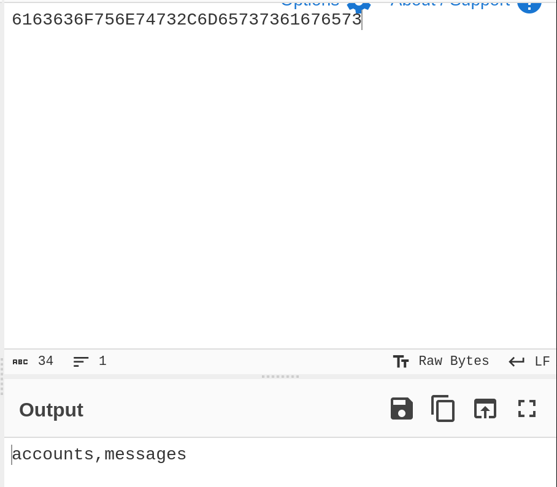

# PC Writeup - by Thammanant Thamtaranon  

- PC is an easy Linux-based machine hosted on Hack The Box.

## Reconnaissance  
- I began with a full TCP port scan including service/version detection and OS fingerprinting:  `nmap -A -T4 -p- 10.10.11.214`  

  

- The scan revealed two open ports:  
  - 22 (SSH)  
  - 50051 (gRPC)  

## Scanning & Enumeration  
- I connected to the gRPC service:  
  

- Listing the available methods revealed potential entry points:  
  

- The getInfo method required authentication:  
  

- When attempting to register as 'admin', I discovered the account already existed:  
  

- I successfully logged in using admin:admin credentials:  
  

- Using verbose mode (`-vv` flag) revealed the authentication token:  
  

- However, the getInfo method didn't return useful information even with the token.

## Exploitation  
- Testing for SQL injection vulnerabilities revealed the ID parameter was vulnerable to the payload `1 UNION SELECT 1`.  

- After identifying the backend as SQLite:  
  

- Since the response required integer values, I converted database information to hex for extraction:  
  
  
  
  
  
  

- This provided SSH access as user 'sau':  
  

- I successfully retrieved the user flag.

## Privilege Escalation  
- Checking sudo permissions showed no privileges for user 'sau':  `sudo -l`  

- I discovered internal services using:  `ss -tulpn`  

- This revealed a service running on port 8000:  
  

- I established an SSH tunnel to access the service locally:  `ssh sau@10.10.11.214 -L 8000:localhost:8000`  

- The service was identified as pyLoad (based on the 2022 copyright notice), suggesting potential CVEs from 2022-2023. After researching online, I found **CVE-2023-0297**.  

- Testing for **CVE-2023-0297** by accessing `/flash/addcrypted2`:  
  

- After confirming the vulnerability, I used a public POC from Exploit-DB:  
  
  

- Following a successful callback, I modified the exploit by uploading a reverse shell and executing it, which resulted in root access:  
  

- I successfully retrieved the root flag, completing the machine.
