# Pandora Writeup - by Thammanant Thamtaranon

**Pandora** is an **Easy**-difficulty Linux machine hosted on Hack The Box.

---

## Reconnaissance
- We started the engagement with a full TCP port scan using Nmap to identify open services and determine the underlying operating system.
    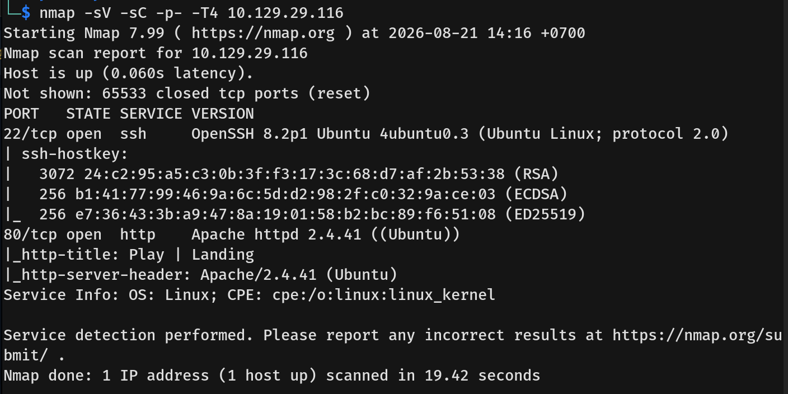
    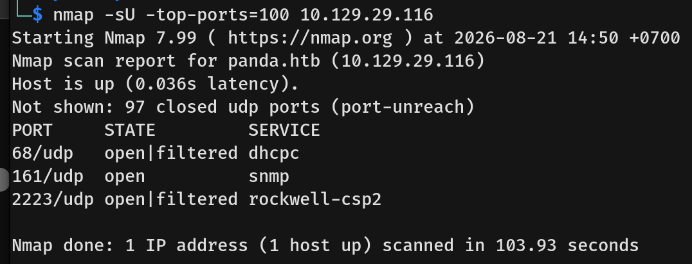
- The results indicated only one open TCP port and a few UDP ports:
    *   **22/tcp:** SSH (OpenSSH 8.2p1 Ubuntu 4ubuntu0.3)
    *   **80/tcp:** HTTP (Apache httpd 2.4.41)
    *   **68/udp:** dhcpc
    *   **161/udp:** snmp
    *   **2223/udp:** rockwell-csp2

---

## Scanning & Enumeration
- Visiting port 80 in the browser showed a simple static "Play" landing page referencing the domain `panda.htb`. We added this to our `/etc/hosts` file.
    
- After initial enumeration of the web server yielded little else, we moved on to the SNMP service. Using `snmpwalk` with the default `public` community string, we successfully queried the server to enumerate system details and running processes.
    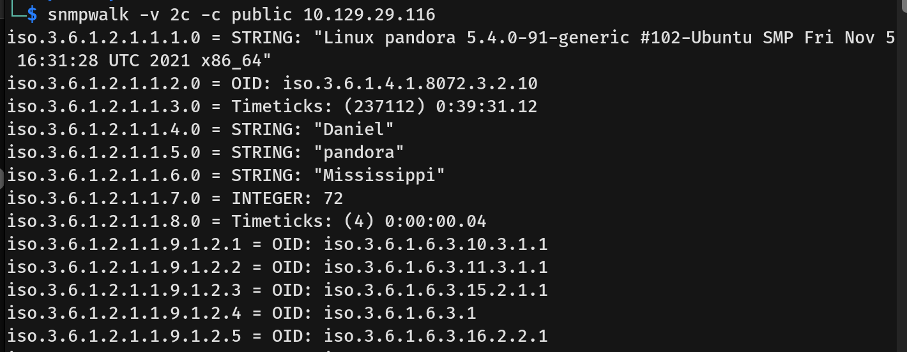
- Scrolling through the process list, we found a command containing plaintext credentials for the user `daniel`.
    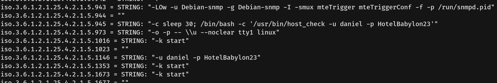
- We then used these credentials to SSH into the machine as `daniel`.
    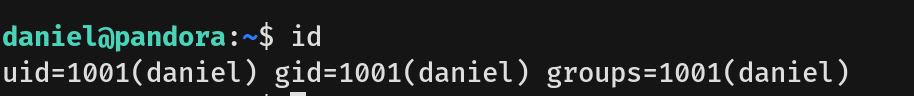

---

## Exploitation
- After further enumeration on the system, we discovered an internal virtual host configuration for Apache named `pandora.panda.htb`.
    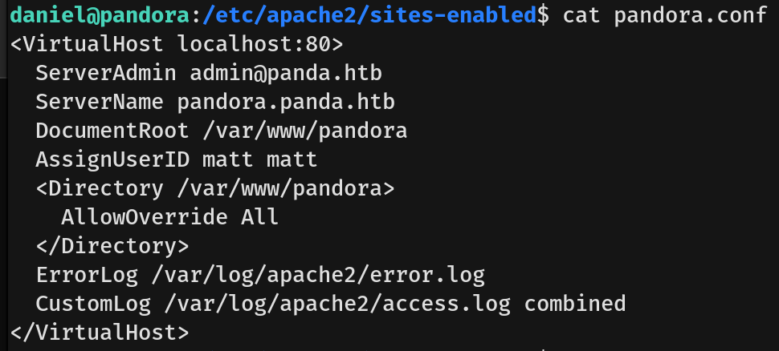
- We created an SSH tunnel to forward this internal web service to our local machine. Visiting the site revealed a Pandora FMS login page, noting the version `v7.0NG.742_FIX_PERL2020` at the bottom.
    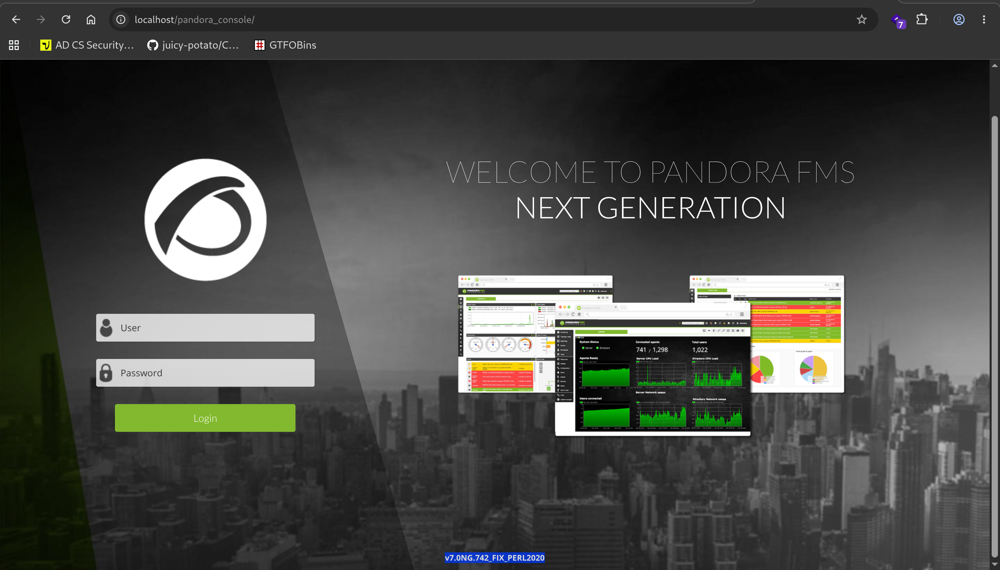
- Searching for this version online revealed it is vulnerable to **CVE-2021-32099**, a critical SQL injection vulnerability in the `chart_generator.php` component. This flaw allows an unauthenticated attacker to upgrade their session and completely bypass the login mechanism.
    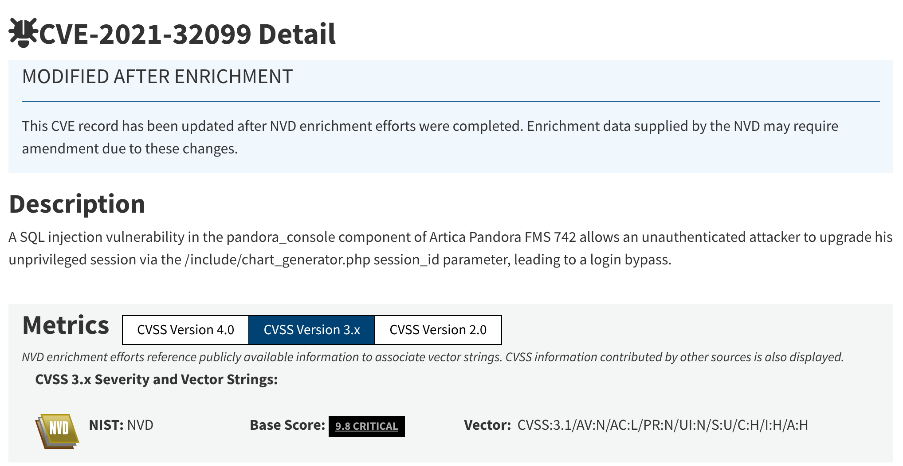
- We found a PoC for this vulnerability in a [GitHub repository](https://github.com/akr3ch/CVE-2021-32099).
    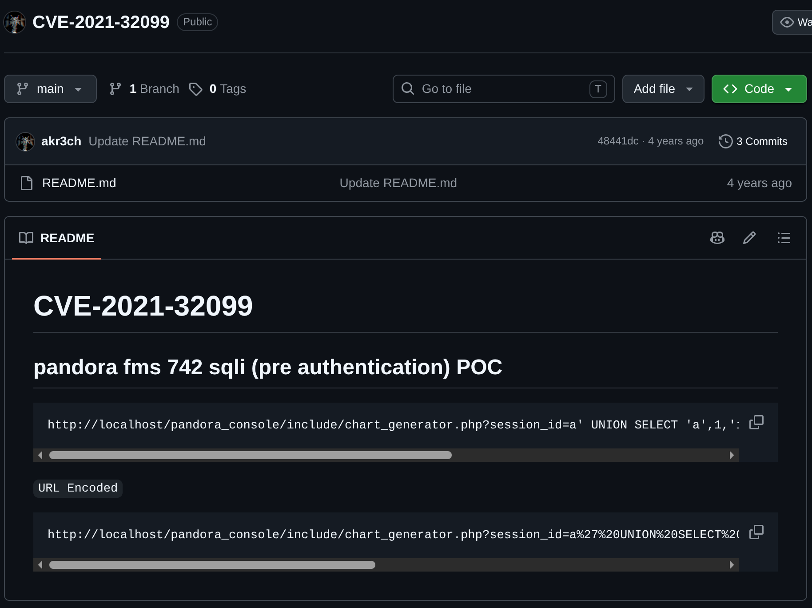
- After navigating to the PoC URL containing the SQL statement and returning to the main page, we successfully bypassed the login and gained access as an admin.
    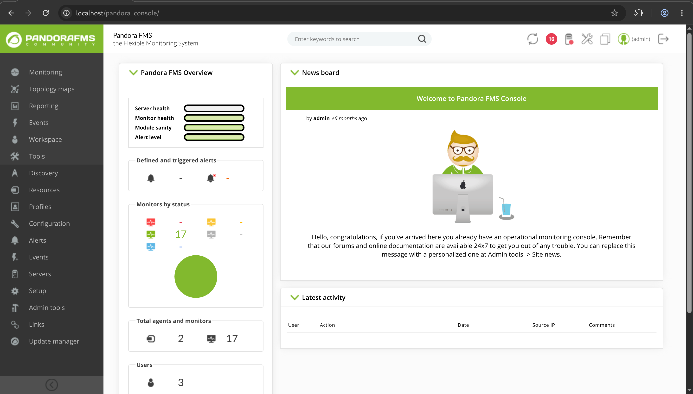
- Navigating to **Admin tools -> File manager**, we found a feature that allows file uploads.
    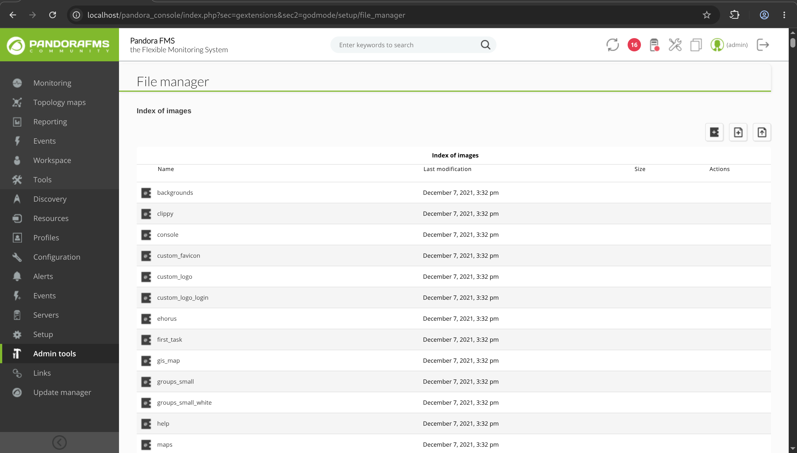
- We uploaded a standard PHP web shell.
    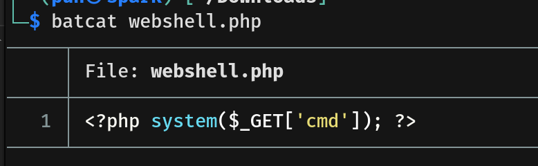
- However, when attempting to access it, the file was downloaded instead of executed. By inspecting the server's response, we discovered the exact directory path where our PHP web shell was stored (`/pandora_console/images/webshell.php`).
    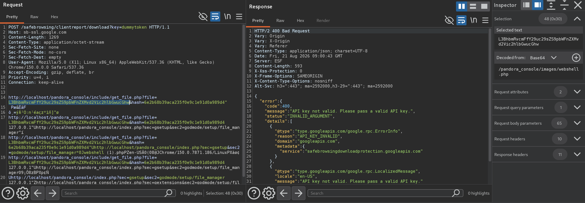
- Navigating to this path provided us with a working web shell running as the user `matt`.
    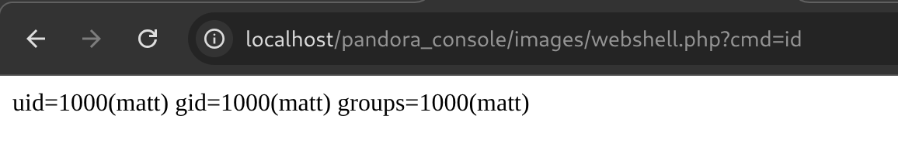
- Using the web shell, we executed a reverse shell payload to gain an interactive session as `matt`.
    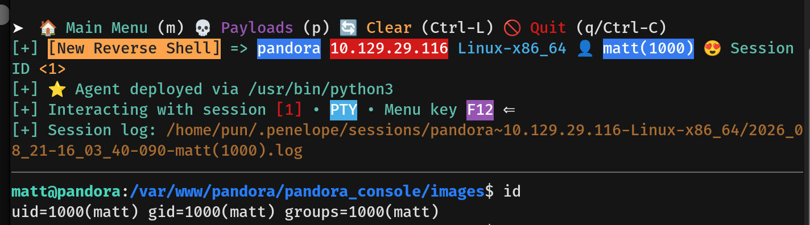
- Because the reverse shell connection was slightly unstable, we generated an SSH key pair on our local machine.
    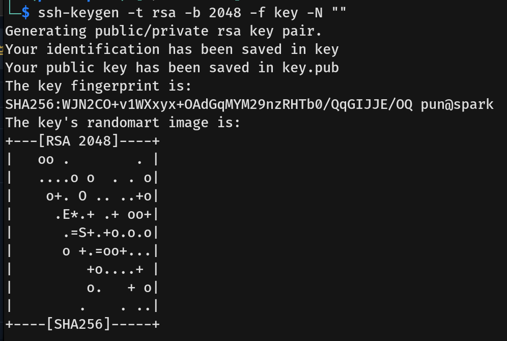
- We then placed our public key into Matt's `~/.ssh/authorized_keys` file and set the appropriate permissions.
    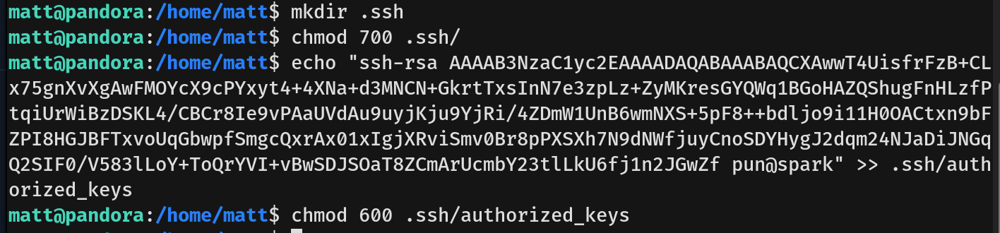
- With this setup, we established a stable SSH connection as `matt` and captured the user flag.
    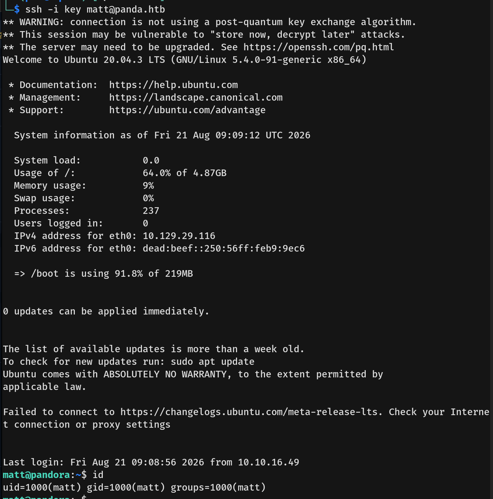

---

## Privilege Escalation
- We couldn't run `sudo -l` because we lacked Matt's password, so we searched for interesting SUID binaries and discovered `/usr/bin/pandora_backup`.
    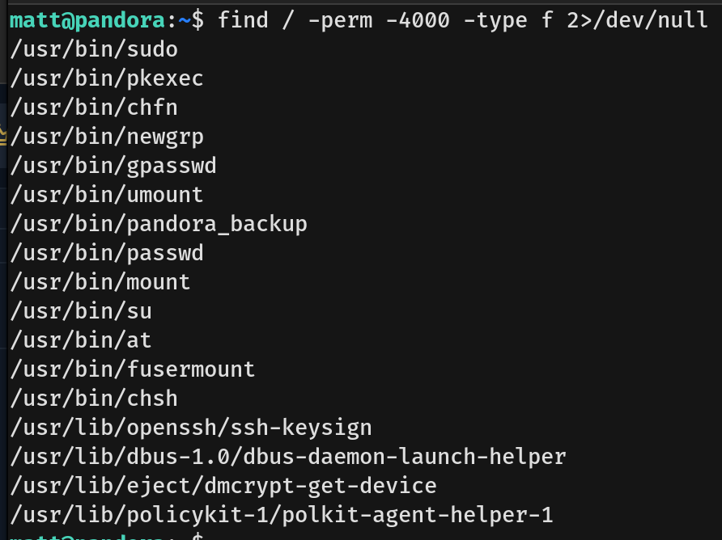
- By reading the binary, we discovered that it executes the `tar` command (`tar -cvf`) to back up all the files in the `/var/www/pandora/pandora_console/` directory. 
    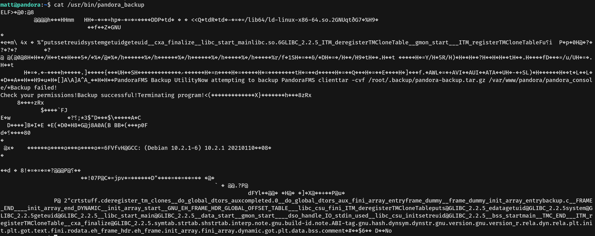
- Crucially, the binary calls `tar` without using an absolute path. We exploited this via PATH hijacking. We created a malicious script named `tar` inside `/tmp/exploit` that runs `chmod +s /bin/bash`. We made it executable, prepended `/tmp/exploit` to our environment's `$PATH` variable, and executed `/usr/bin/pandora_backup`. The SUID binary ran our fake `tar` script as root, setting the SUID bit on the system's `/bin/bash` binary.
    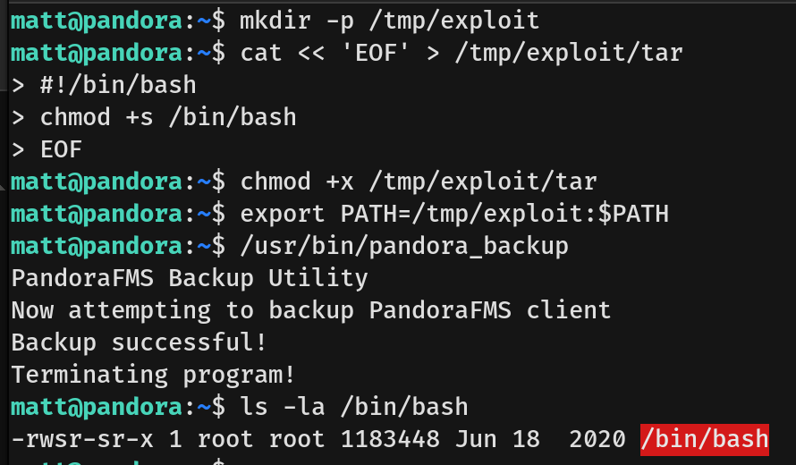
- Finally, we ran `/bin/bash -p` to drop into a privileged root shell and captured the root flag.
