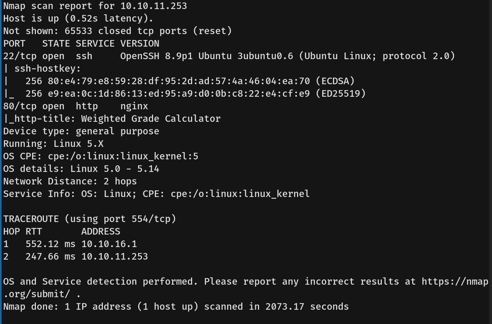
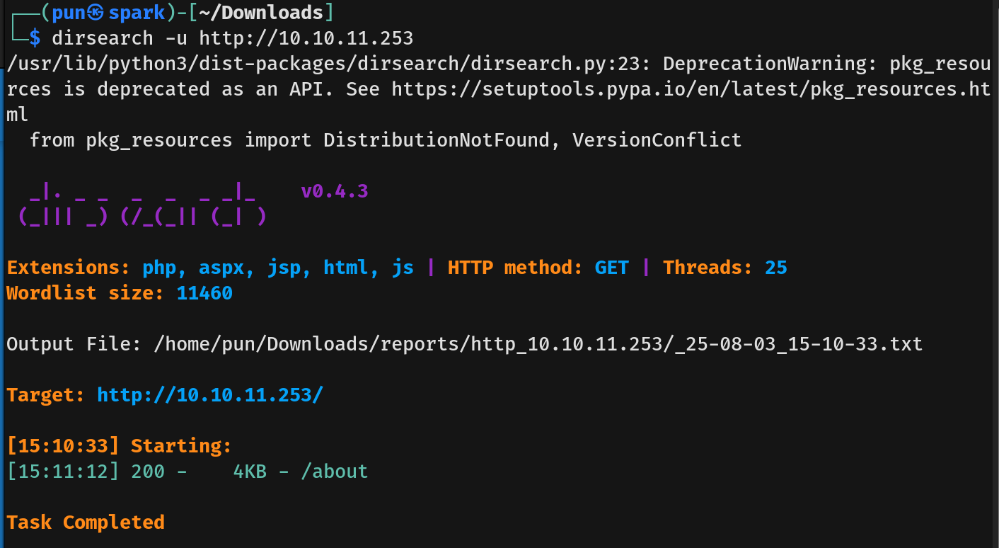
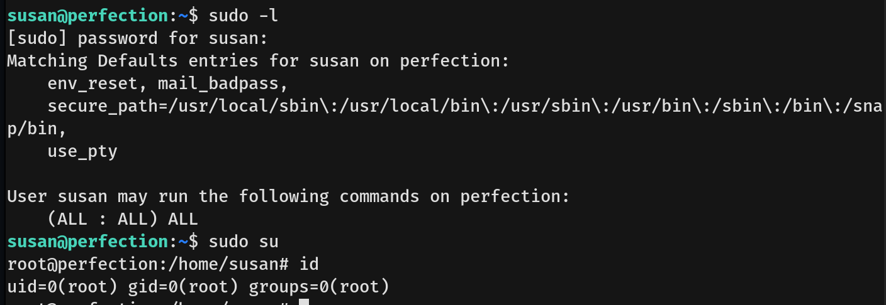

# Perfection Writeup - by Thammanant Thamtaranon  
- Perfection is an easy Linux-based machine hosted on Hack The Box.

## Reconnaissance  
- We began by performing a full TCP port scan with version detection and OS fingerprinting using the command:  
  `nmap -A -T4 -p- 10.10.11.8`  

## Scanning & Enumeration  
- We enumerated web directories using:  
  `dirsearch -u http://10.10.11.8:5000`  
  
- One interesting path we discovered was:  
  `http://10.10.11.8:5000/support`

## Exploitation  

## Privilege Escalation  
- We created a shell script, named it `initdb.sh`, gave it execution permission, and run the command `sudo /usr/bin/syscheck`.  
  
- We received a shell as `root` and obtained the **root flag**.
