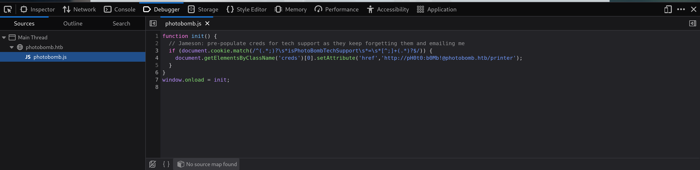
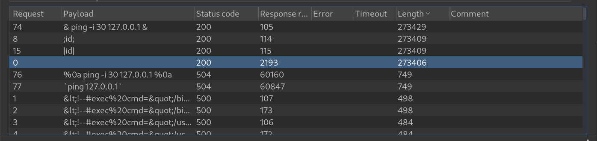
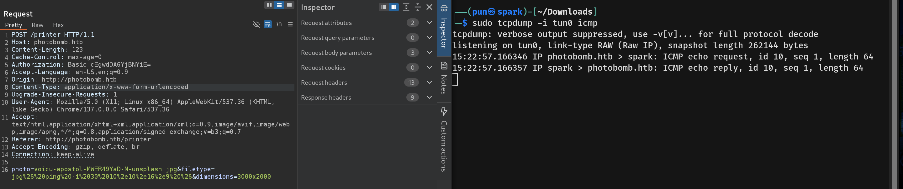
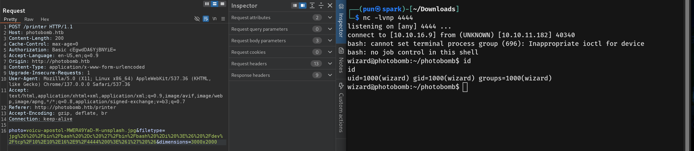
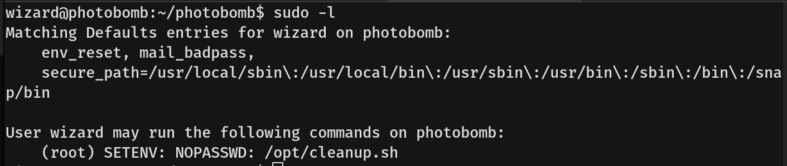
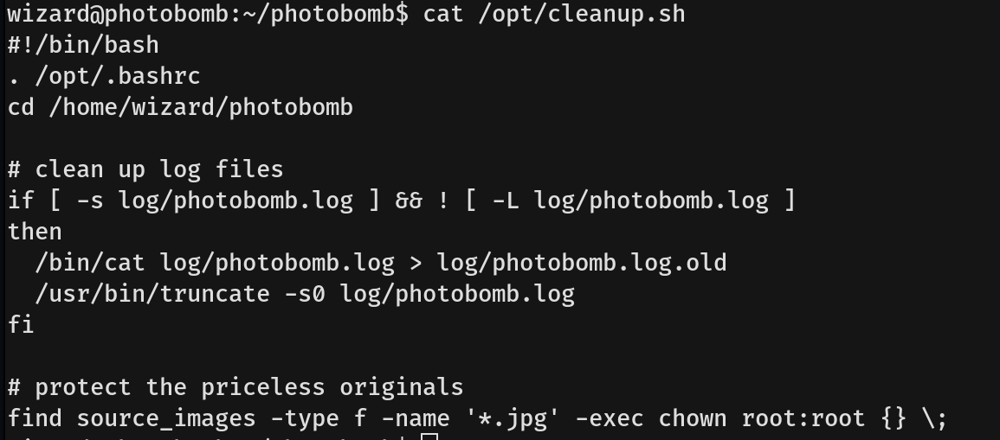
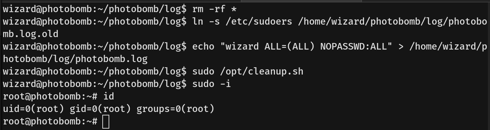

# Photobomb Writeup - by Thammanant Thamtaranon  
- Photobomb is an easy Linux-based machine hosted on Hack The Box.

## Reconnaissance  
- I started with a full TCP port scan including service/version detection and OS fingerprinting using the command:  
  `nmap -A -T4 -p- 10.10.11.182`  
  
- The scan showed two open ports:
  - 22 (SSH)
  - 80 (HTTP)
- We then added `photobomb.htb` to `/etc/hosts` for proper hostname resolution.

## Scanning & Enumeration  
- I ran a directory brute-force using `dirsearch`: `dirsearch -u photobomb.htb`  
  
- I then enumerated virtual hosts using `ffuf`:  
  `ffuf -u http://photobomb.htb -H "Host: FUZZ.photobomb.htb" -w /usr/share/seclists/Discovery/DNS/subdomains-top1million-20000.txt -mc all -ac`  
- We found nothing.
- Accessing `/print` required a credential.
- By inspecting the source code, I found the embedded credential.  
  
- Using this credential, we accessed the page where we could select and download the image.

## Exploitation  
- Using Burp Suite to inspect the request, we saw three parameters: `photo`, `filetype`, and `dimensions`.
- I then tested for command injection using examples from [PayloadsAllTheThings](https://github.com/swisskyrepo/PayloadsAllTheThings/blob/master/Command%20Injection/Intruder/command-execution-unix.txt).
- I tried both `photo` and `filetype`. The results showed that the `filetype` parameter was injectable.  
  
- I tested by pinging my own machine.  
  
- After confirming this, I replaced the command with a reverse shell.  
  
- We successfully obtained a shell as user `wizard` and grabbed the user flag.

## Privilege Escalation  
- I attempted to run `sudo -l` and found that any user could execute `/opt/cleanup.sh` as root without a password.  
  
- Inspecting `cleanup.sh`, I found a vulnerability in the line:  
  `/bin/cat log/photobomb.log > log/photobomb.log.old`  
  
- The script checks if `log/photobomb.log` is a symlink but does not check `log/photobomb.log.old`.
- We created a symlink from `log/photobomb.log.old` to `/etc/sudoers` and then echoed `wizard ALL=(ALL) NOPASSWD:ALL` into `log/photobomb.log`. Running `sudo /opt/cleanup.sh` overwrote `/etc/sudoers`.  
  
- We then obtained a root shell and captured the root flag.
