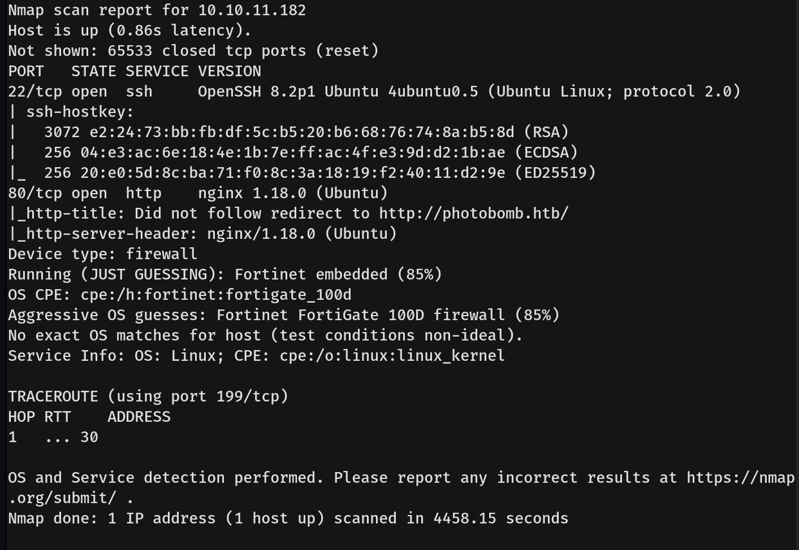

# Photobomb Writeup - by Thammanant Thamtaranon  
- Photobomb is an easy Linux-based machine hosted on Hack The Box.

## Reconnaissance  
- I started with a full TCP port scan including service/version detection and OS fingerprinting using the command:  
  `nmap -A -T4 -p- 10.10.11.182`  
  
- The scan showed two open ports:
  - 22 (SSH)
  - 80 (HTTP).
- I added `photobomb.htb` to `/etc/hosts` for proper hostname resolution.

## Scanning & Enumeration  
- I ran a directory brute-force using `dirsearch`: `dirsearch -u photobomb.htb`

- I then enumerated virtual hosts using `ffuf`:  
  `ffuf -u http://photobomb.htb -H "Host: FUZZ.photobomb.htb" -w /usr/share/seclists/Discovery/DNS/subdomains-top1million-20000.txt -mc all -ac`  
  
- I discovered `data.photobomb.htb`, so I added that to `/etc/hosts` as well.

## Exploitation  

## Privilege Escalation  
- I attempted to run `sudo -l`, but Phil did not have sudo privileges.  
