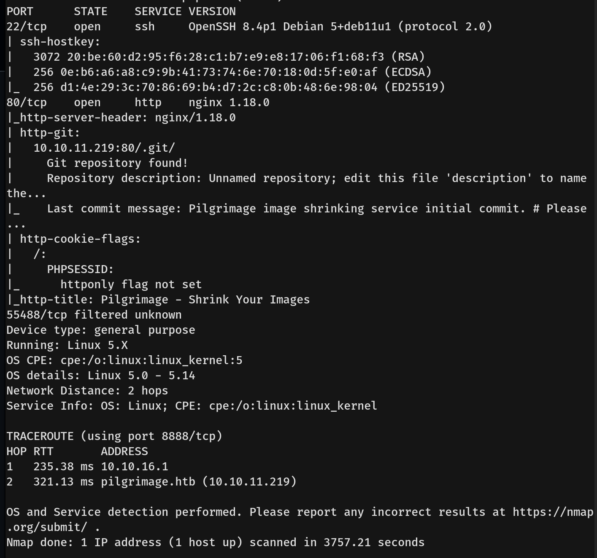
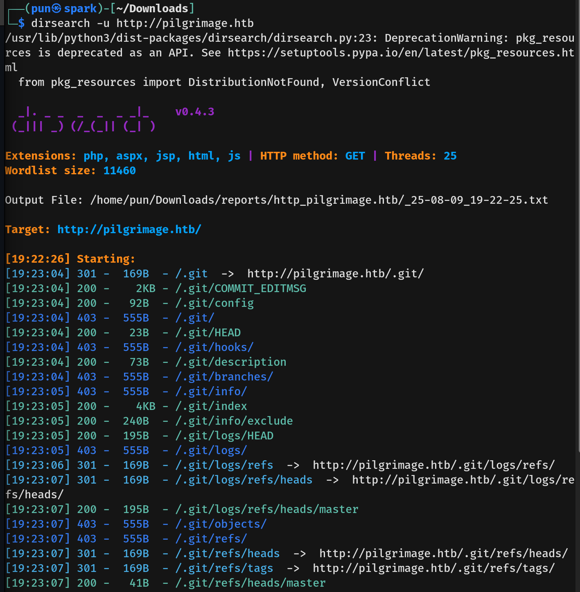
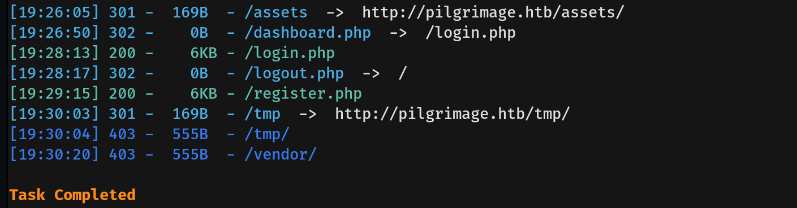
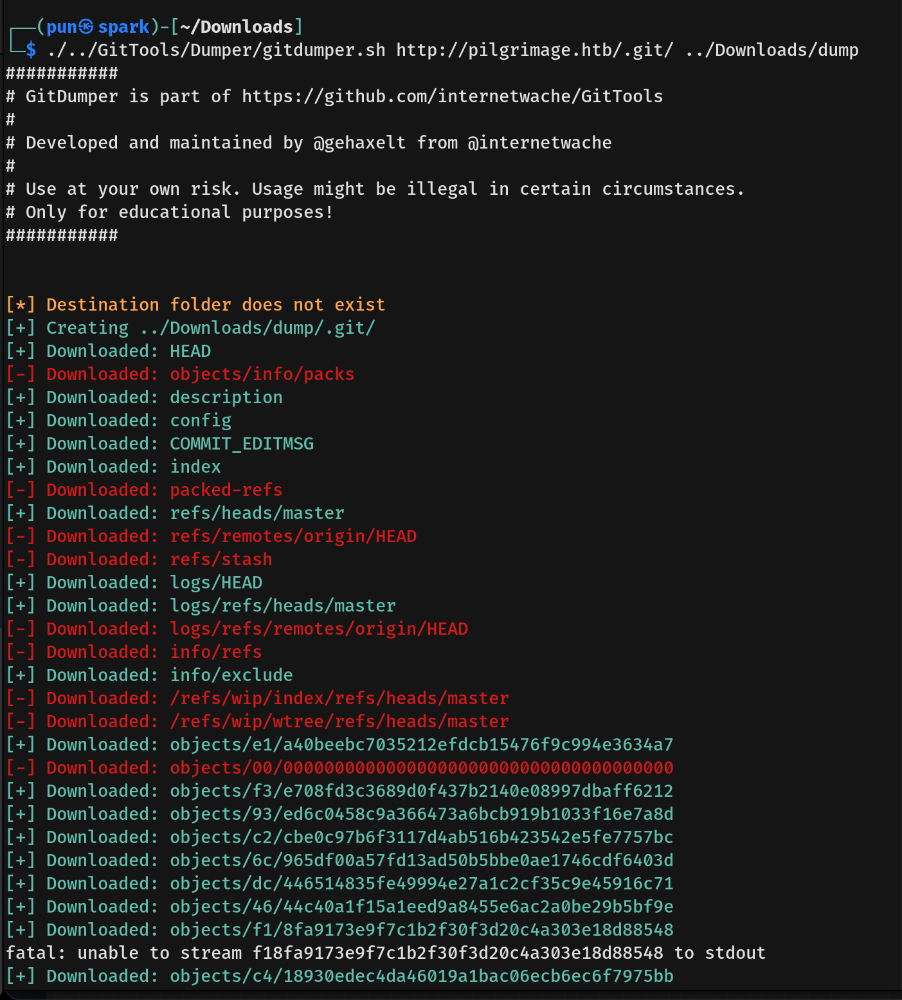
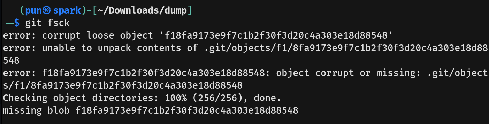
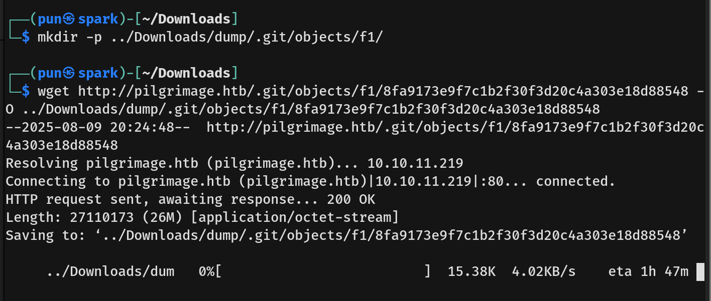
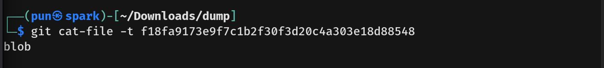
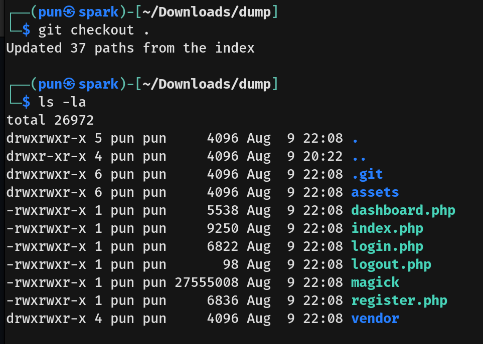
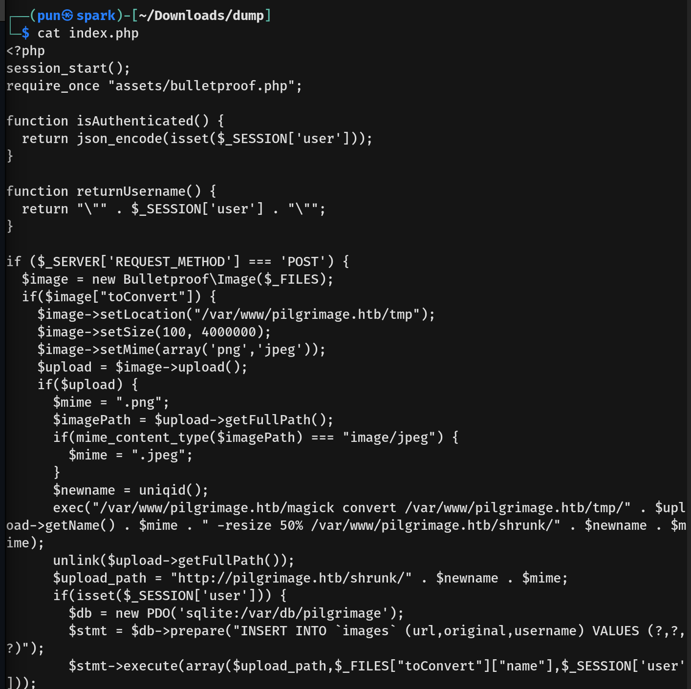
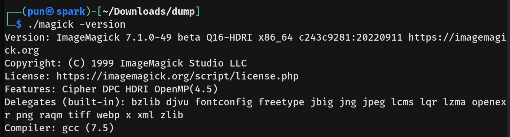

# Pilgrimage Writeup - by Thammanant Thamtaranon  
- Pilgrimage is an easy Linux-based machine hosted on Hack The Box.

## Reconnaissance  
- I started with a full TCP port scan including service/version detection and OS fingerprinting:  
  `nmap -A -T4 -p- 10.10.11.219`  
  
- The scan showed two open ports:  
  - 22 (SSH)  
  - 80 (HTTP)  
- I added `pilgrimage.htb` to `/etc/hosts` for proper hostname resolution.

## Scanning & Enumeration  
- I ran a directory brute-force using `dirsearch`:  
  `dirsearch -u http://pilgrimage.htb`  

  
- We then found user `emily` in `COMMIT_EDITMSG` file.
- I also run the Vhost enumeration but found nothing.
- From the cookie section we now know that it is written in PHP.
- We found the .git, so we will use the GitTools to dump the data.
- We run the command `./../GitTools/Dumper/gitdumper.sh http://pilgrimage.htb/.git/ ../Downloads/dump`.

- Since there are some error we need to fix those.
- We use the command `git fsck` and found that one of the blob is missing.

- So we make a directory and downloaded the missing blob.

- After that we check git's recognition.

- Then we run `git checkout .`

- After inspect `index.png`, we founded that the web is using magick.

- We then run `./magick -version`.

- 

## Exploitation  
- We use the command

## Privilege Escalation  
