# Remote Writeup - by Thammanant Thamtaranon

**Remote** is an **Easy**-difficulty Windows machine hosted on Hack The Box.

---

## Reconnaissance
- We started the engagement with a full TCP port scan using Nmap to identify open services and determine the underlying operating system.
  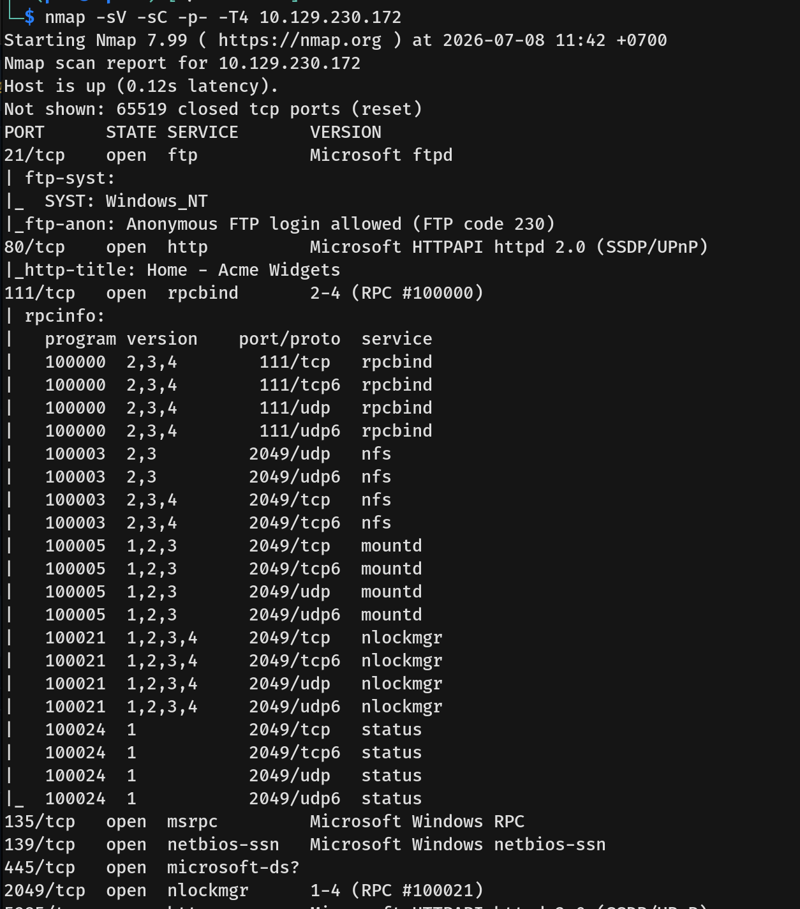
  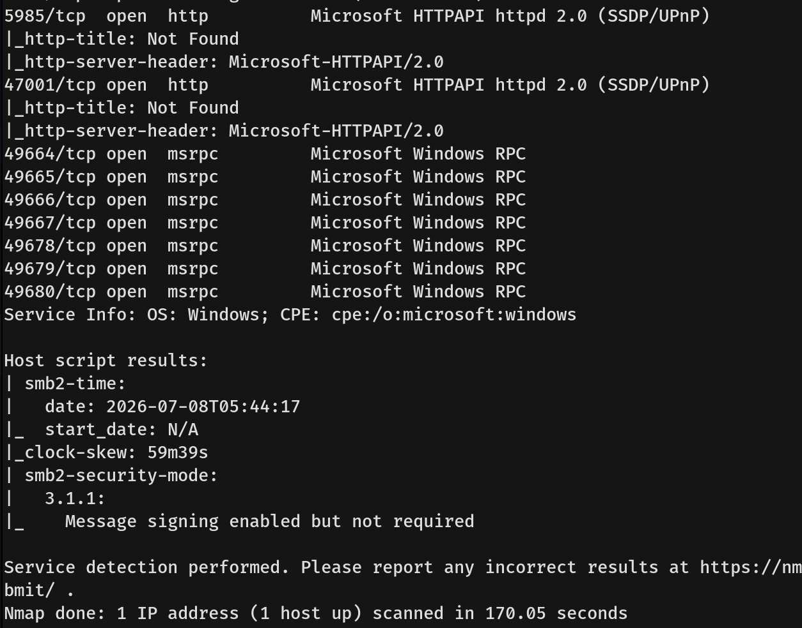
- The results indicated several open ports, revealing a Windows Server environment with the following key services available:
  * **21/tcp:** ftp (Microsoft ftpd - Anonymous login allowed)
  * **80/tcp:** http (Microsoft HTTPAPI httpd 2.0 - Hosting Acme Widgets)
  * **111/tcp & 2049/tcp:** rpcbind / nfs (Network File System)
  * **135/tcp & 139/tcp & 445/tcp:** msrpc / netbios-ssn / microsoft-ds (SMB)
  * **5985/tcp:** http (WinRM remote management)

---

## Scanning & Enumeration
- I started by connecting to the FTP server using anonymous credentials, but found no files of interest.
- Next, we checked the SMB service using both null credentials and guest access, but were unable to successfully authenticate or list shares.
- Moving on to port 80, we discovered the "ACME Widgets" website.
  
- Enumerating further, I found an Umbraco CMS login page. Since Umbraco does not have default credentials, I left the login form aside for the moment.
  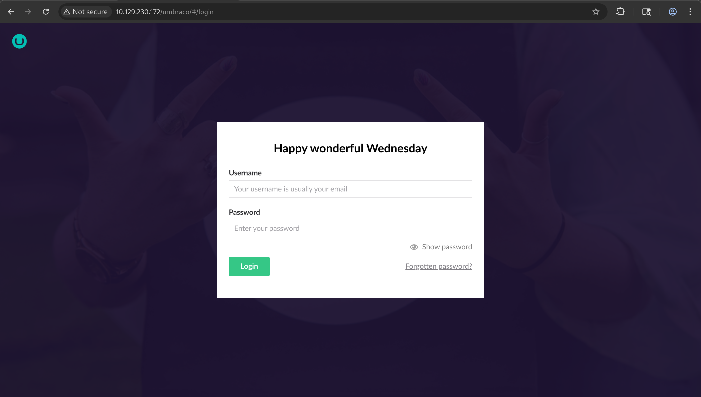
- I searched for known Umbraco vulnerabilities via Searchsploit and found multiple listings. While a Metasploit module was available, it failed to execute. I deduced that we needed valid credentials to leverage the authenticated Remote Code Execution (RCE) exploits.
  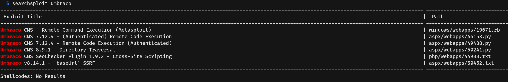
- I then inspected the NFS service running on ports 111 and 2049. Running `showmount -e` revealed a network share named `/site_backups` accessible by everyone. I mounted the share locally to my attack machine to look for any interesting files.
  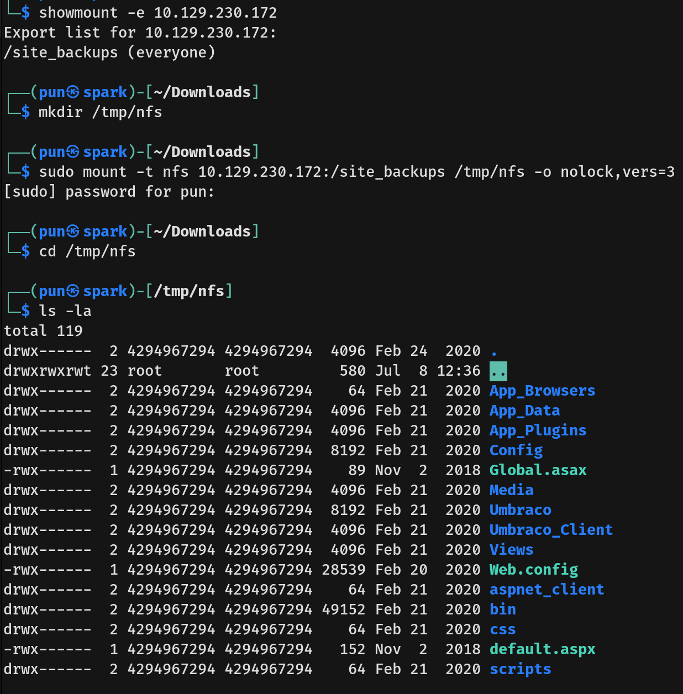

---

## Exploitation
- Inside the mounted directory structure under `/App_Data`, I found `Umbraco.sdf`, which is the SQL Server Compact database file utilized by the CMS. I used the `strings` command to extract plaintext strings from the database and successfully uncovered an administrator account credential with a SHA1 hash. Other user credentials were discovered but used HMACSHA256.
  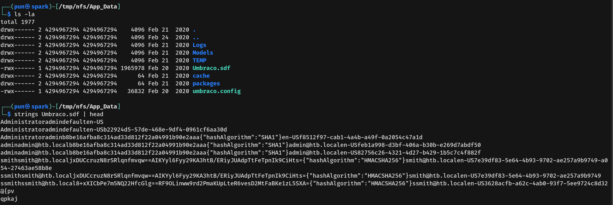
- Fortunately, we were able to successfully crack the administrator's SHA1 hash to reveal the cleartext password.
  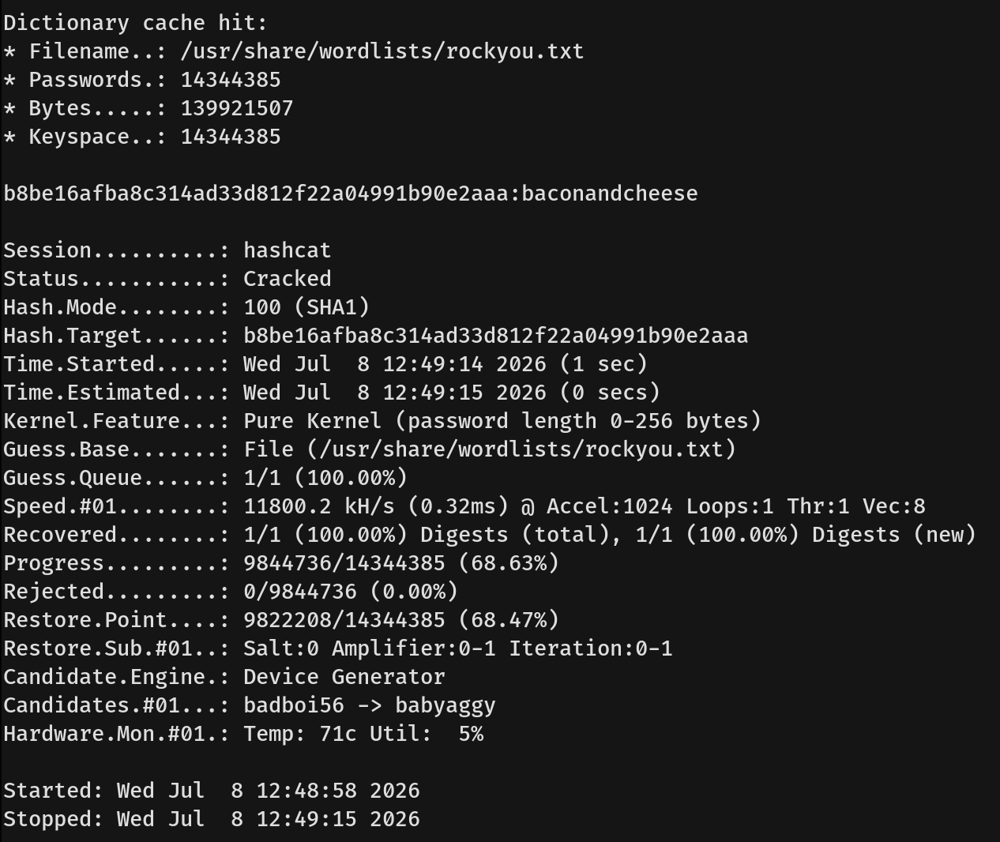
- With valid admin credentials, I downloaded an authenticated RCE exploit script via Searchsploit. Running the script allowed me to execute system commands, and executing `whoami` confirmed that we had code execution as the `iis apppool\defaultapppool` account.
  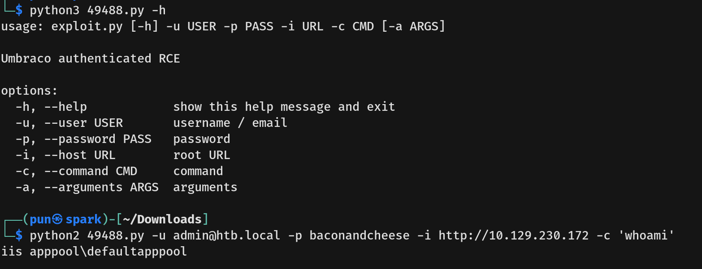
- I then changed the exploit payload to a reverse shell using Penelope.
  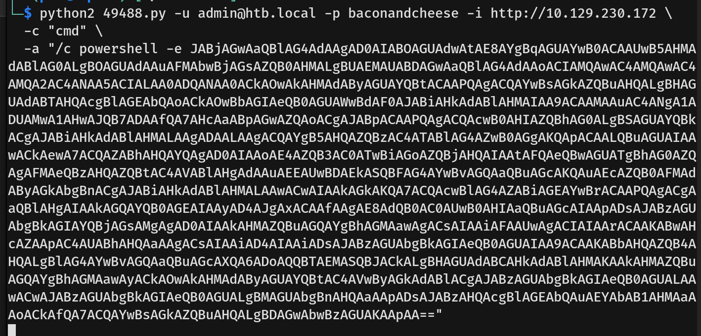
- The shell caught successfully, granting stable access as the low-privileged web server user. From there, I navigated to `C:\Users\Public\Desktop` and captured the user flag.
  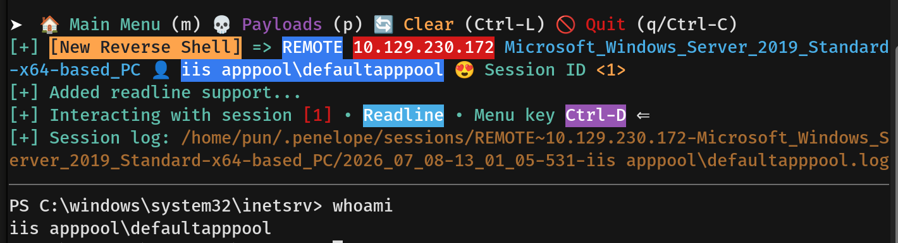

---

## Privilege Escalation
- From our PowerShell session, I executed `whoami /priv` to check the current user privileges and discovered that `SeImpersonatePrivilege` was enabled.
  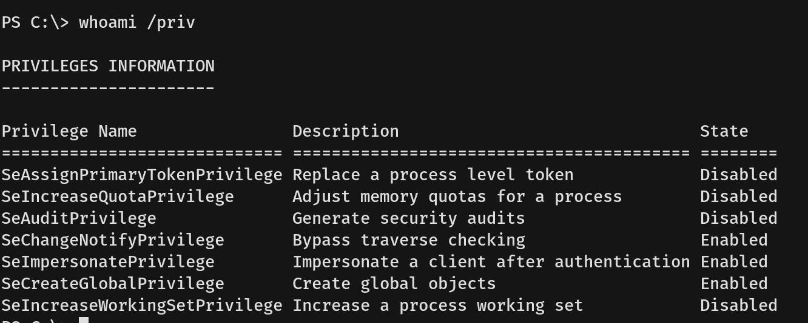
- I checked the system information using `systeminfo` and verified that the target OS is Windows Server 2019 Standard. This environment is vulnerable to token impersonation exploits using GodPotato.
  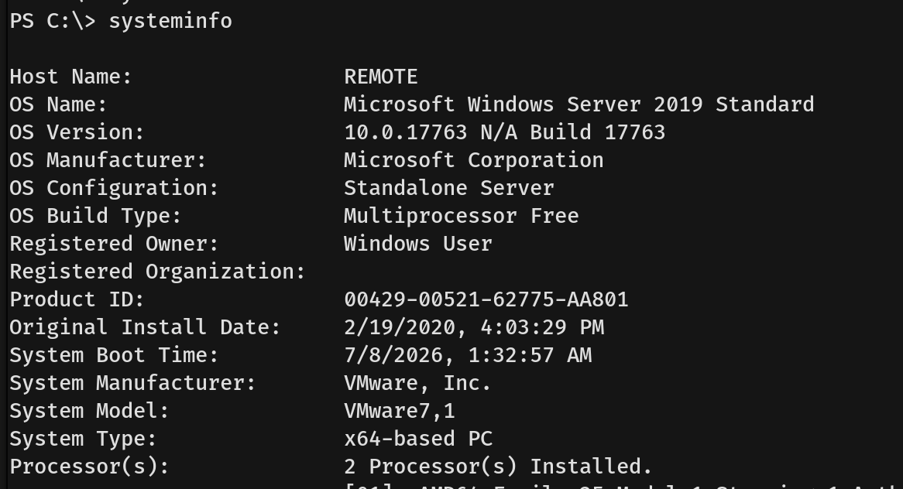
- I inspected the directory environment under `C:\Users` to verify the presence of .NET framework directories, indicating that .NET v4.x was available on the target system.
  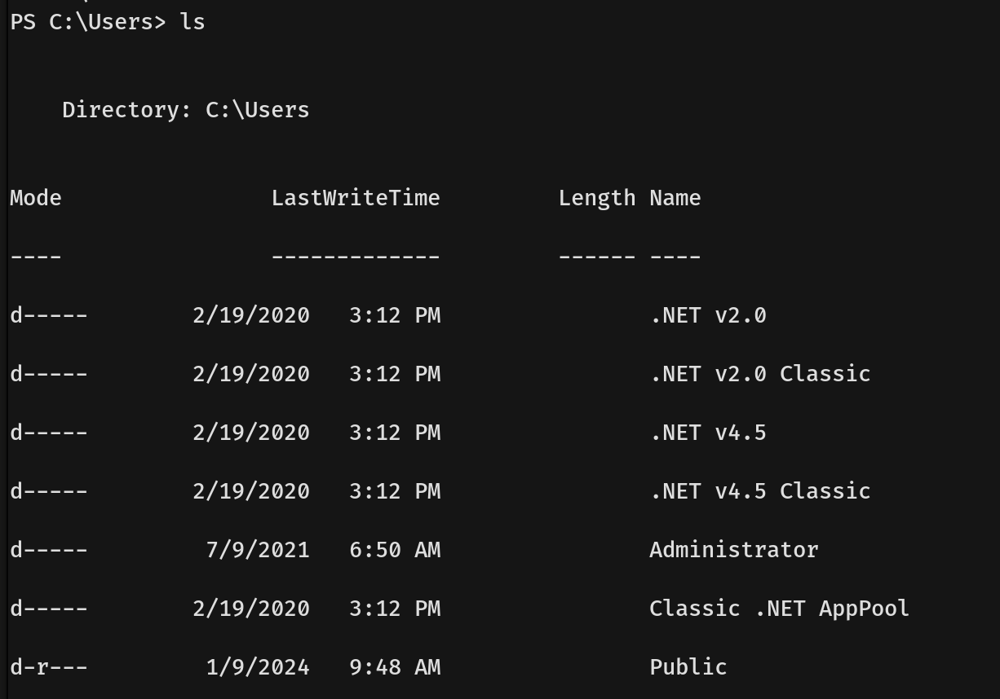
- Based on this finding, I used `certutil.exe` to download `GodPotato-NET4.exe` from my attack machine over to the target's `C:\Windows\Temp` directory.
  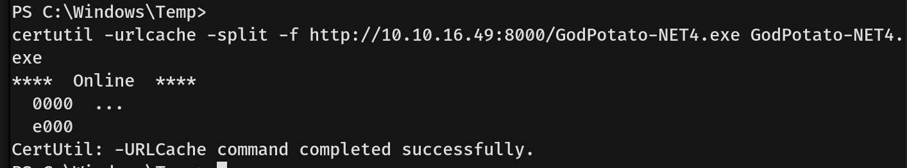
- I executed the binary with a test command to confirm the exploit's capability. The tool successfully triggered the DCOM/RPC plumbing mechanism and returned `nt authority\system`.
  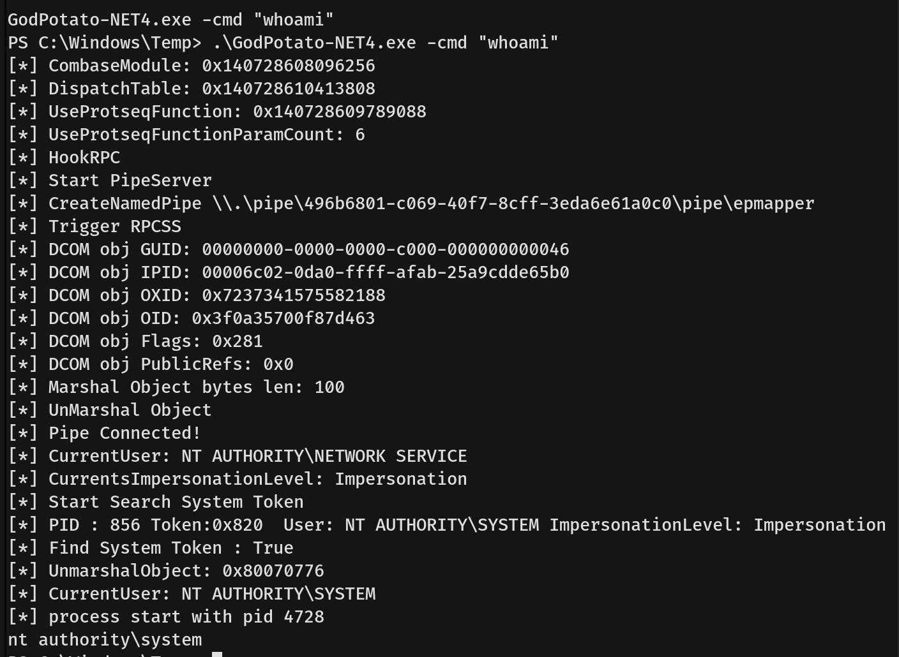
- Finally, we ran a payload to establish a reverse shell through GodPotato, connecting back to our listener as `NT AUTHORITY\SYSTEM`. With full control, I navigated to the Administrator's desktop and captured the root flag.
  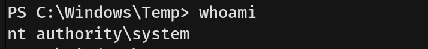
