# Resolute Writeup - by Thammanant Thamtaranon

**Resolute** is a **Medium**-difficulty Windows machine hosted on Hack The Box.

---

## Reconnaissance
- We started the engagement with a full TCP port scan using Nmap to identify open services and determine the underlying operating system.
  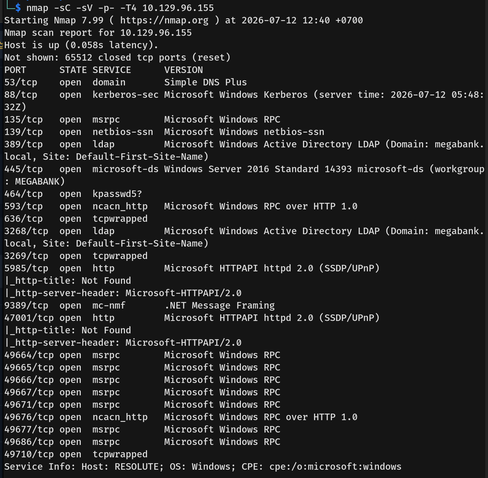
  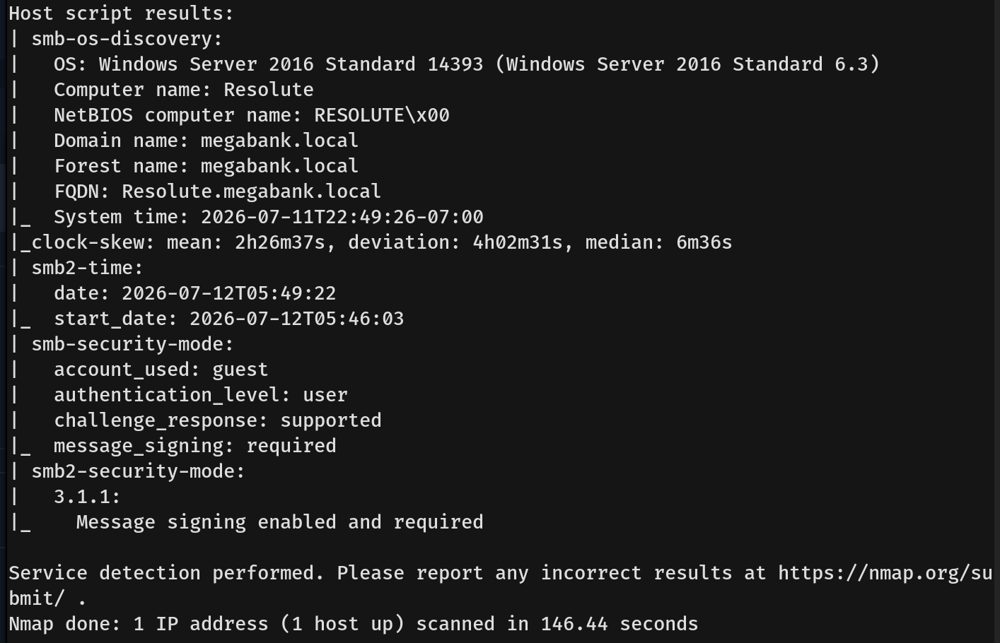
- The results indicated an Active Directory Domain Controller environment with several key services available:
  * **53/tcp:** domain (DNS)
  * **88/tcp:** kerberos-sec
  * **135/tcp:** msrpc
  * **139/tcp & 445/tcp:** netbios-ssn / microsoft-ds (SMB)
  * **389/tcp & 636/tcp:** ldap / ldapssl
  * **5985/tcp:** http (WinRM remote management)
- We then added `megabank.local` and `resolute.megabank.local` to our `/etc/hosts` file.

---

## Scanning & Enumeration
- We started by enumerating SMB with null and guest credentials. The null credentials worked, but we were not permitted to list the directories.
  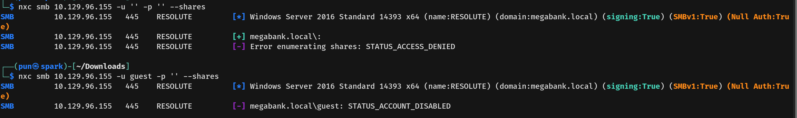
- I then enumerated LDAP using null credentials. We found the description for the user `marko` indicating that their password was set to `Welcome123!`.
  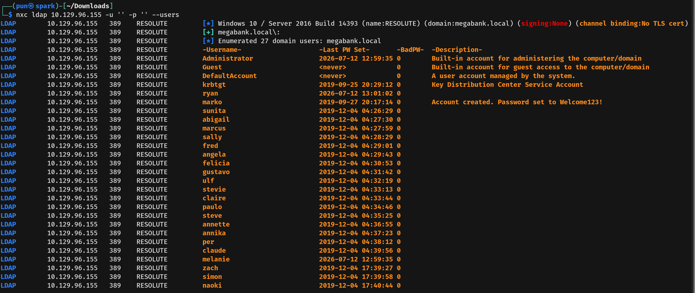

---

## Exploitation
- We then verified the username and password against SMB, but the authentication failed.
  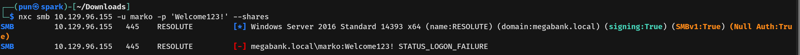
- I extracted a list of users from the previous LDAP results.
  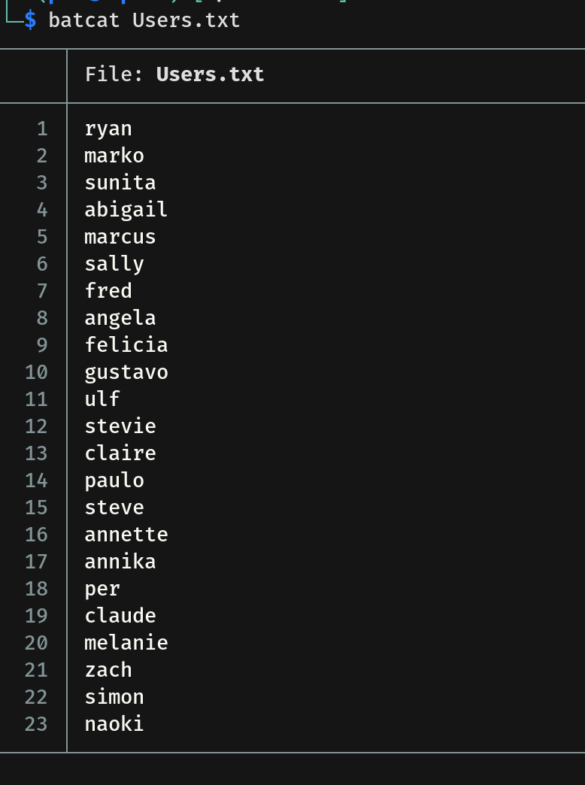
- With the user list, we performed a password spray attack and found that the user `melanie` still had the password `Welcome123!`.
  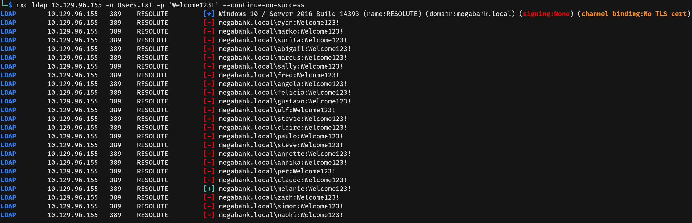
- Checking the SMB shares using `melanie`'s credentials revealed no interesting files.
  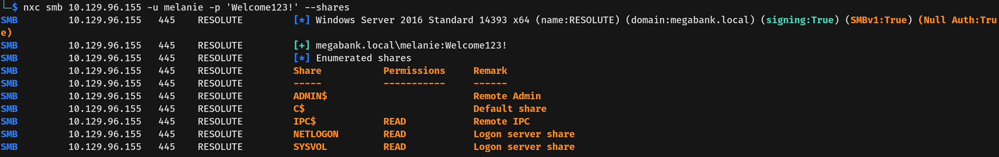
- I then synchronized my attacker machine's clock with the target machine to prevent any Kerberos time skew errors.
  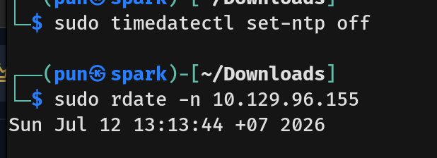
- With the clock set, we ran BloodHound to analyze the domain's relationship mapping.
  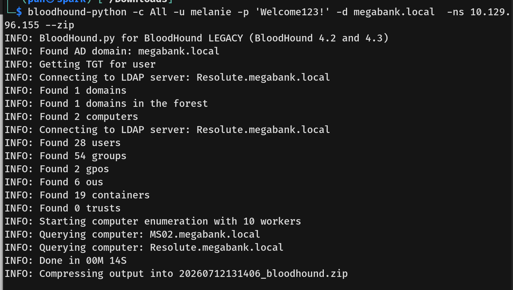
- However, BloodHound showed that user `melanie` had no direct path to Domain Admin. I connected to the machine via WinRM using her credentials and captured the user flag.

---

## Privilege Escalation
- Looking at `melanie`'s privileges, we found `SeMachineAccountPrivilege`. This privilege allows standard domain users to add up to 10 computer accounts to the Active Directory domain.
  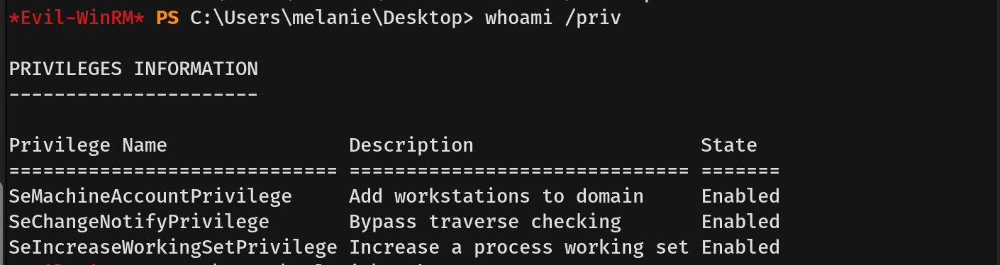
- Searching for privilege escalation vectors associated with this capability, we found a Medium blog post demonstrating a chain of **CVE-2021-42278** and **CVE-2021-42287** (often referred to as the **noPac** exploit) to gain `NT AUTHORITY\SYSTEM`.
  * **CVE-2021-42278:** A vulnerability that allows an attacker to spoof the `sAMAccountName` of a domain controller by creating a machine account and renaming it to match a DC without the trailing `$` symbol.
  * **CVE-2021-42287:** A vulnerability in the Kerberos Key Distribution Center (KDC). When an attacker requests a Ticket Granting Service (TGS) ticket for a machine account that no longer exists (because we renamed it back), the KDC falls back to searching for the Domain Controller's account and mistakenly grants a ticket with Domain Admin privileges.
  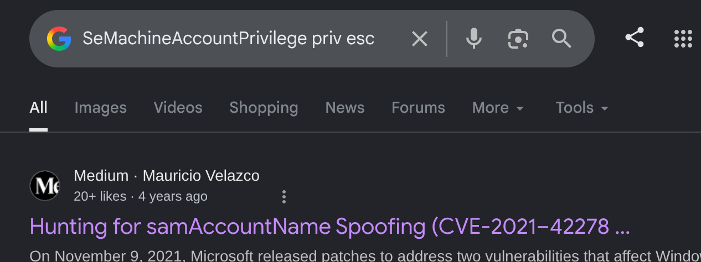
- I then downloaded a Python Proof-of-Concept (PoC) from [Ridter/noPac on GitHub](https://github.com/Ridter/noPac/tree/main).
- We ran the PoC, successfully exploited the chain to get a shell as `NT AUTHORITY\SYSTEM`, and captured the root flag.
  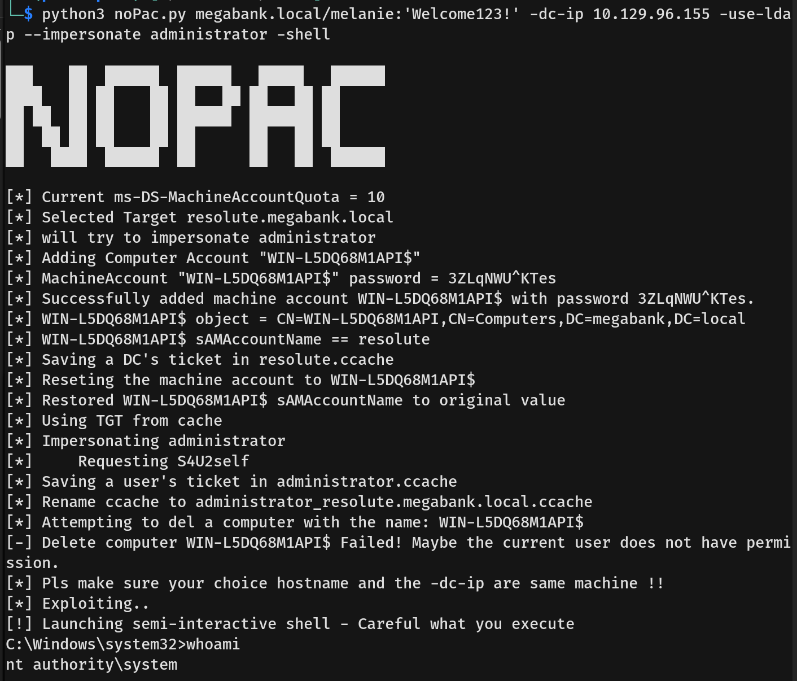
