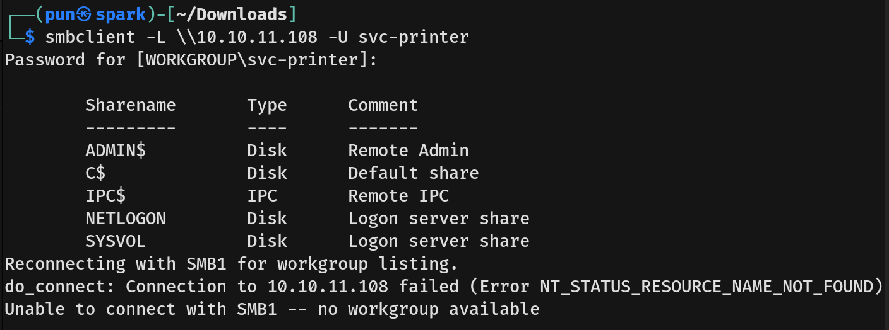

# Return Writeup - by Thammanant Thamtaranon  
- Return is an easy Windows machine hosted on Hack The Box.

## Reconnaissance  
- I started with a full TCP port scan including service/version detection and OS fingerprinting:
```bash
nmap -A -T4 -p- 10.10.10.108
```
  
- The scan showed multiple open ports:  
  - 80 (HTTP)  
  - 88 (Kerberos)  
  - 135 (MSRPC)  
  - 139 (NETBIOS)  
  - 389 (LDAP)  
  - 445 (SMB)  
  - 464 (kpasswd5)  
  - 636 (LDAPS)  
  - 3268 (LDAPS)  
  - 3269 (LDAPS)  
  - 5985 (WINRM)  
  - 9389 (AD Web Services)

## Scanning & Enumeration  
- I ran a directory brute-force using `dirsearch`:
```bash
dirsearch -u 10.10.11.108
```
  
- In `/settings.php`, we found the server address, server port, and username.  
  
- Clicking the update button sent a request with only `ip` as the parameter.  
  
- We then changed the `ip` to our machine and ran `nc -lvnp 389` to listen.  
- We got a connection that looked like a password.  
  
- Using `netexec`, we verified that the credentials worked for multiple services.  


## Exploitation  
- Since the credentials worked for all services, we first tried connecting to SMB.  
  
- Being high-privilege, we attempted `psexec` but it failed due to missing write privileges.  
- We moved on to WinRM, using `evil-winrm`:
```bash
evil-winrm -i 10.10.11.108 -u svc-printer -p '1edFg43012!!'
```
  
- We captured the user flag.

## Privilege Escalation  
- We ran `whoami /priv` to check current user privileges.  
  
- Then ran `whoami /groups` to verify group memberships.  
  
- We attempted using `SeBackupPrivilege` to copy `SAM` and `SYSTEM` files.  
- After extracting NTLM hashes, pass-the-hash attempts failed.  
- We then explored the Server Operators group following [this guide](https://www.hackingarticles.in/windows-privilege-escalation-server-operator-group/)   
- We gained SYSTEM privileges and captured the root flag.  

