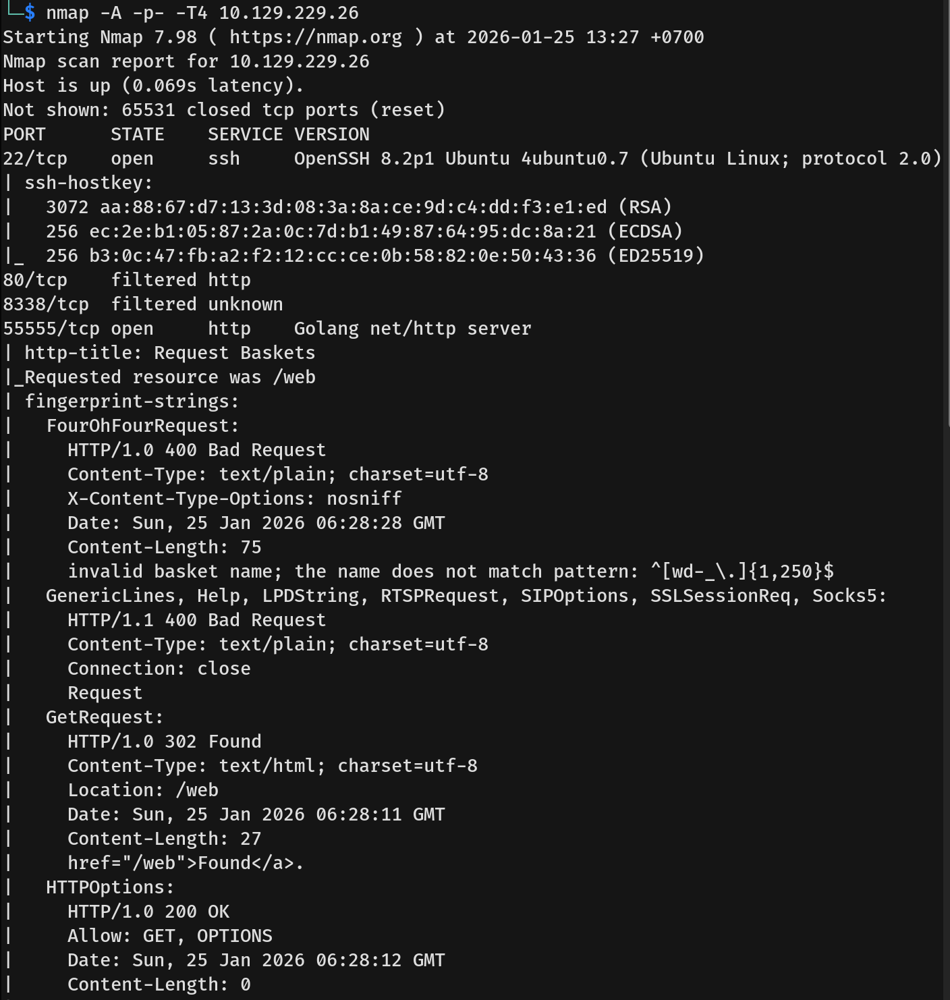
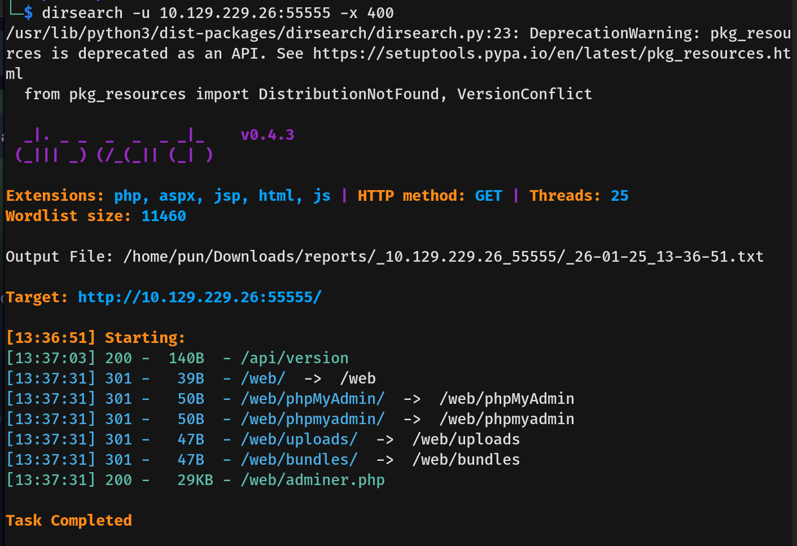
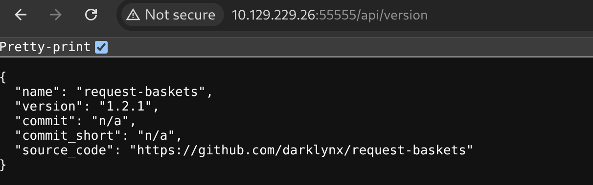
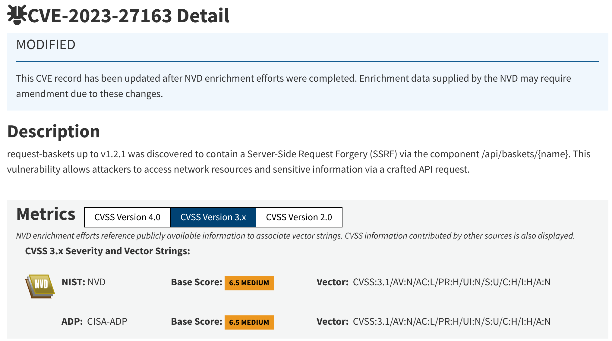
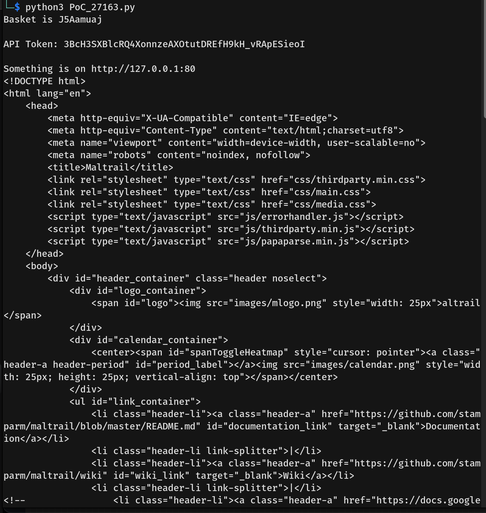
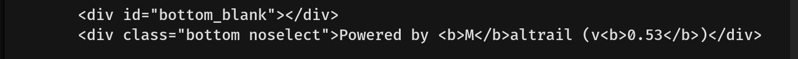
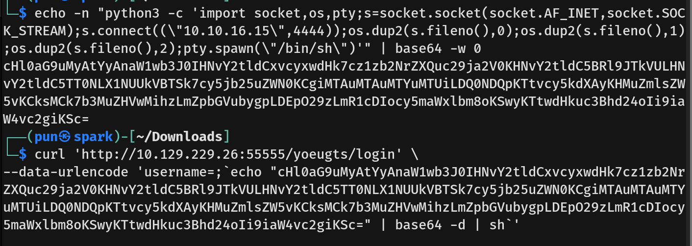
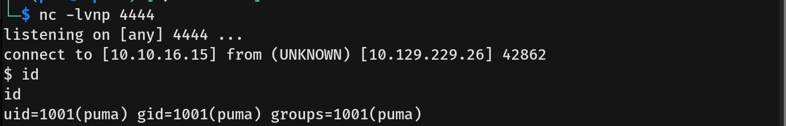
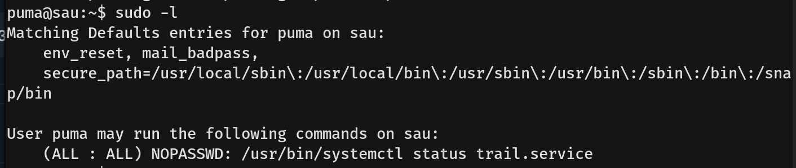
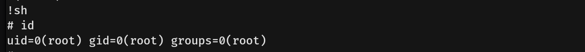

# Sau Writeup - by Thammanant Thamtaranon

**Sau** is an **Easy**-difficulty Linux machine hosted on Hack The Box.

---

## Reconnaissance
- I began with a full TCP port scan to identify open services and the operating system.
  
- The scan revealed two open ports:
  - **22/tcp** — OpenSSH 8.2p1
  - **55555/tcp** — Golang net/http server
- I also noticed port **80** and **8338** were filtered, suggesting internal services might be running behind a firewall.
- I ran a directory scan to verify if there were any interesting endpoints.
  
- Navigating to `/api/version` on port 55555 in the browser revealed an application called **Request Baskets**, version **1.2.1**.
  

---

## Scanning & Enumeration
- I researched "Request Baskets 1.2.1" and found it is vulnerable to **Server-Side Request Forgery (SSRF)** (CVE-2023-27163).
  
- To exploit this, I downloaded and ran a POC script. The script successfully returned the HTML content of the internal port 80.
  
- The output confirmed the internal application was **Maltrail v0.53**.
  

---

## Exploitation
- I identified that Maltrail v0.53 is vulnerable to **Unauthenticated OS Command Injection** in the `username` parameter of the login page.
  
- I prepared a Python reverse shell payload and encoded it in Base64 to avoid bad characters.
- I exploited the vulnerability by sending a malicious request that injected the payload into the `username` field.
  
- I set up a netcat listener on my attack machine and successfully caught the reverse shell as the user `puma`.
  

---

## Privilege Escalation
- I checked for sudo privileges using `sudo -l`.
  
- The user `puma` is allowed to run `/usr/bin/systemctl status trail.service` as root without a password.
- This command opens the service status using a pager (like `less` or `more`). Since the pager allows command execution, I ran the command with sudo.
- Once the pager opened, I typed `!sh` to break out of the pager and spawn a shell.
- This dropped me into a **root** shell, and I captured the root flag.
  
