# Sauna Writeup - by Thammanant Thamtaranon

**Sauna** is an **Easy**-difficulty Windows machine hosted on Hack The Box.

---

## Reconnaissance
- We started the engagement with a full TCP port scan using Nmap to identify open services and determine the underlying operating system.
  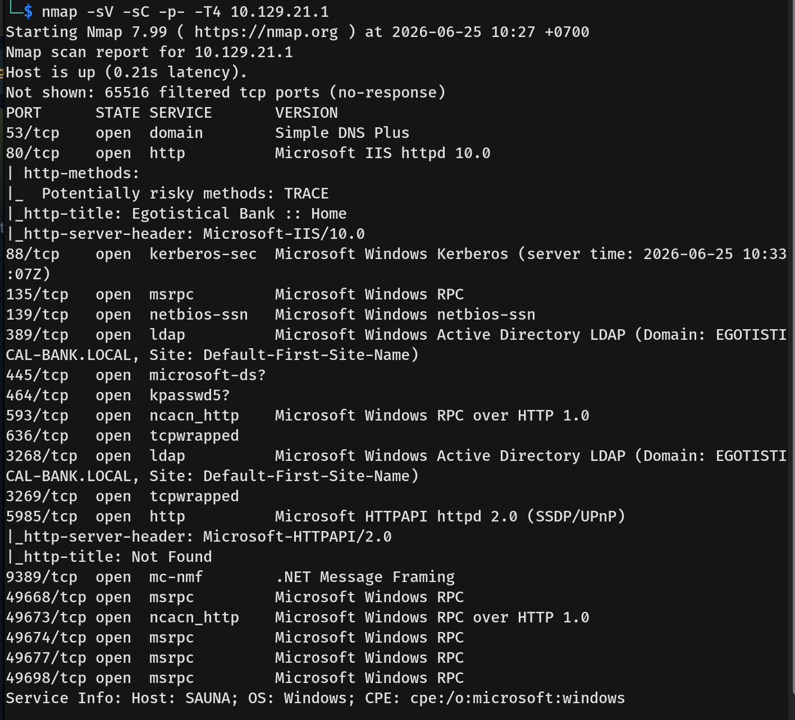
- The results indicated several open ports, revealing a Windows Server 2016 Standard 14393 environment acting as a Domain Controller for `EGOTISTICAL-BANK.LOCAL`:
  * **53/tcp:** domain (Simple DNS Plus)
  * **80/tcp:** http (Microsoft IIS httpd 10.0)
  * **88/tcp:** kerberos-sec (Microsoft Windows Kerberos)
  * **135, 139, 445/tcp:** RPC / SMB
  * **389, 3268/tcp:** ldap (Microsoft Windows Active Directory LDAP)
  * **5985/tcp:** http (Microsoft HTTPAPI httpd 2.0 - WinRM)

---

## Scanning & Enumeration
- I started by testing SMB guest and null sessions. The null authentication succeeded, but I could not list any shares.
  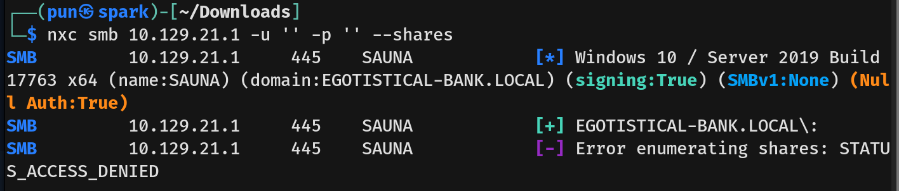
- Knowing null credentials worked, I tried enumerating LDAP using null credentials via `nxc`, but it returned no users.
  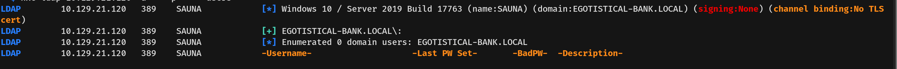
- Moving on to port 80, we found a website for Egotistical Bank.
  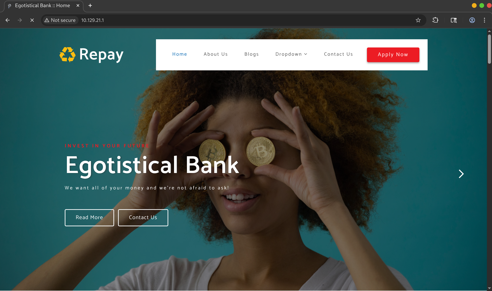
- Enumerating further, I found a list of company team members on the "About Us" page.
  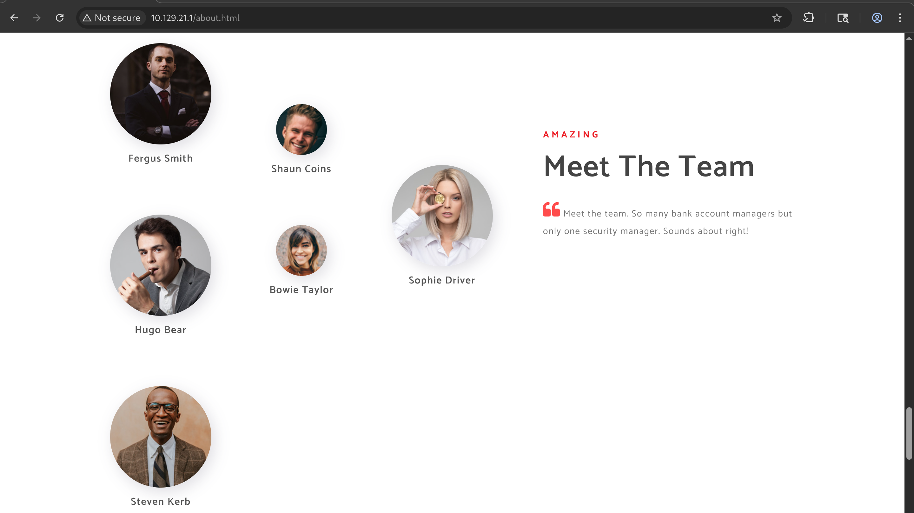
- Since these were standard first and last names, I used Claude to generate a list of potential Active Directory username formats (e.g., first initial + last name, like `fsmith`).
  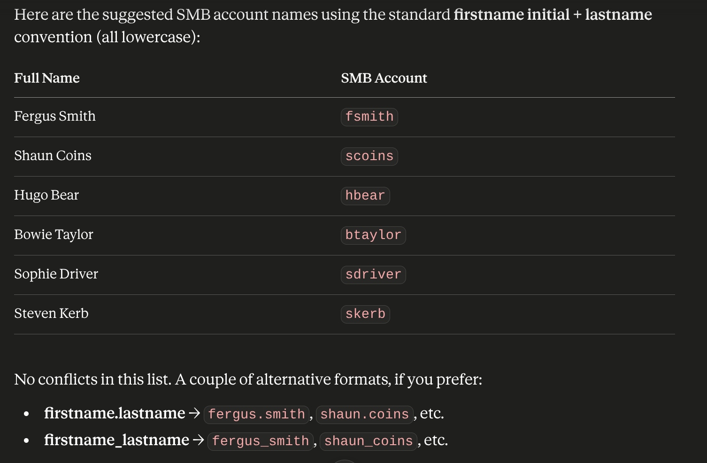
  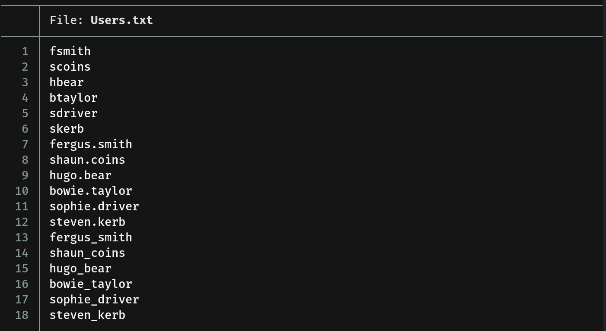

---

## Exploitation
- Using the generated username list, I attempted AS-REP roasting. I found that the account `fsmith` was a valid user and had the **"Do not require Kerberos preauthentication"** property enabled. This misconfiguration allowed us to request an AS-REP ticket on the user's behalf and capture their encrypted TGT hash.
  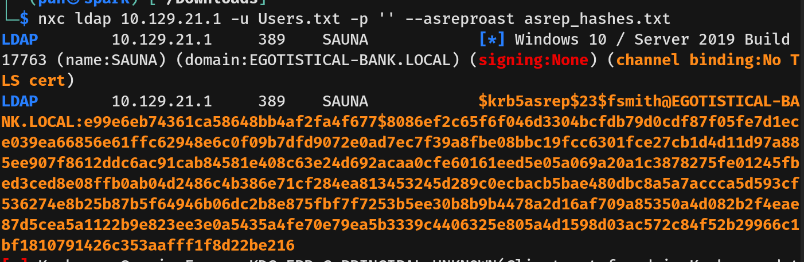
- We then cracked the hash offline using Hashcat and successfully recovered the password for `fsmith`.
  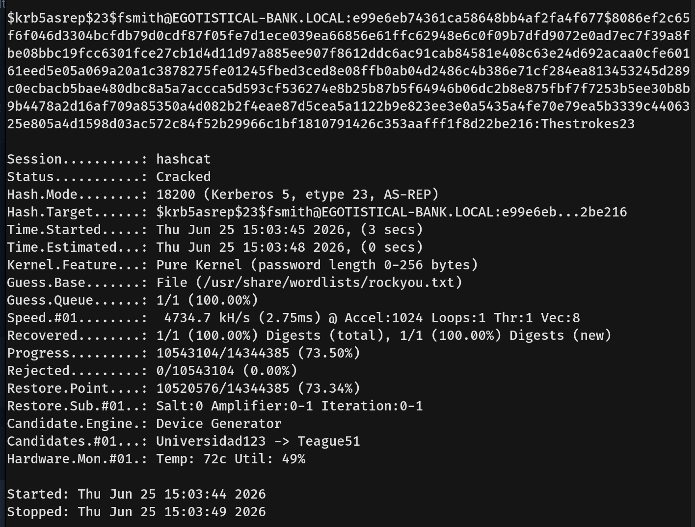
- Checking the credentials against SMB confirmed the password was valid. We found a share that we could write to, but we could not list the files inside it.
  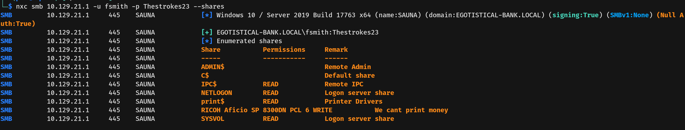
- I then used the `fsmith` credentials to properly enumerate LDAP using `nxc`. This revealed a full list of domain users, including `hsmith` and `svc_loanmgr`.
  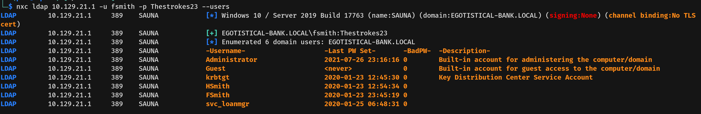
- Next, I ran the BloodHound Python ingestor to extract the domain relationship data.
  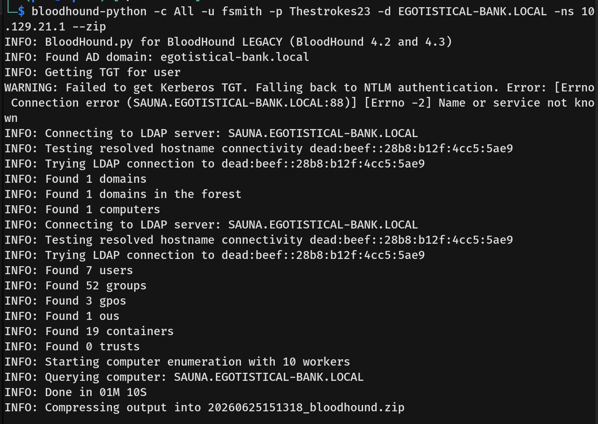
- Unfortunately, user `fsmith` did not have any immediate paths to Domain Admin. Therefore, I used `evil-winrm` to connect directly to the machine for further local enumeration.
  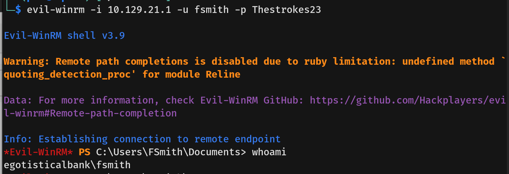
- We successfully logged in and captured the user flag in `fsmith`'s Desktop directory.
  
---

## Privilege Escalation
- During manual enumeration, I checked the registry for stored AutoAdminLogon credentials and discovered a default password in plaintext.
  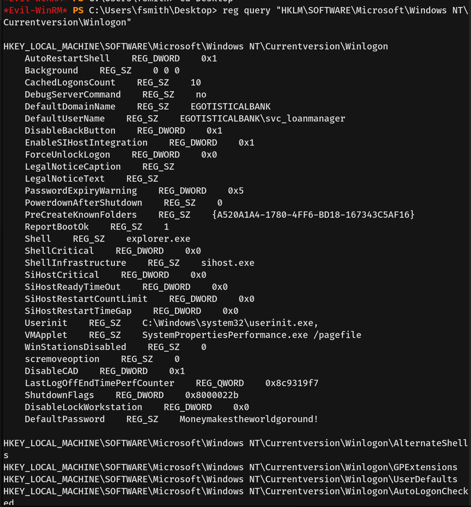
- I tested this password against the other discovered users using SMB and confirmed that it belonged to the `svc_loanmgr` account.
  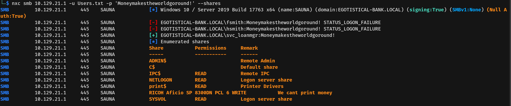
- With access to this new account, I looked back at the BloodHound relationship mapping and saw that `svc_loanmgr` had explicit `GetChanges` and `GetChangesAll` privileges over the domain.
  
  - **GetChanges (`DS-Replication-Get-Changes`):** Allows a user to replicate Active Directory data, but excludes sensitive secret data like passwords.
  - **GetChangesAll (`DS-Replication-Get-Changes-All`):** Overrides the above restriction and explicitly allows the replication of sensitive AD data, including NTLM password hashes.
- Having both of these rights allows an attacker to perform a **DCSync** attack. Using `impacket-secretsdump`, we simulated a Domain Controller and successfully dumped the NTLM hashes of every user in the domain, including the Administrator.
  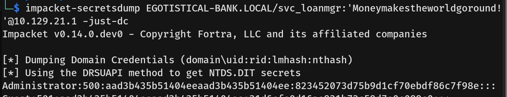
- With the Administrator hash in hand, we performed a Pass-The-Hash attack via `evil-winrm` to connect back to the machine as `Administrator` and captured the root flag.
  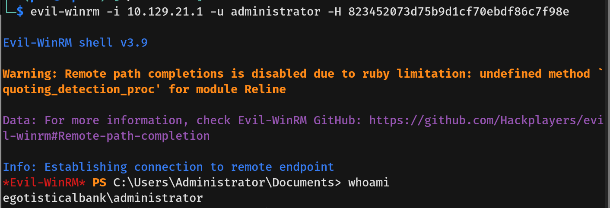
