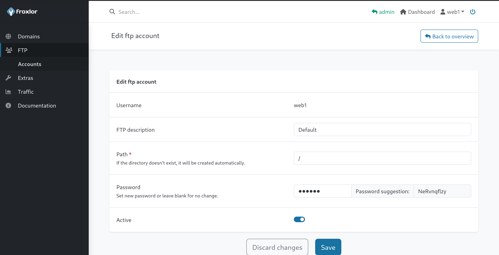

# Sightless Writeup - by Thammanant Thamtaranon
  - Sightless is an easy Linux-based machine hosted on Hack The Box.

## Reconnaissance
  - Initially, we performed a full TCP port scan with version detection and OS fingerprinting using the command:
    `nmap -A -T4 -p- 10.10.11.32`  

  - We then add `sightless.htb` to `/etc/hosts`.

## Scanning & Enumeration
  - We then run the command `dirsearch -u 10.10.11.32`, but found nothing of interesting.
  - We then move on to ftp, however the ftp does not allow anonymous login.
  - So we inspect the page source and found `sqlpad.sightless.htb` so we add this to `/etc/hosts` as well.
    
## Exploitation
  - We then visit the page and using burp suite revealed the version of `6.10.0`

  - We search for sqlpad version 6.10 CVE and found `CVE-2022-0944`.

  - We downloaded and run the POC.

  - We got in as root, but we are inside a container.

  - Since, we are root we can use the command `cat /etc/shadow` to see user michael password.

  - So we use john to crack the password.

  - We then SSH into the machine using michael credential.
  - We got the user flag.
  - We digging around and find the config file

  - So we use the command `ssh michael@10.10.11.32 -L 8080:localhost:8080` to create a SSh tunnel forward port 8080 to our machine.
  - We also add `admin.sightless.htb` to `/etc/hosts` as well.
  - We can then visit `[localhost:8080](http://admin.sightless.htb:8080/)`.

  - We try find the version of Froxlor but did not found it.
  - On the machine, ssh as michael we use the command `ss -tulpn` and found serveral interesting internal web.

  - We then try to forward every suspicious port and try dirsearch.
  - When we visit `/json`, we found on port `37795` (noted that this will be different for other machine).

  - We found Remote Dev tool.
  - We then use chromium-based browser, and go to `chrome://inspect/#devices` and configre the Discover network targets. We then put `localhost:37795`.

  - Then there will be page from Froxlor page shown.
  - We click inspect and click Preserve log.
  - Then we click on the request which the admin is loggin in
  - We then found admin credentials

  - Now we login as admin into Froxlor at`localhost:8080`.
  - We then look around and found customer name john.

  - We then click to see more details.

  - We found FTP.

  - We then change the FTP password to the recommned password.
  - Then we connect to ftp using john credential.
  - However, since the ftp required SSL/TLS we use the command `lftp -u web1,cBzhpLldvi -e "set ftp:ssl-force true; set ssl:verify-certificate no" ftp://10.10.11.32`.

  - We find `Database.kdb`, so we downloaded on to our machine.
  - Since we do not have the password, we use john to crack the hash.

  - We use the command `kpcli --kdb Database.kdb` to read the database.
  - We found the root ssh credential.

  - we got the root flag.
