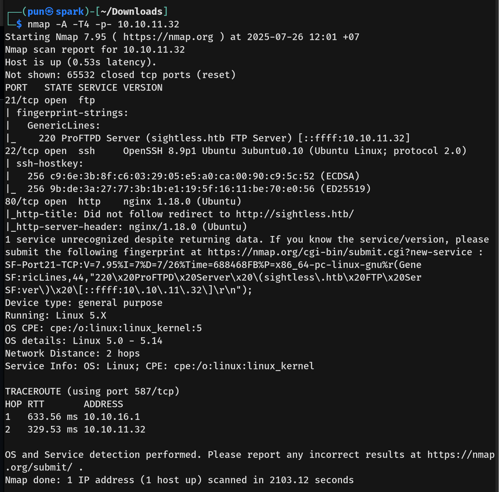

# Sightless Writeup - by Thammanant Thamtaranon
  - Sightless is an easy Linux-based machine hosted on Hack The Box.

## Reconnaissance
  - Initially, we performed a full TCP port scan with version detection and OS fingerprinting using the command:
    `nmap -A -T4 -p- 10.10.11.38`  

## Scanning & Enumeration
  - Port `5000` was identified as open, typically associated with Flask or other Python-based web services. We enumerated web directories using:
    `dirsearch -u 10.10.11.38`  

## Exploitation
