# Sightless Writeup - by Thammanant Thamtaranon
  - Sightless is an easy Linux-based machine hosted on Hack The Box.

## Reconnaissance
  - Initially, we performed a full TCP port scan with version detection and OS fingerprinting using the command:  
    `nmap -A -T4 -p- 10.10.11.32`  

  - We added `sightless.htb` to our `/etc/hosts` file to enable hostname resolution for easier access.

## Scanning & Enumeration
  - We enumerated web directories using:  
    `dirsearch -u http://10.10.11.32`  
    but no interesting paths were found.  

  - The FTP service disallowed anonymous login, limiting our options there.

  - Inspecting the webpage source revealed a subdomain `sqlpad.sightless.htb`, which we added to `/etc/hosts` as well.

## Exploitation
  - Visiting `http://sqlpad.sightless.htb` and intercepting traffic with Burp Suite revealed the application was running SQLPad version `6.10.0`.  
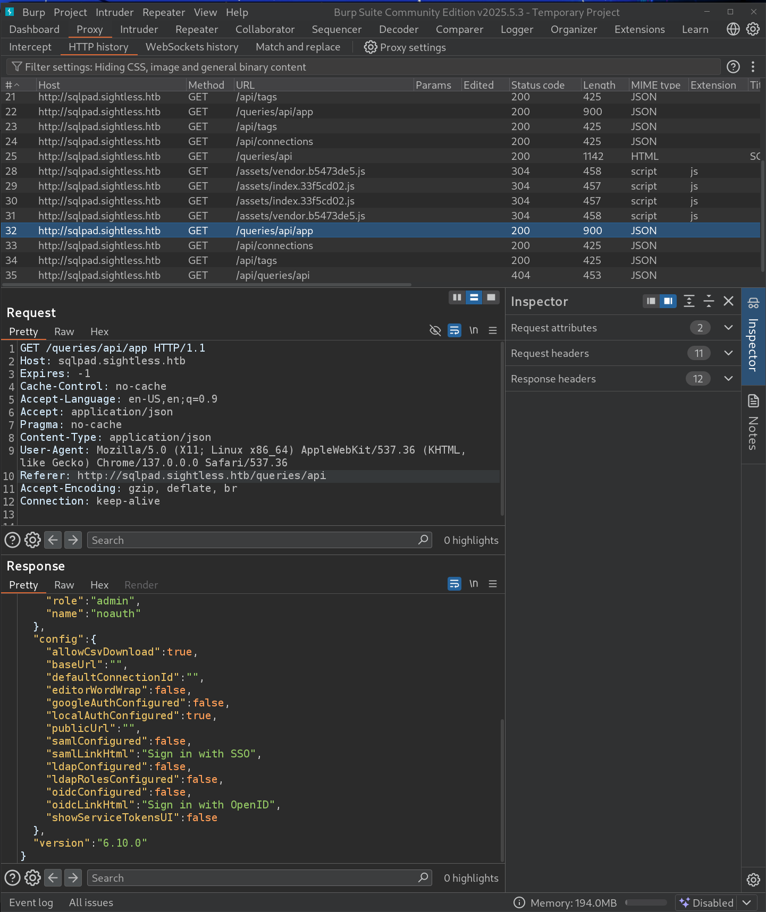

  - Researching known vulnerabilities for SQLPad 6.10 led us to **CVE-2022-0944**, a remote code execution vulnerability.  
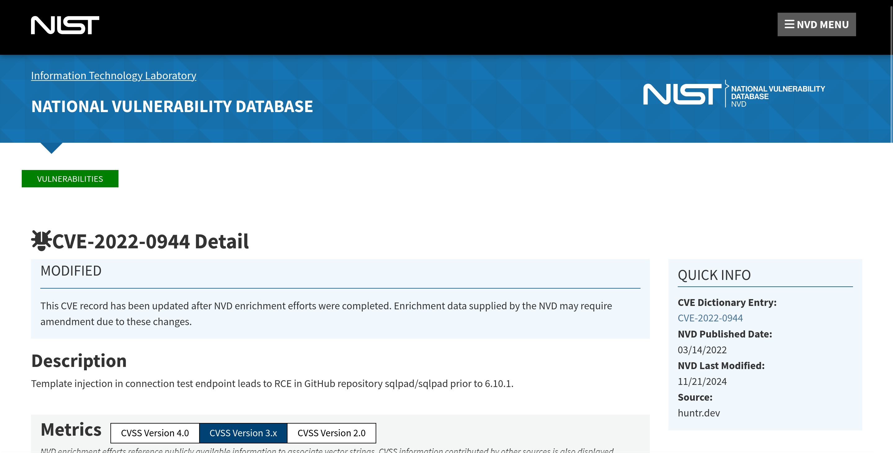

  - We downloaded and ran the publicly available PoC exploit, gaining command execution on the server.  
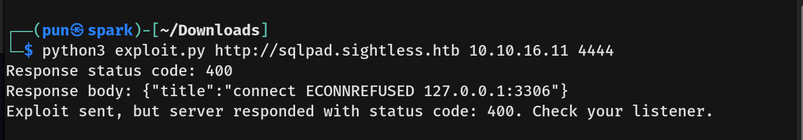

  - Although we had root privileges, the shell was confined within a container environment.  
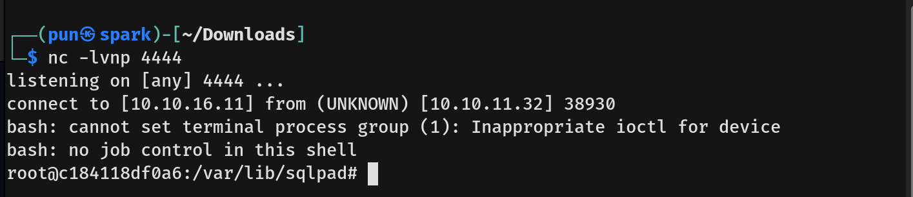

  - With root access inside the container, we read `/etc/shadow` to extract hashed passwords, including for user `michael`.  
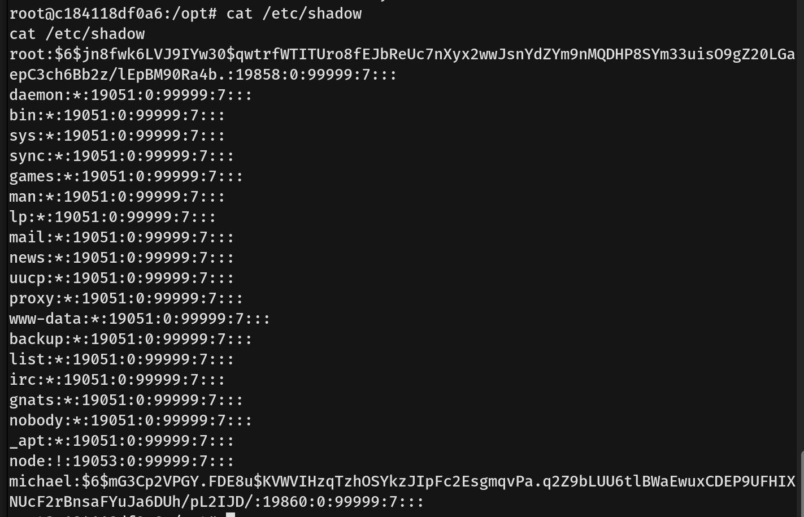

  - We cracked michael’s password using John the Ripper.  
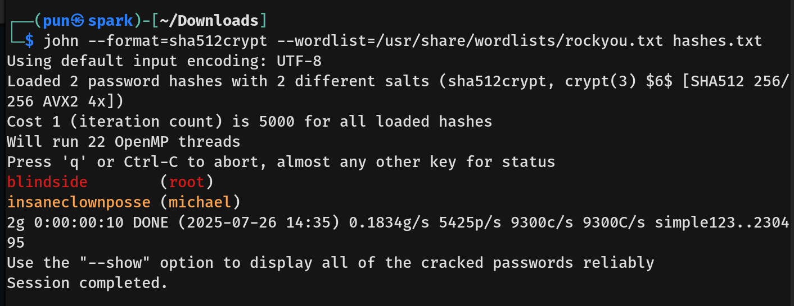

  - Using michael’s credentials, we SSH’d into the machine and obtained the **user flag**.

  - Further enumeration revealed a configuration file indicating additional services.  
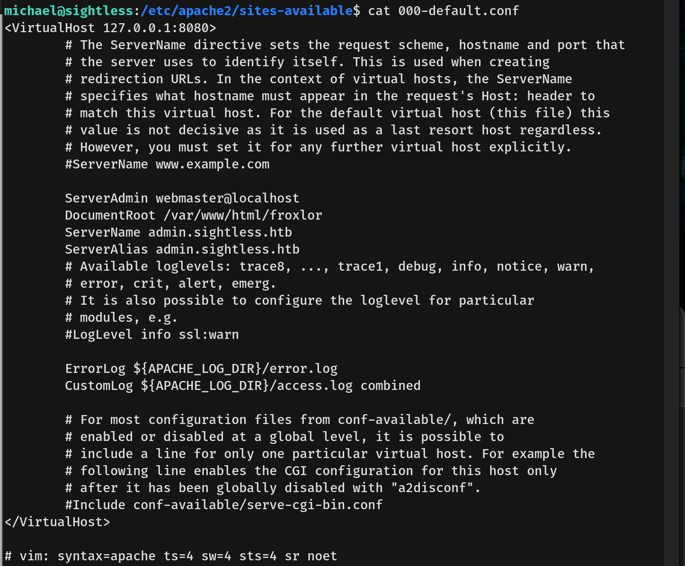

  - We created an SSH tunnel forwarding remote port 8080 to our local machine:  
    `ssh michael@10.10.11.32 -L 8080:localhost:8080`

  - We added `admin.sightless.htb` to `/etc/hosts` to resolve the internal admin panel’s hostname.

  - Accessing `http://admin.sightless.htb:8080` brought up the Froxlor administration panel.  
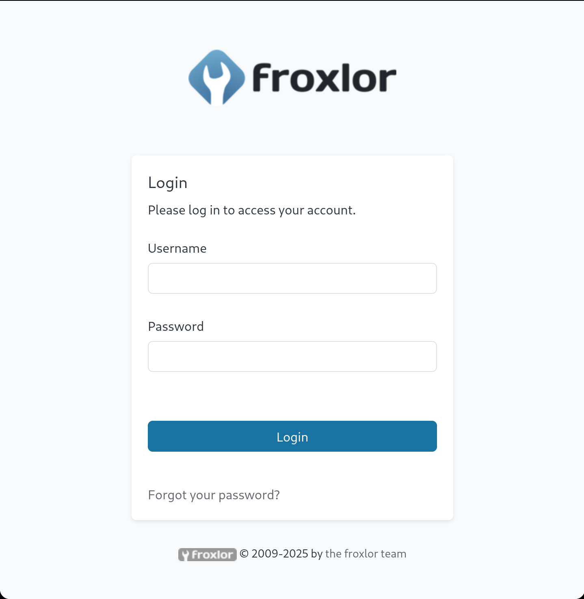

  - Attempts to determine Froxlor’s version via the UI were unsuccessful.

  - Running `ss -tulpn` on the machine as michael revealed several internal services listening on different ports.  
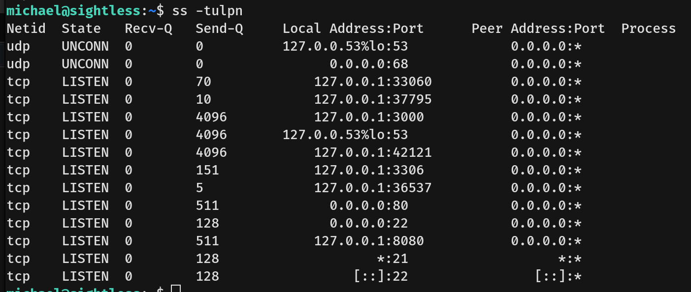

  - We forwarded suspicious ports and used `dirsearch` to enumerate their directories.

  - Accessing `/json` on port `37795` (note: this port may differ in other instances) revealed a Remote DevTools endpoint.  
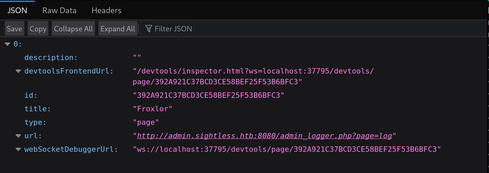

  - Using a Chromium-based browser, we navigated to `chrome://inspect/#devices` and configured it to discover network targets at `localhost:37795`.  
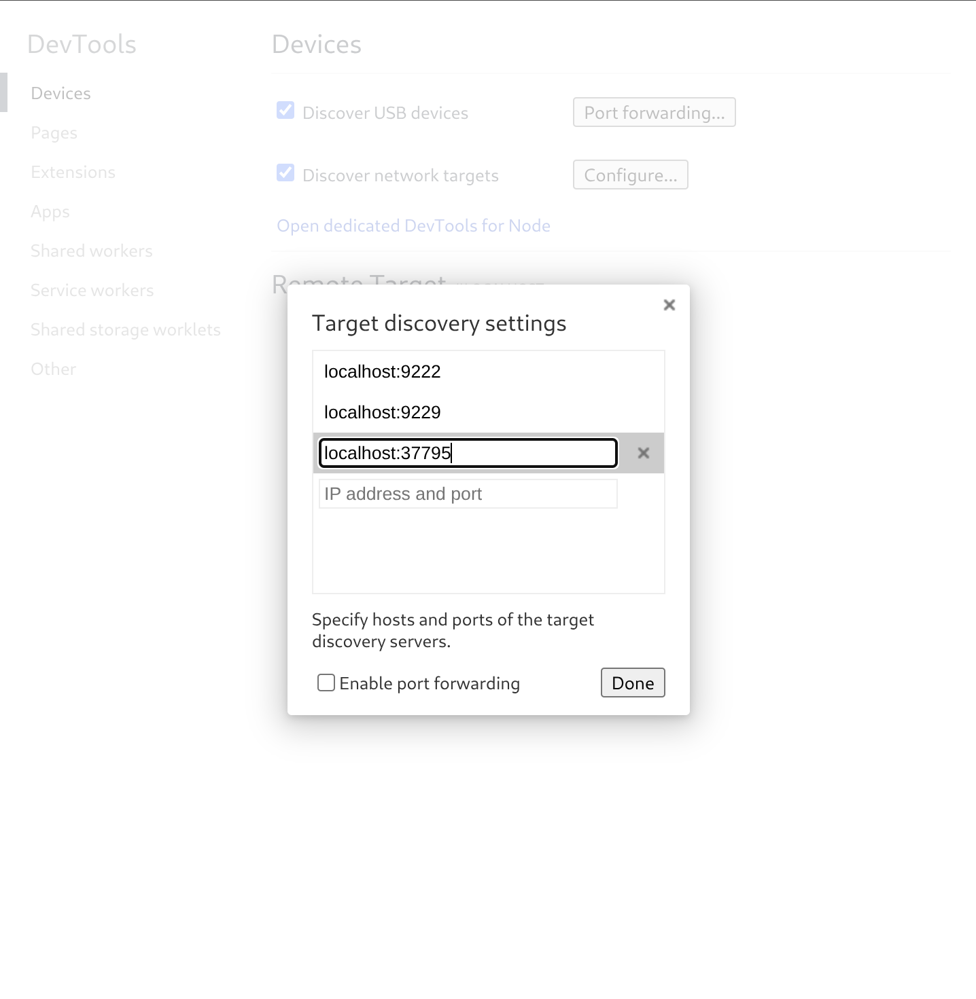

  - This exposed a Froxlor page within DevTools.

  - Enabling “Preserve log” and inspecting network requests during an admin login attempt revealed the admin’s credentials in plaintext.  
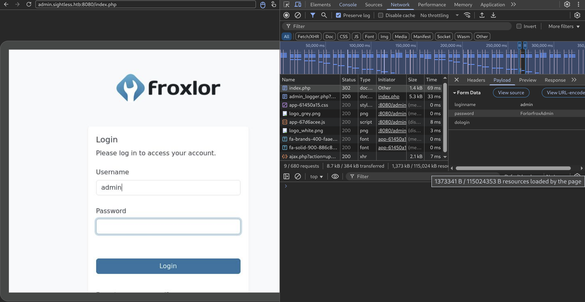

  - We logged into Froxlor as admin at `localhost:8080`.

  - Inside the panel, we discovered a customer account named John.  
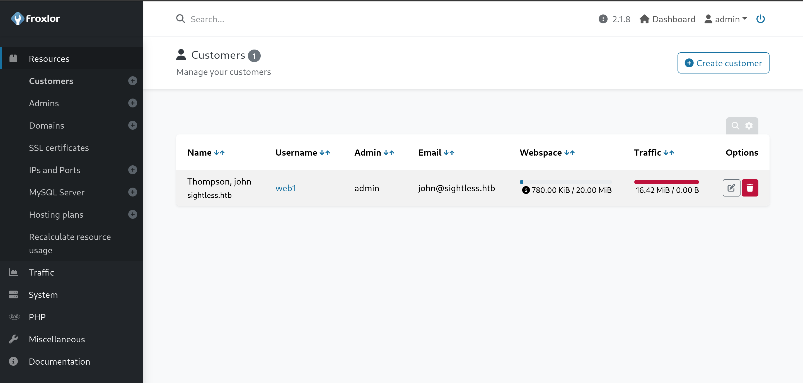

  - Viewing more details showed FTP credentials associated with John’s account.  
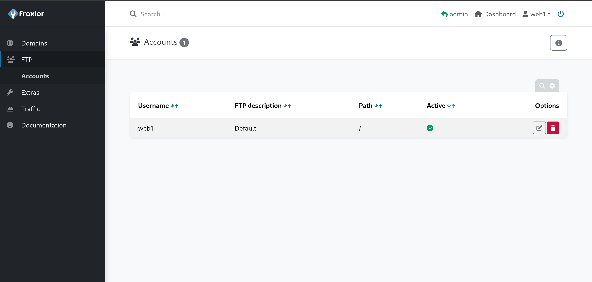

  - We changed the FTP password to a recommended secure password.

  - Using John’s FTP credentials, we connected via `lftp`, enforcing SSL/TLS with:  
    `lftp -u web1,cBzhpLldvi -e "set ftp:ssl-force true; set ssl:verify-certificate no" ftp://10.10.11.32`  
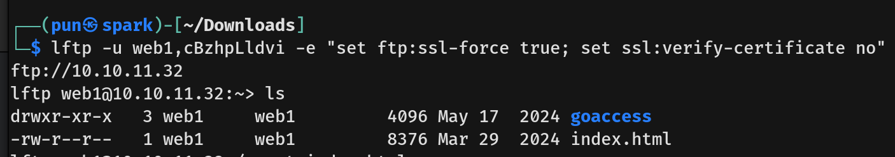

  - We found and downloaded a KeePass database file named `Database.kdb`.

  - Since the KeePass master password was unknown, we cracked it using John the Ripper.  
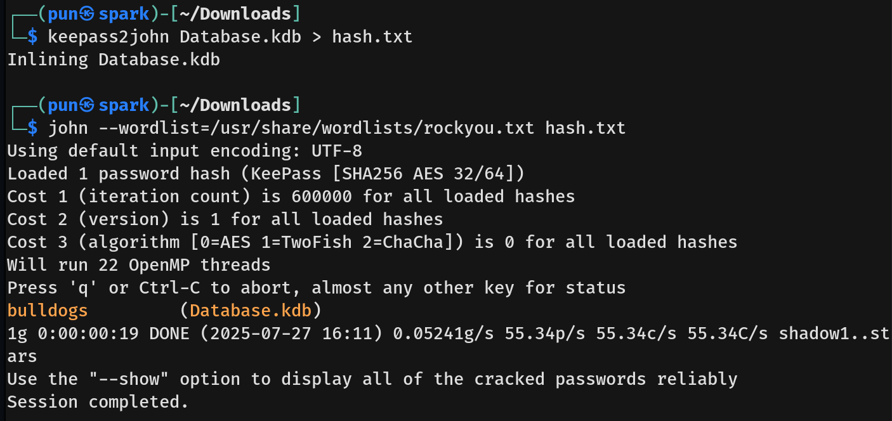

  - Opening the database with `keepassxc`, we extracted the root user’s SSH private key.  
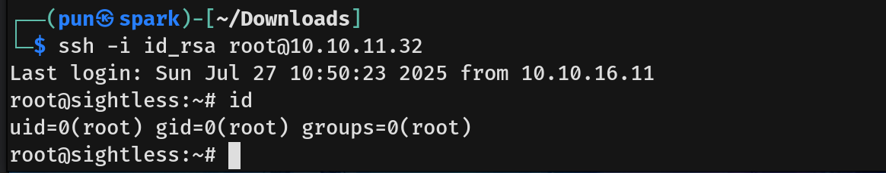

  - Using the extracted SSH key, we logged in as root and obtained the **root flag**, completing the box.
