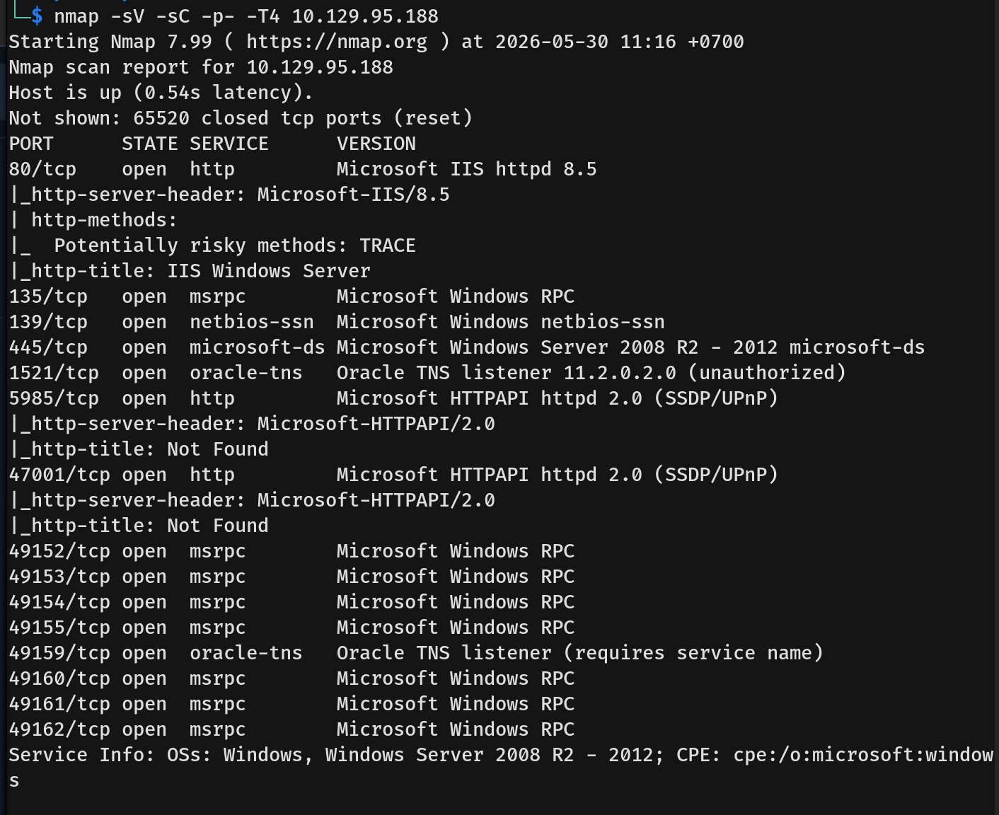
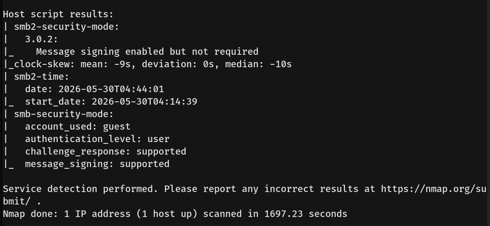
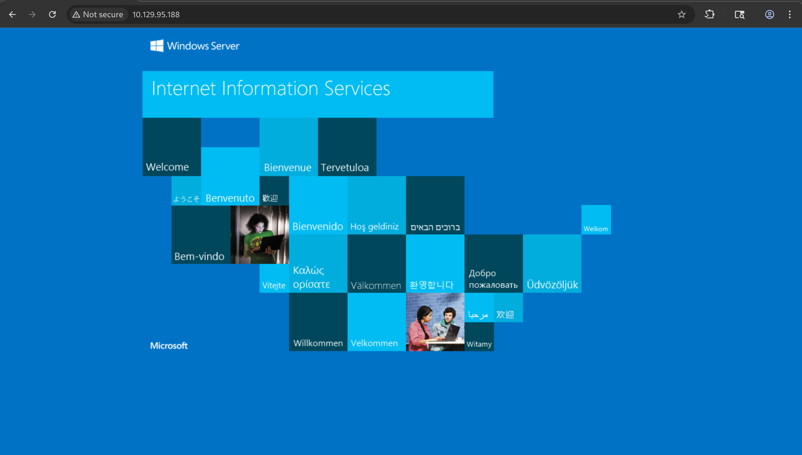
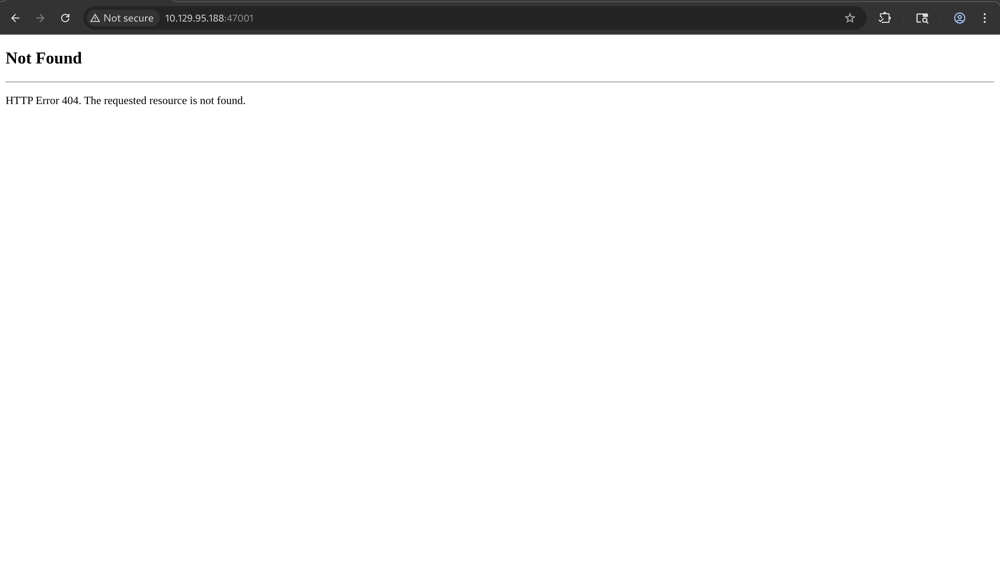
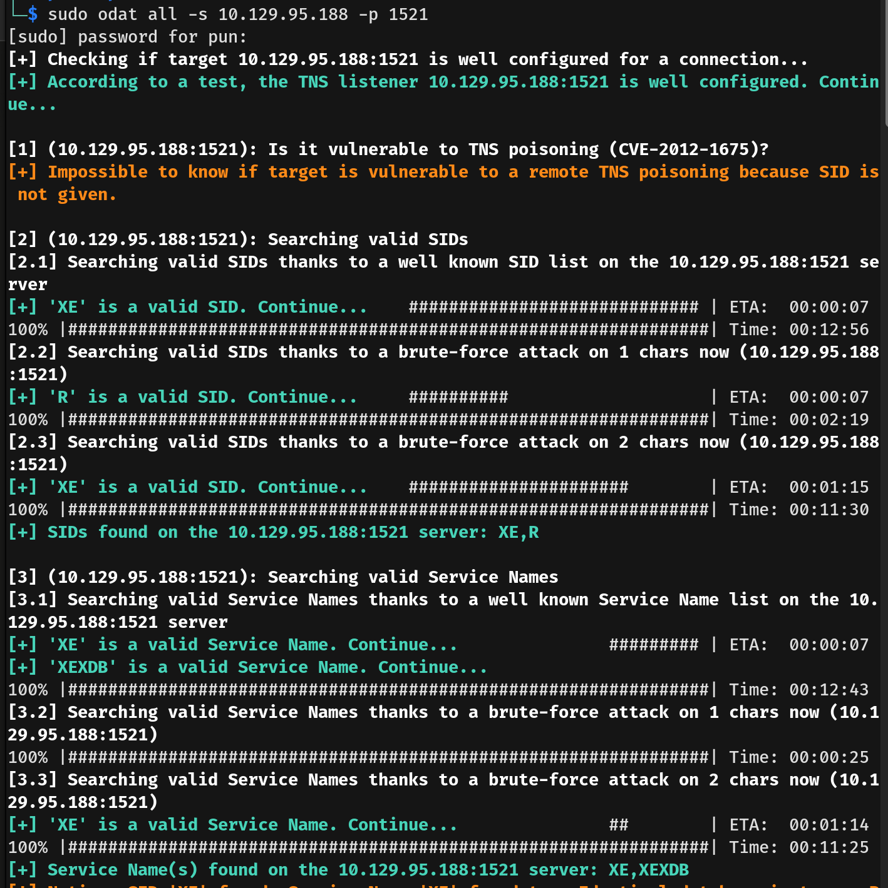
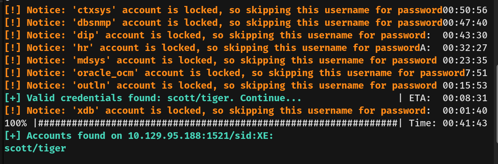
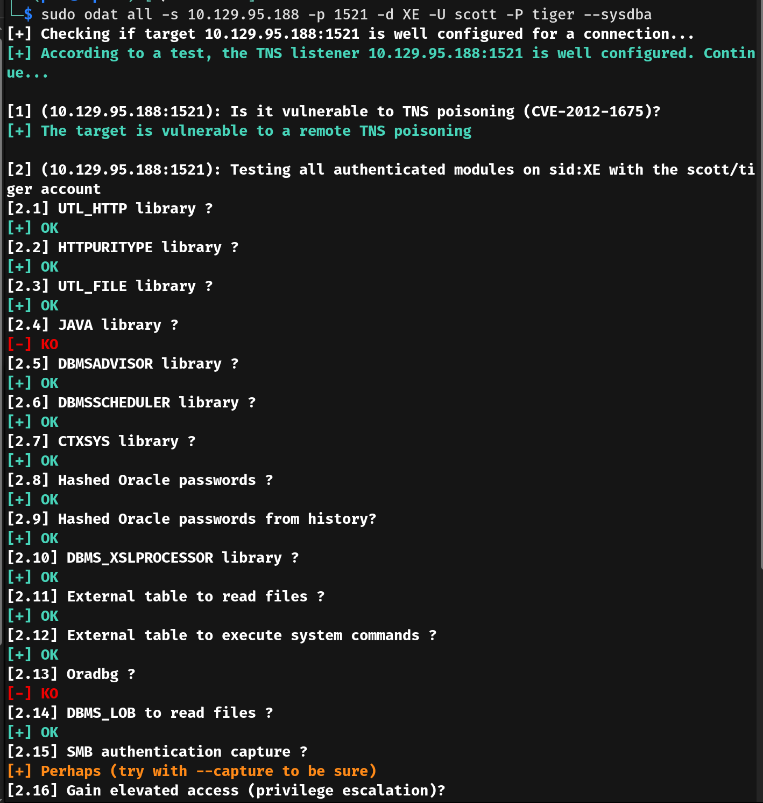
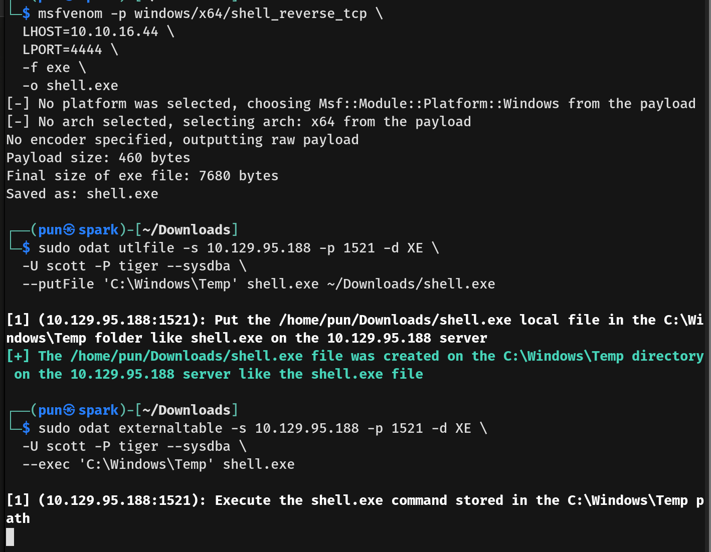
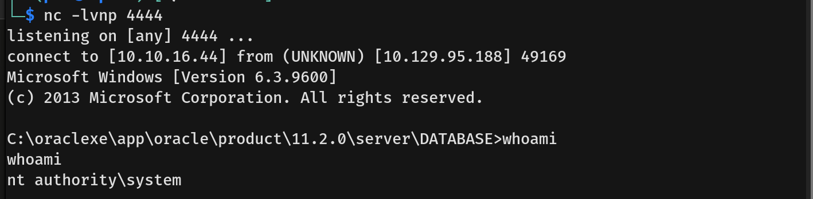

# Silo Writeup - by Thammanant Thamtaranon

**Silo** is a **Medium**-difficulty Windows machine hosted on Hack The Box.

---

## Reconnaissance
- We started the engagement with a full TCP port scan using Nmap to identify open services and determine the underlying operating system.
  
  
- The results indicated a wide array of open ports:
  * **80/tcp:** HTTP (Microsoft IIS httpd 8.5)
  * **135/tcp, 49152-49162/tcp:** msrpc (Microsoft Windows RPC)
  * **139/tcp:** netbios-ssn
  * **445/tcp:** microsoft-ds (Windows Server 2008 R2 - 2012)
  * **1521/tcp, 49159/tcp:** Oracle TNS listener (version 11.2.0.2.0)
  * **5985/tcp, 47001/tcp:** HTTPAPI httpd 2.0 (SSDP/UPnP)

---

## Scanning & Enumeration
- Visiting port 80 in the browser showed a default webpage for Microsoft IIS.
  
- Visiting ports 5985 and 47001 returned a "404 Not Found" error.
  
  
- Enumerating the SMB shares with NetExec failed, authenticating as the `guest` user with a blank password was not allowed, though message signing was supported but not required.
- Moving on to the Oracle database listener on port 1521, I used ODAT to enumerate the service and discovered valid credentials for the account `scott:tiger`.
  
  
- The initial scan showed that the `scott` account was just a low-privilege user.
- I then modified the ODAT command to include the `--sysdba` flag, which tells ODAT to attempt the connection using SYSDBA privileges instead of a normal user connection.
  
- This was successful, and our scan revealed access to numerous privileged modules, including `UTL_FILE`, `DBMS_SCHEDULER`, and the `External table to execute system commands`.

---

## Exploitation
- To exploit our high-level database access, we first used `msfvenom` to generate an x64 Windows reverse shell payload.
- Next, leveraging the `scott` account with `--sysdba` privileges, I used ODAT's `utlfile` module to successfully upload the payload from my machine directly to the `C:\Windows\Temp` directory on the target server.
- Finally, I executed the uploaded payload using ODAT's `externaltable` module with the `--exec` flag.
  
- The payload triggered perfectly, sending a reverse shell back to our listener. We landed as `NT AUTHORITY\SYSTEM` and successfully captured both the `user.txt` and `root.txt` flags.
  
