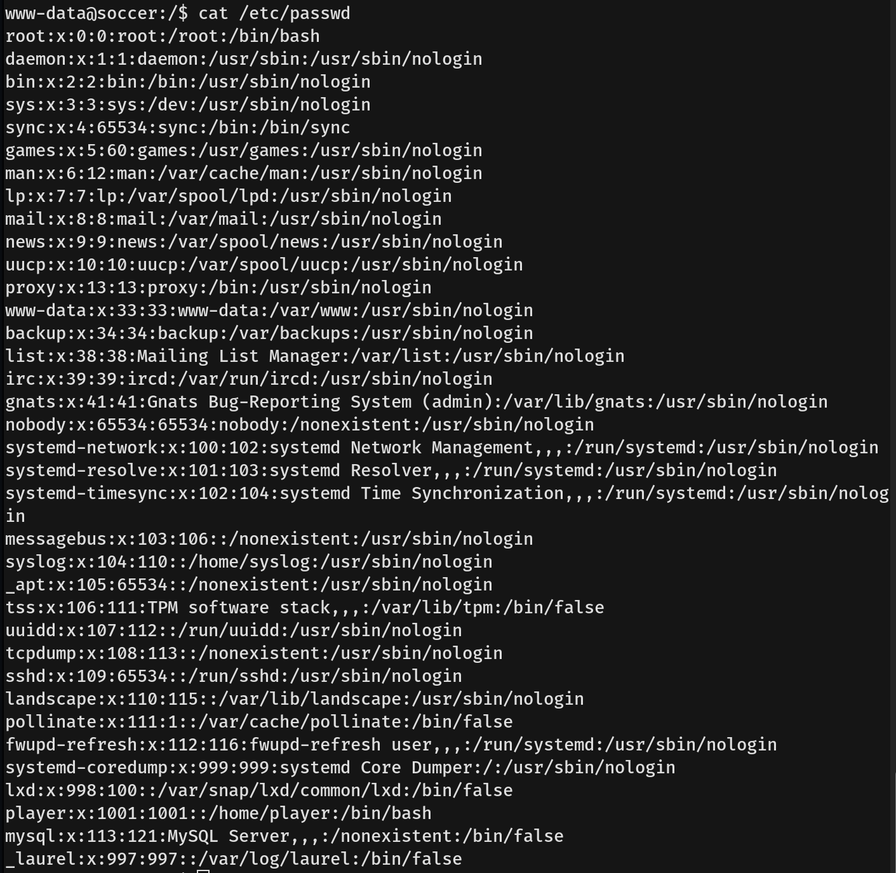

# Soccer Writeup - by Thammanant Thamtaranon  
- Soccer is an easy Linux-based machine hosted on Hack The Box.

## Reconnaissance  
- I started with a full TCP port scan including service/version detection and OS fingerprinting:  
  `nmap -A -T4 -p- 10.10.11.194`  
  
- The scan showed three open ports:  
  - 22 (SSH)  
  - 80 (HTTP)  
  - 9091 (Unknown)  
- I added `soccer.htb` to `/etc/hosts` for proper hostname resolution.

## Scanning & Enumeration  
- I then enumerated virtual hosts using `ffuf`:  
  `ffuf -u http://soccer.htb/ -H "Host: FUZZ.soccer.htb/" -w /usr/share/seclists/Discovery/DNS/subdomains-top1million-20000.txt -mc all -ac`  
- Nothing was found.  
- I ran a directory brute-force using `gobuster`, since `dirsearch` had found nothing:  
  `gobuster dir -u http://soccer.htb/ -w /usr/share/wordlists/dirbuster/directory-list-2.3-medium.txt -x php,html,txt,js,log,json -t 50`  
  
- We discovered the `/tiny` link, which led to Tiny File Manager.  
  
- I then clicked the link `—— © CCP Programmers ——` and followed it to GitHub.  
  
- On GitHub, we found default credentials: `admin/admin@123` and `user/12345`.  
  

## Exploitation  
- We used the admin credentials to log in successfully.  
- Noticing that Tiny File Manager was version `2.4.3`, we searched for CVEs and found **CVE-2021-45010**.  
- The **CVE-2021-45010** is a file upload vulnerability.  
- We uploaded `shell.php` and clicked “open” to trigger the reverse shell.  
  
- Using the command `cat /etc/passwd`, we confirmed the presence of user `player`.  
  
- In the config file, we found another VHost: `soc-player.soccer.htb`, so we added it to `/etc/hosts`.  
  
- Visiting `http://soc-player.soccer.htb`, we found a login and register page.  
- We signed up, logged in, and found the `/check` page.  
  
- Capturing the traffic with Burp Suite, we observed that it sent the `id` key-value to port 9091.  
  

- I tested for SQL Injection using payloads from [PayloadsAllTheThings](https://github.com/swisskyrepo/PayloadsAllTheThings/blob/master/SQL%20Injection/Intruder/SQL-Injection).  
- We discovered that `{"id":"1 OR 1 -- -"}` returned “Ticket Exists,” indicating SQL Injection is possible.  
- Since the response only returned “Ticket Exists” or “Ticket Doesn't Exist,” it was a blind SQL Injection.  
- While SQLMap could automate this, we wrote a custom Python script to exploit it.  [Exploit](exploit.py)  

- After obtaining the user `player` credentials, we SSHed into the machine.  
  
- We then captured the user flag.

## Privilege Escalation  
- Running `sudo -l` revealed that user `player` could not execute any commands with sudo.  
- We ran `find / -perm -4000 -type f 2>/dev/null` to locate SUID binaries.  
  
- We discovered the `doas` command, which looked interesting.  
- Examining the `doas` config file, we found that user `player` could run `dstat` as root.  
  
- We then referenced GTFOBins for the `dstat` command.  
  
- Running the command successfully granted us a root shell.  
  
- We then captured the root flag.
