# Stocker Writeup - by Thammanant Thamtaranon  
- Stocker is an easy Linux-based machine hosted on Hack The Box.

## Reconnaissance  
- I started with a full TCP port scan including service/version detection and OS fingerprinting:  
  `nmap -A -T4 -p- 10.10.11.233`  
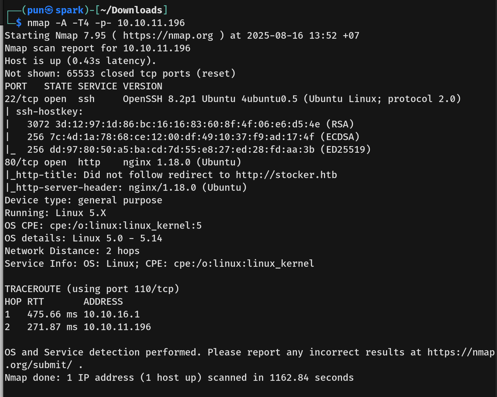  
- The scan showed two open ports:  
  - 22 (SSH)  
  - 80 (HTTP)  
- I then added `stocker.htb` to `/etc/hosts` for proper hostname resolution.

## Scanning & Enumeration  
- I ran a directory brute-force using `dirsearch`:  
  `dirsearch -u http://stocker.htb`  
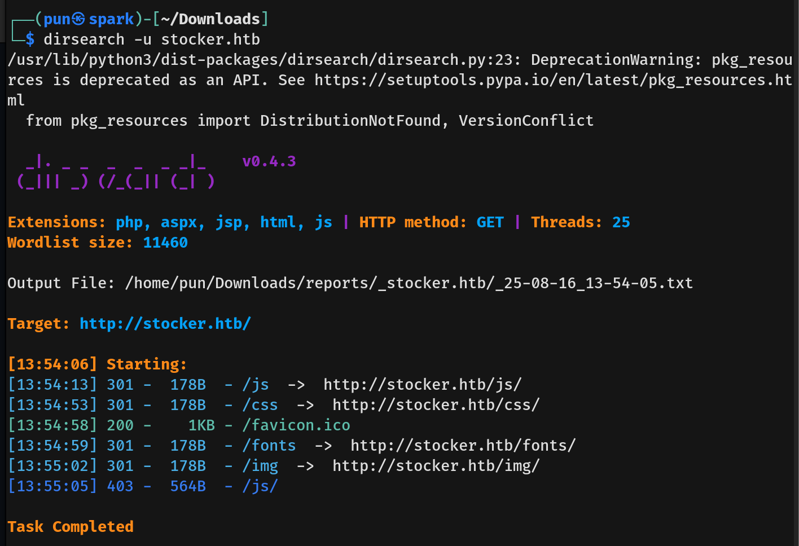  
- No interesting directories were found.

- I then enumerated virtual hosts using `ffuf`:  
  `ffuf -u http://stocker.htb -H "Host: FUZZ.stocker.htb" -w /usr/share/seclists/Discovery/DNS/subdomains-top1million-20000.txt -mc all -ac`  
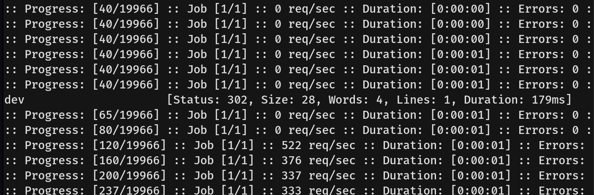  
- From this, I discovered `dev.stocker.htb` and added it to `/etc/hosts`.

- Visiting `http://dev.stocker.htb` redirected me to the login page:  
  `http://dev.stocker.htb/login`
- Using Wappalyzer, I identified Node.js and Express framework.
- We also noticed the `© 2022`, which suggested the latest update was in 2022.

## Exploitation  
- I tried searching for CVEs in Node.js and Express (2022–2023) but found nothing useful, so I attempted to bypass authentication instead.
- We used `SQLMap` to test for SQL Injection, but it was unsuccessful.
- Next, we tried NoSQL Injection based on HackTricks guidance (`https://book.hacktricks.wiki/en/pentesting-web/nosql-injection.html#basic-authentication-bypass`).  
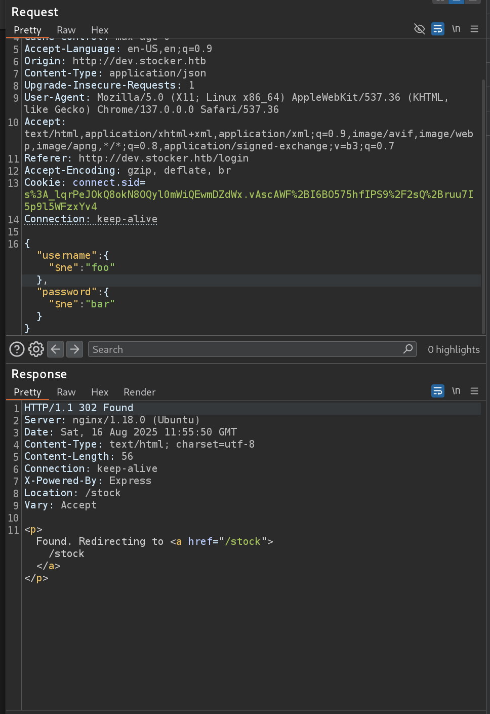  
- We tested both URL and JSON formats.   
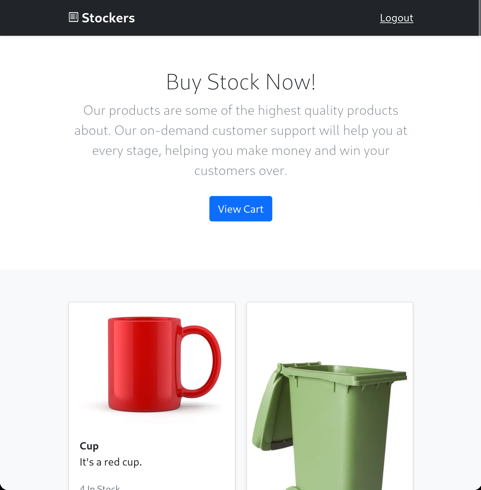  

- When adding an item to the basket and clicking submit, the request was sent to `/api/order`, which returned an `orderId` along with a link to view the receipt in PDF.  
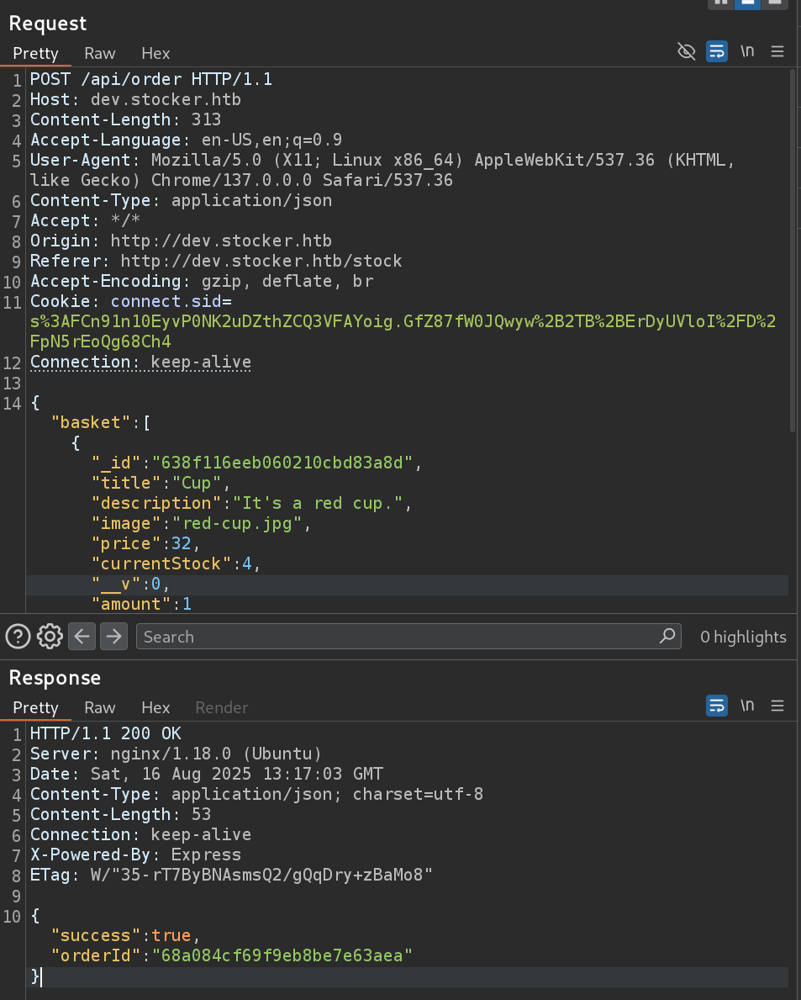  
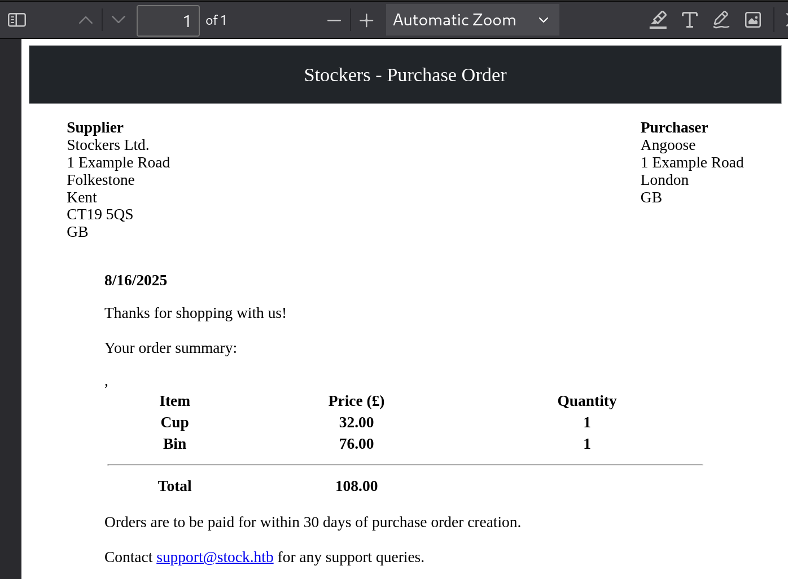  

- From the receipt, the `title` field seemed to be the most likely injection point.  
- I first tried ``, which caused an internal server error, suggesting improper input handling.  
- We then tried `<iframe src='http://localhost:80/'></iframe>` and successfully loaded the stock page into the receipt, confirming SSRF.  
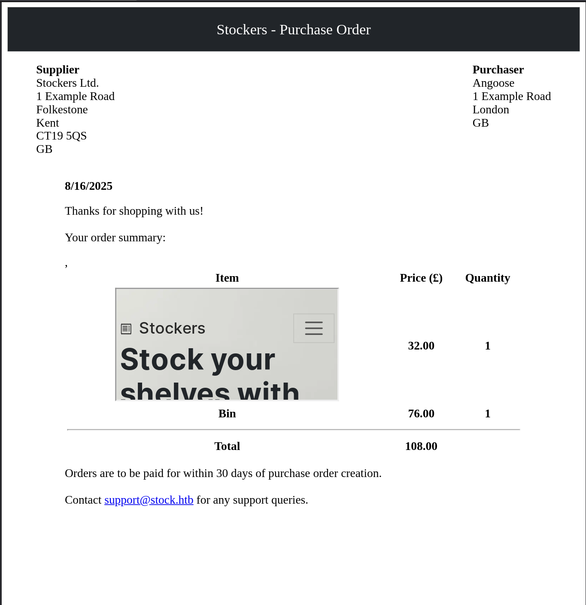  

- We escalated this by reading `/etc/passwd`. To display it clearly, I increased the iframe size, making the payload:  
  `<iframe src='file:///etc/passwd' style='width: 100%; height: 1000px;'></iframe>`  
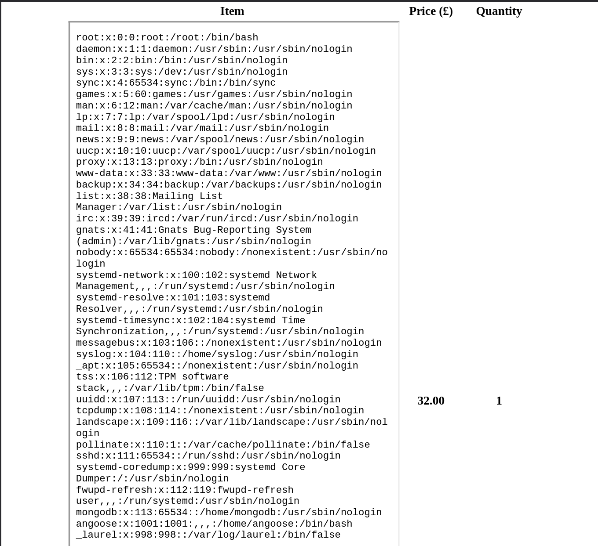  
- This confirmed the existence of the user `angoose`.  

- I tried accessing `/etc/shadow` and `/home/angoos/.ssh/id_rsa` but failed.  
- We then enumerated possible app paths by attempting to read `/var/www/html/dev/index.js`, `/var/www/dev.stocker.htb/index.js`, and `/var/www/dev/index.js`. The correct one was `/var/www/dev/index.js`.  
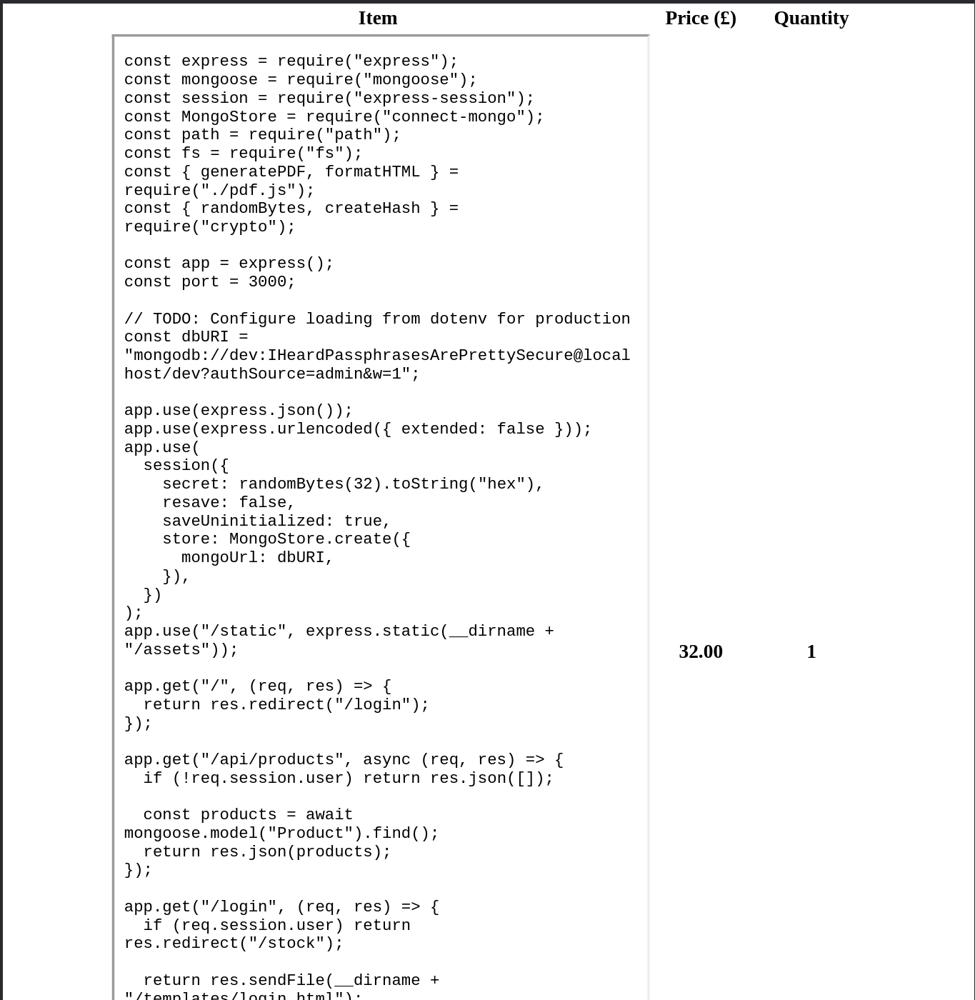  

- From this file, we obtained development credentials. However, since there was no `dev` user on the system, I attempted to SSH as `angoose`.  
- This worked, and I successfully grabbed the user flag.  
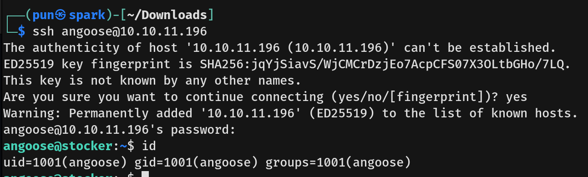  

## Privilege Escalation  
- Running `sudo -l` revealed that the user `angoose` could run `/usr/bin/node /usr/local/scripts/*.js` as root.  
- Since the sudo rule used a wildcard (*), we bypassed the restriction with `../../`.  
- I created a `root.js` file in my home directory containing a command to add the SUID bit to `/bin/bash`.  
- When the task ran, it executed my payload as root, making `/bin/bash` SUID.
- I then used it to escalate privileges and obtained a root shell.  
- Finally, I captured the root flag.  
  
