# Timelapse Writeup - by Thammanant Thamtaranon

**Timelapse** is an **Easy**-difficulty Windows machine hosted on Hack The Box.

---

## Reconnaissance
- We started the engagement with a full TCP port scan using Nmap to identify open services and determine the underlying operating system.
  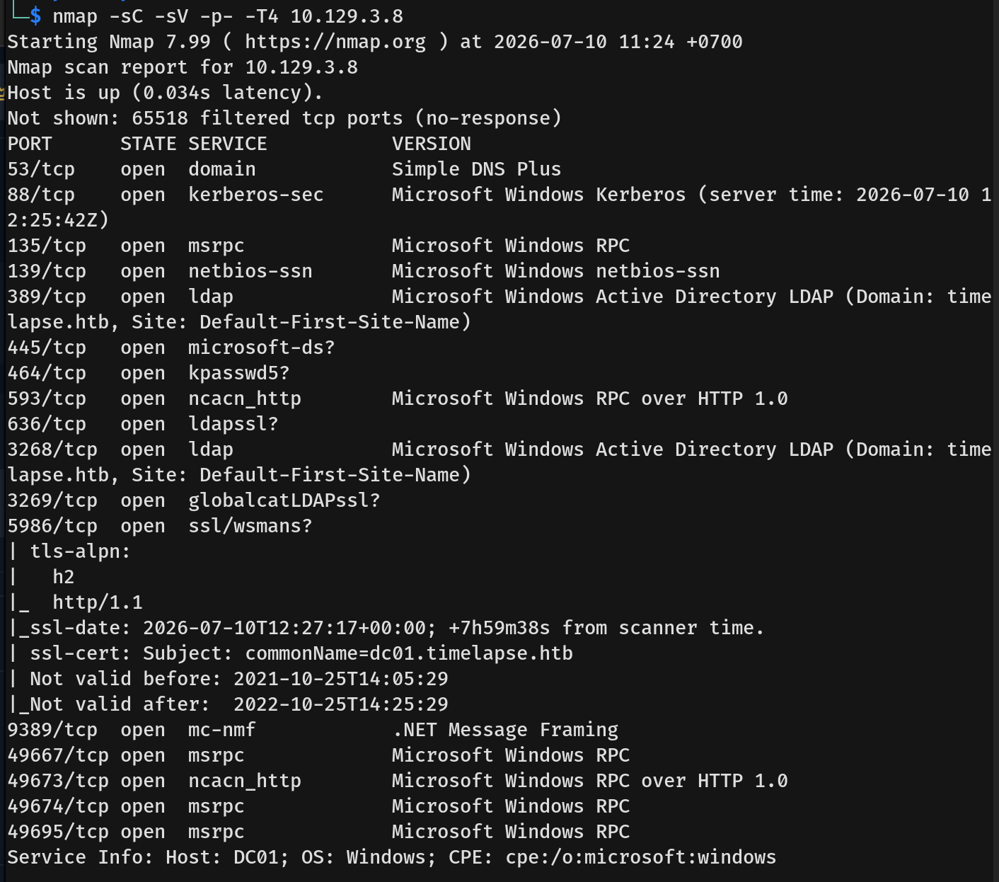
- The results indicated an Active Directory Domain Controller environment `dc01.timelapse.htb` with several key services available:
  * **53/tcp:** domain (DNS)
  * **88/tcp:** kerberos-sec
  * **135/tcp & 139/tcp & 445/tcp:** msrpc / netbios-ssn / microsoft-ds (SMB)
  * **389/tcp & 636/tcp:** ldap / ldapssl
  * **5986/tcp:** ssl/wsman (WinRM over SSL)
- We then added `timelapse.htb` and `dc01.timelapse.htb` to our `/etc/hosts` file.

---

## Scanning & Enumeration
- We started by enumerating SMB with null and guest credentials. The guest credentials worked, and we gained access to `Shares`.
  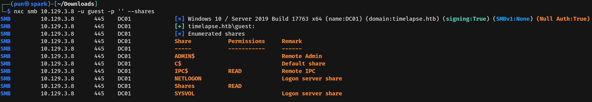
- Since the guest credentials worked, I then used `--rid-brute` to collect usernames on the machine.
  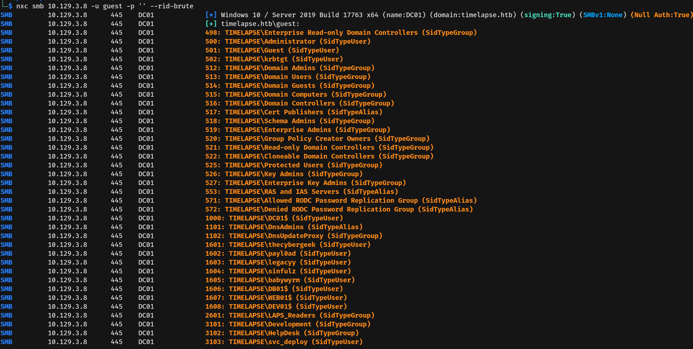
- Connecting to the share, we found two folders: `Dev` and `HelpDesk`. The `Dev` folder contained `winrm_backup.zip`, and the `HelpDesk` folder contained documentation indicating that the machine is using LAPS. 
- **LAPS (Local Administrator Password Solution)** is a Microsoft feature that automatically manages and randomizes the local administrator passwords on domain-joined computers, storing them securely in Active Directory.
  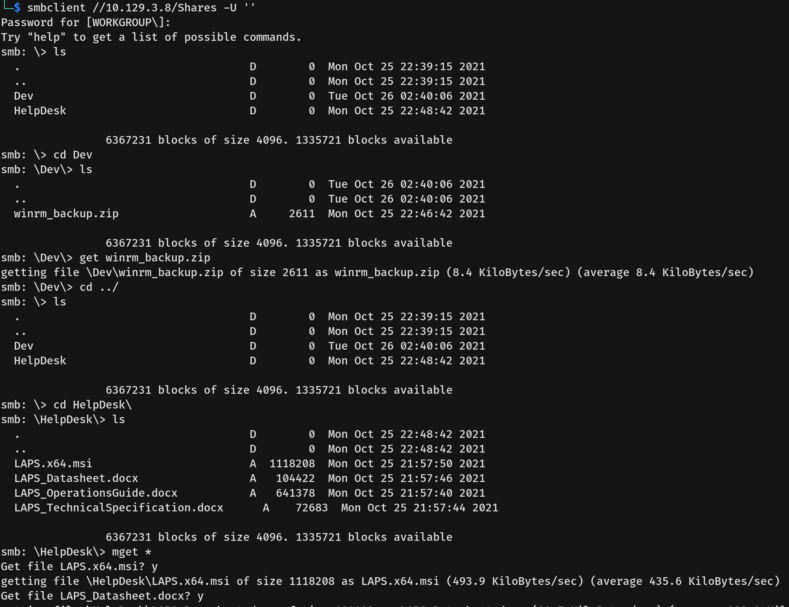
  
---

## Exploitation
- I then downloaded `winrm_backup.zip` to my attack machine; however, extracting it required a password.
  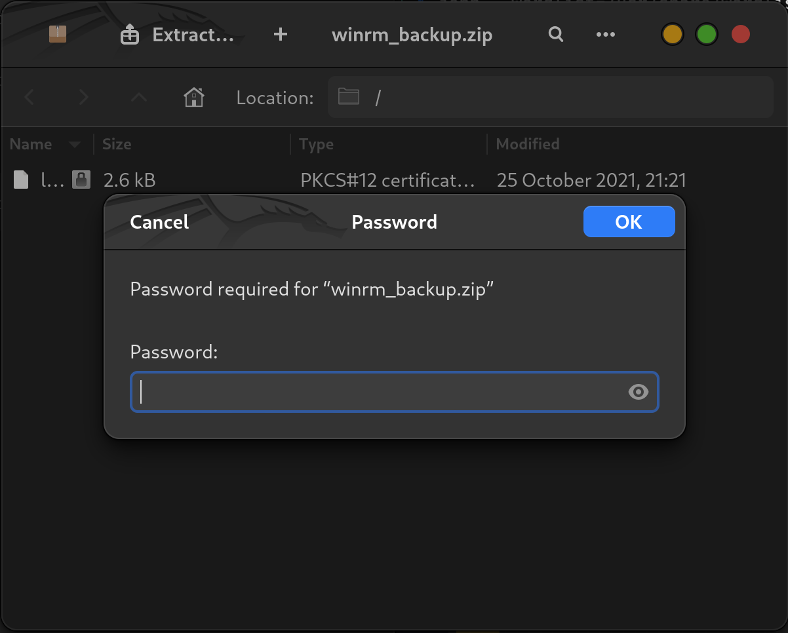
- We used `zip2john`, an extension of John the Ripper, to extract the hash and crack the zip password.
  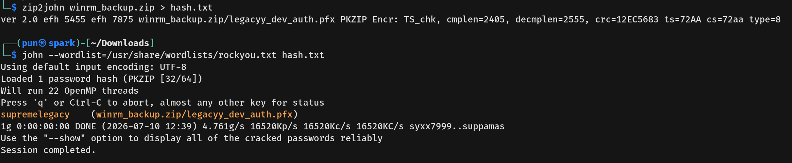
- After entering the password, we extracted `legacyy_dev_auth.pfx`, which contained the user `legacyy`'s keys. However, it also needed a password to unlock its contents. 
- **PFX (Personal Information Exchange)** is a certificate format used to store both private and public keys in a single encrypted file.
  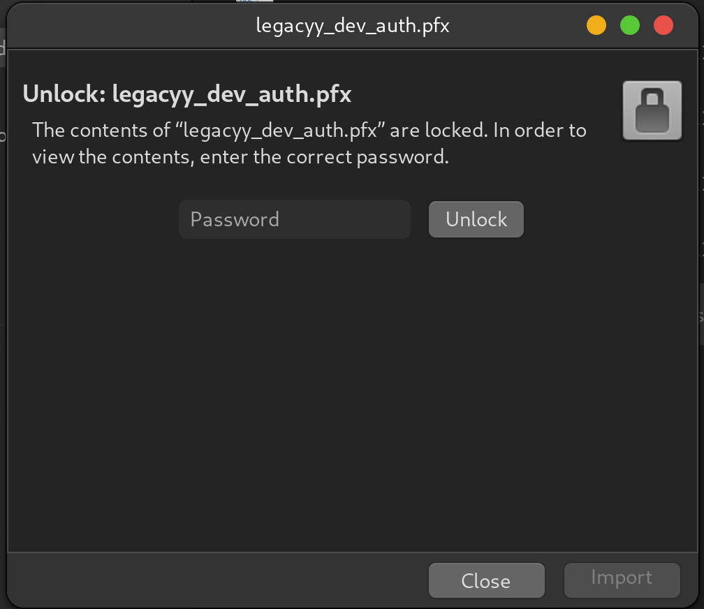
- We then used `pfx2john`, another extension of John the Ripper, to crack the PFX password as well.
  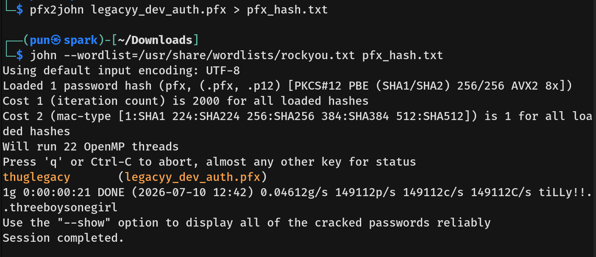
- With the password for the PFX, I extracted the encrypted private key and the public certificate from it using `openssl`.
  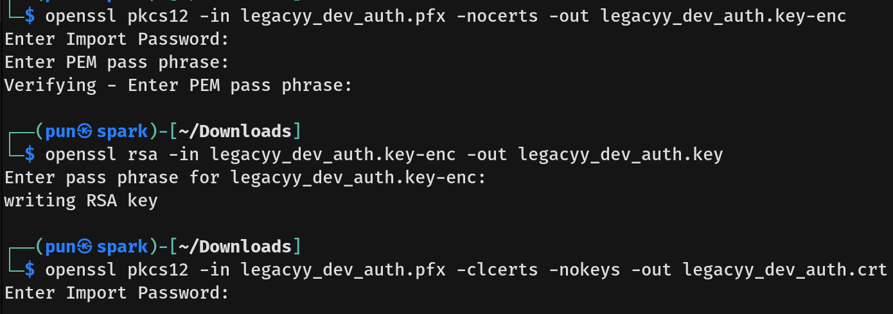
- With the keys, I used `evil-winrm` to connect to the machine as `legacyy` and captured the user flag.
  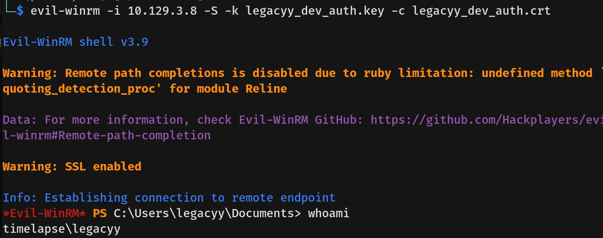

---

## Privilege Escalation
- The `legacyy` account did not contain any privileges or group memberships that could help us escalate.
- While enumerating the system, we checked the PowerShell history file and found cleartext credentials. These credentials belonged to the user `svc_deploy`.
  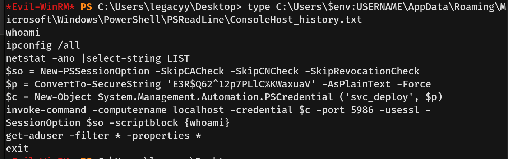
- I then connected to the machine using the `svc_deploy` credentials.
  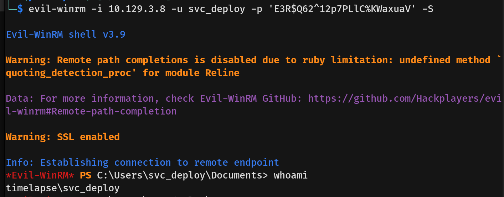
- Checking their privileges, we noticed the user `svc_deploy` is in the `LAPS_Readers` group, which grants the ability to read the LAPS-managed local administrator passwords stored in Active Directory.
  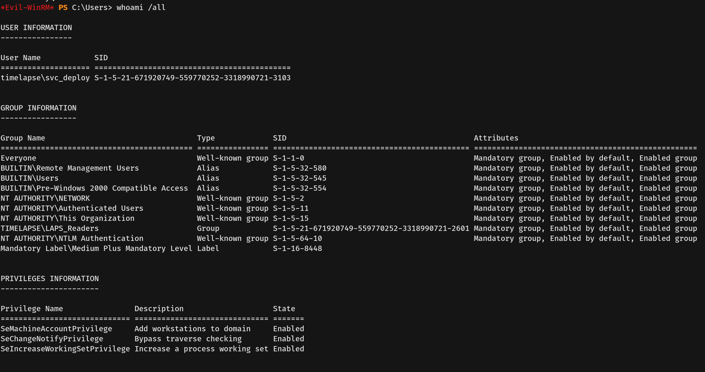
- With this access, I ran a PowerShell command to read the `ms-Mcs-AdmPwd` property and successfully retrieved the `DC01` Administrator password.
  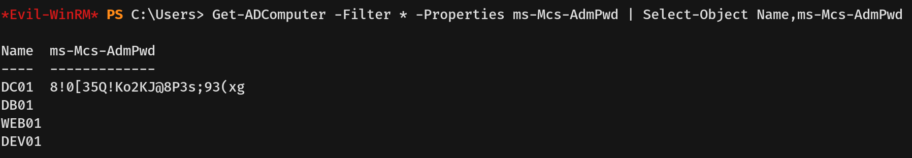
- I then connected to the machine as `Administrator`. Interestingly, the root flag was not on the Administrator's desktop.
  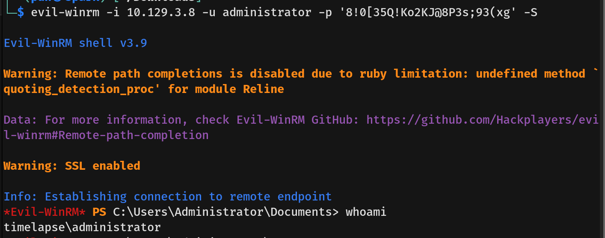
- Checking the user `TRX`'s desktop folder instead, we found and captured the root flag.
  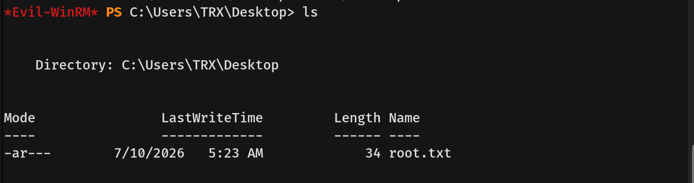
