# Titanic Writeup - by Thammanant Thamtaranon

**Titanic** is an easy-difficulty Linux machine hosted on Hack The Box.

---

## Reconnaissance
- I began with a full TCP port scan, including service/version detection and OS fingerprinting:
  `nmap -A -T4 -p- 10.10.11.55`
  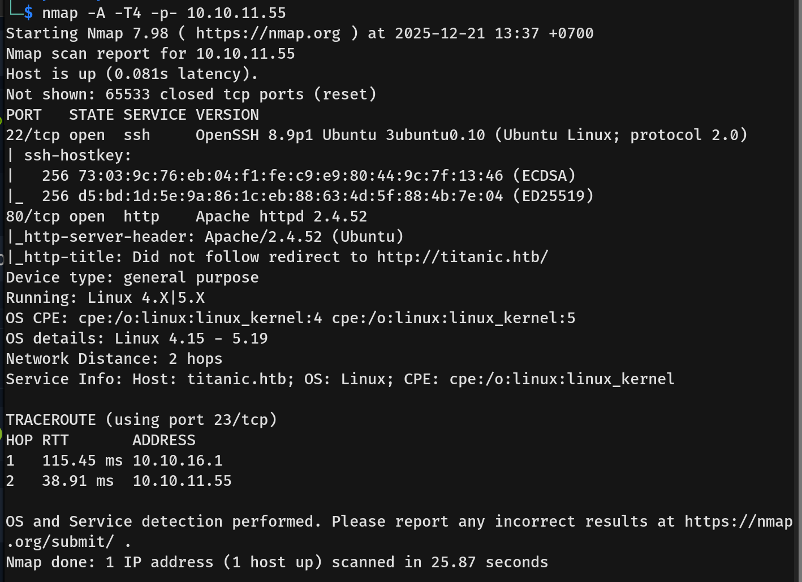
- The scan revealed two open ports:
  - **22** — SSH (OpenSSH 8.9p1 Ubuntu)
  - **80** — HTTP (Apache httpd 2.4.52)
- Based on the scan results, I added `titanic.htb` to my `/etc/hosts` file.

---

## Scanning & Enumeration
- Visiting the main website `http://titanic.htb` presented a booking page for a "luxurious ship trip experience."
  
- I proceeded to enumerate subdomains (Virtual Hosts) using `ffuf` to find any hidden applications.
  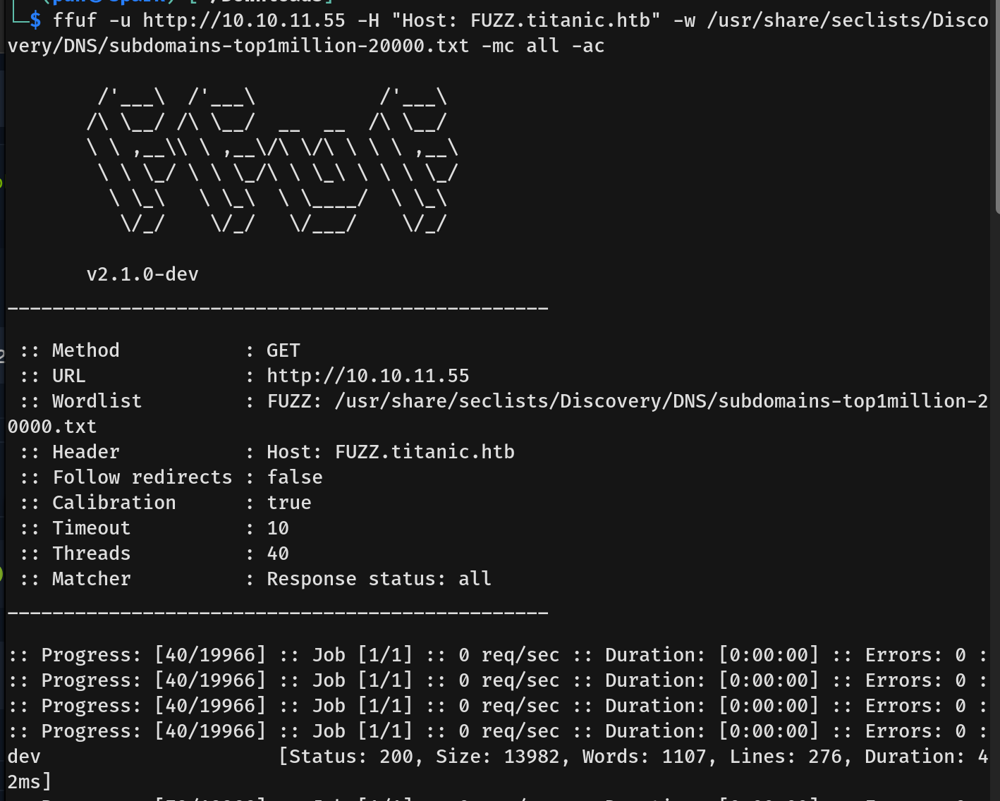
- The scan discovered a valid subdomain: **dev.titanic.htb**. I added this to my `/etc/hosts` file as well.
- Visiting `http://dev.titanic.htb` revealed a **Gitea** instance, a self-hosted Git service.
  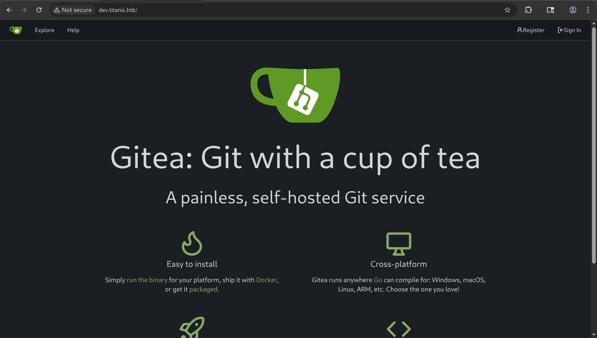
- Exploring the Gitea instance, I found a user named **developer** with two public repositories: `docker-config` and `flask-app`.
  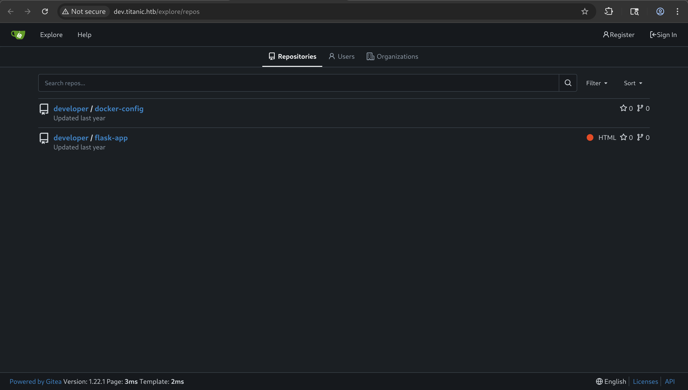
- I examined the **docker-config** repository. Inside `mysql/docker-compose.yml`, I found hardcoded environment variables.
  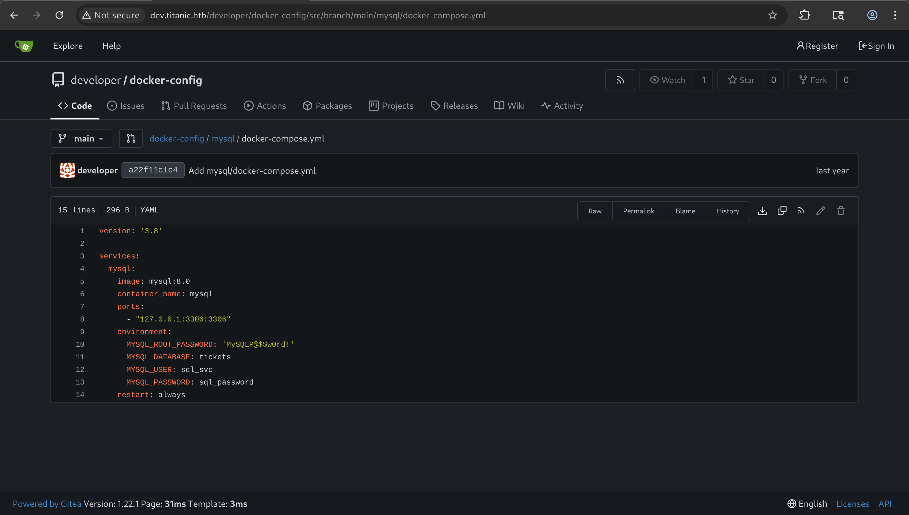
- This file leaked a potential password:
  - **MYSQL_ROOT_PASSWORD:** `MySQLP@$$w0rd!`
- Next, I analyzed the **flask-app** repository, which appears to be the source code for the main booking application. I reviewed `app.py` for vulnerabilities.
  
- I identified a critical **Path Traversal / Local File Inclusion (LFI)** vulnerability in the `download_ticket` function.
  
- **Vulnerability Logic:**
  - The application defines a route `/download` that takes a `ticket` parameter.
  - It constructs the file path using `os.path.join(TICKETS_DIR, ticket)` without sanitizing the input.
  - It then checks if the file exists and sends it back to the user using `send_file`.
  - An attacker can exploit this by passing path traversal sequences (e.g., `../../../../etc/passwd`) in the `ticket` parameter to read arbitrary files on the server.
- Additionally, checking the commit history or other files in the `flask-app` repo, I found sample ticket files (JSON) containing Personally Identifiable Information (PII) for users, though these appear to be thematic dummy data.
  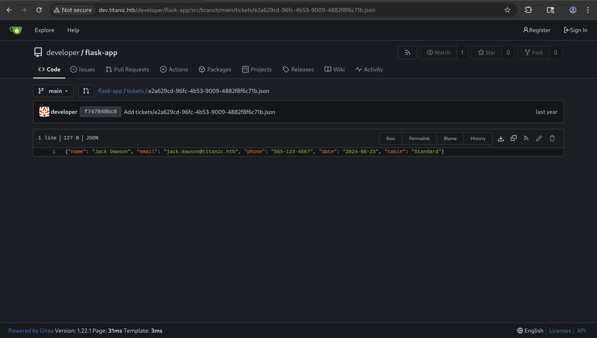
  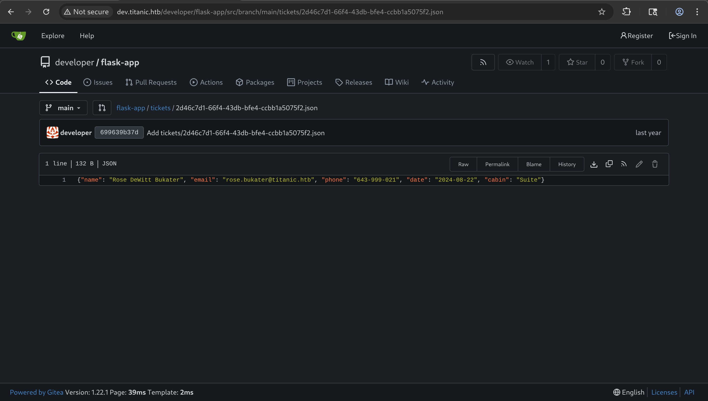

---

## Exploitation
- I verified the LFI vulnerability using **Burp Suite**. I captured the request to `/download?ticket=...` and modified the `ticket` parameter to traverse the directories.
  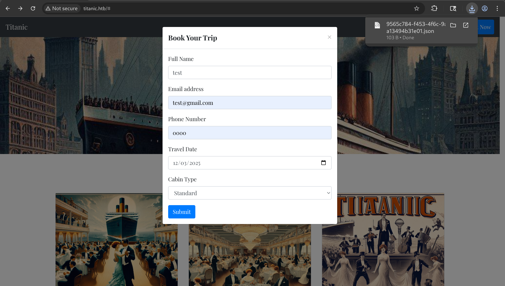
  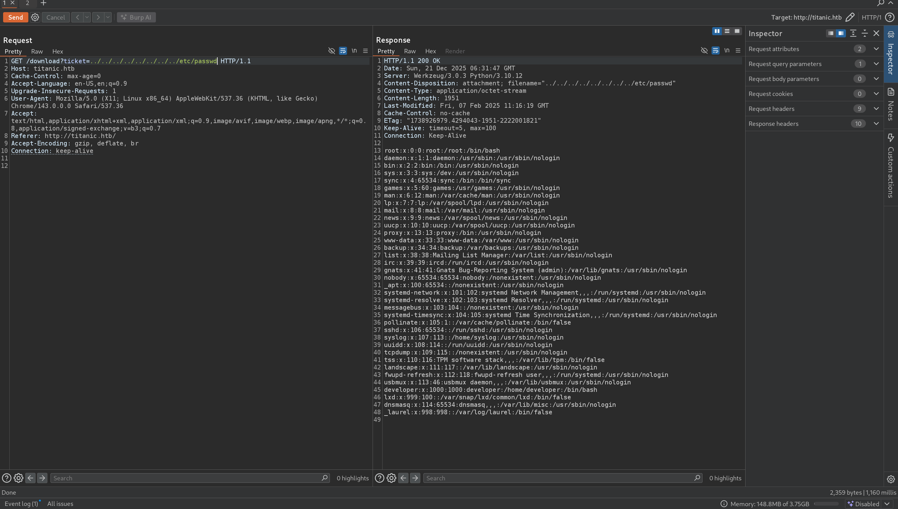
- **Attack Strategy:** Since we know there is a **Gitea** instance running and we saw the `docker-compose.yml` earlier, we inferred that the Gitea data is likely mapped to a standard path like `/home/developer/gitea/data`. I used the LFI to download the Gitea database file (`gitea.db`), which usually contains user credentials.
  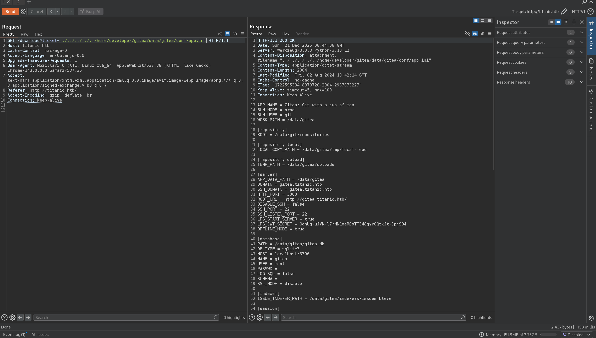
- I extracted the database locally and browsed the `user` table. I found the password hash for the **developer** user.
  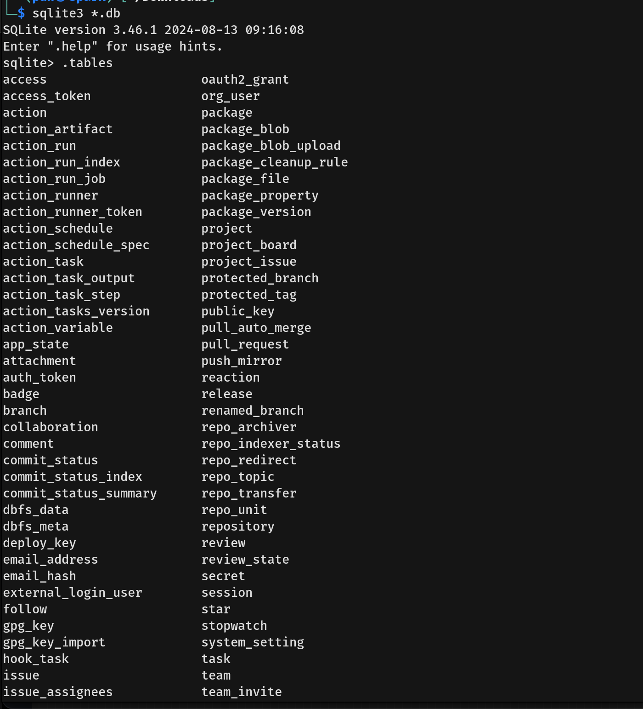
  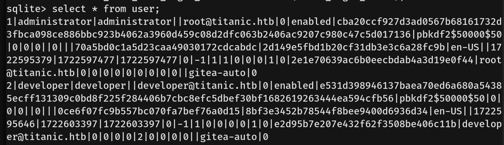
- I used `hashcat` to crack the extracted hash. It was a standard `pbkdf2` hash, and we successfully recovered the password.
  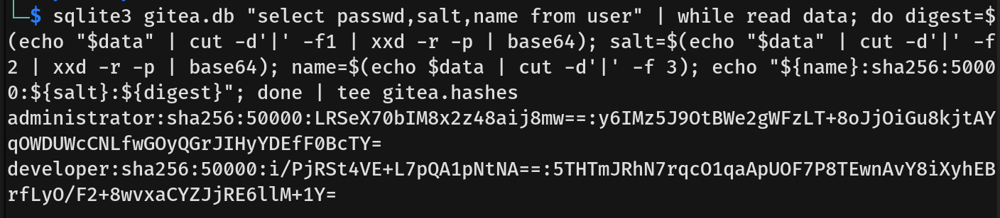
  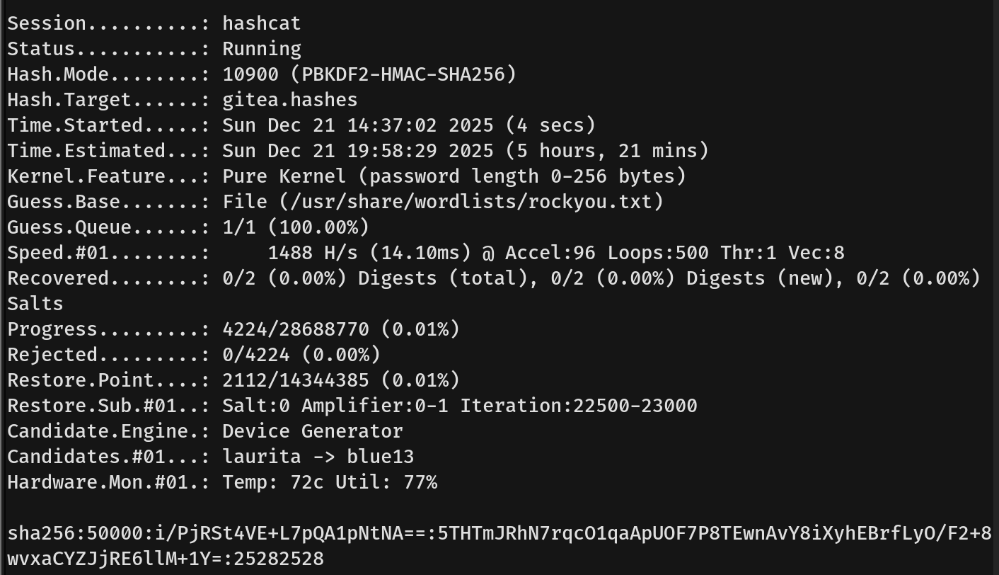
- With the valid password, I logged in via **SSH** as the **developer** user.
  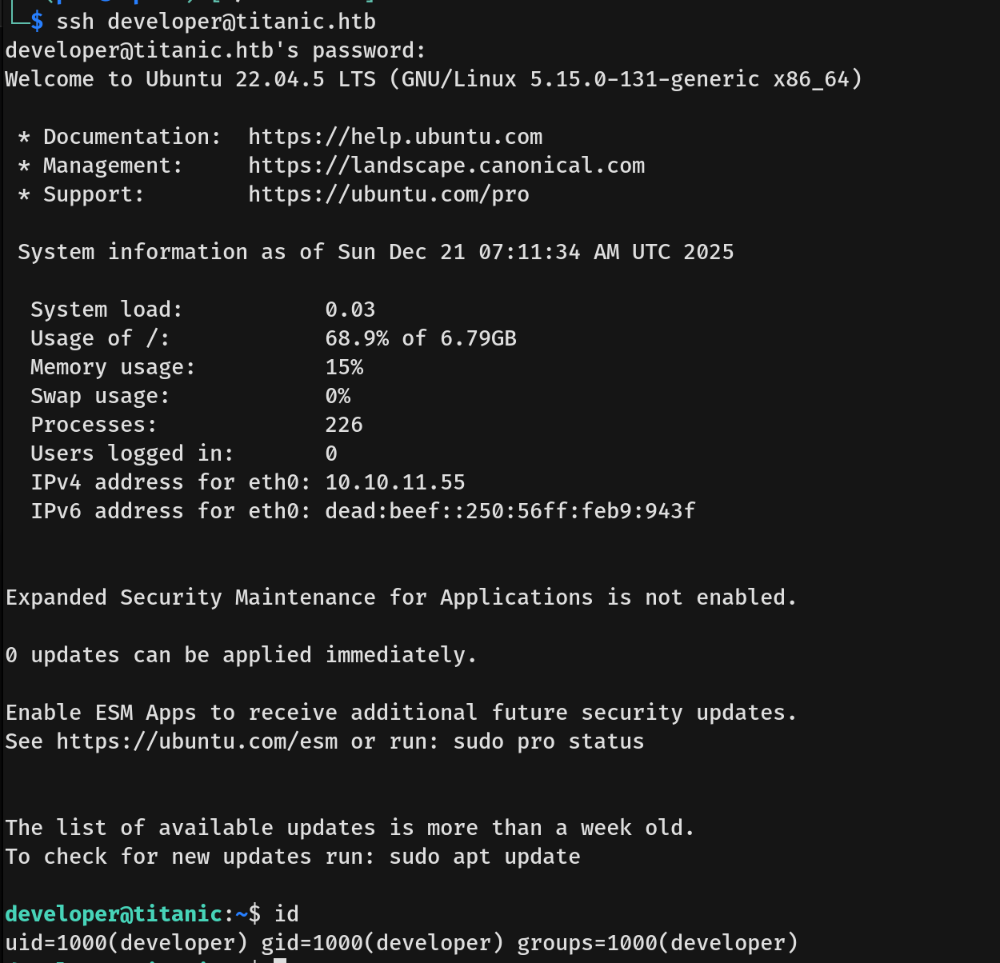
- I retrieved the **user flag** from `user.txt`.

---

## Privilege Escalation
- I ran the command `sudo -l`, but unfortunately, the user `developer` cannot run sudo.
- Since we know this machine hosts containers, we navigated to `/opt` and found several directories. The interesting one is `/opt/scripts`.
- Reading the script revealed that it uses `/usr/bin/magick` and is executed as **root**.
  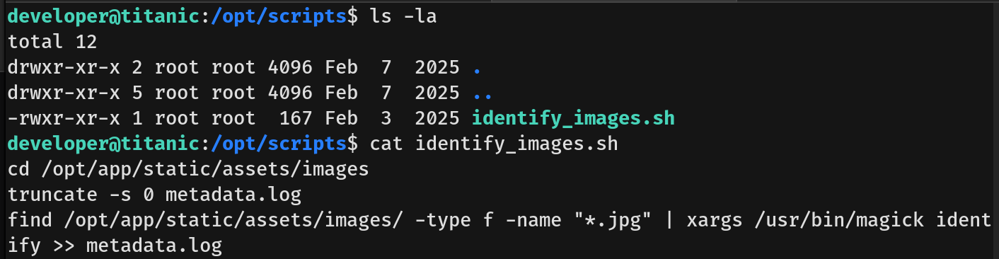
- Upon checking the version of ImageMagick installed, I found it was vulnerable to **CVE-2024-41817**. This vulnerability allows for **Arbitrary Code Execution** via a malicious shared library when the application attempts to load a delegate or coder.
  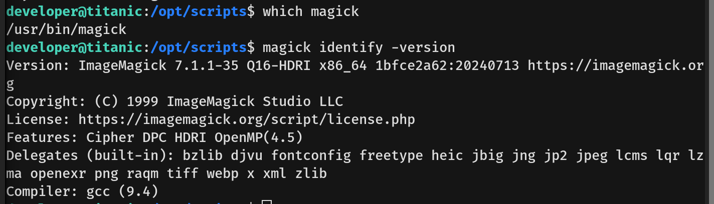
  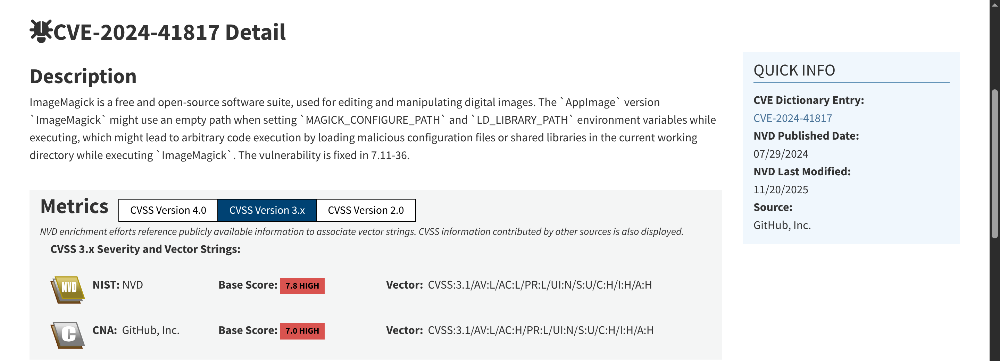
- **Exploit Logic:** I created a malicious Shared Object (`.so`) file containing a payload to spawn a reverse shell or modify file permissions. I then crafted a specific image file that, when processed by the vulnerable ImageMagick instance, triggers the loading of my malicious library.
  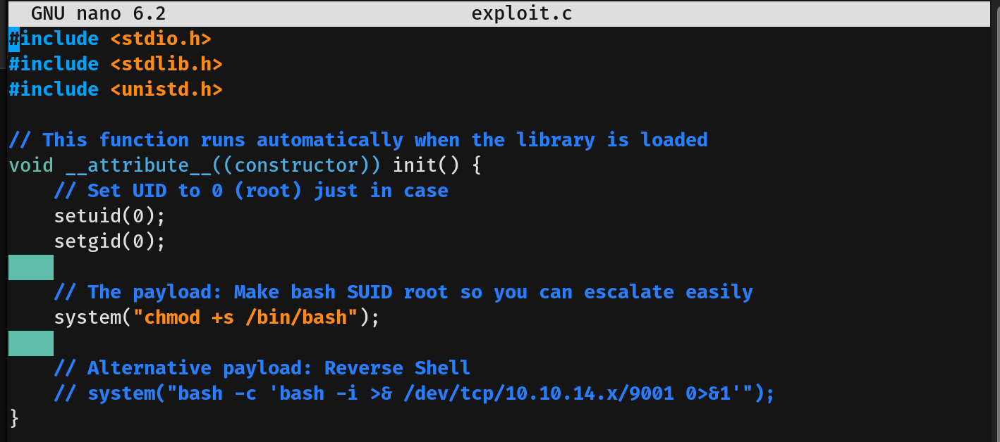
- I placed the malicious image into the folder monitored by the root script and waited for the script to execute.
- When the cron job executed and processed the image, the exploit triggered and successfully modified the permissions of `/bin/bash` to add the SUID bit. I was then able to run `/bin/bash -p` to elevate to root.
  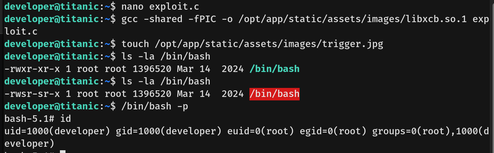
- I captured the **root flag**.
