# TombWatcher Writeup - by Thammanant Thamtaranon

**TombWatcher** is a medium-difficulty Windows machine hosted on Hack The Box.

## Reconnaissance
- I began with a full TCP port scan, including service/version detection and OS fingerprinting:
  `nmap -A -T4 -p- 10.10.11.72`
  
  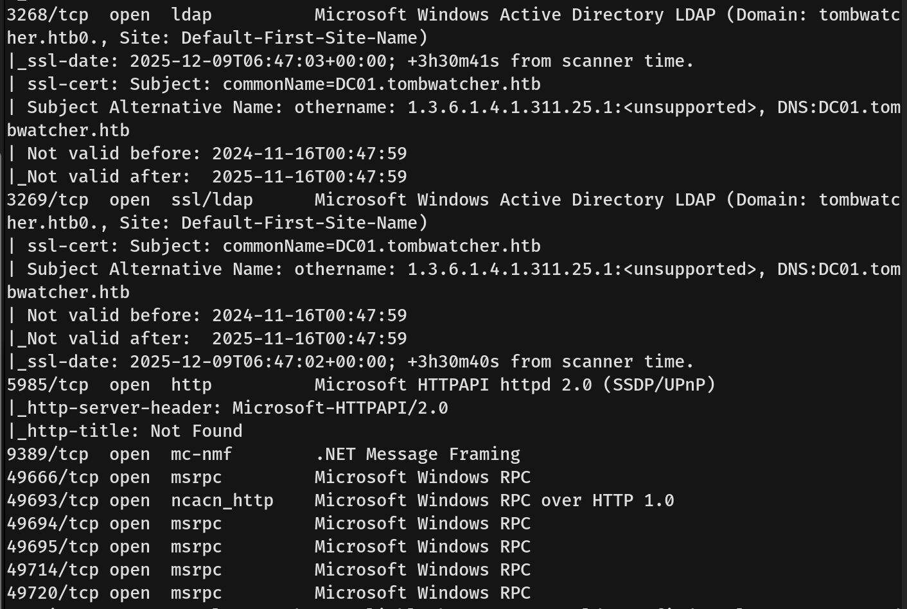
- The scan revealed the following open ports:
  - **53** — DNS (Simple DNS Plus)
  - **80** — HTTP (Microsoft IIS httpd 10.0)
  - **88** — Kerberos (Microsoft Windows Kerberos)
  - **389** — LDAP (Microsoft Windows Active Directory LDAP)
  - **445** — Microsoft-DS (SMB)
  - **5985** — WinRM (Microsoft HTTPAPI httpd 2.0)
  - **3268/3269** — Global Catalog LDAP/LDAPS
  - **49666 - 49720** — RPC High Ports
- I added `tombwatcher.htb` and `dc01.tombwatcher.htb` to `/etc/hosts` for proper hostname resolution.

## Scanning & Enumeration
- We ran `dirsearch` on both `tombwatcher.htb` and `dc01.tombwatcher.htb`, but nothing of interest was found.
- I then used `nxc` (NetExec) with the given username and password on SMB. After enumeration, nothing useful was found.
  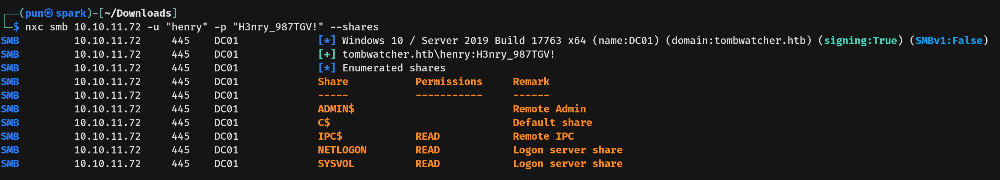
- We then used `rpcclient` to gather more information.
  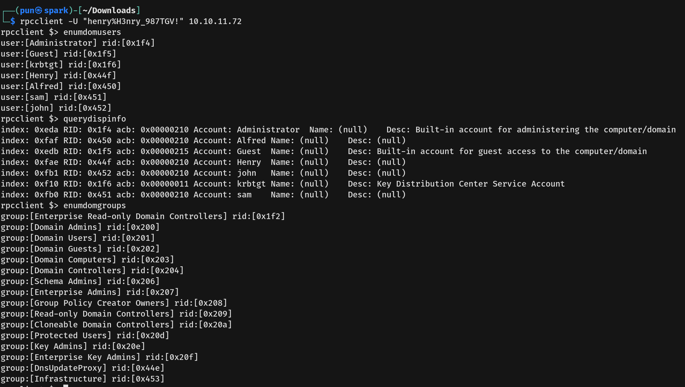
- We found three users: `Alfred`, `Sam`, and `John`.

## Exploitation
- I used `bloodhound-python` to map the relationships in the domain.
  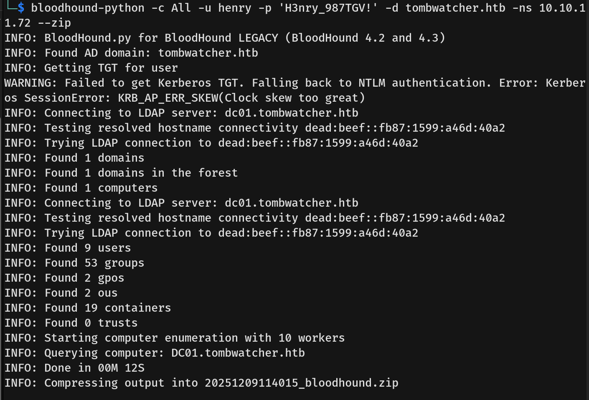
- We found that user **Henry** has the **WriteSPN** right over user **Alfred**. This allows us to perform **Targeted Kerberoasting**.
  
- **Targeted Kerberoasting Logic:** Normally, we can only Kerberoast users who already have an SPN. Alfred does not have one. Since Henry has `WriteSPN`, we can force a fake SPN onto Alfred's account (e.g., `HTTP/test`). Alfred now becomes a "Service Account," allowing us to request a TGS ticket encrypted with his password, which we can then crack offline.
- First, I set my clock to match the server clock to prevent the `KRB_AP_ERR_SKEW` error.
  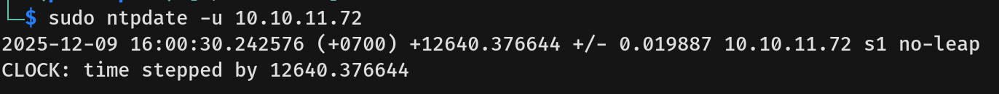
- Next, I injected a fake SPN into Alfred's account.
  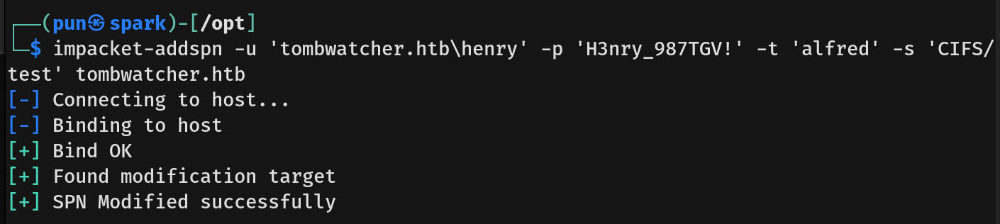
- Then, we requested the service from user Alfred.
  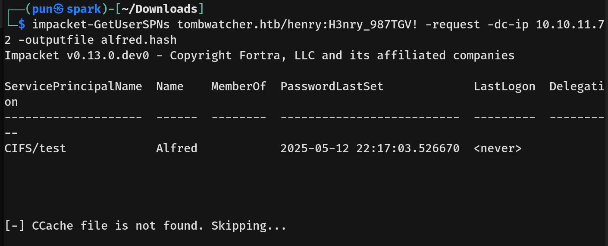
- Finally, we cracked the hash, resulting in Alfred's cleartext password.
  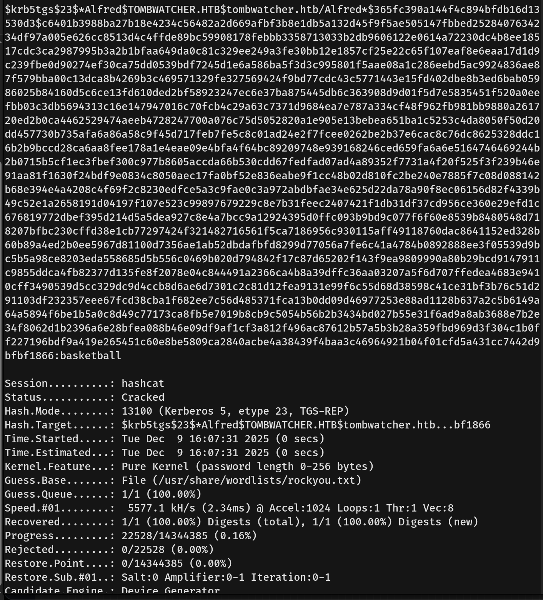
- Going back to BloodHound, we found that user **Alfred** has the **AddSelf** right to the **INFRASTRUCTURE** group. This means Alfred has the right to add himself to that group.
  
- I then added Alfred to the Infrastructure group.
  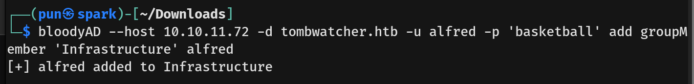
- Now, the **INFRASTRUCTURE** group has **ReadGMSAPassword** on `ANSIBLE_DEV$`. Group Managed Service Accounts (gMSA) have complex, Windows-managed passwords, and we now have permission to read that password.
  
  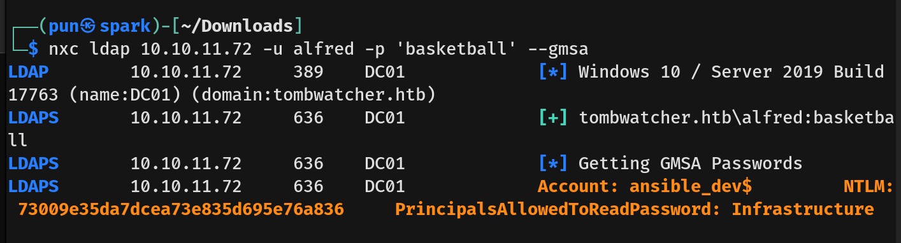
- Now that we had the hash password of `ANSIBLE_DEV$`, we used the **Pass-The-Hash (PtH)** technique.
- From the relationships map, `ANSIBLE_DEV$` has **ForceChangePassword** rights on user **Sam**. I used this right to set a new password for Sam.
  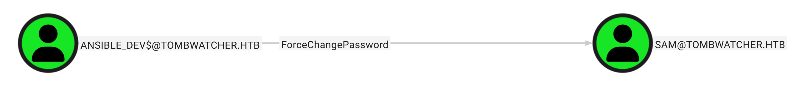
  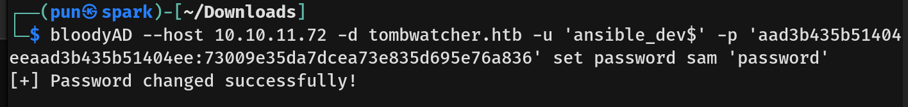
- Since User **Sam** has **WriteOwner** on User **John**, this permission is extremely powerful because the Owner of an object can always modify its permissions. We used `WriteOwner` to make Sam the owner of John's account.
  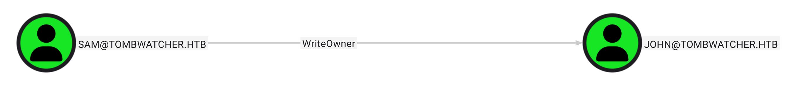
  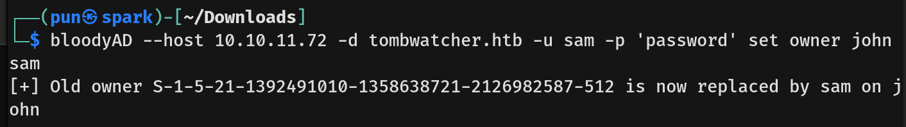
- With Sam as the owner, we granted him **GenericAll** rights to modify John's account.
  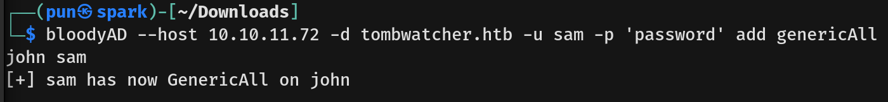
- Now that Sam had full control, I forced a password change on John's account.
  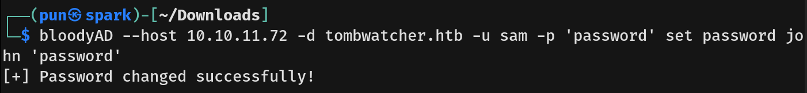
- We ran `nxc` against WinRM and were able to log in with the changed password.
  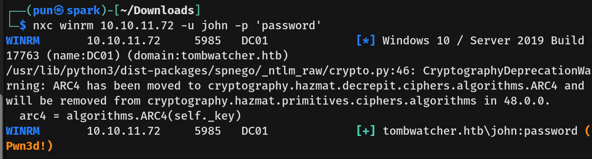
- We captured the user flag.

## Privilege Escalation
- From the relationships map, user **John** has **GenericAll** permissions on the Organizational Unit (OU) named **ADCS**. This automatically inherits Full Control over every User, Group, and Computer inside that OU.
  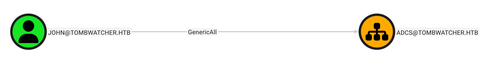
- I connected as John using `Evil-WinRM`.
  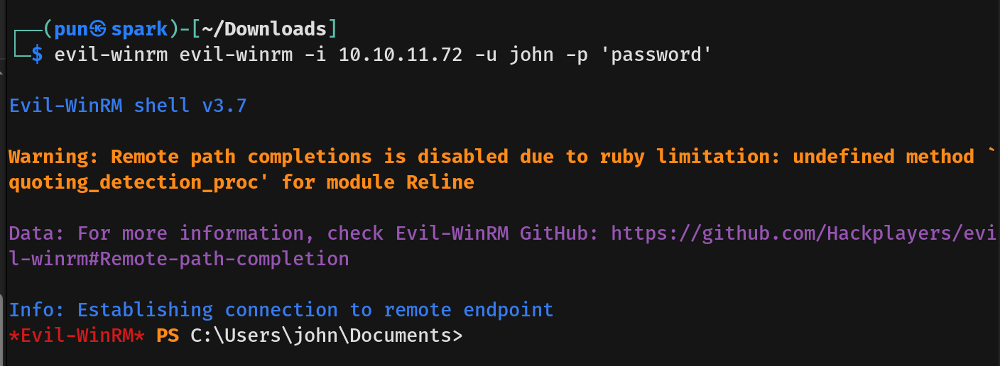
- I checked the contents of the ADCS OU, but unfortunately, nothing was currently inside.
  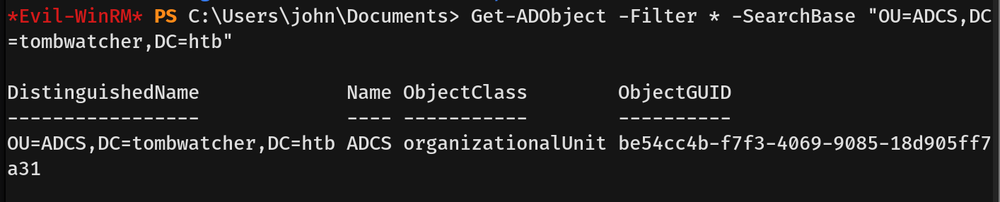
- Leveraging our **GenericAll** rights on the ADCS OU, we attempted to restore a deleted high-privilege object and found a user object named `cert_admin`.
  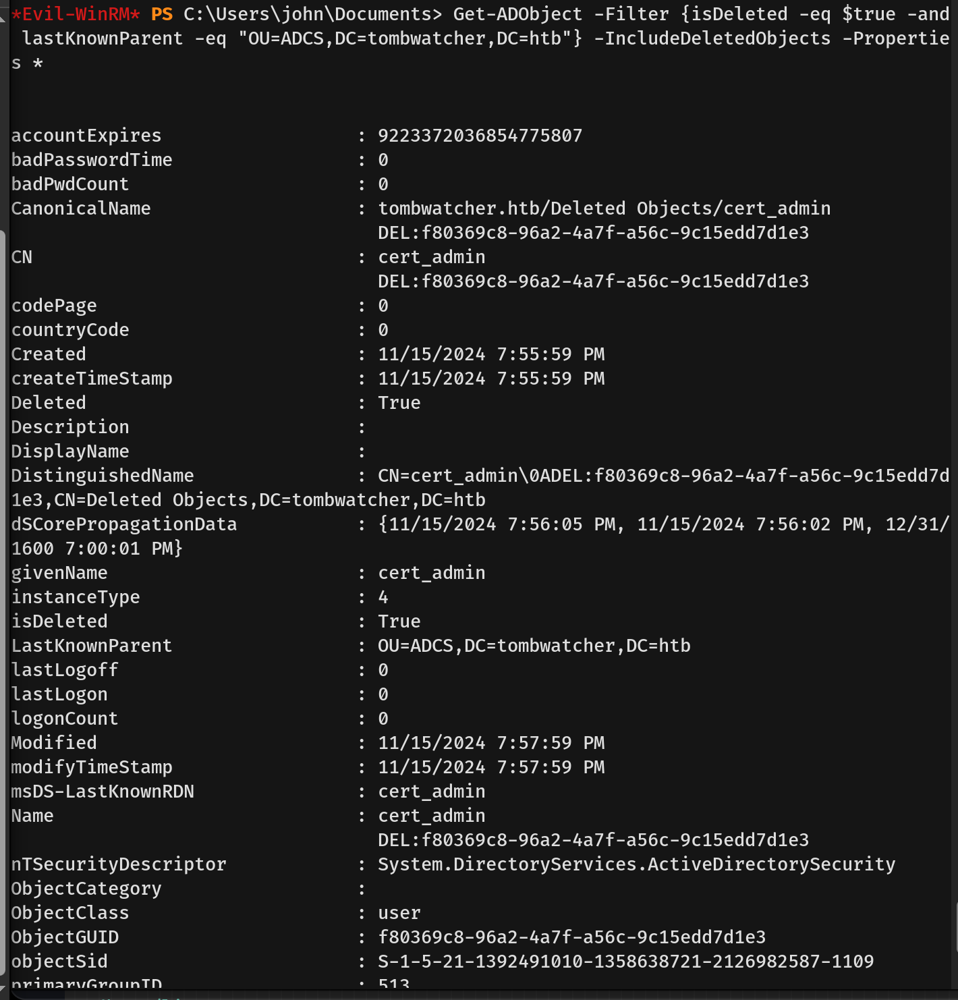
- I used the `Restore-ADObject` cmdlet to restore the object. After restoration, I set a new password and enabled the account. However, the restored account's privileges were only those of a Domain User.
  
- We then ran `certipy-ad` as `cert_admin`.
  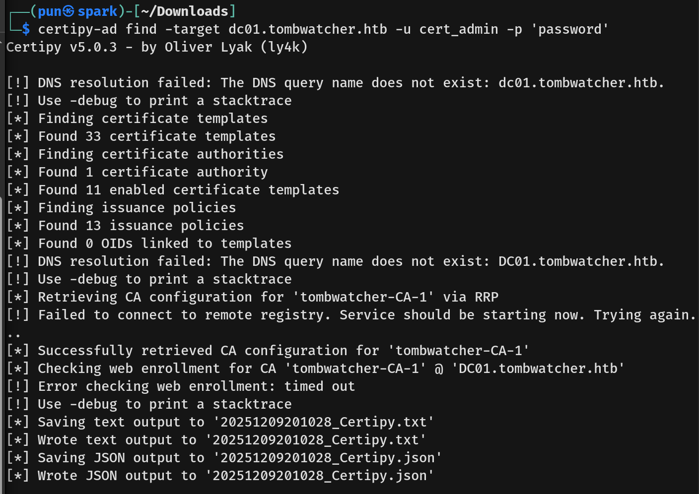
- We found **ESC15** (Enrollment Agent Abuse with Template Constraints), an advanced ADCS attack (CVE-2024-49019) that allows an attacker to bypass constraints on a target certificate template by using an Enrollment Agent certificate.
  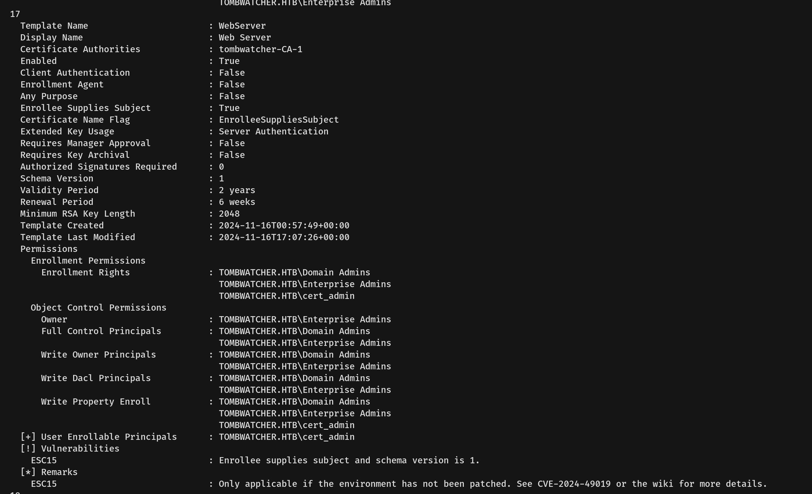
- First, we requested the Administrator's Certificate. This used the Enrollment Agent's privilege to bypass the constraints of the WebServer template.
  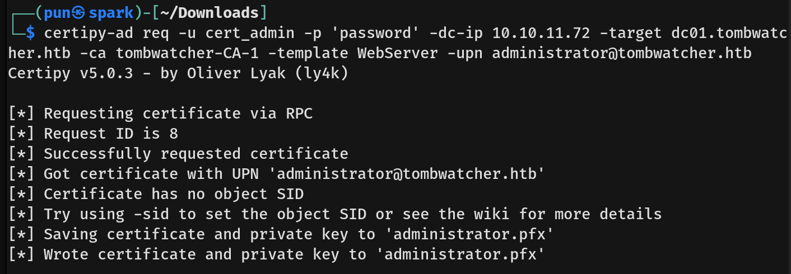
- We attempted to authenticate with the resulting PFX file, but we failed.
  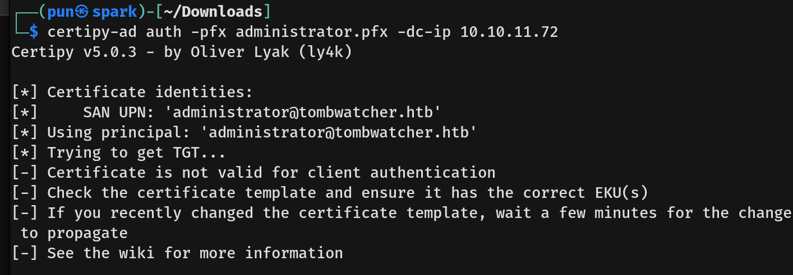
- We pivoted to a privilege escalation attack known as **ESC3** (Certificate Request Agent). This is a two-stage method where the first stage uses a low-privileged user's credentials to request a certificate that grants the power to request certificates on behalf of others.
  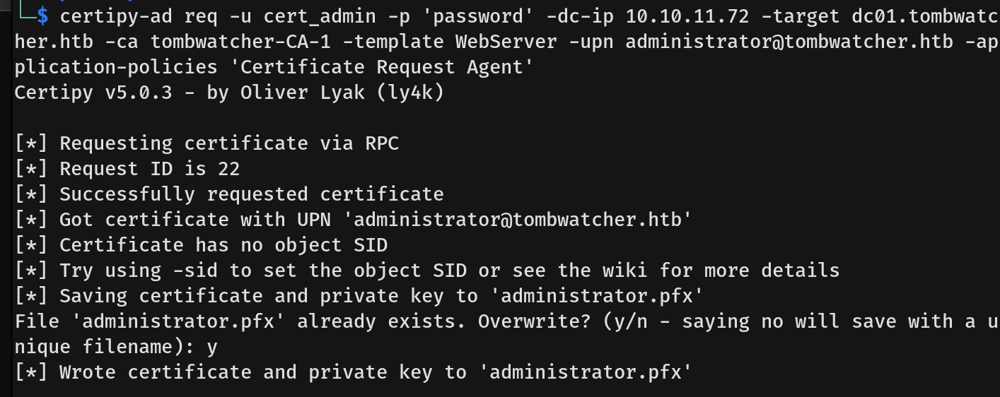
- Using the Agent Certificate obtained in the previous stage, I then submitted a new certificate request to the CA, specifying the target Administrator in the Subject Alternative Name (SAN).
  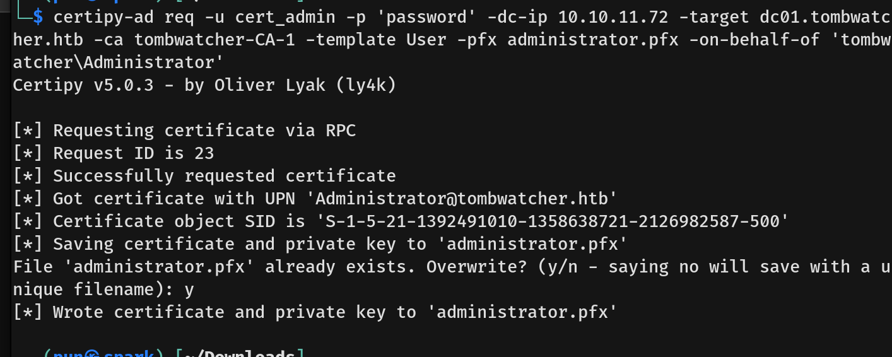
- Finally, we used the resulting PFX file to authenticate as Administrator.
  
- We successfully obtained the Administrator hash and authenticated into the machine using Pass-The-Hash.
  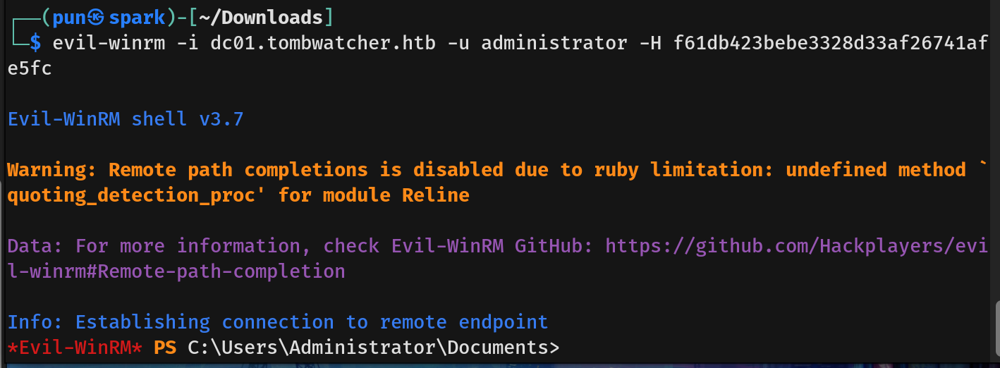
- We then captured the root flag.
