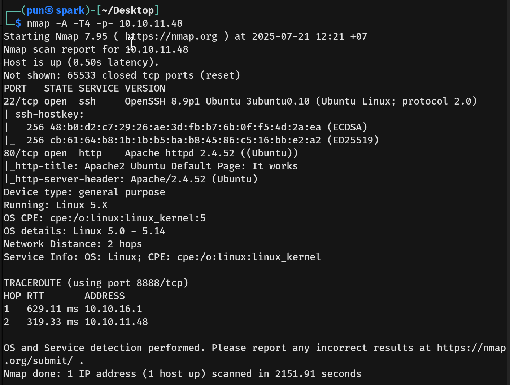
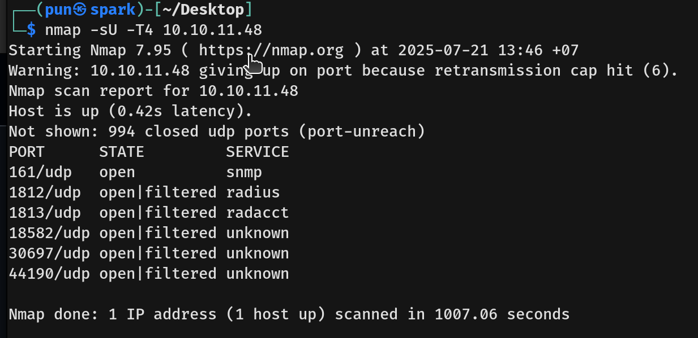
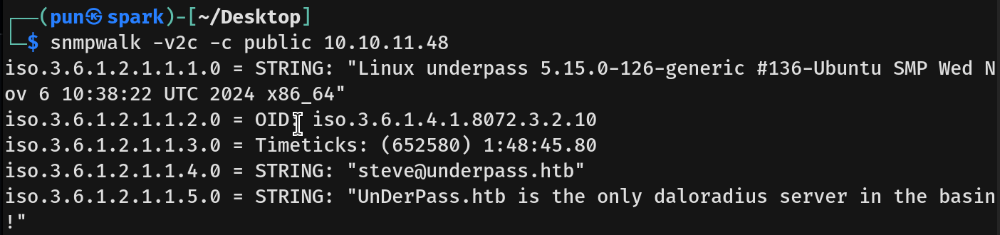
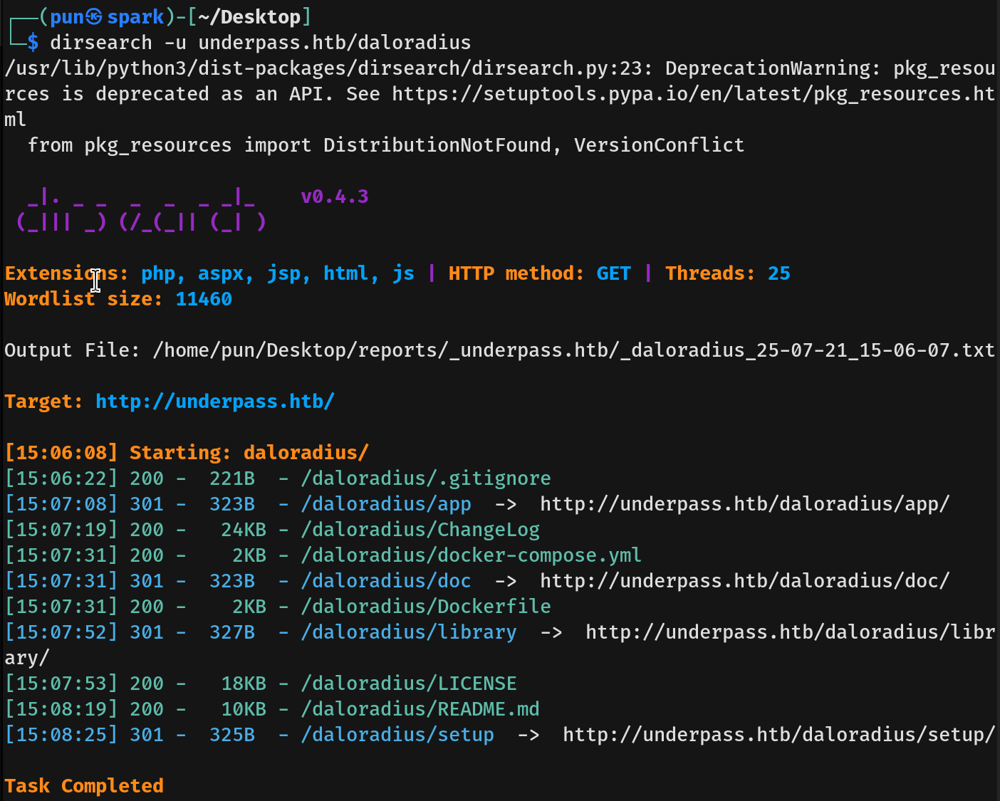
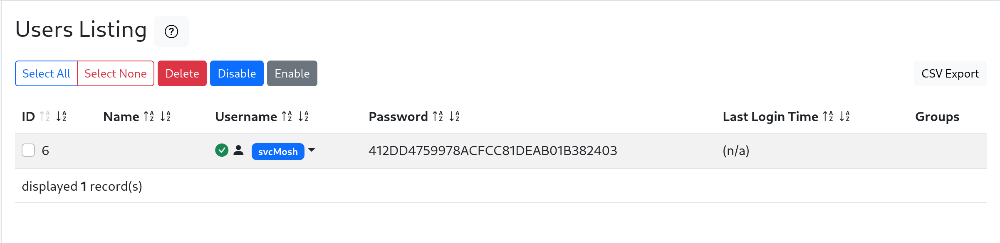
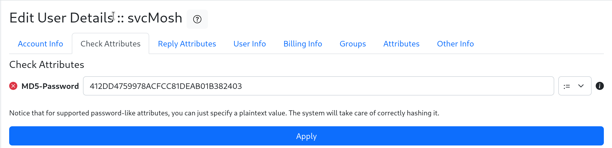
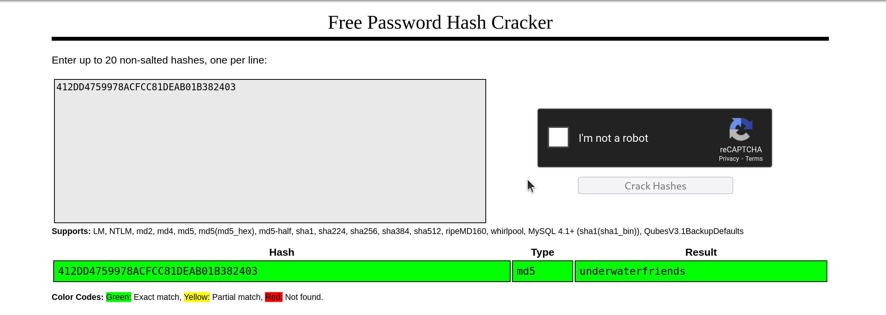
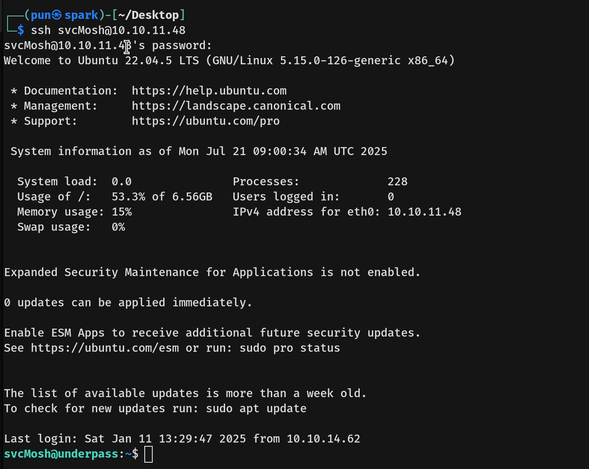
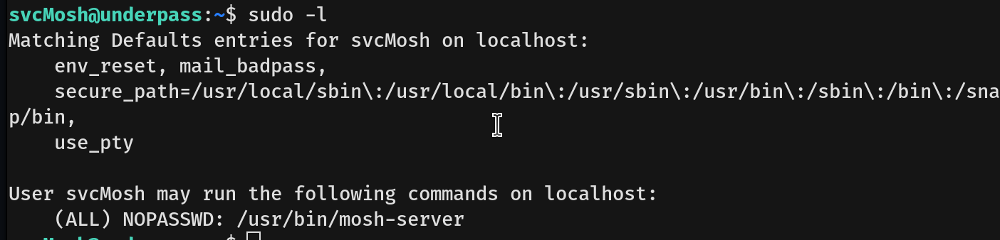
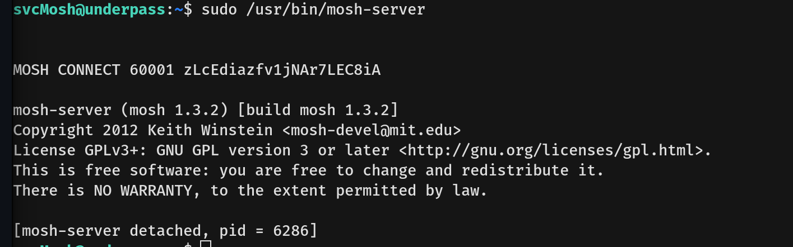

# UnderPass Writeup - by Thammanant Thamtaranon
  - UnderPass is an easy Linux machine on Hack The Box.

## Reconnaissance
  - First, we use the command `nmap -A -T4 -p- 10.10.11.48` to check for any open TCP ports and their information.  
  
  - Next, we use the command `nmap -sU -T4 10.10.11.48` to check for any UDP ports.  
  

## Scanning & Enumeration
  - Now that we know port 80 is open, we visit it and find the Apache2 Default Page. We then use the command `dirsearch -u 10.10.11.48` to check for any directories.
  - Sadly, we find nothing.
  - We now move on to the enumerated UDP service; we see SNMP, so we use the command `snmpwalk -v2c -c public 10.10.11.48` to retrieve a tree of management information.  
  
  - We add `10.10.11.48 underpass.htb` to the file `/etc/hosts`.
  - We try Virtual Host Enumeration for `underpass.htb` using command `wfuzz -u unederpass.htb -H "Host: FUZZ.underpass.htb" -w /usr/share/seclists/Discovery/DNS/subdomains-top1million-5000.txt --hh 199691` but find nothing.
  - Since we know that the server is using daloRADIUS, I try to enumerate the path `/daloradius` using the command `dirsearch -u underpass.htb/daloradius`.  
  
  - We enumerate further and find `http://underpass.htb/daloradius/app/users/login.php` and `http://underpass.htb/daloradius/app/operators/login.php`.
  - We try the default credentials, which are `administrator:radius` on `/users/login.php`, but it fails. So we try them on `/operators/login.php` and it works.  
  

## Exploitation
  - We see the Users section and click on it.  
    
  
  - We see that the user's password is in MD5 format.
  - So, we use CrackStation to crack the password.  
  
  - We then SSH into `svcMosh`.  
  
  - We get the user flag.
  - Next, we try privilege escalation to root.
  - We use the command `sudo -l`.  
  
  - The file `mosh-server` is owned by root, so if we understand what it does, maybe we can use it to gain root privileges.
  - We try running `sudo /usr/bin/mosh-server`.  
  
  - We started the mosh server at UDP port 60001, so if we can connect to the server, we can gain root privileges.
  - We use the command `mosh --server="sudo /usr/bin/mosh-server" localhost`. The client will start the server with root privileges and connect to it, giving us a root shell.
  - We get the root flag.
