# UpDown Writeup - by Thammanant Thamtaranon

**UpDown** is a **Medium**-difficulty Linux machine hosted on Hack The Box.

---

## Reconnaissance
- We began the engagement with a full TCP port scan using Nmap to identify open services and fingerprint the underlying operating system.
  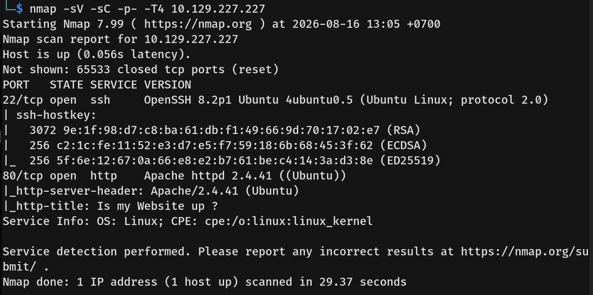
- Only two ports were open:
  * **22/tcp:** ssh (OpenSSH 8.2p1 Ubuntu 4ubuntu0.5)
  * **80/tcp:** http (Apache httpd 2.4.41 (Ubuntu)

---

## Scanning & Enumeration
- We visited the site on port 80 and identified the hostname `siteisup.htb`, which we added to our `/etc/hosts` file.
  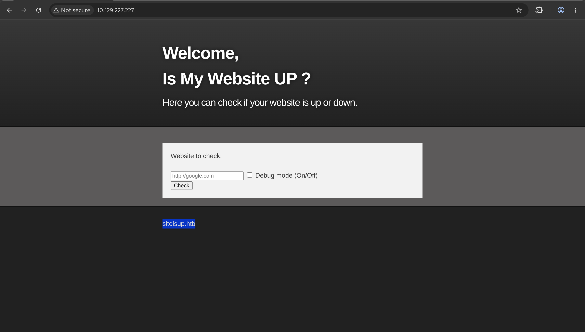
- With the hostname in place, we ran virtual-host enumeration and discovered a `dev` vhost, so we added `dev.siteisup.htb` to our `/etc/hosts` as well.
  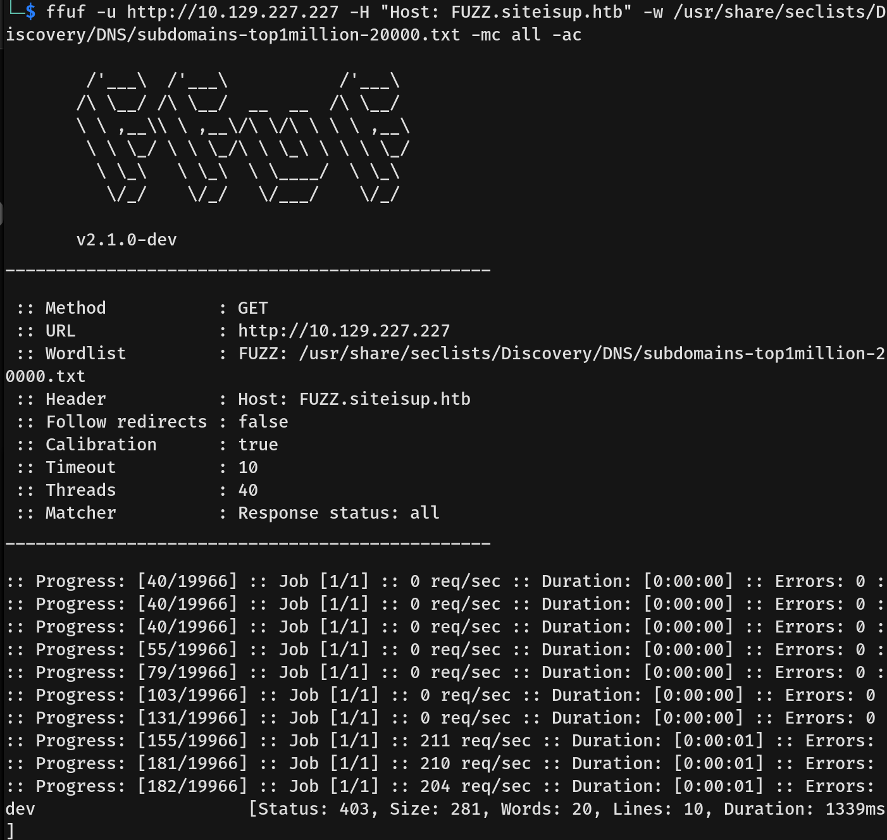
- Visiting `dev.siteisup.htb` directly returned a 403 Forbidden.
  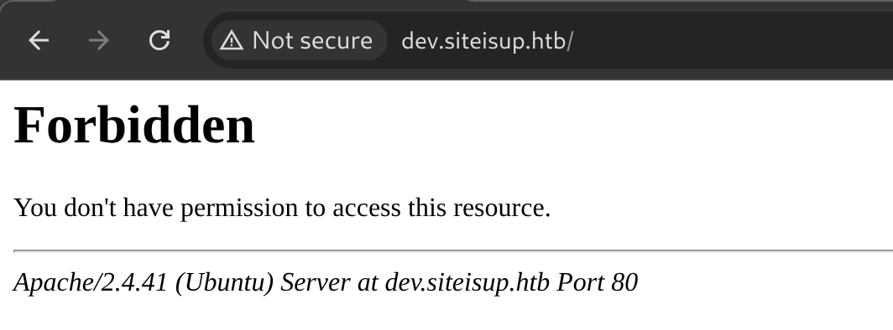
- Separately, we ran directory brute-forcing against the main site and found a `/dev` path, distinct from the `dev` vhost above, since this one is just a directory on `siteisup.htb` itself rather than a virtual host.
  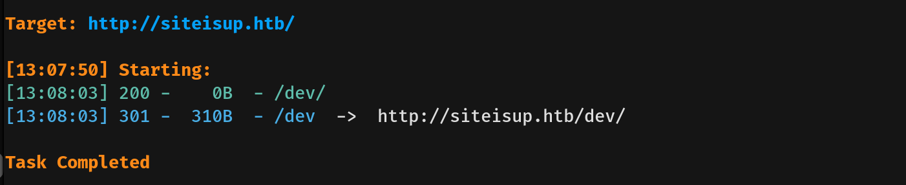
- Enumerating inside `/dev` further, we found an exposed `.git` directory at `siteisup.htb/dev/.git/`.
  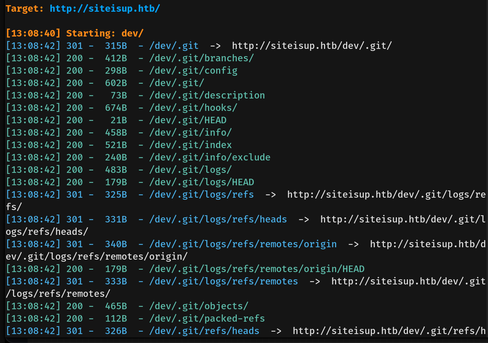
- We used [git-dumper](https://github.com/arthaud/git-dumper) to pull down the exposed repository.
  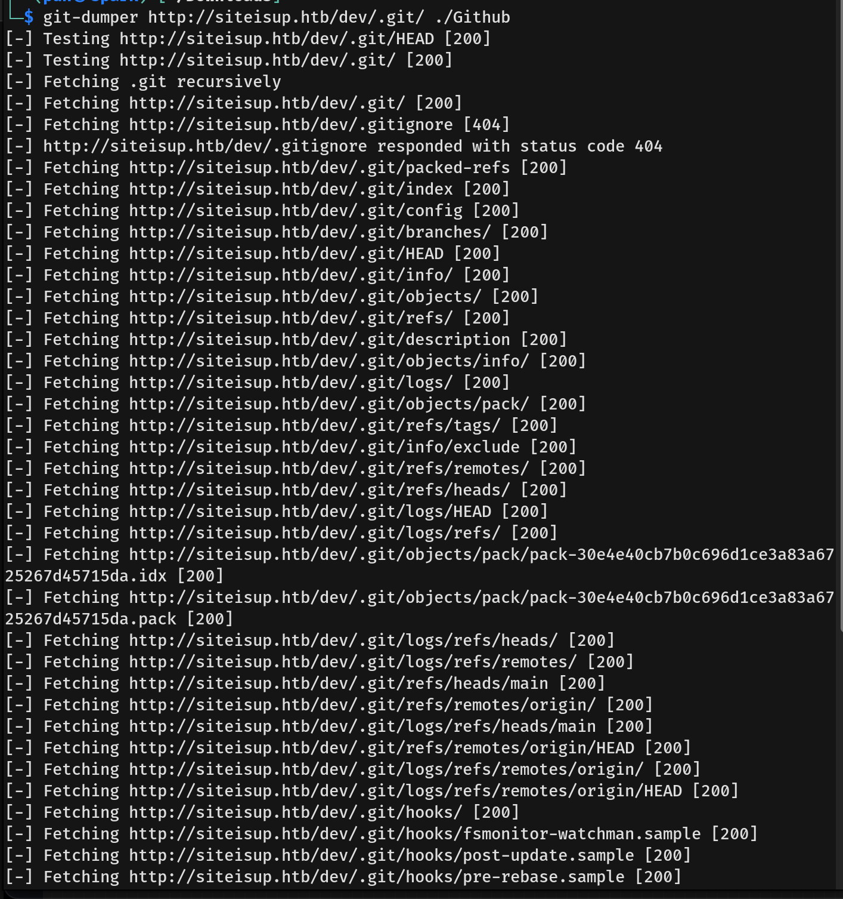
- Reading through the recovered source, we found an `.htaccess` file and a `changelog.txt`.
  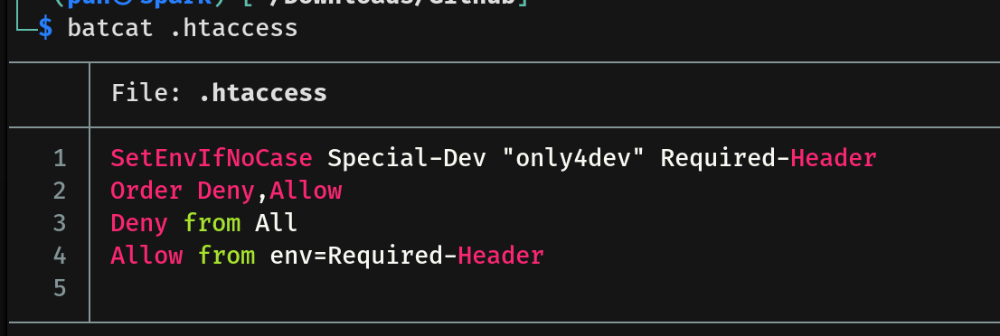
  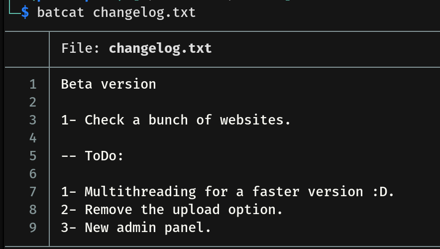
  - The `.htaccess` explains the 403 from earlier: it denies every request by default and only allows one through if it carries a `Special-Dev` header whose value matches `only4dev`.
- The repository also contained the PHP source for the site's file-upload `check` feature.
  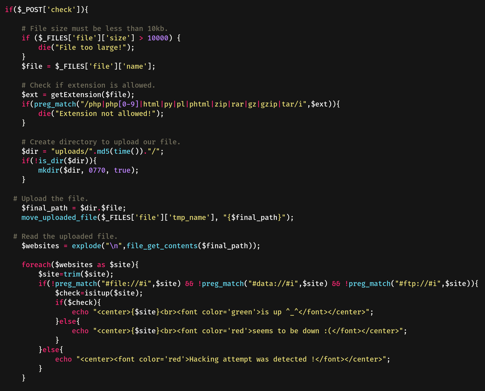

---

## Exploitation
- With the header requirement identified, we used Burp Suite's Match and Replace rule to automatically attach `Special-Dev: only4dev` to every outgoing request, giving us consistent access to `dev.siteisup.htb`.
  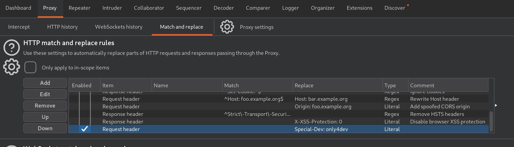
- `dev.siteisup.htb` turned out to be the same application. The same upload feature we found in the repository, plus a link to an Admin Panel.
  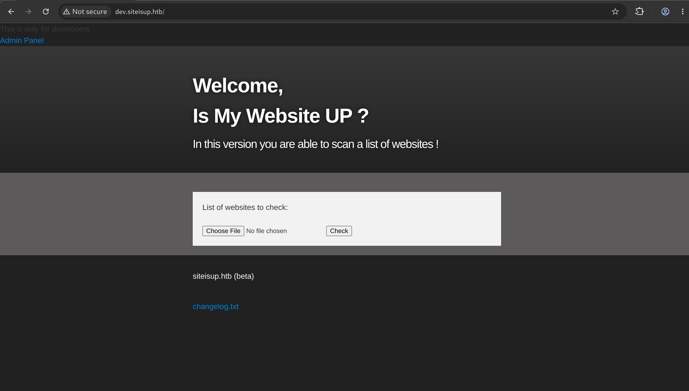
- The Admin Panel link points to `/?page=admin`, using a `page` GET parameter to choose what gets displayed. This strongly indicates local file inclusion.
  
- We noticed `/uploads` has directory listing enabled, so we could see every per-upload folder directly.
  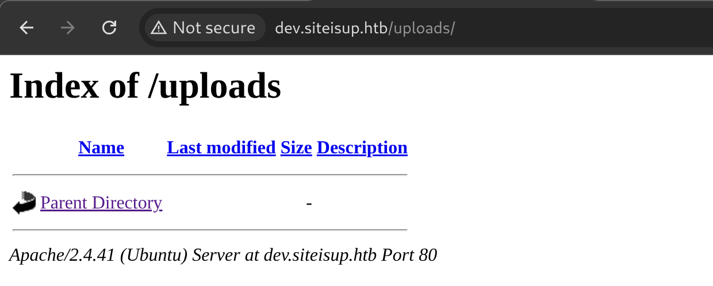
- Our first attempt was uploading `<?php phpinfo(); ?>` with a `.pht` extension, since `.pht` doesn't contain the substring `php` and so slips past the filter. However, `.pht` isn't configured to execute as PHP on this server, so visiting the file just rendered the raw source as plain text instead of running it.
  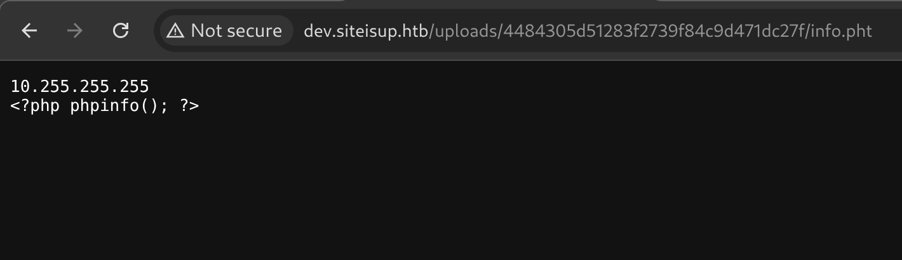
- We also noticed uploaded files get cleaned up shortly after being processed, except when the extension isn't one the application expects, in which case the file and its folder stick around noticeably longer.
- Combining both findings, we packaged our PHP payload inside a ZIP archive and renamed the archive itself with a `.test` extension, essentially bypassing the upload filter as an unrecognized file type while still being valid ZIP data underneath.
  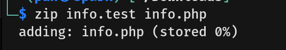
- We first tried accessing the uploaded `.test` file directly, which just returned the raw archive rather than executing it. Requesting it through the `page` parameter without any wrapper also failed, but wrapping the path with PHP's `phar://` stream wrapper worked. `phar://` treats the archive as a PHAR file and executes the PHP script packaged inside it.
  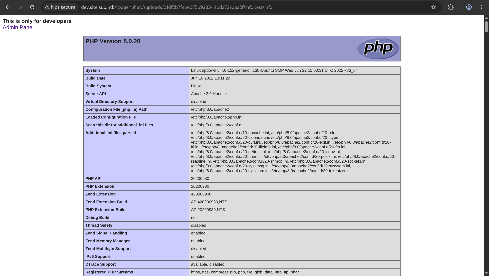
- With code execution confirmed, we checked `phpinfo()`'s `disable_functions` list for a way to get a shell. The obvious options `system`, `exec`, `shell_exec`, `popen`, `passthru` were disabled, but `proc_open` was not.
  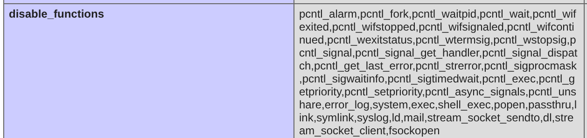
  - **`proc_open`** opens a new process and hands the caller direct control over its input/output/error pipes, similar to `popen`.
- We downloaded a [`proc_open`-based PHP reverse shell](https://gist.github.com/simran-sankhala/d94bc4e42fee5158395d189ec39ecac4) and packaged it the same way.
  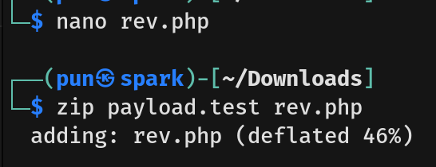
- After uploading it and triggering it the same way as before (via `phar://` through the `page` parameter), we caught a reverse shell as `www-data`.
  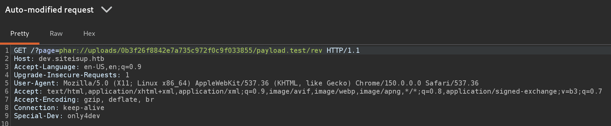
  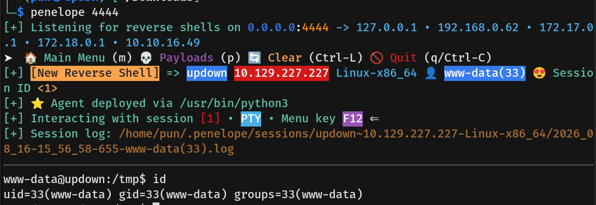

---

## Privilege Escalation
- In `/home/developer/dev/`, we found a readable `siteisup_test.py`.
  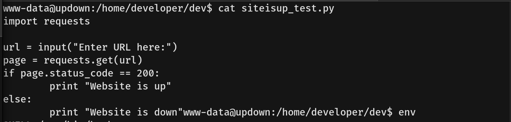
  - The script reads the URL with Python 2's built-in `input()`. Python 2's `input()` evaluates whatever is typed as a Python expression rather than treating it as plain text, so anything we type there runs as code.
- In the same directory, we found an executable, `siteisup`, which shares the same vulnerable input handling as the test script.
- We then ran it directly. Entering `__import__('os').system('/bin/sh')` at the "Enter URL here:" prompt spawned a shell, landing us as `developer`.
  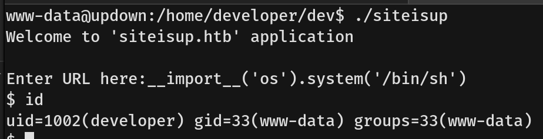
- As `developer`, we ran `sudo -l` and found we could run `easy_install` as root with no password required.
  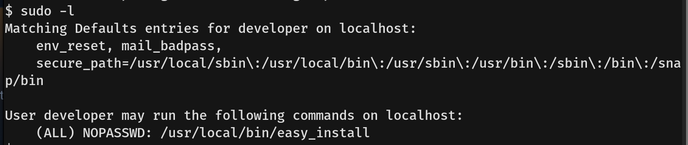
- Checking GTFOBins for `easy_install` confirmed it's a known sudo privilege-escalation vector.
  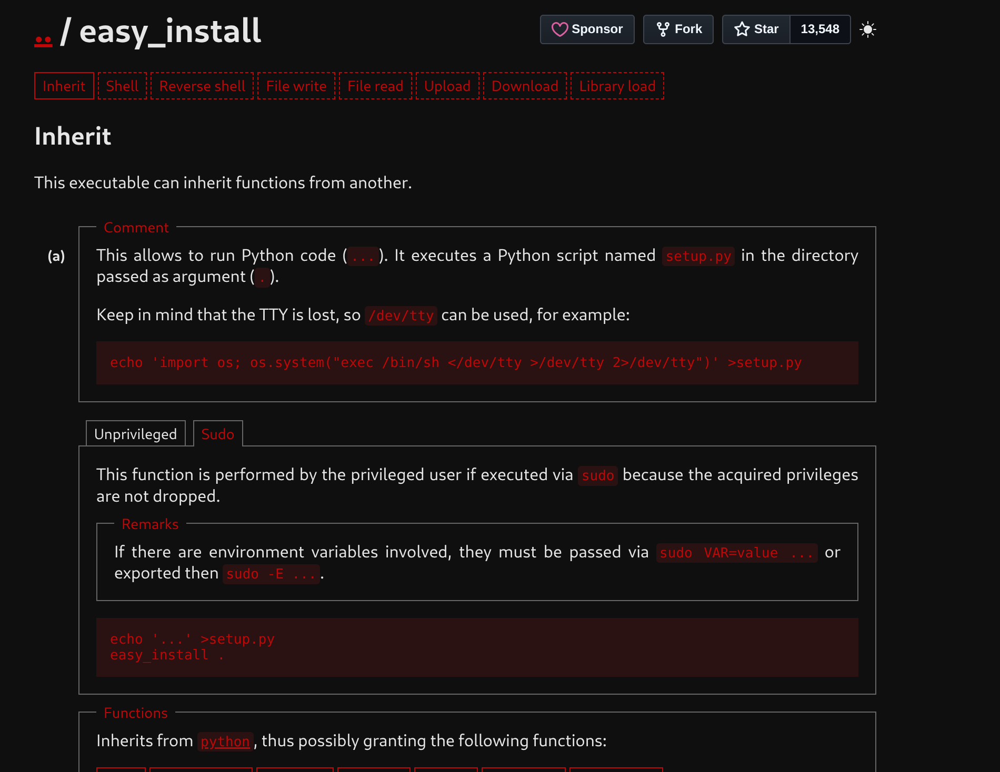
- Following the GTFOBins technique, we escalated to root and captured both the user and root flags.
  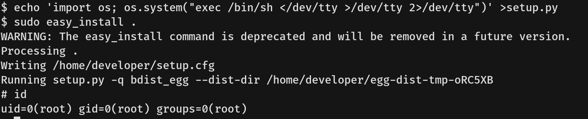
