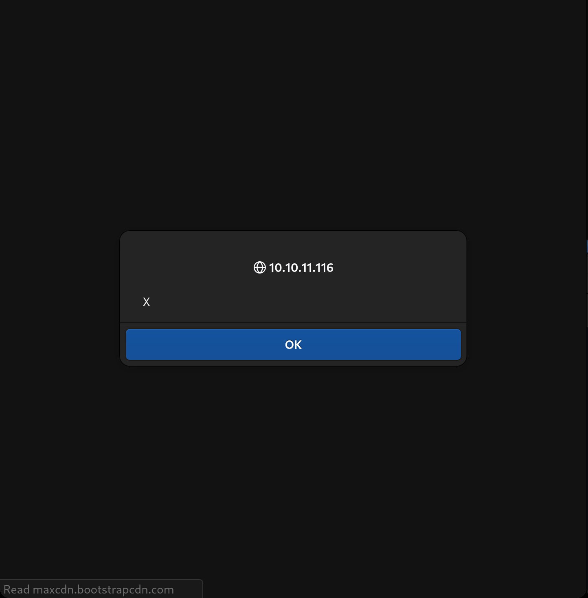
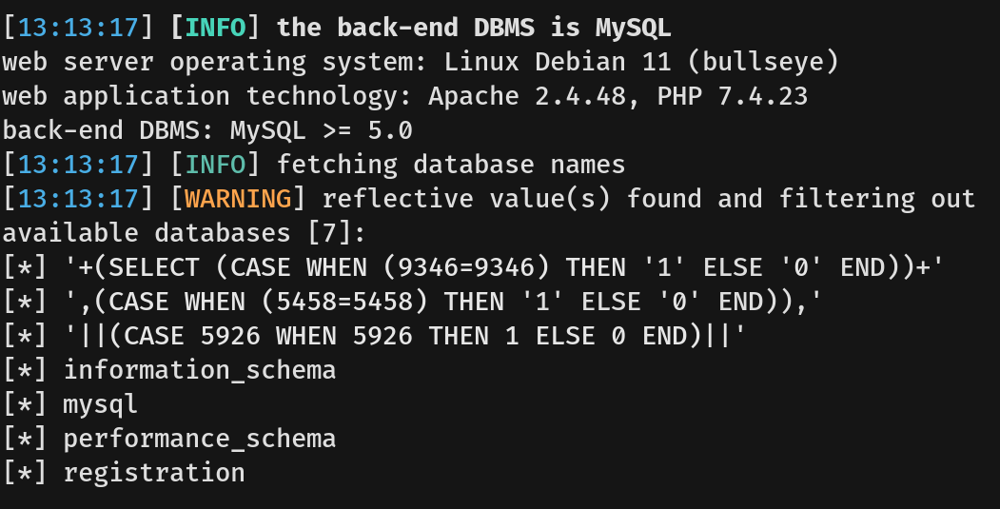
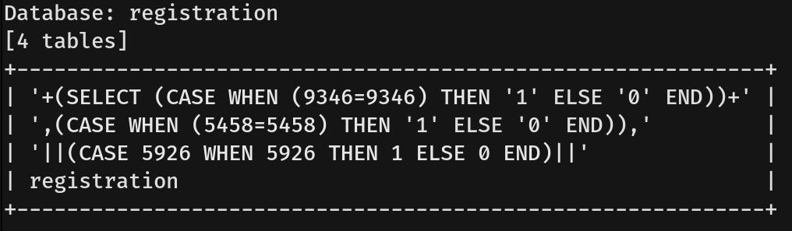
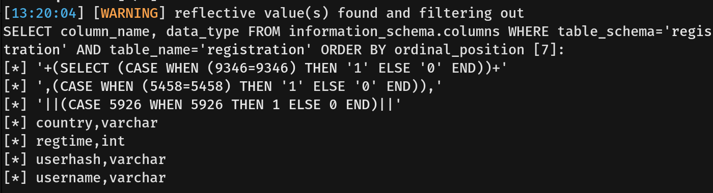
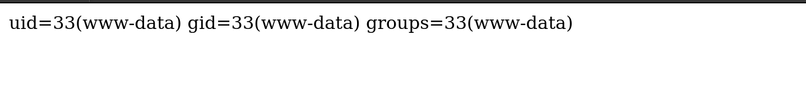
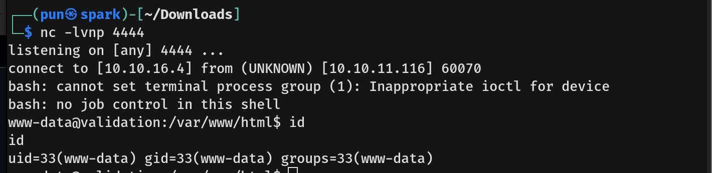
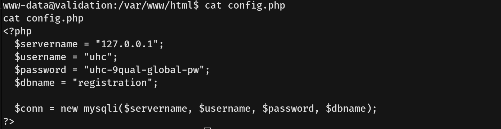

# Validation Writeup - by Thammanant Thamtaranon  
- Validation is an easy Linux-based machine hosted on Hack The Box.

## Reconnaissance  
- We began with a full TCP port scan including service/version detection and OS fingerprinting:  
  `nmap -A -T4 -p- -Pn 10.10.11.116`  
    
- The scan revealed the following open ports:  
  - **22** — SSH  
  - **80** — HTTP  
  - **4556** — HTTP  
  - **8080** — HTTP

## Scanning & Enumeration  
- Visiting port **80** served a web application.  
    
- I performed a directory brute-force using `dirsearch`:  
  `dirsearch -u http://10.10.11.116`  
    
- Accessing `/account.php` required registration prior to interaction.

## Exploitation  
- I tested for reflected XSS and it was successful.  
    
- I adapted the payload to attempt cookie exfiltration:  
  ``
- After waiting several minutes, we determined there was no external user or bot to trigger the payload, so the cookie was not captured via this vector.
- I then tested for SQL injection. The `country` parameter was vulnerable.  
    
    
  
- The table contents consisted of data we had submitted during registration and did not contain useful secrets.
- Using SQL injection, we were able to write a web shell to the server successfully.  
  
- I enter the web shell command with a reverse shell and started a listener on my machine. This yielded a shell as `www-data`.  
  
- From this context we retrieved the user flag.

## Privilege Escalation  
- While enumerating, we discovered `config.php`, which contained credentials for user `uhc`.  
  
- We attempted `su uhc`, but the `uhc` account did not exist on the system. We then attempted escalation to `root` and successfully obtained a root shell.  
- We validated root access and captured the root flag.  
  
