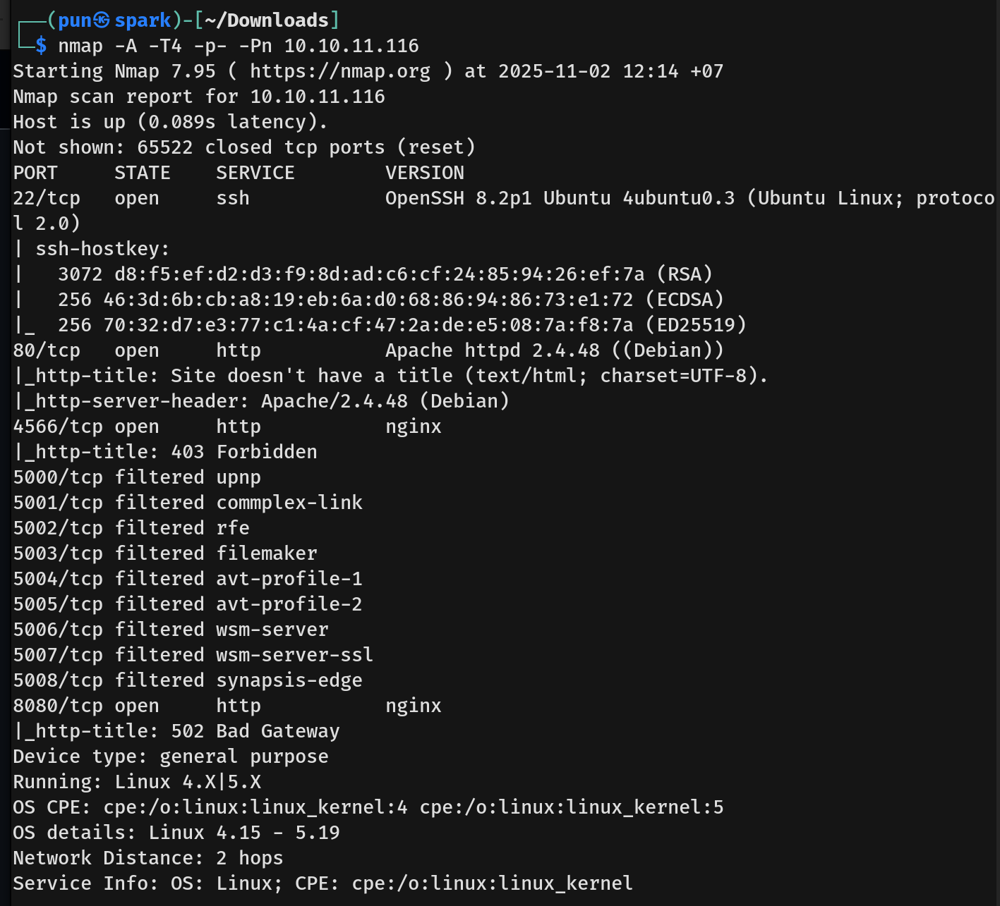
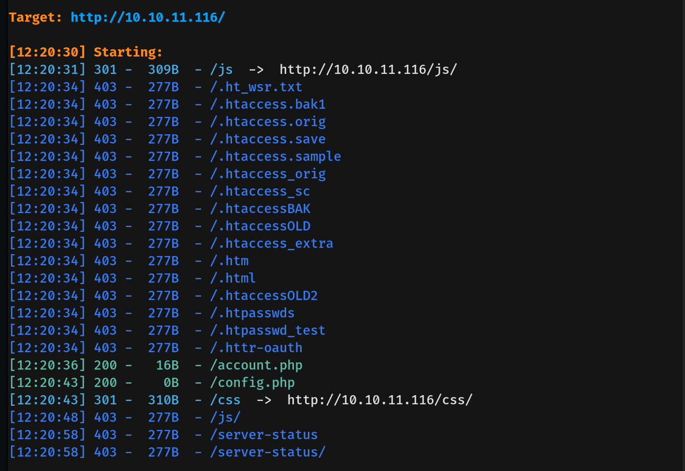
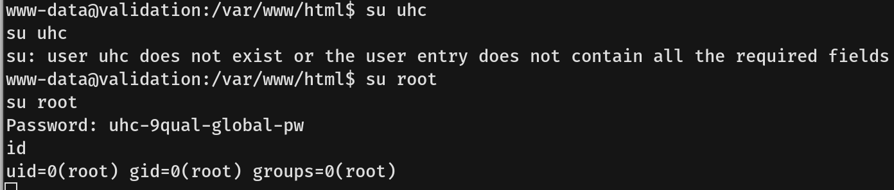

# Validation Writeup - by Thammanant Thamtaranon  
- Validation is an easy Linux-based machine hosted on Hack The Box.

## Reconnaissance  
- I began with a full TCP port scan including service/version detection and OS fingerprinting:  
  `nmap -A -T4 -p- -Pn 10.10.11.116`  
    
- The scan revealed the following open ports:  
  - **22** — SSH  
  - **80** — HTTP  
  - **4556** — HTTP
  - **8080** — HTTP

## Scanning & Enumeration  
- Visiting the port 80 show a website.
    
- I performed a directory brute-force using `dirsearch`: `dirsearch -u 10.10.11.116`  
    
- Visiting `/account.php` ask for registeration first.
- 

## Exploitation  
- Using the credential recovered from the JAR, I authenticated to phpMyAdmin at `http://blocky.htb/phpmyadmin/` and gained access to the application database.  
    
- Within phpMyAdmin we found Notch's credentials.  
    
- I updated Notch's password in the database and verified the new credentials by logging in as Notch.  
    
    
- The WordPress instance did not yield further privilege escalation, so we shifted focus to system access via SSH. Using the recovered credentials: `notch:8YsqfCTnvxAUeduzjNSXe22`
- I established an SSH session to the target and obtained the user flag.  

## Privilege Escalation  
- We enumerated sudo privileges with `sudo -l` and found that the `notch` user had sudo rights.  
  
- To escalate, I executed the permitted sudo command to obtain a root shell: `sudo su -`  
  
- After escalation we captured the root flag.
