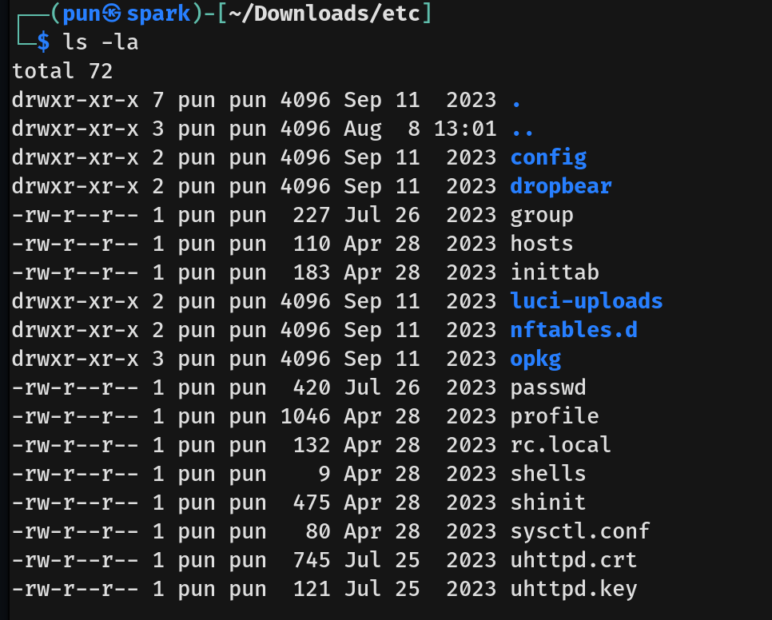

# Wifinetic Writeup - by Thammanant Thamtaranon  
- Wifinetic is an easy Linux-based machine hosted on Hack The Box.

## Reconnaissance  
- I started with a full TCP port scan including service/version detection and OS fingerprinting:  
  `nmap -A -T4 -p- 10.10.11.247`  
  
- The scan showed two open ports:  
  - 21 (FTP)  
  - 22 (SSH)

## Scanning & Enumeration  
- Since FTP allowed anonymous login, I connected to the FTP server.  
  
- I then used the `get` command to download all files to my machine.

## Exploitation  
- I extracted the archive with:  
  `tar -xvf backup-OpenWrt-2023-07-26.tar`  
  
- After browsing through the extracted files, I found the user `netadmin`.  
  
- I also found what looks like credentials.  
  
- Using the username `netadmin` and the discovered password, I SSHed into the machine.  
  
- I successfully obtained the user flag.

## Privilege Escalation  
- Running `sudo -l` showed that `netadmin` has no sudo privileges.  
- I then ran `systemctl list-units --type=service --state=running` and found the `hostapd.service` running.  
  
- **hostapd** (Host Access Point Daemon) is a user-space daemon used on Linux to turn a wireless interface into a full-featured Wi-Fi access point and authentication server.  
- Using `iw dev`, I listed all wireless devices and found that `wlan0` is acting as the Access Point.  
  
- Attempting to run `tcpdump` failed due to permission issues. However, I noticed that `reaver` was installed.  
- Since there was already a monitoring interface `mon0`, I ran:  
  `reaver -i mon0 -b 02:00:00:00:00:00 -vv`  
  to crack the WPS PIN and retrieve the Wi-Fi password.  
  
- Finally, I used `su root` to switch to the root user.  
- I got a root shell and retrieved the root flag.  

